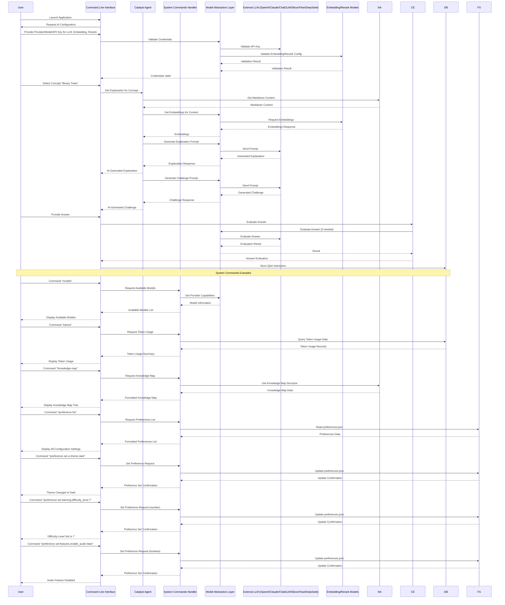
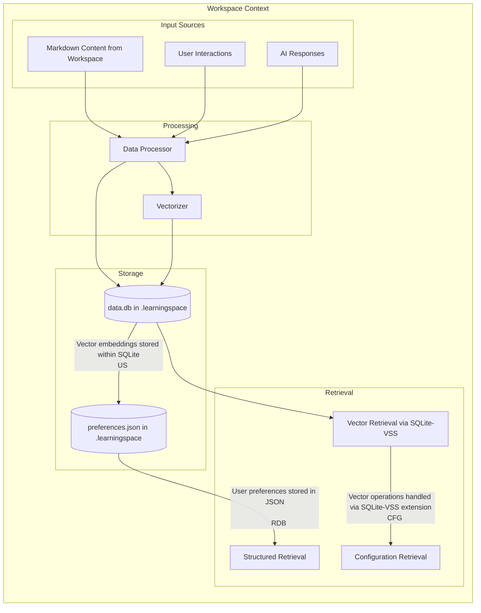
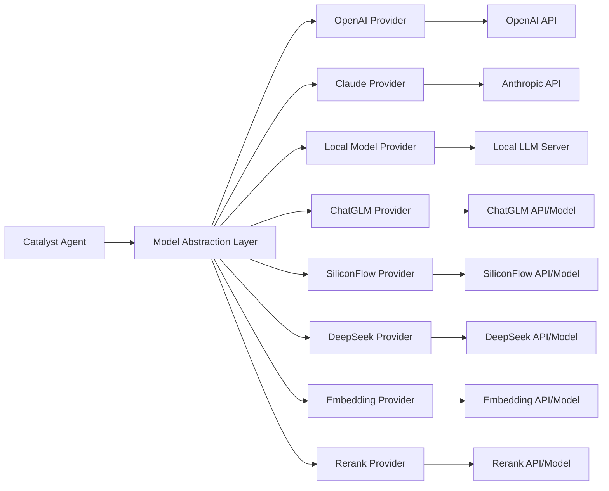
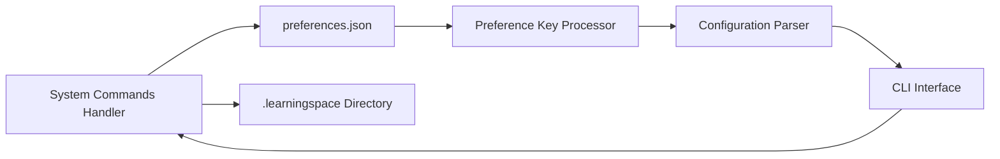
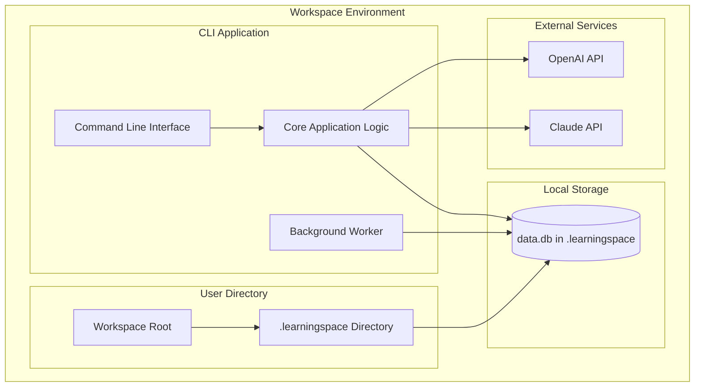
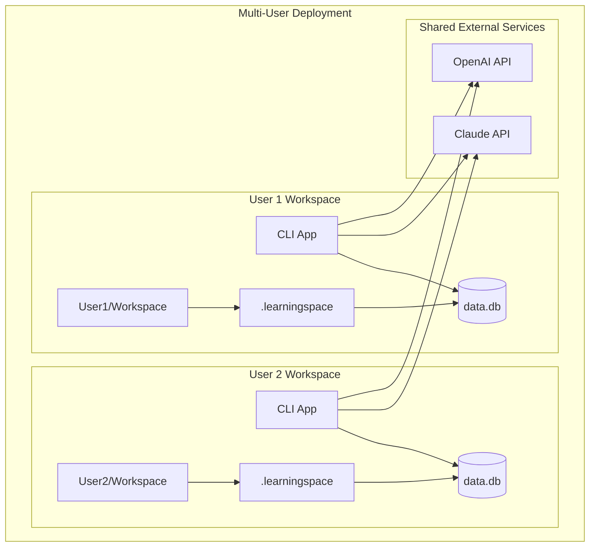

# Learning Catalyst - Software Architecture Document

## 1. Introduction

### 1.1 Purpose
This document describes the architectural design for the Learning Catalyst project - a **local-first, conversational AI tutor** that operates within the command line. It fosters a natural, dialogue-led learning experience, **proactively guiding users** through their local Markdown-based materials. The application operates within a user-specified workspace directory and stores all data in a `.learningspace` subdirectory. The architecture supports multiple AI providers including OpenAI, Claude, ChatGLM, SiliconFlow, DeepSeek, and local models. Additionally, users can configure custom embedding and rerank models to enhance content retrieval and relevance. The application provides system commands (prefixed with /) for users to check token usage, manage models and providers, and configure preferences using key-value syntax stored in a JSON configuration file. The design is intended to support progressive enhancement across three phases: Guided Conversational Core, Enhanced Analytics & Adaptivity, and AI-Driven Tutor.

### 1.2 Scope
This architecture covers the core modules, data persistence systems, and integration points required to implement the Learning Catalyst command-line platform that operates within user-defined workspaces. The application creates a `.learningspace` directory in the workspace to store all data. The design ensures support for multiple AI providers including OpenAI, Claude, ChatGLM, SiliconFlow, DeepSeek, and local models, with user-configurable settings. Additionally, users can configure custom embedding and rerank models for enhanced content retrieval. The application features a continuous conversational interface where the AI tutor actively guides the conversation and includes slash-prefixed system commands for user management. The architecture maintains system performance and security while providing maximum flexibility for AI model selection and configuration management.

### 1.3 Document Conventions
- The architecture is designed using a layered approach
- Component interactions are represented with clear interfaces
- All diagrams are represented in mermaid format
- Security considerations are marked with 🔐
- Performance considerations are marked with ⚡

---

## 2. Architectural Overview

### 2.1 Layered Architecture
The system follows a clean architecture pattern with distinct layers:

```
┌─────────────────────────────────────┐
│         Presentation Layer          │
├─────────────────────────────────────┤
│         Application Layer           │
├─────────────────────────────────────┤
│         Domain Layer                │
├─────────────────────────────────────┤
│         Infrastructure Layer        │
└─────────────────────────────────────┘
```

### 2.2 High-Level Component Diagram

```mermaid
graph TB
    subgraph "Presentation Layer"
        CLI[Command Line Interface<br/>Conversational View]
    end

    subgraph "Application Layer"
        CA[Catalyst Agent<br/>Intent/AI Processing]
        CE[Challenge Engine]
        SM[State Manager]
        CM[Configuration Manager]
        SC[System Commands Handler]
        AA[Assessment Engine]
        AD[Analytics Dashboard]
    end

    subgraph "Infrastructure Layer"
        MAL[Model Abstraction Layer]
        DB[(SQLite Database with Vector Support)]
        AI[(External LLM APIs)]
    end

    CLI --> CA
    CLI --> SC
    CLI --> SM
    
    CA --> CE
    CA --> SM
    CA --> AA
    CE --> AA
    
    SC --> CM
    SC --> DB
    SC --> FS[File System (config.json, preferences.json)]
    CA --> MAL
    CM --> MAL
    MAL --> AI
    CA --> DB
    CE --> DB
    SM --> DB
    AA --> DB
    AD --> DB
```

---

## 3. Core Modules Architecture

### 3.1 CLI Interface (Conversational View)
**Purpose**: Renders the conversational dialogue and handles user input and system commands

**Responsibilities**:
- Display continuous chat dialogue between user and AI tutor
- Handle user text input and distinguish between conversational input and system commands
- Render AI responses in the conversation flow
- Manage the input prompt and handle command parsing
- Display system command outputs separately from conversation

**Technology Stack**:
- Rich library for advanced terminal UI
- Click or Typer for command parsing
- Markdown processing libraries
- Asynchronous I/O handlers

**Interface**:
```python
from abc import ABC, abstractmethod
from typing import List, Dict, Optional, Any
from dataclasses import dataclass
import asyncio

@dataclass
class ConversationMessage:
    role: str  # "user", "assistant", "system"
    content: str
    timestamp: str
    metadata: Optional[Dict[str, Any]] = None

@dataclass
class CommandResult:
    success: bool
    message: str
    data: Optional[Dict[str, Any]] = None

class CLIInterface(ABC):
    @abstractmethod
    def display_message(self, message: ConversationMessage) -> None:
        """Display a message in the conversation view"""
        pass
    
    @abstractmethod
    def display_system_message(self, message: str) -> None:
        """Display a system message separately from conversation"""
        pass
    
    @abstractmethod
    async def get_user_input(self) -> str:
        """Get input from user, distinguishing between commands and conversation"""
        pass
    
    @abstractmethod
    async def handle_command(self, command: str) -> CommandResult:
        """Process a system command and return result"""
        pass
    
    @abstractmethod
    def clear_conversation_context(self) -> None:
        """Reset the AI's short-term conversational context"""
        pass
    
    @abstractmethod
    def render_conversation(self, messages: List[ConversationMessage]) -> None:
        """Render the full conversation history to the terminal"""
        pass
```

### 3.2 Catalyst Agent
**Purpose**: Core AI-driven module that interprets user intent, processes queries, generates explanations, formulates challenges, and is responsible for generating context-aware startup prompts to guide the user immediately upon launch

**Responsibilities**:
- Interpret user intent from conversational input (query, challenge request, or answer)
- Generate AI-based explanations from Markdown content
- Create prompts for challenge generation
- Interface with the Model Abstraction Layer
- Personalize content based on user profile and conversation history
- Generate context-aware startup prompts to guide the user immediately upon launch
- Proactively suggest next steps in the learning process

**Technology Stack**:
- Python prompt engineering framework
- Content personalization engine
- Context management system
- Intent classification algorithms

**Interface**:
```python
from abc import ABC, abstractmethod
from typing import List, Dict, Optional, Any
from dataclasses import dataclass
import asyncio

@dataclass
class Challenge:
    id: str
    question: str
    options: Optional[List[str]] = None  # For multiple choice
    challenge_type: str  # "multiple_choice", "open_ended", etc.
    concept_id: str

@dataclass 
class Evaluation:
    is_correct: bool
    feedback: str
    score: float

@dataclass
class UserProfile:
    id: str
    preferences: Dict[str, Any]
    competency_profile: Dict[str, Any]
    ai_config: Dict[str, Any]

@dataclass
class ConversationContext:
    user_profile: UserProfile
    current_concept: Optional[Concept]
    conversation_history: List[Dict[str, Any]]  # Full conversation history
    interaction_history: List[Dict[str, Any]]  # Question/answer interactions

@dataclass
class IntentClassification:
    intent_type: str  # "query", "challenge_request", "answer", "general_conversation"
    concept_reference: Optional[str]  # If user refers to a specific concept
    confidence: float

class CatalystAgent(ABC):
    @abstractmethod
    async def interpret_intent(self, user_input: str, context: ConversationContext) -> IntentClassification:
        """Interpret user's intent from conversational input"""
        pass
    
    @abstractmethod
    async def generate_response(self, user_input: str, intent: IntentClassification, context: ConversationContext) -> str:
        """Generate appropriate response based on user input and intent"""
        pass
    
    @abstractmethod
    async def generate_explanation(self, concept: Concept, context: ConversationContext) -> str:
        """Generate AI-based explanation for a concept"""
        pass
    
    @abstractmethod
    async def generate_challenge(self, concept: Concept, context: ConversationContext) -> Challenge:
        """Generate an AI-based challenge for a concept"""
        pass
    
    @abstractmethod
    async def evaluate_answer(self, answer: str, challenge: Challenge, context: ConversationContext) -> Evaluation:
        """Evaluate user's answer to a challenge"""
        pass
    
    @abstractmethod
    async def generate_startup_prompt(self, has_previous_state: bool, context: ConversationContext) -> str:
        """Generate context-aware welcome message and suggestions upon application launch"""
        pass
    
    @abstractmethod
    async def suggest_next_concepts(self, profile: UserProfile, context: ConversationContext) -> List[Concept]:
        """Suggest next concepts based on user profile and conversation context"""
        pass
    
    @abstractmethod
    async def track_token_usage(self, model: str, input_tokens: int, output_tokens: int, context: str) -> None:
        """Track token usage for analytics and reporting"""
        pass
    
    @abstractmethod
    async def proactive_challenge_offer(self, concept: Concept, context: ConversationContext) -> bool:
        """Determine if the AI should proactively offer a challenge after an explanation"""
        pass
```

### 3.3 State Manager
**Purpose**: Handles the mechanics of automatically saving the application state on exit and seamlessly loading it on launch for the Catalyst Agent to interpret. Manages manual checkpoints.

**Responsibilities**:
- Automatically save full application state on exit
- Automatically load previous state on application start
- Manage conversational context persistence
- Handle manual checkpoint creation and restoration
- Serialize/deserialize conversation history and application state

**Technology Stack**:
- Python serialization (pickle or JSON)
- File system operations
- Compression algorithms (gzip)
- SQLite persistence service

**Interface**:
```python
from abc import ABC, abstractmethod
from typing import List, Dict, Optional, Any
from dataclasses import dataclass
import asyncio
import json

@dataclass
class ApplicationState:
    user_profile: UserProfile
    conversation_context: ConversationContext  # From Catalyst Agent
    conversation_messages: List[ConversationMessage]  # Full chat history
    current_state_metadata: Dict[str, Any]  # Current application state info

@dataclass
class Checkpoint:
    id: str
    user_id: str
    state_data: str  # JSON string of the state
    created_at: str
    description: str

class StateManager(ABC):
    @abstractmethod
    async def save_current_state(self, state: ApplicationState) -> None:
        """Automatically save current application state"""
        pass
    
    @abstractmethod
    async def load_last_state(self) -> Optional[ApplicationState]:
        """Load the last saved application state on startup"""
        pass
    
    @abstractmethod
    async def create_checkpoint(self, state: ApplicationState, description: str) -> Checkpoint:
        """Create a named checkpoint from current application state"""
        pass
    
    @abstractmethod
    async def load_checkpoint(self, checkpoint_id: str) -> Optional[ApplicationState]:
        """Load application state from a named checkpoint"""
        pass
    
    @abstractmethod
    async def list_checkpoints(self) -> List[Checkpoint]:
        """List available checkpoints for user"""
        pass
```

### 3.4 Challenge Engine
**Purpose**: Works with the Catalyst Agent to present AI-generated questions and process user answers

**Responsibilities**:
- Format and present challenges to users within the conversation flow
- Collect and validate user responses
- Determine challenge types (multiple-choice, open-ended, etc.)
- Integrate with evaluation systems
- Work with Catalyst Agent to proactively offer challenges

**Interface**:
```python
from abc import ABC, abstractmethod
from typing import List, Dict, Optional, Any
from dataclasses import dataclass
import asyncio

@dataclass
class UserAnswer:
    challenge_id: str
    answer_text: str
    timestamp: str

@dataclass
class ChallengeResult:
    challenge_id: str
    user_answer: UserAnswer
    evaluation: Evaluation
    is_correct: bool

class ChallengeEngine(ABC):
    @abstractmethod
    def present_challenge(self, challenge: Challenge, context: ConversationContext) -> str:
        """Generate text to present a challenge to the user in the conversation"""
        pass
    
    @abstractmethod
    async def process_answer(self, user_answer: UserAnswer, challenge: Challenge, context: ConversationContext) -> ChallengeResult:
        """Process and evaluate user's answer to a challenge"""
        pass
    
    @abstractmethod
    def adapt_challenge(self, challenge: Challenge, user_profile: UserProfile) -> Challenge:
        """Adapt challenge based on user profile and competency"""
        pass
```

### 3.5 Configuration Manager
**Purpose**: Manages providers, models, and API keys via `config.json`

**Responsibilities**:
- Handle configuration of AI providers and their settings
- Manage model definitions and API keys
- Validate provider configurations and credentials
- Provide model switching capabilities
- Handle configuration import/export and validation

**Technology Stack**:
- JSON file handling
- Provider validation services
- Configuration schema validation
- API key management

**Interface**:
```python
from abc import ABC, abstractmethod
from typing import List, Dict, Optional, Any, Union
from dataclasses import dataclass
import asyncio

@dataclass
class ProviderConfig:
    id: str
    provider_type: str  # "openai", "anthropic", "chatglm", "siliconflow", "deepseek", "local"
    base_url: Optional[str] = None
    auth_scheme: str = "api_key"  # or other auth methods
    settings: Optional[Dict[str, Any]] = None  # provider-specific settings

@dataclass
class ModelConfig:
    id: str
    provider_id: str
    model_name: str
    settings: Optional[Dict[str, Any]] = None  # model-specific settings

@dataclass
class ActiveConfig:
    active_model_id: str
    providers: List[ProviderConfig]
    models: List[ModelConfig]

class ConfigurationManager(ABC):
    @abstractmethod
    async def load_config(self) -> ActiveConfig:
        """Load configuration from config.json"""
        pass
    
    @abstractmethod
    async def save_config(self, config: ActiveConfig) -> bool:
        """Save configuration to config.json"""
        pass
    
    @abstractmethod
    async def add_provider(self, provider: ProviderConfig) -> bool:
        """Add a new provider configuration"""
        pass
    
    @abstractmethod
    async def remove_provider(self, provider_id: str) -> bool:
        """Remove a provider configuration"""
        pass
    
    @abstractmethod
    async def add_model(self, model: ModelConfig) -> bool:
        """Add a new model configuration"""
        pass
    
    @abstractmethod
    async def remove_model(self, model_id: str) -> bool:
        """Remove a model configuration"""
        pass
    
    @abstractmethod
    async def set_active_model(self, model_id: str) -> bool:
        """Set the active model for all AI operations"""
        pass
    
    @abstractmethod
    async def validate_provider_config(self, provider: ProviderConfig) -> bool:
        """Validate provider configuration and credentials"""
        pass
    
    @abstractmethod
    async def list_providers(self) -> List[ProviderConfig]:
        """List all configured providers"""
        pass
    
    @abstractmethod
    async def list_models(self) -> List[ModelConfig]:
        """List all configured models (excluding API keys)"""
        pass
```

### 3.6 Model Abstraction Layer
**Purpose**: Provides a unified interface for communicating with various LLM providers

**Responsibilities**:
- Abstract communication with different AI providers
- Handle API key management and validation
- Normalize responses from different providers
- Route requests to the appropriate provider
- Interface with Configuration Manager for model selection

**Technology Stack**:
- Python HTTP clients (httpx/requests)
- Provider adapter patterns
- Authentication and validation service
- Rate limiting and cost monitoring

**Interface**:
```python
from abc import ABC, abstractmethod
from typing import List, Dict, Optional, Any, Union
from dataclasses import dataclass
import asyncio

@dataclass
class Message:
    role: str  # "system", "user", "assistant"
    content: str

@dataclass 
class AIResponse:
    content: str
    model: str
    usage: Dict[str, int]  # tokens used
    timestamp: str

@dataclass
class Credentials:
    provider: str  # "openai", "anthropic", "chatglm", "siliconflow", "deepseek", "local", "embedding", "rerank"
    api_key: str
    base_url: Optional[str] = None
    additional_config: Optional[Dict[str, Any]] = None  # For provider-specific settings

@dataclass
class EmbeddingResponse:
    embeddings: List[List[float]]
    model: str
    usage: Dict[str, int]  # tokens used

@dataclass
class RerankResponse:
    results: List[Dict[str, Any]]  # with document and relevance score
    model: str

@dataclass
class ProviderCapabilities:
    supports_streaming: bool
    max_tokens: int
    supported_models: List[str]
    input_cost_per_token: float
    output_cost_per_token: float
    supports_embeddings: bool
    supports_rerank: bool

class ModelAbstractionLayer(ABC):
    @abstractmethod
    async def send_message(
        self, 
        provider: str, 
        model: str, 
        messages: List[Message],
        temperature: float = 0.7
    ) -> AIResponse:
        """Send message to LLM provider and get response"""
        pass
    
    @abstractmethod
    async def get_embeddings(
        self,
        provider: str,
        model: str,
        texts: List[str],
        dimensions: Optional[int] = None
    ) -> EmbeddingResponse:
        """Get embeddings for texts using specified provider and model"""
        pass
    
    @abstractmethod
    async def rerank(
        self,
        provider: str,
        model: str,
        query: str,
        documents: List[str],
        top_k: int = 10
    ) -> RerankResponse:
        """Rerank documents based on query relevance"""
        pass
    
    @abstractmethod
    async def validate_credentials(self, provider: str, credentials: Credentials) -> bool:
        """Validate API credentials for a provider"""
        pass
    
    @abstractmethod
    async def list_available_models(self, provider: str) -> List[str]:
        """Get list of available models for a provider"""
        pass
    
    @abstractmethod
    async def get_provider_capabilities(self, provider: str) -> ProviderCapabilities:
        """Get capabilities information for a provider"""
        pass
```

### 3.6 Analytics Dashboard
**Purpose**: Shows proficiency, weak areas, and learning trends

**Responsibilities**:
- Visualize user progress and performance
- Generate learning trend reports
- Identify weak concepts
- Provide actionable insights

**Technology Stack**:
- Python data visualization (matplotlib, plotext for terminal)
- Analytics processing engine
- Report generation system

**Interface**:
```python
from abc import ABC, abstractmethod
from typing import List, Dict, Optional, Any
from dataclasses import dataclass
from datetime import datetime
import asyncio

@dataclass
class TimePeriod:
    start_date: datetime
    end_date: datetime

@dataclass
class ProgressReport:
    user_id: str
    concepts_mastered: int
    concepts_in_progress: int
    overall_score: float
    time_spent: int  # in minutes
    report_date: str

@dataclass
class TrendData:
    user_id: str
    metric: str  # e.g. "accuracy", "time_per_question"
    data_points: List[Dict[str, Any]]  # with date and value
    trend_direction: str  # "improving", "declining", "stable"

@dataclass
class AnalyticsExport:
    user_id: str
    export_data: str  # JSON string of all analytics data
    export_format: str  # "json", "csv", etc.
    timestamp: str

class AnalyticsDashboard(ABC):
    @abstractmethod
    async def generate_progress_report(self, user_id: str) -> ProgressReport:
        """Generate overall progress report for user"""
        pass
    
    @abstractmethod
    async def identify_weak_areas(self, user_id: str) -> List[Concept]:
        """Identify concepts where user is struggling"""
        pass
    
    @abstractmethod
    async def generate_trend_data(self, user_id: str, period: TimePeriod) -> TrendData:
        """Generate trend data for specific metric over time period"""
        pass
    
    @abstractmethod
    async def export_analytics(self, user_id: str) -> AnalyticsExport:
        """Export analytics data for user"""
        pass
```

### 3.7 Assessment Engine
**Purpose**: Background process for evaluating user progress and adapting difficulty

**Responsibilities**:
- Analyze user performance patterns
- Update competency profiles
- Adjust difficulty levels based on performance
- Generate adaptive learning recommendations

**Technology Stack**:
- Python pattern recognition algorithms
- Statistical analysis for difficulty adaptation
- Background processing with asyncio

**Interface**:
```python
from abc import ABC, abstractmethod
from typing import List, Dict, Optional, Any
from dataclasses import dataclass
import asyncio

@dataclass
class InteractionHistory:
    user_id: str
    interactions: List[Dict[str, Any]]  # question, answer, result, timestamp

@dataclass
class AnalysisResult:
    user_id: str
    strengths: List[str]  # concept IDs or topic areas
    weaknesses: List[str]  # concept IDs or topic areas
    performance_trends: Dict[str, float]  # concept_id -> trend score
    confidence_level: float

@dataclass
class CompetencyProfile:
    user_id: str
    skills: Dict[str, float]  # concept_id -> competency level (0-1)
    learning_style: str
    preferred_difficulty: int
    last_updated: str

@dataclass
class Recommendations:
    user_id: str
    next_concepts: List[Concept]
    difficulty_adjustments: Dict[str, int]  # concept_id -> recommended difficulty
    study_focus: List[str]
    timestamp: str

class AssessmentEngine(ABC):
    @abstractmethod
    async def analyze_performance(self, user_id: str, history: InteractionHistory) -> AnalysisResult:
        """Analyze user's performance patterns"""
        pass
    
    @abstractmethod
    async def update_competency_profile(self, user_id: str, analysis: AnalysisResult) -> CompetencyProfile:
        """Update user's competency profile based on analysis"""
        pass
    
    @abstractmethod
    async def determine_adaptive_difficulty(self, user_id: str, concept: Concept) -> int:
        """Determine appropriate difficulty level for user on a concept"""
        pass
    
    @abstractmethod
    async def generate_recommendations(self, user_id: str, profile: CompetencyProfile) -> Recommendations:
        """Generate personalized learning recommendations"""
        pass
```

### 3.8 System Commands Handler
**Purpose**: Handle system-level commands for model information, token usage, configuration, and state management

**Responsibilities**:
- Handle all system commands prefixed with '/'
- Provide available models information to users
- Track and display token usage statistics
- Manage model and provider configuration
- Handle state management commands (save/load checkpoints)
- Handle conversational context commands
- Handle analytics and recommendations commands

**Technology Stack**:
- Command parsing and validation
- Statistics aggregation and reporting
- Model and configuration management utilities

**Interface**:
```python
from abc import ABC, abstractmethod
from typing import List, Dict, Optional, Any
from dataclasses import dataclass
import asyncio

@dataclass
class ModelInfo:
    provider: str
    model_name: str
    capabilities: List[str]  # e.g., ["chat", "embedding", "rerank"]
    max_tokens: int
    description: str

@dataclass
class TokenUsage:
    model: str
    input_tokens: int
    output_tokens: int
    total_tokens: int
    timestamp: str
    context: str  # what the tokens were used for

@dataclass
class TokenUsageSummary:
    total_input_tokens: int
    total_output_tokens: int
    total_tokens: int
    usage_by_model: Dict[str, TokenUsage]
    period_start: str
    period_end: str

@dataclass
class CommandResult:
    success: bool
    message: str
    data: Optional[Dict[str, Any]] = None

class SystemCommandsHandler(ABC):
    @abstractmethod
    async def handle_models_command(self) -> CommandResult:
        """Handle /models command - list all configured models (never shows API keys)"""
        pass
    
    @abstractmethod
    async def handle_model_use_command(self, model_id: str) -> CommandResult:
        """Handle /model use <id> command - set active model for all operations"""
        pass
    
    @abstractmethod
    async def handle_model_add_command(self) -> CommandResult:
        """Handle /model add command - wizard to add a new model"""
        pass
    
    @abstractmethod
    async def handle_model_remove_command(self, model_id: str) -> CommandResult:
        """Handle /model remove <id> command - removes a model configuration"""
        pass
    
    @abstractmethod
    async def handle_provider_list_command(self) -> CommandResult:
        """Handle /provider list command - list all configured providers"""
        pass
    
    @abstractmethod
    async def handle_provider_add_command(self) -> CommandResult:
        """Handle /provider add command - wizard to add a new provider"""
        pass
    
    @abstractmethod
    async def handle_provider_remove_command(self, provider_id: str) -> CommandResult:
        """Handle /provider remove <id> command - removes a provider configuration"""
        pass
    
    @abstractmethod
    async def handle_token_usage_command(self, period_days: int = 30) -> CommandResult:
        """Handle /tokens command - show token usage summary for specified period"""
        pass
    
    @abstractmethod
    async def handle_clear_command(self) -> CommandResult:
        """Handle /clear command - reset AI's short-term conversational context"""
        pass
    
    @abstractmethod
    async def handle_checkpoint_save_command(self, name: str) -> CommandResult:
        """Handle /checkpoint save <name> command - manually save named snapshot"""
        pass
    
    @abstractmethod
    async def handle_checkpoint_load_command(self, name: str) -> CommandResult:
        """Handle /checkpoint load <name> command - restore to named checkpoint"""
        pass
    
    @abstractmethod
    async def handle_stats_command(self) -> CommandResult:
        """Handle /stats command - display analytics dashboard (Phase 2)"""
        pass
    
    @abstractmethod
    async def handle_suggest_command(self) -> CommandResult:
        """Handle /suggest command - AI-driven learning suggestions (Phase 3)"""
        pass
    
    @abstractmethod
    async def handle_knowledge_map_command(self) -> CommandResult:
        """Handle /knowledge-map command - display learning concept map/tree structure"""
        pass
    
    @abstractmethod
    async def handle_preference_list_command(self) -> CommandResult:
        """Handle /preference list command - show all configuration settings"""
        pass
    
    @abstractmethod
    async def handle_preference_set_command(self, key: str, value: Union[str, int, float, bool, Dict[str, Any]]) -> CommandResult:
        """Handle /preference set <key> <value> command - set configuration using key-value format"""
        pass
```

### 3.8.1 System Commands Handler Type Hints
The interface uses the following type hints requiring import from typing:
```python
from typing import List, Dict, Optional, Any, Union
```

---

## 4. Phase-Specific Architecture

### 4.1 Phase 1 Architecture (Guided Conversational Core)

#### 4.1.1 Component Interactions


#### 4.1.2 Key Features Architecture
- Mandatory AI Setup flow
- Core game loop with AI explanation and challenges
- Basic progress tracking
- Manual checkpoint management
- System commands for token usage and available models:
  - `/models` - List all configured AI providers and their capabilities
  - `/tokens` - Show token usage summary for current session/period
  - `/tokens <model_name>` - Show detailed token usage for specific model
  - `/models info <model_name>` - Show detailed information about a specific model
  - `/knowledge-map` - Display the learning concept map/tree structure
  - `/preference list` - Show all current configuration settings
  - `/preference set <key> <value>` - Set a configuration value using key-value format (like npm config set git.url http://example.com), supporting string, number, boolean, and JSON values (e.g., theme, difficulty level, enable feature)

### 4.2 Phase 2 Architecture (Gamified Progression)

#### 4.2.1 Extended Component Interactions
- Integration of Assessment Engine with game loop
- Analytics Dashboard implementation
- Automatic difficulty adjustment
- Enhanced user preferences system

#### 4.2.2 New System Flows
```mermaid
flowchart TD
    subgraph "Enhanced CLI Learning Loop"
        A[User Selects Concept via CLI] --> B[Catalyst Agent Generates Explanation]
        B --> C[CLI Displays Explanation to User]
        C --> D[Challenge Engine Generates Challenge]
        D --> E[CLI Presents Challenge to User]
        E --> F[User Provides Answer via CLI]
        F --> G[Assessment Engine Analyzes Performance]
        G --> H[Update Competency Profile]
        H --> I[Adjust Difficulty if Needed]
        I --> J[CLI Presents Next Challenge]
        J --> K[Store Interaction Data]
        K --> A
        
        F --> L[Analytics Dashboard Updates Stats]
    end
    
    subgraph "System Command Flows"
        S1[User Enters /models Command] --> S2[System Commands Handler Lists Models]
        S3[User Enters /knowledge-map Command] --> S4[System Commands Handler Displays Map]
        S5[User Enters /tokens Command] --> S6[System Commands Handler Shows Token Usage]
        S7[User Enters /preference list Command] --> S8[System Commands Handler Lists Config]
        S9[User Enters /preference set ui.theme dark] --> S10[System Commands Handler Sets Config]
        S11[User Enters /preference set learning.difficulty_level 7] --> S12[System Commands Handler Sets Config (number)]
        S13[User Enters /preference set features.enable_audio false] --> S14[System Commands Handler Sets Config (boolean)]
    end
    
    subgraph "Background Processes"
        M[Periodic Assessment Analysis] --> N[Update User Profile]
        O[Auto-Save Process via CLI] --> P[Update Checkpoints]
    end
```

### 4.3 Phase 3 Architecture (AI-Driven Catalyst)

#### 4.3.1 Advanced Features Architecture
- Navigator Mode implementation
- Proactive AI guidance system
- Long-term memory with vector storage
- Advanced personalization engine

#### 4.3.2 Enhanced Component Interactions
- Vector DB integration for conversation history
- AI-driven path suggestion system
- Advanced semantic evaluation
- Context-aware content generation
- Enhanced system command capabilities:
  - `/knowledge-map` shows detailed relationship visualization
  - `/models` includes recommendation for optimal model selection
  - `/tokens` provides detailed analytics by learning context
  - `/preference` allows advanced configuration with support for various data types (string, number, boolean, JSON) using key-value syntax for complex settings

---

## 5. Data Architecture

### 5.1 Workspace Structure
The application operates within a workspace directory and creates a `.learningspace` subdirectory to store all application data:

```
workspace/
├── .learningspace/                 # Application data directory
│   ├── data.db                     # SQLite database file (includes token usage tracking)
│   ├── config.json                 # Application configuration
│   ├── preferences.json            # User preferences with key-value support (like npm config)
│   ├── checkpoints/                # Checkpoint storage
│   │   └── [checkpoint_id].json
│   ├── content_chunks/             # Processed content chunks
│   │   └── [concept_id].json
│   ├── reports/                    # Generated reports (token usage, model info)
│   │   └── [report_type]_[date].txt
│   └── logs/                       # Application logs
│       └── [date].log
├── learning_materials/             # User's learning content
│   ├── concepts.md
│   └── ...
└── README.md
```

### 5.2 Database Schema

#### 5.1.1 Relational Database (SQLite)
```sql
-- User Profiles
CREATE TABLE user_profiles (
    id TEXT PRIMARY KEY,  -- Using TEXT for UUID in SQLite
    created_at TEXT,      -- Using TEXT for TIMESTAMP in SQLite (ISO 8601 format)
    preferences TEXT,     -- JSON stored as TEXT in SQLite
    competency_profile TEXT,  -- JSON stored as TEXT in SQLite
    ai_config TEXT,       -- JSON stored as TEXT in SQLite
    current_checkpoint_id TEXT
);

-- Conversation Messages
CREATE TABLE conversation_messages (
    id TEXT PRIMARY KEY,  -- Using TEXT for UUID in SQLite
    user_id TEXT REFERENCES user_profiles(id),
    role TEXT,            -- 'user', 'assistant', 'system'
    content TEXT,         -- The message content
    timestamp TEXT,       -- Using TEXT for TIMESTAMP in SQLite (ISO 8601 format)
    metadata TEXT         -- Additional metadata as JSON (e.g., intent classification)
);

-- Q&A History
CREATE TABLE qa_history (
    id TEXT PRIMARY KEY,  -- Using TEXT for UUID in SQLite
    user_id TEXT REFERENCES user_profiles(id),
    concept_id TEXT,
    challenge_type TEXT,
    challenge_text TEXT,
    user_answer TEXT,
    ai_evaluation TEXT,   -- JSON stored as TEXT in SQLite
    timestamp TEXT,       -- Using TEXT for TIMESTAMP in SQLite (ISO 8601 format)
    score REAL            -- Using REAL instead of DECIMAL in SQLite
);

-- Checkpoints
CREATE TABLE checkpoints (
    id TEXT PRIMARY KEY,  -- Using TEXT for UUID in SQLite
    user_id TEXT REFERENCES user_profiles(id),
    state_data TEXT,      -- JSON stored as TEXT in SQLite (full application state)
    created_at TEXT,      -- Using TEXT for TIMESTAMP in SQLite (ISO 8601 format)
    description TEXT
);

-- Concepts
CREATE TABLE concepts (
    id TEXT PRIMARY KEY,
    title TEXT,
    content TEXT,
    prerequisites TEXT,   -- JSON array stored as TEXT in SQLite
    difficulty_level INTEGER
);

-- Configuration for AI Providers and Models
CREATE TABLE ai_configurations (
    id TEXT PRIMARY KEY,
    config_type TEXT,     -- 'provider' or 'model'
    provider_id TEXT,     -- Reference to provider for models
    name TEXT,            -- Display name
    provider_type TEXT,   -- 'openai', 'anthropic', 'chatglm', etc.
    model_name TEXT,      -- For model configs
    settings TEXT,        -- JSON configuration
    base_url TEXT,        -- Optional custom endpoint
    is_active BOOLEAN DEFAULT 0  -- Whether this is currently selected
);

-- Create indexes for performance
CREATE INDEX idx_conversation_messages_user_id ON conversation_messages(user_id);
CREATE INDEX idx_conversation_messages_timestamp ON conversation_messages(timestamp);
CREATE INDEX idx_qa_history_user_id ON qa_history(user_id);
CREATE INDEX idx_qa_history_concept_id ON qa_history(concept_id);
CREATE INDEX idx_qa_history_timestamp ON qa_history(timestamp);
CREATE INDEX idx_checkpoints_user_id ON checkpoints(user_id);
CREATE INDEX idx_checkpoints_created_at ON checkpoints(created_at);

-- Token Usage Tracking
CREATE TABLE token_usage (
    id TEXT PRIMARY KEY,
    model_name TEXT,
    provider TEXT,
    input_tokens INTEGER,
    output_tokens INTEGER,
    total_tokens INTEGER,
    timestamp TEXT,  -- ISO 8601 format
    user_id TEXT REFERENCES user_profiles(id),
    context TEXT  -- What the tokens were used for (e.g. "explanation", "challenge", "embedding")
);

-- Create indexes for token usage queries
CREATE INDEX idx_token_usage_user_id ON token_usage(user_id);
CREATE INDEX idx_token_usage_model_name ON token_usage(model_name);
CREATE INDEX idx_token_usage_timestamp ON token_usage(timestamp);
```

#### 5.2.1 Preferences Storage
User preferences are stored in a dedicated JSON configuration file within the `.learningspace` directory:
```
.learningspace/preferences.json
```

The file contains a JSON structure allowing hierarchical configuration with support for key-value preferences similar to npm config:
```json
{
  "ui": {
    "theme": "dark",
    "font_size": 12,
    "show_line_numbers": true
  },
  "learning": {
    "difficulty_level": 5,
    "learning_style": "visual",
    "daily_goal_minutes": 30,
    "enable_audio": false
  },
  "ai": {
    "default_provider": "openai",
    "default_model": "gpt-4",
    "temperature": 0.7,
    "enable_rag": true,
    "max_context_tokens": 4096
  },
  "features": {
    "show_completion_percentage": true,
    "auto_save_checkpoints": true,
    "notification_settings": {
      "enabled": true,
      "interval_minutes": 15
    }
  }
}
```

#### 5.2.2 Vector Storage (SQLite-VSS)
- Content chunks with vector embeddings using user-configured embedding models for semantic search
- Stored as additional columns in SQLite tables using SQLite-VSS extension
- Conversation history with vector embeddings
- User interaction embeddings for personalization
- Support for multiple embedding models with model tracking
- Example schema extension for vectors:
```sql
-- Add vector support to concepts table
ALTER TABLE concepts ADD COLUMN content_embedding BLOB;  -- Vector embedding stored as binary data
ALTER TABLE concepts ADD COLUMN embedding_model TEXT;   -- Track which embedding model was used

-- Create table for storing content chunks with embeddings
CREATE TABLE content_chunks (
    id TEXT PRIMARY KEY,
    concept_id TEXT REFERENCES concepts(id),
    chunk_text TEXT,
    chunk_embedding BLOB,  -- Vector embedding stored as binary data
    embedding_model TEXT,  -- Track which embedding model was used
    chunk_index INTEGER
);

-- Create table for storing conversation history with embeddings
CREATE TABLE conversation_history (
    id TEXT PRIMARY KEY,
    user_id TEXT REFERENCES user_profiles(id),
    conversation_embedding BLOB,  -- Vector embedding of conversation
    conversation_text TEXT,
    embedding_model TEXT,          -- Track which embedding model was used
    timestamp TEXT,
    context_tags TEXT  -- JSON array of context tags
);

-- Create indexes for vector search performance
-- Note: SQLite-VSS provides vector similarity functions for searching
```

### 5.3 Data Flow Architecture
The data flow operates within the workspace context, with all data stored in the `.learningspace` directory:



---

## 6. Integration Architecture

### 6.1 External LLM Integration


### 6.2 File System Integration


### 6.2 Security Architecture 🔐
- API key encryption at rest
- Secure credential validation
- Rate limiting and monitoring
- User data isolation
- Audit logging for AI interactions

### 6.3 Performance Architecture ⚡
- Caching layer for frequently accessed content within workspace
- Asynchronous processing for AI operations
- Local file system access for efficient workspace operations
- Single file database with efficient vector operations via SQLite-VSS
- Optimized vector search using SQLite extensions
- Efficient token usage tracking without performance impact
- Workspace initialization optimization

---

## 7. Deployment Architecture

### 7.1 CLI Application Deployment
The application is designed as a command-line tool that operates within a workspace directory, creating a `.learningspace` subdirectory for data storage:



For multi-user scenarios, separate workspace directories per user:


### 7.2 Scalability Patterns
- Workspace-per-user for data isolation
- File-based SQLite with concurrent access optimization within workspace
- SQLite-VSS for vector operations within the same file
- Asynchronous job queues for AI processing
- Optional separate workspaces for high-usage scenarios

---

## 8. Non-Functional Requirements

### 8.1 Performance Requirements ⚡
- Load concept & checkpoint within <2s
- AI response time <10s for standard queries (API-dependent)
- Support for single-user or small group scenarios
- Handle large Markdown books (100+ chapters)
- Efficient file-based storage with SQLite

### 8.2 Security Requirements 🔐
- End-to-end encryption for sensitive data
- Secure API key storage and transmission
- Rate limiting to prevent abuse
- Workspace-level data isolation

### 8.3 Reliability Requirements
- Auto-save checkpoints on exit to .learningspace directory
- System recovery from unexpected failures
- Workspace initialization on first run in current directory
- Backup and restore capabilities within workspace
- Safe handling of .learningspace directory permissions

### 8.4 Maintainability Requirements
- Modular architecture supporting new AI providers (OpenAI, Claude, ChatGLM, SiliconFlow, DeepSeek, local models)
- Support for user-configured embedding and rerank models
- System commands for token usage and model information tracking
- Key-value preference configuration system (like npm config)
- Clear separation of concerns
- Comprehensive logging and monitoring for all model types
- Automated testing coverage

### 8.5 Extensibility Requirements
- Database abstraction layer to support multiple database backends
- Performance monitoring and alerting for database operations
- Migration path readiness for scaling scenarios
- Plugin architecture for optional heavy-duty database backends
- Provider adapter pattern to easily add new LLM services

---

## 9. Technology Stack

### 9.1 Backend Technologies
- **Language**: Python (or Node.js/Go for high performance)
- **Framework**: FastAPI (or Express.js/Fiber)
- **Databases**: SQLite for structured data, SQLite-VSS for vector storage
- **Authentication**: JWT tokens with secure session management
- **Caching**: Redis for session and content caching

### 9.2 AI Integration Technologies
- **LLM Abstraction**: Custom wrapper supporting multiple providers
- **Prompt Management**: Prompt engineering framework
- **Embedding Models**: OpenAI embeddings, Sentence Transformers, local embedding models, or user-configured embedding models
- **Rerank Models**: Support for user-configured rerank models (e.g., cross-encoders, custom ranking algorithms)
- **Vector Storage**: SQLite-VSS (SQLite Vector Similarity Search) 
- **AI Models**: OpenAI GPT, Claude, ChatGLM, SiliconFlow, DeepSeek, Local models (Ollama/Llama.cpp)

### 9.3 CLI Presentation Layer
- **Framework**: Rich (for advanced terminal UI with theme support)
- **Command Parser**: Click or Typer (for command handling with / prefix support)
- **Text Formatting**: Markdown processing libraries
- **Visualization**: Plotext or Terminal-based charts for analytics
- **System Commands**: Dedicated command handlers for token usage, model information, knowledge map, and user preferences
- **Command Format**: Support for slash-prefixed commands (/models, /knowledge-map, /tokens, /preference)
- **Configuration**: Support for user preference settings with key-value syntax via preferences.json (similar to npm config set)
- **Preference Key Support**: Ability to reference hierarchical configuration using dot notation (like npm config)
- **Multi-type Values**: Support for string, number, boolean, and JSON values in preferences (like npm config)

### 9.4 Infrastructure
- **Workspace Management**: Directory creation and management utilities
- **Containerization**: Docker with Docker Compose (optional)
- **Orchestration**: Optional for multi-user scenarios
- **CI/CD**: GitHub Actions
- **Monitoring**: Logging with Python logging module
- **Configuration**: JSON-based configuration with key-value preference support in .learningspace directory
- **Preference Libraries**: Libraries to handle key-value preference queries and updates (like npm config)

---

## 10. Evolution Strategy

### 10.1 Phase Transition Plan
- Phase 1 provides the core foundation
- Phase 2 builds on existing interfaces with new components
- Phase 3 integrates advanced AI capabilities with minimal core changes

### 10.2 Backward Compatibility
- Maintain stable APIs between phases
- Versioned endpoints for new features
- Migration scripts for database schema changes
- Feature flags for gradual rollouts

### 10.3 Future Extensibility
- Plugin architecture for new AI providers (already supporting OpenAI, Claude, ChatGLM, SiliconFlow, DeepSeek, and local models)
- Extensible embedding and rerank model interfaces for custom models
- Modular components for easy enhancement
- Standardized interfaces for third-party integrations
- Extensible data models for new features

---

## 11. Risk Considerations

### 11.1 Technical Risks
- **LLM API Cost & Latency**: Implement rate limiting and cost monitoring across multiple providers
- **Quality of AI Generation**: Extensive prompt testing and evaluation for each provider (OpenAI, Claude, ChatGLM, SiliconFlow, DeepSeek)
- **Custom Model Integration**: Ensuring compatibility and performance with user-configured embedding and rerank models
- **Performance with SQLite**: Optimize queries and use proper indexing
- **Vector Operations Performance**: Ensure SQLite-VSS provides adequate performance for vector similarity searches
- **Scalability Limitations**: SQLite may face limitations with concurrent access or very large datasets
- **Provider Integration Complexity**: Managing different APIs and requirements for multiple LLM providers
- **Data Privacy**: Secure handling of user interactions with AI services

### 11.2 Mitigation Strategies
- Implement circuit breakers for external API calls across all providers
- Use caching for frequently requested content and embedding results
- Optimize SQLite schema and queries with proper indexing
- Profile and optimize vector search operations with custom embedding models
- Monitor and alert on API usage and costs per provider
- Implement standardized testing framework for all LLM and embedding providers
- Validate custom embedding and rerank model configurations before use
- Regular performance testing and optimization
- Plan for database migration strategy if scalability needs arise

### 11.3 Database Extension Considerations
If performance issues arise with the lightweight database approach, consider these extensions:

#### 11.3.1 Hybrid Approach
- Keep user profiles and core data in SQLite
- Migrate heavy vector operations to dedicated vector database (Pinecone, Weaviate, or Qdrant) if needed
- Use database abstraction layer to make switching easier

#### 11.3.2 Performance Monitoring
- Implement performance metrics for database operations
- Set alerts for slow queries (>500ms)
- Monitor vector search performance specifically
- Plan for migration if response times exceed user expectations

#### 11.3.3 Caching Strategy Enhancement
- Implement Redis for frequently accessed content
- Cache vector embeddings to reduce computation
- Cache search results for common queries
- Use memory-mapped files for static content

#### 11.3.4 Optional Migration Path
- Maintain database abstraction layer to allow switching to PostgreSQL if needed
- Use database migration tools to support schema evolution
- Implement feature flags to enable/disable different database backends
- Design API contracts that remain stable across database changes