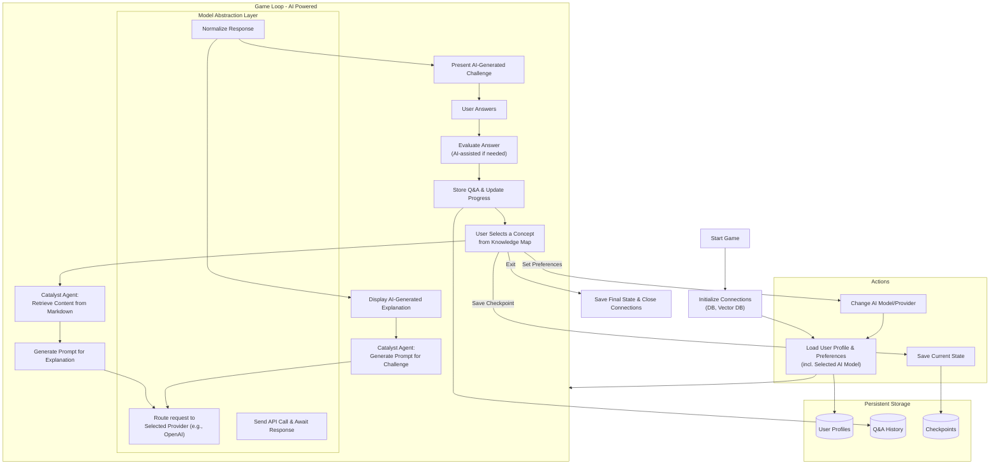

# 📑 Learning Catalyst – Requirement Specification Document

## 1. Introduction

### 1.1 Purpose

The Learning Catalyst is an **AI-driven interactive learning game** designed to guide users through Markdown-based learning materials. It provides a **knowledge map, adaptive challenges, checkpoints, and analytics**. Over successive phases, the system will evolve from static learning delivery to an **AI-driven adaptive tutor**.

### 1.2 Scope

- **AI-powered gamified environment** where users explore concepts, answer AI-generated challenges, and save progress.
- **Persistent storage** for user progress, checkpoints, and profiles.
- **User-selectable AI models and providers** for flexibility and cost management.
- **Progressive enhancement** of analytics, gamification, and AI autonomy over subsequent phases.

Target users: **self-learners, students, or professionals** who benefit from an interactive, guided learning experience.

------

## 2. System Overview

### 2.1 Core Modules

- **Knowledge Navigator**: Displays knowledge map, available actions.
- **Challenge Engine**: Works with the Catalyst Agent to present AI-generated questions.
- **Checkpoint Manager**: Saves/loads progress states.
- **Catalyst Agent**: **Core AI-driven module from Phase 1.** It generates explanations, creates challenges, and provides guidance by interfacing with an LLM.
- **Model Abstraction Layer**: **Core module from Phase 1.** Provides a unified interface for communicating with various LLM providers (e.g., OpenAI, Anthropic, local models).
- **Analytics Dashboard**: (Phase 2) Shows proficiency, weak areas, trends.
- **Assessment Engine**: Background process for evaluating user progress and adapting difficulty.

### 2.2 Data Persistence

- **User Profiles** (preferences, progress, competency profile, selected AI model/provider settings).
- **Q&A Database** (all concepts, AI-generated questions, user attempts, AI feedback, timestamps).
- **Checkpoints** (compressed state saves).
- **System Configuration** (available models, API endpoints, credentials management).
- **Vector DB (Optional but Recommended for Phase 1)**: For efficient semantic retrieval of content chunks to provide context to the LLM.

------

## 3. Functional Requirements

### 3.1 User Actions

- **Explore Concept**
  - **Phase 1**: The Catalyst Agent reads the relevant Markdown section and uses an LLM to generate a tailored, engaging explanation.
- **Answer Challenges**
  - **Phase 1**: The Catalyst Agent uses the LLM to generate relevant questions (e.g., multiple-choice, open-ended) based on the concept content. The system evaluates the user's answer, potentially using the LLM for grading open-ended responses.
- **Set Preferences**
  - **Phase 1**: Select AI Model & Provider (e.g., GPT-4o, Claude 3 Sonnet), theme.
  - **Phase 2+**: Adjust difficulty, learning style.
- **View Stats**
  - **Phase 1**: Simple stats (attempts, correctness).
  - **Phase 2+**: Enhanced analytics with proficiency trends.
- **Manage Checkpoints**
  - Save/load learning state.
- **Free Query (Navigator Mode)** – Phase 3 only.

### 3.2 Background Processing

- Track Q&A history.
- Update user’s competency profile.
- Identify patterns (weak concepts, learning pace).
- Adjust difficulty (rule-based → AI-driven).

------

## 4. Non-Functional Requirements

- **Scalability**: Handle large Markdown books (100+ chapters).
- **Performance**: Load concept & checkpoint within <2s.
- **Reliability**: Auto-save checkpoints on exit.
- **Security**: Isolate user data (multi-user support).
- **Modularity & Extensibility**: The architecture must support plugging in new LLM providers via the Model Abstraction Layer without requiring significant changes to the `Catalyst Agent` or core application logic.

------

## 5. Architecture Considerations

- **Layered Architecture**
  - **Presentation Layer**: Game UI (knowledge map, chat-like interface for AI interaction).
  - **Logic Layer**: **Catalyst Agent**, **Model Abstraction Layer**, Challenge Engine, Assessment Engine.
  - **Data Layer**: Relational DB, Vector DB.
- **Integration Points**
  - **Phase 1**: Catalyst Agent → **Model Abstraction Layer** → User-selected LLM API. The core game loop is dependent on this integration.
- **Storage Technology**
  - **Phase 1**: SQLite/Postgres for profiles and Q&A history. **Vector DB (e.g., ChromaDB, FAISS) is highly recommended** for providing context to the LLM.

---

## 6. Project Lifecycle

------

### 📌 Phase 1 – MVP (Static Learning Game)

**Goal**: Deliver a core interactive learning experience where the AI generates curriculum content and challenges on the fly.

- **AI-generated explanations** from source Markdown.
- **AI-generated challenges** based on concept content.
- LLM-based evaluation for simple answers.
- User can **select their preferred AI model and provider**.
- Basic progress tracking and manual checkpoints.

**Flowchart (MVP)**

------

### 📌 Phase 2 – Gamified Progression

**Goal**: Enhance the AI core with robust analytics, gamification, and smarter progression.

- **Analytics Dashboard** showing proficiency, weak areas, and learning trends.
- **Background Assessment Engine** updates a user's competency profile based on performance.
- Rule-based **adaptive difficulty** (e.g., ask harder questions on mastered topics).
- **Autosave** checkpoints.

**Flowchart (Phase 2)**: This phase adds the `Assessment Engine` and `Analytics Dashboard` around the existing AI core loop from Phase 1. The main interaction loop remains the same, but its outputs now feed a more complex background system.

------

### 📌 Phase 3 – AI-Driven Catalyst

**Goal**: Evolve the Catalyst Agent into a semi-autonomous tutor that can operate with more freedom.

- **Navigator Mode**: Allow free-form Q&A with the AI about the learning material.
- **AI-Driven Pathing**: The AI suggests the next concept to study based on the user's competency profile and goals.
- **Long-term Memory**: Use advanced vector context to allow the AI to remember interactions across multiple sessions.
- Fully **AI-driven adaptive difficulty** and content personalization.

**Flowchart (Phase 3)**: This phase adds the "Free Query" path and makes the AI's role more proactive, potentially breaking from the linear "Select Concept -> Explain -> Challenge" loop by suggesting concepts itself.

------

## 7. Risks & Dependencies

- **LLM API Cost & Latency (Primary MVP Risk)**: The core user experience is directly tied to the performance and cost of external AI services. This must be managed and monitored from day one.
- **Quality of AI Generation**: The quality of explanations and challenges is dependent on prompt engineering and the chosen model. Poor generation can lead to a frustrating user experience.
- **Data Privacy & Security**: Sending learning material to third-party APIs requires clear privacy policies. User data and API keys must be secured.
- **Initial Setup Complexity**: The MVP now requires integration with LLM APIs and potentially a vector DB, increasing initial development effort compared to a static version.

---

## 8. Success Criteria

- **Phase 1**: Users can successfully learn from a Markdown file where the **AI generates the explanations and challenges**, and their progress is saved. Users can switch between configured AI models.
- **Phase 2**: The system provides users with a **meaningful analytics dashboard** that helps them understand their strengths and weaknesses.
- **Phase 3**: Users can treat the application like a **personal tutor**, asking free-form questions and receiving intelligent suggestions on what to learn next.

------

## 9. Requirements Traceability Matrix (RTM)

| Requirement ID             | User Story                                     | Flowchart Node(s) | Component(s)                                           |
| -------------------------- | ---------------------------------------------- | ----------------- | ------------------------------------------------------ |
| **BYOK-R1 (Prerequisite)** | **US1: Provide and Validate AI Configuration** | **A to K**        | **Configuration Manager, UI, Model Abstraction Layer** |
| **BYOK-R2**                | US2: Get AI Explanation                        | L1, L2, L3        | Catalyst Agent, Model Abstraction Layer                |
| **BYOK-R3**                | US3: Answer AI Challenge                       | L3, L4            | Catalyst Agent, Challenge Engine                       |
| **BYOK-R4**                | US4: Change My AI Config                       | C                 | Configuration Manager, UI                              |
| **BYOK-R5**                | US5: Save Progress                             | M1                | Checkpoint Manager                                     |

------

| Requirement ID | User Story               | Flowchart Node(s)             | Component(s)                          |
| -------------- | ------------------------ | ----------------------------- | ------------------------------------- |
| **GAM-R1**     | US1: Adaptive Difficulty | D5, D6, AssessmentEngine, D14 | Assessment Engine, Challenge Engine   |
| **GAM-R2**     | US2: View Stats Trends   | D9, DB1, DB2                  | Analytics Engine, DB1, DB2            |
| **GAM-R3**     | US3: Update Preferences  | D1, D11, DB2                  | UI Panel, Preferences Manager         |
| **GAM-R4**     | US4: Autosave            | D6, D8, DB3                   | Checkpoint Manager, Persistence Layer |

------

| Requirement ID | User Story                         | Flowchart Node(s)  | Component(s)                                           |
| -------------- | ---------------------------------- | ------------------ | ------------------------------------------------------ |
| **AI-R1**      | US1: Personalized Explanation      | D2, D3, M1-M4, D4  | Catalyst Agent, Model Abstraction Layer                |
| **AI-R2**      | US2: Semantic Challenge Evaluation | D5-D8, AIEngine    | Challenge Engine, AI Assessment Engine, LLM API        |
| **AI-R3**      | US3: Navigator Mode                | D1, D12, M1-M4, D4 | UI Panel, Catalyst Agent, Model Abstraction Layer      |
| **AI-R4**      | US4: AI-Driven Adaptive Path       | AIEngine           | Assessment Engine, LLM API                             |
| **AI-R5**      | US5: Contextual Checkpoints        | D10, DB3           | Checkpoint Manager, Context Compressor                 |
| **AI-R6**      | US6: Select AI Model & Provider    | D11, C, DB2        | UI Panel, Preferences Manager, Model Abstraction Layer |