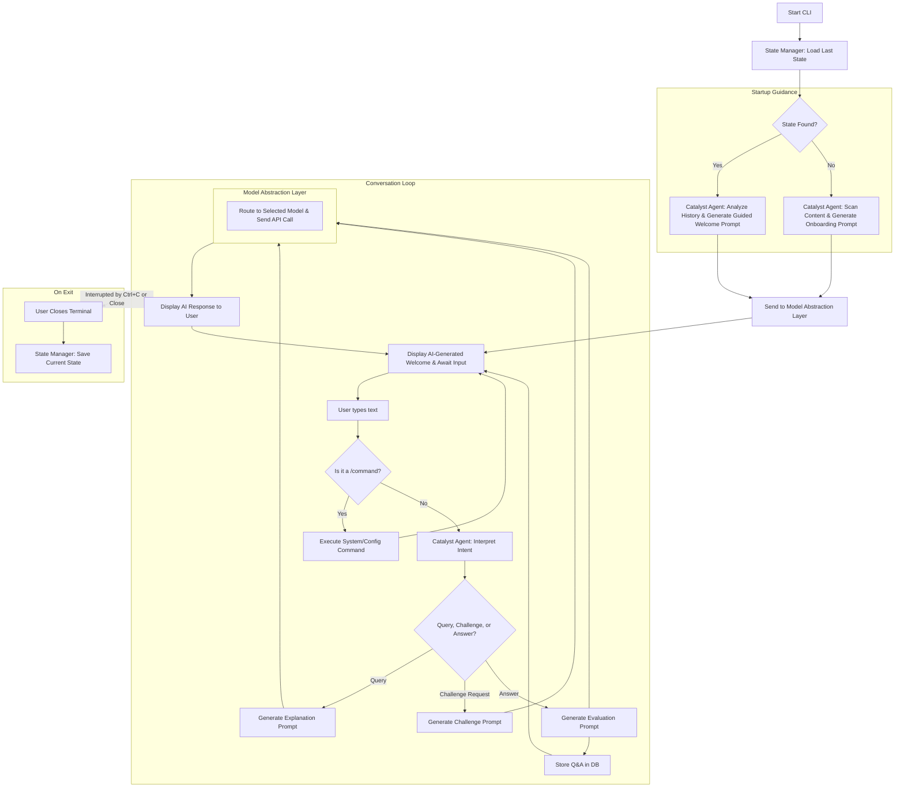

# 📑 Learning Catalyst

## 1. Introduction

### 1.1 Purpose
Learning Catalyst is a **local-first, conversational AI tutor** that operates within the command line. It fosters a natural, dialogue-led learning experience, **proactively guiding users** through their local Markdown-based materials. The application initiates the learning process from the moment it starts, suggesting next steps and ensuring a continuous, supportive journey. By leveraging configurable AI models, it provides on-demand explanations, adaptive challenges, and persistent progress tracking in a private and highly controlled environment.

### 1.2 Scope
*   **Proactive Conversational Interface**: The primary interaction is a continuous chat dialogue where the AI tutor actively guides the conversation.
*   **Guided Startup & Resumption**: The application intelligently resumes previous sessions or onboards new users with context-aware suggestions, eliminating user uncertainty.
*   **Context-Aware Learning**: The AI grounds its responses and challenges in the user's local Markdown files.
*   **Persistent State**: The application automatically saves the user's conversation and progress, allowing them to seamlessly resume at any time.
*   **Pluggable AI Models**: Users can configure and switch between various AI providers and models to manage cost and performance.
*   **Progressive Enhancement**: The system is designed to evolve from a core conversational tool into a fully adaptive AI tutor.

**Target Users**: Self-learners, students, and professionals who want a supportive, AI-driven learning partner and value local data control.

---

## 2. System Overview

### 2.1 Core Modules
- **Configuration Manager**: Manages providers, models, and API keys via `config.json`.
- **CLI Interface**: Renders the conversational dialogue and handles user input and system commands.
- **Catalyst Agent**: The core AI-driven module. It interprets user intent, processes queries, generates explanations, formulates challenges, and is **responsible for generating context-aware startup prompts to guide the user immediately upon launch.**
- **Challenge Engine**: Works with the Catalyst Agent to present AI-generated questions and process user answers.
- **State Manager**: Handles the **mechanics** of automatically saving the application state on exit and seamlessly loading it on launch for the Catalyst Agent to interpret. Manages manual checkpoints.
- **Model Abstraction Layer**: Provides a unified interface for communicating with various LLM providers.
- **Analytics Dashboard**: (Phase 2) Displays user proficiency and learning trends.
- **Assessment Engine**: (Phase 2) A background process that evaluates user performance to update competency profiles.

### 2.2 Data Persistence
- **User Profiles**: Stores preferences, a long-term competency profile, and the selected AI model.
- **Q&A Database (SQLite)**: A persistent log of all concepts, AI-generated questions, user attempts, and AI feedback.
- **Application State**: A file representing the current conversational context and UI state, automatically saved on exit.
- **System Configuration (`config.json`)**: Stores models, providers, and API keys.
- **Vector DB (ChromaDB or FAISS)**: (Phase 3 Recommended) For enabling long-term memory and semantic retrieval of content.

### 2.3 Technology Stack
- **CLI Framework**: Click or Typer
- **Configuration**: JSON files
- **Database**: SQLite for profiles and Q&A history
- **Vector DB**: ChromaDB or FAISS (optional)
- **API Standard**: OpenAI-compatible interface for all providers

---

## 3. Functional Requirements

### High-Level User Story: Guided Application Startup

> **As a** Learning Catalyst user,
> **I want** the application to proactively guide my next learning step upon startup,
> **so that** I can immediately re-engage with my learning path or start a new one without uncertainty.

### 3.1 Application Startup & Resumption
The application must provide a guided experience from the moment it is launched, eliminating blank states and actively directing the user.

#### 3.1.1 Scenario: Guided Resumption (Existing User)
-   **GIVEN** a user has a previously saved learning session,
-   **WHEN** the user launches the application,
-   **THEN** the system must:
    1.  Automatically load the last saved state, displaying the full conversation history.
    2.  Use the **Catalyst Agent** to generate a dynamic, context-aware welcome message that summarizes the last point of discussion (e.g., `Welcome back! We were just discussing JavaScript closures.`).
    3.  Propose a specific, actionable next step to re-engage the user (e.g., `"Would you like me to quiz you on that now?"` or `"Shall we move on to the next topic, 'Immediately Invoked Function Expressions'?"`).
    4.  Activate the input prompt, awaiting the user's response to the AI's suggestion.

#### 3.1.2 Scenario: Guided Onboarding (New User)
-   **GIVEN** a user is launching the application for the first time or no state file exists,
-   **WHEN** the user launches the application,
-   **THEN** the system must:
    1.  Initialize a new session.
    2.  Use the **Catalyst Agent** to perform a lightweight scan of the available local Markdown files.
    3.  Display a welcome message that immediately suggests a concrete first topic based on the scanned content (e.g., `Welcome to Learning Catalyst! I see you have materials on Python. To get started, shall I explain the first topic, 'Variables and Data Types'?'`).
    4.  Guide the user with a simple choice (e.g., "yes", "no") rather than requiring them to formulate an initial query.
    5.  Activate the input prompt, awaiting the user's response to the onboarding suggestion.

### 3.2 The Core Conversational Experience
The primary user interaction is a single, continuous conversation.

| User Input Type                                              | System Behavior                                              |
| ------------------------------------------------------------ | ------------------------------------------------------------ |
| **Query for Information**<br/>(e.g., `Explain closures in JavaScript.`) | The **Catalyst Agent** retrieves relevant content from the Markdown files and generates a detailed explanation. |
| **Request for a Challenge**<br/>(e.g., `Quiz me on that.` or `Give me a hard question.`) | The **Challenge Engine** generates a relevant question (MCQ, open-ended) based on the current context or a specified topic. |
| **Answer to a Challenge**<br/>(e.g., `A closure is...` or `C`) | The system receives the input as an answer to the last-asked question. The **Catalyst Agent** evaluates its correctness and provides feedback. |

### 3.3 System and State Management Commands
These commands are prefixed with `/` to distinguish them from conversational input.

| Command                   | Description                                                  |
| ------------------------- | ------------------------------------------------------------ |
| `/clear`                  | Resets the AI's short-term conversational context. This is for starting a fresh topic without losing overall progress history. |
| `/checkpoint save <name>` | Manually saves a named snapshot of the current state, allowing the user to create specific restore points. |
| `/checkpoint load <name>` | Restores the application to a previously saved checkpoint.   |
| `/stats`                  | (Phase 2) Displays the user's analytics dashboard.           |
| `/suggest`                | (Phase 3) Asks the AI tutor to suggest the next concept to learn based on the user's profile. |

### 3.4 Configuration Commands
These commands are used for one-time setup and management of AI models.

| Command                 | Description                                                  |
| ----------------------- | ------------------------------------------------------------ |
| `/provider list`        | Lists all configured providers.                              |
| `/provider add`         | A wizard to add a new provider (ID, endpoint, auth scheme).  |
| `/provider remove <id>` | Removes a provider configuration.                            |
| `/models`               | Lists all configured models (never shows API keys).          |
| `/model add`            | A wizard to add a model (ID, provider, model name, API key). |
| `/model remove <id>`    | Removes a model configuration.                               |
| `/model use <id>`       | Sets the active model for all AI operations.                 |

---

## 4. Non-Functional Requirements

- **Local-First**: All user data, progress, and configuration must be stored on the user's local machine.
- **Persistent State**: The application **must** automatically save its full state on exit and use that state to provide a **guided, proactive resumption experience** on the next launch.
- **Simplicity**: Configuration is managed through a single, human-readable `config.json` file.
- **Performance**: Application startup and state restoration should complete in under 2 seconds. AI-driven startup prompts may take slightly longer and should be streamed to the user.
- **Modularity**: The Model Abstraction Layer must allow for easy integration of new OpenAI-compatible AI providers.
- **Security**: API keys are stored in plaintext in the local `config.json`. Users are responsible for securing this file (e.g., via file permissions and `.gitignore`).

---

## 5. Architecture

### 5.1 Layered Architecture
```
┌───────────────────────────────────┐
│        CLI Interface              │
│      (Conversation View)          │
└─────────────────┬─────────────────┘
                  │
┌─────────────────▼─────────────────┐
│          Logic Layer              │
│  ┌─────────────────┐  ┌───────────┐│
│  │ Catalyst Agent │  │Challenge  ││
│  │(Intent/AI Proc)│  │Engine     ││
│  └─────────────────┘  └───────────┘│
│  ┌─────────────────┐  ┌───────────┐│
│  │Model Abstraction│  │State      ││
│  │Layer           │  │Manager    ││
│  └─────────────────┘  └───────────┘│
└─────────────────┬─────────────────┘
                  │
┌─────────────────▼─────────────────┐
│          Data Layer               │
│  ┌───────────┐  ┌───────────┐    │
│  │SQLite DB  │  │Vector DB  │    │
│  │(Q&A Hist) │  │(Content)  │    │
│  └───────────┘  └───────────┘    │
└───────────────────────────────────┘
```

### 5.2 Phase 1 (MVP) Flow


---

## 6. Project Lifecycle

### 📌 Phase 1 – MVP (Guided Conversational Core)
- Implement **intelligent, guided startup**: Proactively suggest the next learning step upon resumption or a starting topic for new users.
- Implement the **continuous conversational interface**.
- **AI-generated explanations and challenges** driven by natural language input.
- **Automatic state saving** on exit and resumption on launch.
- The `/clear` command to reset conversational context.
- Full suite of commands for **model and provider configuration**.
- Manual checkpointing (`/checkpoint save/load`).

### 📌 Phase 2 – Enhanced Analytics & Adaptivity
- Implement a background **Assessment Engine** to build a user competency profile.
- Introduce **rule-based adaptive difficulty** where the AI adjusts challenge hardness based on user performance.
- Add the `/stats` command to display an **analytics dashboard** with proficiency trends.

### 📌 Phase 3 – AI-Driven Tutor
- Integrate a **vector database** to provide the AI with long-term memory across all conversations.
- Implement the `/suggest` command for **AI-driven learning path suggestions**.
- Evolve the system into a **fully adaptive, personalized tutor** that can initiate topics and guide the user proactively throughout the entire session.

---

## 7. Security & Configuration
- **API Key Storage**: Keys are stored in plaintext in the local `config.json`. This is acceptable for a local-only application but requires user awareness.
- **Security Recommendations**:
  - Add `config.json` and the `.learningspace` directory to `.gitignore`.
  - Use restrictive file permissions on the application's data directory.
  - Never share the `config.json` file.

---

## 8. Risks & Dependencies
- **API Cost & Latency**: The user experience is directly tied to the performance and cost of external AI services. The AI-driven startup adds an API call on launch.
- **AI Generation Quality**: The utility of the tool and the relevance of its guidance depend heavily on prompt engineering and the quality of the chosen AI model.
- **Data Privacy**: Although local-first, the content is sent to third-party APIs. The user is responsible for choosing trusted providers.
- **Setup Complexity**: Initial setup requires the user to procure and configure API keys.

---

## 9. Success Criteria
- **Phase 1**: Users are immediately greeted with a relevant, AI-generated suggestion upon launching the app, either continuing a past topic or suggesting a new one. The application state is successfully saved and restored, and users can fully configure their AI models.
- **Phase 2**: The system provides a meaningful analytics dashboard via `/stats`, and users notice that challenge difficulty adapts to their skill level.
- **Phase 3**: The AI demonstrates long-term memory by referencing past topics, and the `/suggest` command provides relevant, intelligent recommendations for what to learn next.

---

## 10. Requirements Traceability Matrix (RTM)

| ID           | Requirement                          | Description                                                  | Component                           | Phase |
| ------------ | ------------------------------------ | ------------------------------------------------------------ | ----------------------------------- | ----- |
| **START-R1** | **Intelligent Startup & Resumption** | Proactively guide the user upon application launch. If a prior state exists, resume the context with a suggestion. If not, onboard the user by suggesting an initial topic from their materials. | Catalyst Agent, State Manager       | 1     |
| **CONV-R1**  | Continuous conversational UI         | The main interface is a seamless, scrolling chat dialogue.   | CLI Interface                       | 1     |
| **CONV-R2**  | AI intent interpretation             | Distinguish between queries, challenge requests, and answers. | Catalyst Agent                      | 1     |
| **STATE-R1** | Automatic State Persistence          | The application's full conversational state is automatically saved on exit and loaded on start. | State Manager                       | 1     |
| **STATE-R2** | Clear conversational context         | The `/clear` command resets the AI's short-term memory.      | Catalyst Agent                      | 1     |
| **STATE-R3** | Manual checkpointing                 | The `/checkpoint` commands allow users to save/load named states. | State Manager                       | 1     |
| **CONF-R1**  | Configuration Management             | Commands to manage AI providers and models.                  | Config Manager                      | 1     |
| **AI-R1**    | Generate explanations                | Generate explanations based on user queries and Markdown content. | Catalyst Agent                      | 1     |
| **AI-R2**    | Generate challenges                  | Create questions based on the current learning context.      | Challenge Engine                    | 1     |
| **AI-R3**    | Evaluate answers                     | Use an LLM to assess the correctness of user answers to challenges. | Catalyst Agent                      | 1     |
| **DATA-R1**  | Persist Q&A history                  | Log questions, answers, and feedback in a local database.    | SQLite DB                           | 1     |
| **ANAL-R1**  | Track user competency profile        | A background system to build a proficiency model of the user. | Assessment Engine                   | 2     |
| **ANAL-R2**  | Display analytics dashboard          | The `/stats` command to show user progress and weak areas.   | Analytics Dashboard                 | 2     |
| **ADAPT-R1** | Adaptive challenge difficulty        | Adjust challenge hardness based on user performance.         | Assessment Engine, Challenge Engine | 2     |
| **TUTOR-R1** | AI-driven learning suggestions       | The `/suggest` command for proactive topic recommendations.  | Catalyst Agent                      | 3     |
| **TUTOR-R2** | Long-term contextual memory          | Use a vector database for semantic recall across sessions.   | Vector DB                           | 3     |