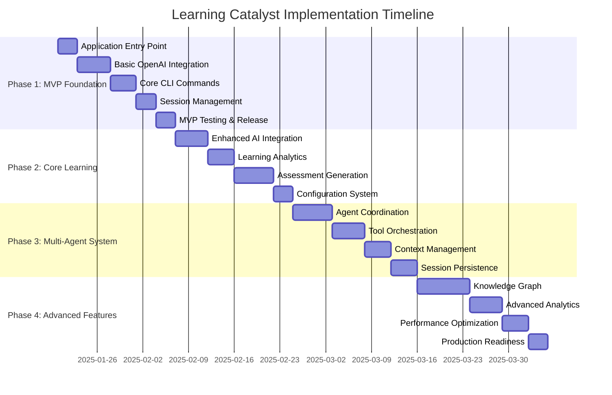

# Learning Catalyst Implementation Plan

## 🎯 Executive Summary

This implementation plan bridges the 76% gap between Learning Catalyst's architectural vision and current implementation. The plan follows a **progressive enhancement approach** that delivers a working Minimum Viable Product (MVP) in Phase 1, then systematically adds capabilities through 4 distinct phases over 12-16 weeks.

## 📊 Current State Analysis

**Assets We Have:**
- ✅ Comprehensive data models (90% complete)
- ✅ Database layer with SQLite (40% complete)
- ✅ Basic CLI interface structure (30% complete)
- ✅ AI provider abstraction framework (40% complete)
- ✅ Configuration management system (70% complete)
- ✅ Testing infrastructure (110% of current needs)

**Critical Missing Components:**
- ✅ Application entry point (`src/cli/main.py`)
- ❌ Working AI provider implementation
- ❌ Learning session management
- ❌ Basic AI conversation flow
- ❌ Error handling and logging

## 🗺️ Implementation Roadmap Overview

---

## 📋 Phase 1: MVP Foundation (2-3 weeks)

### **Goal**: Create a working CLI application that can have basic AI conversations

### **Phase 1.1: Application Entry Point** (3 days)

**Priority**: CRITICAL - This is the blocker preventing any functionality

**Files to Create/Modify**:
- `src/cli/main.py` (new, ~100 lines)
- `src/cli/app.py` (new, ~50 lines)

**Implementation Tasks**:
- [x] Task 1.1.1: Create `src/cli/main.py` with Typer structure
- [x] Task 1.1.2: Implement `setup_configuration()` function
- [x] Task 1.1.3: Create `run_interactive_mode()` async function
- [x] Task 1.1.4: Add Rich console integration
- [x] Task 1.1.5: Implement basic error handling and logging
- [x] Task 1.1.6: Test application startup and basic flow

**Success Criteria**:
- [x] Application can start with `python -m src.cli.main`
- [x] Basic welcome message displays
- [x] Configuration wizard runs for new users
- [x] Graceful error handling for missing dependencies

### **Phase 1.2: Basic OpenAI Integration** (5 days)

**Priority**: CRITICAL - Core functionality dependency

**Files to Create/Modify**:
- `src/ai/providers/openai_provider.py` (complete implementation, ~200 lines)
- `src/ai/factory.py` (enhance, ~50 lines)
- `src/ai/registry.py` (enhance, ~30 lines)

**Implementation Tasks**:
- [ ] Task 1.2.1: Complete `OpenAIProvider.send_message()` implementation
- [ ] Task 1.2.2: Implement `OpenAIProvider.list_available_models()`
- [ ] Task 1.2.3: Add API key management and validation
- [ ] Task 1.2.4: Implement rate limiting and retry logic
- [ ] Task 1.2.5: Add comprehensive error handling for API failures
- [ ] Task 1.2.6: Create provider factory for easy instantiation
- [ ] Task 1.2.7: Test OpenAI integration end-to-end

**Success Criteria**:
- [ ] Can list available OpenAI models
- [ ] Can send chat messages and receive responses
- [ ] Proper error handling for API failures
- [ ] Token usage tracking works
- [ ] Rate limiting prevents API abuse

### **Phase 1.3: Core CLI Commands** (4 days)

**Priority**: HIGH - Essential user interactions

**Files to Create/Modify**:
- `src/cli/commands.py` (enhance existing, add ~150 lines)
- `src/cli/state.py` (enhance, ~50 lines)

**Implementation Tasks**:
- [ ] Task 1.3.1: Implement `ConversationCommand` for natural language interactions
- [ ] Task 1.3.2: Create `ConfigAICommand` for provider setup
- [ ] Task 1.3.3: Implement `SessionCommand` for session management
- [ ] Task 1.3.4: Enhance `HelpCommand` with examples and usage
- [ ] Task 1.3.5: Add command validation and error handling
- [ ] Task 1.3.6: Integrate commands with CLI interface
- [ ] Task 1.3.7: Test all CLI commands functionality

**Success Criteria**:
- [ ] Users can have AI conversations via `/ai`
- [ ] Provider configuration works via CLI
- [ ] Session management commands function
- [ ] Help system provides useful guidance
- [ ] Commands validate input properly

### **Phase 1.4: Session Management** (3 days)

**Priority**: HIGH - State persistence

**Files to Create/Modify**:
- `src/core/session.py` (new, ~150 lines)
- `src/data/session_repository.py` (new, ~100 lines)
- `src/cli/state.py` (enhance, ~30 lines)

**Implementation Tasks**:
- [ ] Task 1.4.1: Create `SessionManager` class with core methods
- [ ] Task 1.4.2: Implement session persistence to SQLite database
- [ ] Task 1.4.3: Create session lifecycle management
- [ ] Task 1.4.4: Add session CLI commands (save/load/list)
- [ ] Task 1.4.5: Integrate session management with AI conversation flow
- [ ] Task 1.4.6: Test session persistence and recovery

**Success Criteria**:
- [ ] Sessions can be created and saved
- [ ] Session data persists across application restarts
- [ ] Users can list and switch between sessions
- [ ] Session context is maintained in conversations

### **Phase 1.5: MVP Testing & Release** (3 days)

**Priority**: MEDIUM - Quality assurance

**Implementation Tasks**:
- [ ] Task 1.5.1: Create end-to-end integration tests
- [ ] Task 1.5.2: Fix critical bugs discovered in testing
- [ ] Task 1.5.3: Update documentation to match implemented features
- [ ] Task 1.5.4: Create user onboarding guide
- [ ] Task 1.5.5: Prepare MVP release and version tagging

**Success Criteria**:
- [ ] All core functionality works without errors
- [ ] Basic user test shows successful interaction
- [ ] Documentation accurately reflects features
- [ ] MVP is ready for user feedback

---

## 📋 Phase 2: Core Learning Features (3-4 weeks)

### **Goal**: Add learning analytics, assessments, and multi-provider support

### **Phase 2.1: Enhanced AI Integration** (5 days)

**Files to Create/Modify**:
- `src/ai/providers/chatglm_provider.py` (complete, ~150 lines)
- `src/ai/providers/deepseek_provider.py` (complete, ~150 lines)
- `src/ai/providers/siliconflow_provider.py` (complete, ~150 lines)
- `src/ai/context_manager.py` (new, ~200 lines)

**Implementation Tasks**:
- [ ] Task 2.1.1: Complete ChatGLM provider implementation
- [ ] Task 2.1.2: Complete DeepSeek provider implementation
- [ ] Task 2.1.3: Complete SiliconFlow provider implementation
- [ ] Task 2.1.4: Create `ProviderManager` for multi-provider support
- [ ] Task 2.1.5: Implement provider health checking
- [ ] Task 2.1.6: Add automatic failover logic
- [ ] Task 2.1.7: Create context-aware request routing

### **Phase 2.2: Learning Analytics** (4 days)

**Files to Create/Modify**:
- `src/core/analytics.py` (new, ~250 lines)
- `src/data/analytics_repository.py` (new, ~150 lines)
- `src/cli/commands.py` (add analytics commands, ~100 lines)

**Implementation Tasks**:
- [ ] Task 2.2.1: Create `LearningAnalytics` class with core tracking
- [ ] Task 2.2.2: Implement interaction tracking system
- [ ] Task 2.2.3: Build progress calculation algorithms
- [ ] Task 2.2.4: Add learning insight generation
- [ ] Task 2.2.5: Create analytics CLI commands
- [ ] Task 2.2.6: Design analytics data models and repository

### **Phase 2.3: Assessment Generation** (6 days)

**Files to Create/Modify**:
- `src/core/assessment.py` (new, ~300 lines)
- `src/core/quiz_generator.py` (new, ~250 lines)
- `src/data/assessment_repository.py` (new, ~150 lines)

**Implementation Tasks**:
- [ ] Task 2.3.1: Create `AssessmentEngine` with quiz generation
- [ ] Task 2.3.2: Implement AI-powered question generation
- [ ] Task 2.3.3: Build answer evaluation logic
- [ ] Task 2.3.4: Add adaptive difficulty adjustment
- [ ] Task 2.3.5: Create feedback generation system
- [ ] Task 2.3.6: Design assessment data models
- [ ] Task 2.3.7: Create assessment CLI commands

### **Phase 2.4: Configuration System** (3 days)

**Files to Create/Modify**:
- `src/core/config.py` (enhance, ~100 lines)
- `src/data/config_repository.py` (new, ~100 lines)
- Add configuration validation and migration

**Implementation Tasks**:
- [ ] Task 2.4.1: Enhance configuration management with validation
- [ ] Task 2.4.2: Create configuration repository for persistence
- [ ] Task 2.4.3: Add configuration schema validation
- [ ] Task 2.4.4: Implement configuration migration system
- [ ] Task 2.4.5: Test comprehensive configuration management

---

## 📋 Phase 3: Multi-Agent System (3-4 weeks)

### **Goal**: Implement collaborative AI agents and tool orchestration

### **Phase 3.1: Agent Coordination** (6 days)

**Files to Create/Modify**:
- `src/ai/agents/coordinator.py` (complete, ~300 lines)
- `src/ai/agents/tutor.py` (complete, ~200 lines)
- `src/ai/agents/assessment.py` (complete, ~200 lines)

**Implementation Tasks**:
- [ ] Task 3.1.1: Complete `AgentCoordinator` implementation
- [ ] Task 3.1.2: Implement Tutor agent with learning capabilities
- [ ] Task 3.1.3: Implement Assessment agent for evaluation
- [ ] Task 3.1.4: Implement Recommendation agent
- [ ] Task 3.1.5: Add agent collaboration protocols
- [ ] Task 3.1.6: Create agent selection logic
- [ ] Task 3.1.7: Test multi-agent workflows

### **Phase 3.2: Tool Orchestration** (5 days)

**Files to Create/Modify**:
- `src/ai/tools/registry.py` (enhance, ~150 lines)
- `src/ai/tools/executor.py` (new, ~200 lines)
- `src/ai/tools/learning.py` (enhance, ~100 lines)

**Implementation Tasks**:
- [ ] Task 3.2.1: Enhance `ToolRegistry` with function calling
- [ ] Task 3.2.2: Implement learning tools (concept explanation, quiz)
- [ ] Task 3.2.3: Implement system tools (config, stats)
- [ ] Task 3.2.4: Add tool execution framework
- [ ] Task 3.2.5: Implement tool result processing
- [ ] Task 3.2.6: Create tool validation and security
- [ ] Task 3.2.7: Test tool orchestration end-to-end

### **Phase 3.3: Context Management** (4 days)

**Files to Create/Modify**:
- `src/ai/context.py` (enhance, ~200 lines)
- `src/core/memory.py` (new, ~150 lines)
- `src/ai/context_manager.py` (enhance, ~100 lines)

**Implementation Tasks**:
- [ ] Task 3.3.1: Enhance `ContextManager` with memory systems
- [ ] Task 3.3.2: Implement conversation context tracking
- [ ] Task 3.3.3: Create learning context management
- [ ] Task 3.3.4: Add context compression and summarization
- [ ] Task 3.3.5: Implement context persistence
- [ ] Task 3.3.6: Test context management across sessions

### **Phase 3.4: Session Persistence** (4 days)

**Files to Create/Modify**:
- `src/core/session.py` (enhance, ~100 lines)
- `src/data/session_repository.py` (enhance, ~100 lines)
- `src/core/checkpoint.py` (new, ~150 lines)

**Implementation Tasks**:
- [ ] Task 3.4.1: Enhance session persistence with full state
- [ ] Task 3.4.2: Add session checkpoint and restore system
- [ ] Task 3.4.3: Implement session migration and backup
- [ ] Task 3.4.4: Create session analytics and insights
- [ ] Task 3.4.5: Test robust session persistence

---

## 📋 Phase 4: Advanced Features (3-4 weeks)

### **Goal**: Knowledge graph, advanced analytics, and production readiness

### **Phase 4.1: Knowledge Graph** (8 days)

**Files to Create/Modify**:
- `src/knowledge/graph.py` (new, ~400 lines)
- `src/knowledge/semantic.py` (new, ~250 lines)
- `src/knowledge/search.py` (new, ~200 lines)

**Implementation Tasks**:
- [ ] Task 4.1.1: Create knowledge graph data structures
- [ ] Task 4.1.2: Implement concept relationship management
- [ ] Task 4.1.3: Build semantic search capabilities
- [ ] Task 4.1.4: Add vector embeddings for concepts
- [ ] Task 4.1.5: Implement knowledge discovery algorithms
- [ ] Task 4.1.6: Create knowledge graph CLI commands
- [ ] Task 4.1.7: Test knowledge graph functionality
- [ ] Task 4.1.8: Integrate with learning recommendations

### **Phase 4.2: Advanced Analytics** (5 days)

**Files to Create/Modify**:
- `src/core/analytics.py` (enhance, ~200 lines)
- `src/core/predictive.py` (new, ~250 lines)
- `src/cli/commands.py` (add advanced analytics, ~100 lines)

**Implementation Tasks**:
- [ ] Task 4.2.1: Create comprehensive learning analytics
- [ ] Task 4.2.2: Implement learning pattern recognition
- [ ] Task 4.2.3: Build predictive learning models
- [ ] Task 4.2.4: Add learning efficiency metrics
- [ ] Task 4.2.5: Create advanced analytics dashboard
- [ ] Task 4.2.6: Test advanced analytics features

### **Phase 4.3: Performance Optimization** (4 days)

**Files to Create/Modify**:
- `src/core/cache.py` (new, ~150 lines)
- `src/core/monitoring.py` (new, ~100 lines)
- Performance optimization across existing modules

**Implementation Tasks**:
- [ ] Task 4.3.1: Profile and optimize database queries
- [ ] Task 4.3.2: Implement caching systems
- [ ] Task 4.3.3: Optimize AI API call efficiency
- [ ] Task 4.3.4: Add performance monitoring
- [ ] Task 4.3.5: Implement memory optimization
- [ ] Task 4.3.6: Test performance improvements

### **Phase 4.4: Production Readiness** (3 days)

**Files to Create/Modify**:
- `deploy/` directory (new)
- `docs/production/` (new)
- Logging and monitoring enhancements

**Implementation Tasks**:
- [ ] Task 4.4.1: Create deployment configuration
- [ ] Task 4.4.2: Add comprehensive logging system
- [ ] Task 4.4.3: Implement security hardening
- [ ] Task 4.4.4: Create backup and recovery systems
- [ ] Task 4.4.5: Prepare production documentation
- [ ] Task 4.4.6: Final integration testing

---

## 🎯 Success Criteria & Validation

### **Phase 1 MVP Success Criteria**

**Functional Requirements**:
- [ ] Application starts without errors
- [ ] User can configure AI provider via CLI
- [ ] User can have basic AI conversation
- [ ] Sessions save and restore properly
- [ ] Basic help system works

**Quality Requirements**:
- [ ] No critical bugs in core functionality
- [ ] Error messages are user-friendly
- [ ] Configuration validation works
- [ ] Basic logging provides debugging info

**Performance Requirements**:
- [ ] Application starts in <3 seconds
- [ ] AI responses arrive in <30 seconds
- [ ] Session operations complete in <1 second

### **Phase 2 Success Criteria**
- [ ] Multiple AI providers work seamlessly
- [ ] Learning analytics provide meaningful insights
- [ ] Assessment generation creates useful quizzes
- [ ] Configuration system handles all settings

### **Phase 3 Success Criteria**
- [ ] Multiple agents collaborate effectively
- [ ] Tool calling system works reliably
- [ ] Context management maintains conversation flow
- [ ] Session persistence survives restarts

### **Phase 4 Success Criteria**
- [ ] Knowledge graph provides useful connections
- [ ] Advanced analytics drive learning improvements
- [ ] Performance meets production standards
- [ ] System is deployment-ready

---

## ⏱️ Development Timeline & Resources

### **Timeline Overview**
- **Phase 1**: 2-3 weeks (MVP)
- **Phase 2**: 3-4 weeks (Core Learning)
- **Phase 3**: 3-4 weeks (Multi-Agent)
- **Phase 4**: 3-4 weeks (Advanced Features)
- **Total**: 11-15 weeks

### **Weekly Milestones**

**Week 1-3: Phase 1 MVP**
- Week 1: Application entry point and OpenAI integration
- Week 2: CLI commands and session management
- Week 3: Testing and MVP release

**Week 4-7: Phase 2 Core Learning**
- Week 4-5: Enhanced AI integration with multiple providers
- Week 6: Learning analytics and assessment generation
- Week 7: Configuration system and Phase 2 testing

**Week 8-11: Phase 3 Multi-Agent**
- Week 8-9: Agent coordination and collaboration
- Week 10: Tool orchestration and context management
- Week 11: Session persistence and Phase 3 testing

**Week 12-15: Phase 4 Advanced Features**
- Week 12-13: Knowledge graph implementation
- Week 14: Advanced analytics and performance optimization
- Week 15: Production readiness and final testing

---

## 🚀 Getting Started Checklist

### **Immediate Actions (This Week)**
- [ ] Immediate Action 1: Set up development environment for all team members
- [ ] Immediate Action 2: Create project management structure (GitHub Projects/Notion)
- [ ] Immediate Action 3: Set up CI/CD pipeline with automated testing
- [ ] Immediate Action 4: Begin Phase 1.1: Application entry point development
- [ ] Immediate Action 5: Establish user feedback mechanism for early testing
- [ ] Immediate Action 6: Create development workspace and branch strategy

### **Development Setup Checklist**
- [ ] Install development dependencies (`poetry install`)
- [ ] Set up pre-commit hooks for code quality
- [ ] Create development database
- [ ] Configure AI provider API keys for testing
- [ ] Set up development environment variables
- [ ] Create individual development branches

### **First Week Goals**
- [ ] Complete Phase 1.1: Application entry point
- [ ] Start Phase 1.2: OpenAI integration
- [ ] Set up basic testing framework
- [ ] Create initial documentation updates
- [ ] Establish team communication channels

---

## 📊 Implementation Progress Tracking

### **Phase Progress Indicators**

**Phase 1: MVP Foundation**
- [x] Phase 1.1: Application Entry Point (6/6 tasks)
- [ ] Phase 1.2: Basic OpenAI Integration (0/7 tasks)
- [ ] Phase 1.3: Core CLI Commands (0/7 tasks)
- [ ] Phase 1.4: Session Management (0/6 tasks)
- [ ] Phase 1.5: MVP Testing & Release (0/5 tasks)

**Phase 2: Core Learning Features**
- [ ] Phase 2.1: Enhanced AI Integration (0/7 tasks)
- [ ] Phase 2.2: Learning Analytics (0/6 tasks)
- [ ] Phase 2.3: Assessment Generation (0/7 tasks)
- [ ] Phase 2.4: Configuration System (0/5 tasks)

**Phase 3: Multi-Agent System**
- [ ] Phase 3.1: Agent Coordination (0/7 tasks)
- [ ] Phase 3.2: Tool Orchestration (0/7 tasks)
- [ ] Phase 3.3: Context Management (0/6 tasks)
- [ ] Phase 3.4: Session Persistence (0/5 tasks)

**Phase 4: Advanced Features**
- [ ] Phase 4.1: Knowledge Graph (0/8 tasks)
- [ ] Phase 4.2: Advanced Analytics (0/6 tasks)
- [ ] Phase 4.3: Performance Optimization (0/6 tasks)
- [ ] Phase 4.4: Production Readiness (0/6 tasks)

---

## 📋 Quality Assurance & Testing

### **Testing Strategy**

**Unit Testing Requirements**
- [ ] 80%+ code coverage for all new features
- [ ] All public APIs have comprehensive tests
- [ ] Error conditions are properly tested
- [ ] Integration points have contract tests

**Integration Testing Requirements**
- [ ] End-to-end user workflows tested
- [ ] Multi-provider integration verified
- [ ] Session persistence tested across restarts
- [ ] AI provider failover tested

**Performance Testing Requirements**
- [ ] Response times meet specifications
- [ ] Memory usage remains within limits
- [ ] Database queries are optimized
- [ ] Concurrent usage scenarios tested

### **Code Quality Standards**

**Linting and Formatting**
- [ ] All code passes black formatting
- [ ] All code passes flake8 linting
- [ ] All code passes isort import sorting
- [ ] All code passes pyright type checking

**Documentation Standards**
- [ ] All public APIs documented
- [ ] Code examples provided for complex features
- [ ] User documentation updated with each feature
- [ ] Technical documentation kept current

---

## 🔧 Risk Management

### **Technical Risks**

**AI Provider Reliability**
- [ ] Risk: API rate limiting or outages
- [ ] Mitigation: Implement failover to multiple providers
- [ ] Fallback: Graceful degradation to offline mode

**Performance Issues**
- [ ] Risk: Slow response times affect user experience
- [ ] Mitigation: Implement caching and async processing
- [ ] Fallback: Provide progress indicators

**Data Loss**
- [ ] Risk: Session data corruption or loss
- [ ] Mitigation: Implement robust backup and recovery
- [ ] Fallback: Multiple data storage strategies

### **Project Risks**

**Scope Creep**
- [ ] Risk: Adding features beyond MVP scope
- [ ] Mitigation: Strict phase boundaries and prioritization
- [ ] Fallback: Defer non-essential features to later phases

**Timeline Delays**
- [ ] Risk: Development takes longer than estimated
- [ ] Mitigation: Regular progress reviews and buffer time
- [ ] Fallback: Prioritize critical path features

**Resource Constraints**
- [ ] Risk: Insufficient development resources
- [ ] Mitigation: Clear prioritization and milestone planning
- [ ] Fallback: Scale back features to match resources

---

## 📈 Metrics & Monitoring

### **Development Metrics**
- [ ] Velocity: Story points completed per sprint
- [ ] Bug Rate: Bugs found vs. bugs fixed
- [ ] Test Coverage: Percentage of code covered
- [ ] Code Quality: Linting and type checking pass rates

### **Product Metrics**
- [ ] User Engagement: Daily/weekly active users
- [ ] Learning Progress: Concept completion rates
- [ ] AI Performance: Response times and success rates
- [ ] User Satisfaction: Feedback scores and reviews

### **Technical Metrics**
- [ ] Response Times: API and command response times
- [ ] Error Rates: Failure rates across components
- [ ] Resource Usage: Memory and CPU consumption
- [ ] Availability: System uptime and reliability

---

## 🎯 Conclusion

This comprehensive implementation plan provides a clear, actionable roadmap to transform Learning Catalyst from 24% implementation to a fully-featured learning platform. The phased approach ensures that working software is delivered at each step while maintaining quality and gathering user feedback throughout the process.

### **Key Success Factors**
1. **Start with the MVP**: Get a working version in users' hands quickly
2. **Iterative Development**: Build incrementally on proven foundations
3. **Quality Focus**: Maintain high standards for code and user experience
4. **User Feedback**: Continuously gather and incorporate user input
5. **Flexible Planning**: Adapt based on learning and changing requirements

### **Next Steps**
1. **Immediate Setup**: Configure development environment and project management
2. **Phase 1 Start**: Begin with the critical application entry point
3. **Regular Reviews**: Hold weekly progress reviews and planning sessions
4. **User Engagement**: Establish early user feedback channels
5. **Quality Assurance**: Implement testing and quality processes from day one

By following this structured approach, Learning Catalyst can evolve from its current architectural vision to a practical, valuable learning platform that delivers real benefits to users while maintaining the flexibility to adapt and grow based on real-world usage and feedback.

---

*Last Updated: 2025-10-13*
*Version: 1.0.0*
*Total Tasks: 121 | Total Estimated Duration: 11-15 weeks*