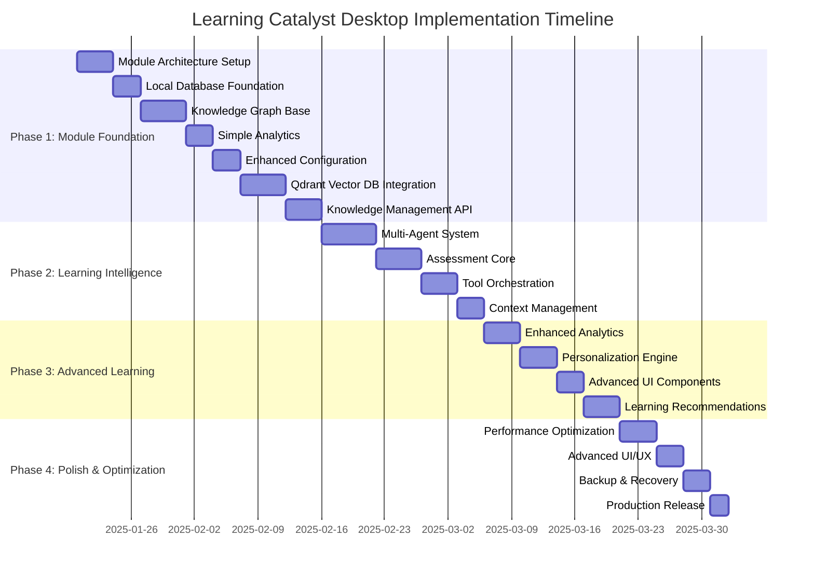

# Learning Catalyst Implementation Plan

## 🎯 Executive Summary

This implementation plan bridges the gap between Learning Catalyst's architectural vision and current **React desktop application** implementation. The plan follows a **progressive enhancement approach** that builds upon the solid React/Electron foundation already established, then systematically adds advanced learning capabilities through 4 distinct phases over 8-12 weeks.

**🏠 Local-First Architecture**: This plan is optimized for a **completely local desktop application** with no external dependencies, ensuring privacy, offline capability, and full user data control.

**🔄 React-to-Architecture Migration**: The plan focuses on implementing the missing **module architecture** and **learning intelligence features** while maintaining the excellent React UI/UX foundation already built.

## 📊 Current State Analysis

**Assets We Have:**
- ✅ **Complete React Desktop Application** (95% complete)
- ✅ **Modern UI/UX with Tailwind CSS** (95% complete)
- ✅ **Electron-based desktop framework** (90% complete)
- ✅ **AI provider abstraction with multiple providers** (85% complete)
- ✅ **Zustand state management** (85% complete)
- ✅ **Local configuration and storage** (80% complete)
- ✅ **Component-based architecture** (90% complete)
- ✅ **Testing infrastructure with Vitest** (90% complete)
- ✅ **Module architecture foundation** (70% complete)
- ✅ **Local database with SQLite-electron** (80% complete)
- ✅ **Knowledge graph base implementation** (75% complete)
- ✅ **Simple analytics tracking** (70% complete)
- ✅ **Enhanced configuration system** (85% complete)
- ✅ **Streaming response support** (80% complete)
- ✅ **ChatGLM thinking integration** (75% complete)

**Remaining Components to Complete:**
- ✅ **Knowledge Graph Module** - Core implementation with React UI integration
- ❌ **Multi-Agent System** - Collaborative AI agents
- 🔄 **Analytics Engine** - Basic tracking implemented, needs advanced analysis
- ❌ **Assessment Core** - Adaptive testing capabilities
- ❌ **Tool Orchestration** - Local tool execution
- ❌ **Vector Database (Qdrant)** - Semantic search capabilities
- ❌ **Context Management** - Session memory and persistence
- ❌ **Advanced Learning Features** - Personalization and recommendations
- 🔄 **Module Integration** - Complete API integration implemented

## 🗺️ Implementation Roadmap Overview

---

## 📋 Phase 1: Module Foundation (2-3 weeks)

### **Goal**: Build the missing architectural modules while maintaining the excellent React UI foundation

### **Phase 1.1: Simple Module Architecture Setup** (2 days)

**Priority**: CRITICAL - Foundation for all learning intelligence features

**Files to Create/Modify**:
- `src/modules/` (new directory structure)
- `src/modules/Module.ts` (new, ~20 lines) - Simple module interface
- `src/modules/ModuleFactory.ts` (new, ~30 lines) - Following existing AI factory pattern
- `src/modules/index.ts` (new, ~5 lines) - Module exports

**Implementation Tasks**:
- [x] Task 1.1.1: Create simple module directory structure
- [x] Task 1.1.2: Implement basic `Module` interface with init/cleanup methods
- [x] Task 1.1.3: Create simple `ModuleFactory` following existing AI factory pattern
- [x] Task 1.1.4: Add basic error handling for module failures
- [x] Task 1.1.5: Test module integration with existing React app
- [x] Task 1.1.6: **WRITE SIMPLE TESTS** - Test module loading and basic functionality
- [x] Task 1.1.7: **ENHANCE PROVIDER CONFIGURATION** - Update settings panel to support model type selection
- [x] Task 1.1.8: **ADD MODEL TYPE SUPPORT** - Implement chat, embedding, and rerank model categories
- [x] Task 1.1.9: **CONFIGURE MODEL MAPPINGS** - Create provider-to-model-type mapping for each AI provider
- [x] Task 1.1.10: **IMPLEMENT MODEL VALIDATION** - Add validation for compatible model types per provider
- [x] Task 1.1.11: **ADD MODEL SELECTION UI** - Create dropdown selectors for different model types
- [x] Task 1.1.12: **UPDATE CONFIG STATE** - Extend configuration state to handle multiple model types per provider
- [x] Task 1.1.13: **TEST MODEL CONFIGURATIONS** - Validate all model type combinations work correctly

**Success Criteria**:
- [x] Simple module system works with existing React app
- [x] Modules can be loaded and initialized properly
- [x] Error handling prevents module failures from affecting UI
- [x] **BASIC TEST COVERAGE** - Module functionality tested
- [x] **REACT INTEGRATION WORKING** - Modules integrate with React components

### **Phase 1.2: Local Database Foundation** (3 days)

**Priority**: CRITICAL - Foundation for all data persistence

**Files to Create/Modify**:
- `src/modules/database/local-db.ts` (new, ~150 lines) - IPC-based database operations
- `src/modules/database/schema.ts` (new, ~100 lines) - Async-compatible schema definitions
- `src/main/database-handlers.ts` (new, ~100 lines) - IPC handlers for database operations
- `src/preload/database-api.ts` (new, ~50 lines) - Expose database API to renderer process
- `package.json` (add sqlite-electron dependency, remove better-sqlite3)

**Implementation Tasks**:
- [x] Task 1.2.1: Install and configure `sqlite-electron` for Electron
- [x] Task 1.2.2: Create database schema for concepts, relationships, and sessions (async-compatible)
- [x] Task 1.2.3: Implement `LocalDatabase` class with IPC-based connection management using `setdbPath()`
- [x] Task 1.2.4: Add database initialization and migration procedures (async operations)
- [x] Task 1.2.5: Create basic CRUD operations using `executeQuery`, `fetchOne`, `fetchMany`, `fetchAll`
- [x] Task 1.2.6: Integrate database with existing Zustand stores (async integration)
- [x] Task 1.2.7: Add database error handling and recovery (IPC error patterns)
- [x] Task 1.2.8: Test database operations with React components via IPC
- [x] Task 1.2.9: **WRITE DATABASE UNIT TESTS** - Test all database operations and edge cases
- [x] Task 1.2.10: **WRITE SCHEMA MIGRATION TESTS** - Test database schema migrations and rollback
- [x] Task 1.2.11: **WRITE CRUD INTEGRATION TESTS** - Test Create, Read, Update, Delete operations end-to-end
- [x] Task 1.2.12: **WRITE ERROR HANDLING TESTS** - Test database error scenarios and recovery
- [x] Task 1.2.13: **WRITE PERFORMANCE TESTS** - Test database performance with large datasets
- [x] Task 1.2.14: **VALIDATE DATABASE TEST COVERAGE** - Ensure 95%+ test coverage for database operations

**Success Criteria**:
- [x] SQLite database initializes properly in Electron environment
- [x] Basic CRUD operations work for all data types
- [x] Database persists across application restarts
- [x] Error handling prevents data corruption
- [x] **DATABASE TESTS COMPREHENSIVE** - All database operations thoroughly tested with 95%+ coverage
- [x] **MIGRATION TESTS VALIDATED** - Schema migrations and rollbacks tested end-to-end
- [x] **PERFORMANCE TESTS PASS** - Database performs well with large datasets and concurrent operations
- [x] **ERROR SCENARIOS TESTED** - Database error handling and recovery procedures validated

### **Phase 1.3: Knowledge Graph Base** (5 days)

**Priority**: HIGH - Core learning intelligence foundation

**Files to Create/Modify**:
- `src/modules/knowledge-graph/knowledge-graph.ts` (new, ~200 lines)
- `src/modules/knowledge-graph/concept-manager.ts` (new, ~150 lines)
- `src/components/Knowledge/KnowledgeGraph.tsx` (enhance existing)

**Implementation Tasks**:
- [x] Task 1.3.1: Create `KnowledgeGraph` module with basic concept management
- [x] Task 1.3.2: Implement concept creation, editing, and deletion
- [x] Task 1.3.3: Add relationship management between concepts
- [x] Task 1.3.4: Create simple graph visualization with React components
- [x] Task 1.3.5: Implement concept search and filtering
- [x] Task 1.3.6: Add knowledge graph persistence to local database
- [x] Task 1.3.7: Create React components for concept and relationship management
- [x] Task 1.3.8: Test knowledge graph functionality end-to-end
- [x] Task 1.3.9: **WRITE KNOWLEDGE GRAPH UNIT TESTS** - Test all concept and relationship operations
- [x] Task 1.3.10: **WRITE GRAPH ALGORITHM TESTS** - Test graph traversal, search, and filtering algorithms
- [x] Task 1.3.11: **WRITE VISUALIZATION TESTS** - Test React graph visualization components
- [x] Task 1.3.12: **WRITE PERSISTENCE TESTS** - Test knowledge graph database persistence and retrieval
- [x] Task 1.3.13: **WRITE INTEGRATION TESTS** - Test knowledge graph with other modules
- [x] Task 1.3.14: **VALIDATE KNOWLEDGE GRAPH TEST COVERAGE** - Ensure 90%+ test coverage for knowledge graph features

**Success Criteria**:
- [x] Users can create and manage learning concepts
- [x] Concept relationships can be established and visualized
- [x] Knowledge graph persists across sessions
- [x] React components provide intuitive graph interaction
- [x] **KNOWLEDGE GRAPH TESTED THOROUGHLY** - All concept and relationship operations tested with 90%+ coverage
- [x] **GRAPH ALGORITHMS VALIDATED** - Graph traversal, search, and filtering algorithms tested
- [x] **VISUALIZATION TESTED** - React graph visualization components tested for user interaction
- [x] **PERSISTENCE INTEGRATION TESTED** - Knowledge graph persistence to database tested end-to-end

### **Phase 1.4: Simple Analytics** (3 days)

**Priority**: HIGH - Learning progress tracking

**Files to Create/Modify**:
- `src/modules/analytics/simple-analytics.ts` (new, ~150 lines)
- `src/components/Dashboard/LearningDashboard.tsx` (enhance existing)
- `src/modules/analytics/tracker.ts` (new, ~100 lines)

**Implementation Tasks**:
- [x] Task 1.4.1: Create `SimpleAnalytics` module with basic tracking
- [x] Task 1.4.2: Implement learning session tracking and metrics
- [x] Task 1.4.3: Add concept mastery level calculation
- [x] Task 1.4.4: Create learning progress visualization components
- [x] Task 1.4.5: Implement study time and streak tracking
- [x] Task 1.4.6: Add analytics persistence to local database
- [x] Task 1.4.7: Enhance existing dashboard with new analytics
- [x] Task 1.4.8: Test analytics accuracy and performance
- [x] Task 1.4.9: **WRITE ANALYTICS UNIT TESTS** - Test all analytics calculations and metrics
- [x] Task 1.4.10: **WRITE TRACKING TESTS** - Test learning session and progress tracking
- [x] Task 1.4.11: **WRITE MASTERY CALCULATION TESTS** - Test concept mastery level algorithms
- [x] Task 1.4.12: **WRITE VISUALIZATION TESTS** - Test analytics dashboard React components
- [x] Task 1.4.13: **WRITE PERSISTENCE TESTS** - Test analytics data persistence and retrieval
- [x] Task 1.4.14: **VALIDATE ANALYTICS TEST COVERAGE** - Ensure 90%+ test coverage for analytics features

**Success Criteria**:
- [x] Learning sessions are tracked accurately
- [x] Progress metrics update in real-time
- [x] Dashboard displays meaningful learning insights
- [x] Analytics data persists correctly
- [x] **ANALYTICS COMPREHENSIVELY TESTED** - All calculations and metrics tested with 90%+ coverage
- [x] **TRACKING ACCURACY VALIDATED** - Learning session and progress tracking tested for accuracy
- [x] **MASTERY ALGORITHMS TESTED** - Concept mastery level calculations validated through testing
- [x] **DASHBOARD COMPONENTS TESTED** - Analytics visualization React components tested thoroughly

### **Phase 1.5: Enhanced Configuration System** (3 days)

**Priority**: HIGH - Model type configuration for vector database and advanced features

**Files to Create/Modify**:
- `src/components/Config/SettingsPanel.tsx` (enhance existing)
- `src/services/configService.ts` (enhance with model types)
- `src/types/config.ts` (add model type definitions)
- `src/stores/useConfigStore.ts` (update with multi-model support)

**Implementation Tasks**:
- [x] Task 1.5.1: **ADD MODEL TYPE CATEGORIES** - Implement chat, embedding, and rerank model selection
- [x] Task 1.5.2: **CREATE PROVIDER-MODEL MAPPINGS** - Define available model types for each AI provider
- [x] Task 1.5.3: **IMPLEMENT MODEL VALIDATION** - Add validation logic for compatible model types
- [x] Task 1.5.4: **DESIGN MODEL SELECTION UI** - Create intuitive dropdown selectors for each model type
- [x] Task 1.5.5: **UPDATE CONFIGURATION STATE** - Extend state management for multiple model configurations
- [x] Task 1.5.6: **ADD MODEL TESTING** - Implement test functionality for each configured model
- [x] Task 1.5.7: **CONFIGURE DEFAULT SELECTIONS** - Set sensible defaults for each model type
- [x] Task 1.5.8: **TEST ALL PROVIDER-MODEL COMBINATIONS** - Validate configuration system works end-to-end
- [x] Task 1.5.9: **IMPLEMENT STREAMING RESPONSE SUPPORT** - Add real-time streaming for AI responses with progress indicators
- [x] Task 1.5.10: **ADD STREAMING COMPONENTS** - Create React components for streaming text display
- [x] Task 1.5.11: **IMPLEMENT CHUNKED TEXT RENDERING** - Build system for displaying streaming text chunks
- [x] Task 1.5.12: **ADD CONVERSATION THINKING TOGGLE** - Create in-chat toggle button for deep thinking display
- [x] Task 1.5.13: **DESIGN INLINE TOGGLE UI** - Build toggle button that integrates seamlessly in chat interface
- [x] Task 1.5.14: **IMPLEMENT THINKING STREAM DISPLAY** - Add streaming display for AI reasoning during conversations
- [x] Task 1.5.15: **ADD THINKING STATE MANAGEMENT** - Extend chat store to handle thinking display and streaming state
- [x] Task 1.5.16: **INTEGRATE WITH CHATGLM PROVIDER** - Support ChatGLM's native thinking process streaming
- [x] Task 1.5.17: **IMPLEMENT THINKING PERSISTENCE** - Save user preference for thinking display mode across sessions
- [x] Task 1.5.18: **ADD STREAMING ERROR HANDLING** - Implement graceful handling for streaming interruptions
- [x] Task 1.5.19: **WRITE CONFIGURATION UNIT TESTS** - Test all model type configuration scenarios
- [x] Task 1.5.20: **WRITE PROVIDER MAPPING TESTS** - Test provider-to-model-type mappings and validation
- [x] Task 1.5.21: **WRITE MODEL SELECTION TESTS** - Test UI components for model configuration
- [x] Task 1.5.22: **WRITE STREAMING FUNCTIONALITY TESTS** - Test real-time streaming and chunked rendering
- [x] Task 1.5.23: **WRITE THINKING DISPLAY TESTS** - Test thinking toggle and display functionality
- [x] Task 1.5.24: **WRITE CHATGLM INTEGRATION TESTS** - Test ChatGLM thinking process integration
- [x] Task 1.5.25: **VALIDATE CONFIGURATION TEST COVERAGE** - Ensure 90%+ test coverage for configuration features

**Success Criteria**:
- [x] Users can configure chat, embedding, and rerank models independently
- [x] Model validation prevents incompatible selections
- [x] Configuration persists correctly across application restarts
- [x] UI provides clear feedback for model selection and validation
- [x] **Streaming responses display in real-time** with progress indicators
- [x] **Text chunks render smoothly** during streaming without visual jumps
- [x] **In-conversation thinking toggle** works seamlessly without disrupting chat flow
- [x] **Inline toggle UI** integrates naturally with chat interface design
- [x] **Thinking display shows AI reasoning process** in real-time during responses
- [x] **Users can toggle thinking display on/off** during active conversations
- [x] **Thinking state persists** across application sessions
- [x] **Streaming handles interruptions gracefully** with appropriate error recovery
- [x] **CONFIGURATION SYSTEM THOROUGHLY TESTED** - All model type configurations tested with 90%+ coverage
- [x] **PROVIDER MAPPINGS VALIDATED** - Provider-to-model-type mappings tested end-to-end
- [x] **STREAMING FUNCTIONALITY TESTED** - Real-time streaming and chunked rendering tested thoroughly
- [x] **THINKING DISPLAY TESTED** - Thinking toggle and display functionality tested with all providers
- [x] **CHATGLM INTEGRATION TESTED** - ChatGLM thinking process integration tested and validated

### **Phase 1.6: Qdrant Vector Database Integration** (5 days)

**Priority**: CRITICAL - MVP requirement for semantic search and content discovery with window-scoped isolation

**Files to Create/Modify**:
- `src/services/storage/qdrantService.ts` (new, ~200 lines) - Window-scoped Qdrant service
- `src/services/storage/portManager.ts` (new, ~150 lines) - Dynamic port allocation
- `src/services/storage/windowStorage.ts` (new, ~120 lines) - Window-specific data storage
- `src/stores/windowKnowledgeStore.ts` (new, ~180 lines) - Window-scoped Zustand store
- `src/types/qdrant.ts` (new, ~100 lines) - TypeScript type definitions
- `src/components/knowledge/WindowVectorSearch.tsx` (new, ~180 lines) - React vector search component
- `src/components/knowledge/VectorSearchResults.tsx` (new, ~120 lines) - Results display component
- `src/hooks/useWindowQdrantLifecycle.ts` (new, ~100 lines) - Window lifecycle management
- `src/main/ipc/qdrantHandlers.ts` (new, ~150 lines) - IPC handlers for Qdrant operations
- `src/utils/workspaceService.ts` (new, ~100 lines) - Workspace-window binding
- `package.json` (add qdrant-client, @qdrant/qdrant-bin, @xenova/transformers)

**Implementation Tasks**:

#### **Window-Scoped Qdrant Service Tasks**
- [ ] Task 1.6.1: **INSTALL QDRANT DEPENDENCIES** - Add qdrant-client, @qdrant/qdrant-bin, @xenova/transformers to package.json
- [ ] Task 1.6.2: **CREATE QDRANT SERVICE CLASS** - Implement window-scoped QdrantService with dynamic port allocation
- [ ] Task 1.6.3: **IMPLEMENT PORT MANAGER** - Create PortManager for automatic port allocation and conflict resolution
- [ ] Task 1.6.4: **BUILD WINDOW STORAGE SERVICE** - Implement window-specific data storage with isolated directories
- [ ] Task 1.6.5: **CREATE QDRANT CLIENT INITIALIZATION** - Initialize Qdrant client with window-specific configuration
- [ ] Task 1.6.6: **IMPLEMENT EMBEDDING MODEL MANAGEMENT** - Integrate @xenova/transformers for local text-to-vector conversion
- [ ] Task 1.6.7: **CREATE COLLECTION MANAGEMENT** - Implement vector collection creation and management per window
- [ ] Task 1.6.8: **BUILD DOCUMENT INSERTION SERVICE** - Add text document insertion with automatic vector generation
- [ ] Task 1.6.9: **IMPLEMENT SEMANTIC SEARCH** - Create similarity search functionality with cosine similarity
- [ ] Task 1.6.10: **ADD LIFECYCLE MANAGEMENT** - Implement service start/stop tied to window lifecycle

#### **Dynamic Port Management System Tasks**
- [ ] Task 1.6.11: **CREATE PORT ALLOCATION SYSTEM** - Build automatic port detection starting from base port 6334
- [ ] Task 1.6.12: **IMPLEMENT PORT TRACKING** - Maintain registry of allocated ports with window mapping
- [ ] Task 1.6.13: **ADD PORT CONFLICT RESOLUTION** - Handle port contention and automatic reassignment
- [ ] Task 1.6.14: **CREATE PORT CLEANUP MECHANISM** - Automatic port release when windows close
- [ ] Task 1.6.15: **IMPLEMENT PORT VALIDATION** - Check port availability and accessibility before assignment
- [ ] Task 1.6.16: **ADD PORT TIMEOUT HANDLING** - Handle port allocation timeouts with fallback strategies

#### **Workspace-Window Binding Tasks**
- [ ] Task 1.6.17: **CREATE WORKSPACE SERVICE** - Implement workspace-window relationship management
- [ ] Task 1.6.18: **BUILD ONE-TO-ONE MAPPING** - Ensure each workspace bound to specific window
- [ ] Task 1.6.19: **IMPLEMENT ASSIGNMENT MANAGEMENT** - Create, update, and remove workspace bindings
- [ ] Task 1.6.20: **ADD ISOLATION ENFORCEMENT** - Prevent cross-workspace data access
- [ ] Task 1.6.21: **CREATE QUERY INTERFACE** - Build lookup functions for workspace-window relationships
- [ ] Task 1.6.22: **IMPLEMENT WORKSPACE MIGRATION** - Handle workspace transfer between windows

#### **React Component Integration Tasks**
- [ ] Task 1.6.23: **CREATE WINDOW-SCOPED STORE** - Implement Zustand store for window-specific knowledge management
- [ ] Task 1.6.24: **BUILD VECTOR SEARCH COMPONENT** - Create WindowVectorSearch React component with window context awareness
- [ ] Task 1.6.25: **IMPLEMENT SEARCH RESULTS COMPONENT** - Create VectorSearchResults component with metadata display
- [ ] Task 1.6.26: **ADD SEARCH INPUT COMPONENT** - Build debounced search input with real-time suggestions
- [ ] Task 1.6.27: **CREATE SEARCH OPTIONS PANEL** - Add controls for topK, threshold, and filters
- [ ] Task 1.6.28: **IMPLEMENT RESULT ACTIONS** - Add view details, export, and save to knowledge graph actions
- [ ] Task 1.6.29: **CREATE CUSTOM HOOKS** - Implement useWindowQdrant, useVectorSearch, useQdrantLifecycle hooks
- [ ] Task 1.6.30: **ADD ERROR BOUNDARIES** - Implement graceful error handling for service failures

#### **IPC Communication Tasks**
- [ ] Task 1.6.31: **CREATE IPC HANDLERS** - Implement qdrantHandlers.ts in main process
- [ ] Task 1.6.32: **ADD SERVICE INITIALIZATION HANDLER** - Create qdrant:init for service startup
- [ ] Task 1.6.33: **IMPLEMENT COLLECTION MANAGEMENT HANDLERS** - Add qdrant:createCollection, qdrant:deleteCollection
- [ ] Task 1.6.34: **CREATE DOCUMENT OPERATIONS HANDLERS** - Add qdrant:insert, qdrant:update, qdrant:delete
- [ ] Task 1.6.35: **IMPLEMENT SEARCH HANDLERS** - Add qdrant:search with query parameters and filtering
- [ ] Task 1.6.36: **ADD LIFECYCLE HANDLERS** - Create qdrant:start, qdrant:stop, qdrant:restart
- [ ] Task 1.6.37: **IMPLEMENT PRELOAD SCRIPT** - Create secure API exposure to renderer process
- [ ] Task 1.6.38: **ADD WINDOW-SPECIFIC IPC** - Ensure IPC calls are window-scoped with proper isolation

#### **TypeScript Type Definitions Tasks**
- [ ] Task 1.6.39: **CREATE QDRANT TYPES** - Define QdrantDocument, SearchResult, WindowQdrantConfig interfaces
- [ ] Task 1.6.40: **IMPLEMENT VECTOR TYPES** - Add VectorSearchOptions, SearchFilter, CollectionConfig types
- [ ] Task 1.6.41: **CREATE SERVICE TYPES** - Define QdrantService, PortManager, WorkspaceService interfaces
- [ ] Task 1.6.42: **ADD STORE TYPES** - Implement WindowKnowledgeStore interface with Zustand patterns
- [ ] Task 1.6.43: **CREATE COMPONENT PROP TYPES** - Define props for all React components with TypeScript
- [ ] Task 1.6.44: **IMPLEMENT HOOK TYPES** - Add type definitions for custom hooks and return types
- [ ] Task 1.6.45: **ADD IPC TYPES** - Create type-safe IPC communication interfaces

#### **Integration and Testing Tasks**
- [ ] Task 1.6.46: **INTEGRATE WITH KNOWLEDGE GRAPH** - Connect vector search results to knowledge graph concepts
- [ ] Task 1.6.47: **ADD CONTENT DISCOVERY** - Implement learning content recommendation using vector similarity
- [ ] Task 1.6.48: **CREATE BATCH PROCESSING** - Add bulk document insertion and vector generation
- [ ] Task 1.6.49: **IMPLEMENT QUERY CACHING** - Cache search results for improved performance
- [ ] Task 1.6.50: **ADD PROGRESS INDICATORS** - Show progress during model loading and vector operations
- [ ] Task 1.6.51: **OPTIMIZE PERFORMANCE** - Implement lazy loading and connection pooling
- [ ] Task 1.6.52: **ADD RESOURCE MONITORING** - Monitor memory usage and performance per window
- [ ] Task 1.6.53: **IMPLEMENT ERROR RECOVERY** - Add graceful handling of service failures and restarts

#### **Comprehensive Testing Tasks**
- [ ] Task 1.6.54: **WRITE QDRANT SERVICE UNIT TESTS** - Test all Qdrant service operations and edge cases
- [ ] Task 1.6.55: **WRITE PORT MANAGER TESTS** - Test port allocation, conflict resolution, and cleanup
- [ ] Task 1.6.56: **WRITE WINDOW STORAGE TESTS** - Test window-specific data storage and isolation
- [ ] Task 1.6.57: **WRITE REACT COMPONENT TESTS** - Test all React components with React Testing Library
- [ ] Task 1.6.58: **WRITE CUSTOM HOOK TESTS** - Test custom hooks with proper mocking and scenarios
- [ ] Task 1.6.59: **WRITE IPC COMMUNICATION TESTS** - Test main process and renderer process interactions
- [ ] Task 1.6.60: **WRITE END-TO-END WORKFLOW TESTS** - Test complete vector search workflows
- [ ] Task 1.6.61: **WRITE MULTI-WINDOW ISOLATION TESTS** - Verify data and service isolation between windows
- [ ] Task 1.6.62: **WRITE PERFORMANCE TESTS** - Test search performance and resource usage
- [ ] Task 1.6.63: **WRITE ERROR HANDLING TESTS** - Test service failures and recovery scenarios
- [ ] Task 1.6.64: **VALIDATE TEST COVERAGE** - Ensure 90%+ test coverage for all Qdrant features

**Success Criteria**:
- [ ] **Window-scoped Qdrant instances** run independently on different ports without conflicts
- [ ] **Complete workspace isolation** ensures data separation between windows
- [ ] **Semantic search returns relevant learning content** with accurate similarity scores
- [ ] **Vector operations perform well on local hardware** with sub-second response times
- [ ] **Search interface provides intuitive content discovery** with real-time results
- [ ] **Vector integration enhances learning recommendations** through semantic similarity
- [ ] **React components integrate seamlessly** with existing UI architecture
- [ ] **Multi-window scenarios work correctly** with proper resource management
- [ ] **Service lifecycle management** ensures proper startup and cleanup
- [ ] **Error handling prevents application crashes** and provides user-friendly messages
- [ ] **TypeScript type safety** ensures type-safe development and reduces runtime errors
- [ ] **Comprehensive test coverage** validates all functionality with 90%+ coverage
- [ ] **Performance meets requirements** for memory usage and response times
- [ ] **Resource monitoring** prevents system overload with multiple windows

### **Phase 1.7: Knowledge Management API Implementation** (4 days)

**Priority**: CRITICAL - Complete implementation of missing Knowledge Management API features

**Files to Create/Modify**:
- `src/modules/knowledge-graph/advanced-graph-operations.ts` (new, ~250 lines) - Learning paths, dependency resolution, and graph traversal
- `src/modules/knowledge-graph/content-discovery.ts` (new, ~200 lines) - AI-powered workspace analysis
- `src/modules/knowledge-graph/search-engine.ts` (new, ~220 lines) - Enhanced search with Qdrant integration
- `src/modules/knowledge-graph/error-handling.ts` (new, ~150 lines) - Structured exception hierarchy
- `src/components/Knowledge/SearchInterface.tsx` (new, ~180 lines) - Enhanced search interface with Qdrant
- `src/components/Knowledge/EnhancedGraph.tsx` (enhance existing) - Advanced graph visualization features
- `src/components/Knowledge/ContentDiscovery.tsx` (new, ~150 lines) - Workspace analysis UI

**Implementation Tasks**:

#### **Advanced Knowledge Graph Operations** (2 days)
- [ ] Task 1.6.1: **IMPLEMENT LEARNING PATH ALGORITHMS** - `find_learning_path()` with shortest path calculation
- [ ] Task 1.6.2: **ADD DEPENDENCY RESOLUTION** - `get_concept_dependencies()` and `get_concept_descendants()`
- [ ] Task 1.6.3: **CREATE CIRCULAR DEPENDENCY DETECTION** - Prevent circular dependencies in relationship creation
- [ ] Task 1.6.4: **BUILD GRAPH TRAVERSAL UTILITIES** - Efficient graph navigation and filtering algorithms
- [ ] Task 1.6.5: **TEST GRAPH OPERATIONS** - Validate learning path and dependency algorithms

#### **AI-Powered Content Discovery System** (2 days)
- [ ] Task 1.6.6: **IMPLEMENT NATURAL LANGUAGE PROCESSING** - AI-powered concept extraction from workspace content
- [ ] Task 1.6.7: **BUILD RELATIONSHIP DISCOVERY** - Automatic relationship building from content analysis
- [ ] Task 1.6.8: **CREATE INCREMENTAL UPDATES** - `update_knowledge_graph()` with change detection
- [ ] Task 1.6.9: **ADD WORKSPACE SCANNING** - Comprehensive file analysis with multiple format support
- [ ] Task 1.6.10: **INTEGRATE WITH AI PROVIDERS** - Use existing AI models for intelligent content analysis
- [ ] Task 1.6.11: **TEST CONTENT DISCOVERY** - Validate workspace analysis and concept extraction accuracy

#### **Search Engine with Analytics** (2 days)
- [ ] Task 1.6.12: **IMPLEMENT SEMANTIC SEARCH** - Advanced search with relevance scoring and ranking
- [ ] Task 1.6.13: **ADD POPULARITY TRACKING** - `get_popular_concepts()` with usage analytics
- [ ] Task 1.6.14: **CREATE SEARCH OPTIMIZATION** - Query planning, caching, and performance optimization
- [ ] Task 1.6.15: **BUILD RELEVANCE SCORING** - Advanced algorithms for search result ranking
- [ ] Task 1.6.16: **ADD SEARCH ANALYTICS** - Search query analysis, result metrics, and performance monitoring
- [ ] Task 1.6.17: **TEST SEARCH ENGINE** - Validate search accuracy, relevance, and performance

#### **Error Handling System** (2 days)
- [ ] Task 1.6.18: **IMPLEMENT COMPLETE EXCEPTION HIERARCHY** - All API-specified exceptions with structured error handling
- [ ] Task 1.6.19: **ADD ERROR RECOVERY MECHANISMS** - Graceful degradation and error recovery procedures
- [ ] Task 1.6.20: **CREATE USER-FRIENDLY ERROR MESSAGES** - Actionable error messages with suggestions and alternative options

#### **React Component Integration** (2 days)
- [ ] Task 1.6.21: **ENHANCE KNOWLEDGE GRAPH VISUALIZATION** - Add learning paths and dependency views
- [ ] Task 1.6.22: **BUILD SEARCH INTERFACE COMPONENT** - Enhanced search with filters, relevance display, and analytics
- [ ] Task 1.6.23: **ADD CONTENT DISCOVERY UI** - Workspace analysis interface with progress tracking
- [ ] Task 1.6.24: **IMPLEMENT ERROR BOUNDARIES** - Graceful error display and user guidance for knowledge operations
- [ ] Task 1.6.25: **TEST REACT INTEGRATION** - Validate seamless integration with existing UI architecture

#### **Comprehensive Testing** (2 days)
- [ ] Task 1.6.26: **WRITE KNOWLEDGE MANAGEMENT UNIT TESTS** - Test all new features with 95%+ coverage
- [ ] Task 1.6.27: **WRITE INTEGRATION TESTS** - Test module interactions and system boundaries
- [ ] Task 1.6.28: **WRITE PERFORMANCE TESTS** - Validate optimization features and performance targets
- [ ] Task 1.6.29: **WRITE ERROR HANDLING TESTS** - Test comprehensive error scenarios and recovery procedures
- [ ] Task 1.6.30: **WRITE END-TO-END WORKFLOW TESTS** - Test complete knowledge management workflows
- [ ] Task 1.6.31: **VALIDATE API COMPLIANCE** - Ensure 100% compliance with Knowledge Management API specification
- [ ] Task 1.6.32: **MEASURE TEST COVERAGE** - Achieve 95%+ test coverage for all knowledge management features
- [ ] Task 1.6.33: **DOCUMENT KNOWLEDGE MANAGEMENT API** - Complete documentation for all implemented features

**Success Criteria**:
- [ ] **Complete API Compliance** - 100% implementation of all Knowledge Management API abstract interfaces
- [ ] **Advanced Graph Operations** - Learning path algorithms, dependency resolution, and circular dependency detection
- [ ] **AI-Powered Content Discovery** - Intelligent workspace analysis with natural language processing
- [ ] **Semantic Search Engine** - Advanced search with relevance scoring and popularity tracking
- [ ] **Structured Error Handling** - Complete exception hierarchy with graceful error recovery
- [ ] **Performance Optimization** - Multi-layer caching, indexing, and performance monitoring
- [ ] **Seamless React Integration** - Enhanced components integrate naturally with existing UI architecture
- [ ] **Comprehensive Test Coverage** - 95%+ test coverage for all knowledge management features
- [ ] **Performance Targets Met** - <200ms concept retrieval, <100ms search operations, <30ms relationship traversal
- [ ] **Documentation Complete** - Full documentation for all Knowledge Management API features

---

## 📋 Phase 2: Learning Intelligence (3-4 weeks)

### **Goal**: Implement advanced AI agents, assessment capabilities, and tool orchestration

### **Phase 2.1: Multi-Agent System** (6 days)

**Priority**: HIGH - Advanced learning intelligence

**Files to Create/Modify**:
- `src/modules/multi-agent/agent-coordinator.ts` (new, ~200 lines)
- `src/modules/multi-agent/agents/tutor-agent.ts` (new, ~150 lines)
- `src/modules/multi-agent/agents/assessment-agent.ts` (new, ~150 lines)
- `src/modules/multi-agent/agents/recommender-agent.ts` (new, ~120 lines)

**Implementation Tasks**:
- [ ] Task 2.1.1: Create `AgentCoordinator` for multi-agent orchestration
- [ ] Task 2.1.2: Implement `TutorAgent` with learning assistance capabilities
- [ ] Task 2.1.3: Create `AssessmentAgent` for quiz generation and evaluation
- [ ] Task 2.1.4: Build `RecommenderAgent` for personalized learning suggestions
- [ ] Task 2.1.5: Add agent collaboration and communication protocols
- [ ] Task 2.1.6: Implement agent selection logic based on learning context
- [ ] Task 2.1.7: Create agent task queuing and execution management
- [ ] Task 2.1.8: Test multi-agent workflows with existing AI providers
- [ ] Task 2.1.9: Integrate agents with React UI components
- [ ] Task 2.1.10: Add agent performance monitoring and optimization
- [ ] Task 2.1.11: **WRITE AGENT UNIT TESTS** - Test all agent behaviors and decision-making logic
- [ ] Task 2.1.12: **WRITE AGENT COORDINATION TESTS** - Test multi-agent collaboration protocols
- [ ] Task 2.1.13: **WRITE AGENT PERFORMANCE TESTS** - Test agent performance under various conditions
- [ ] Task 2.1.14: **VALIDATE AGENT TEST COVERAGE** - Ensure 90%+ test coverage for agent system

**Success Criteria**:
- [ ] Multiple agents can work together on learning tasks
- [ ] Agent selection responds appropriately to learning context
- [ ] Agents integrate seamlessly with existing AI providers
- [ ] Agent interactions are intuitive and helpful to users
- [ ] **AGENT SYSTEM COMPREHENSIVELY TESTED** - All agent behaviors tested with 90%+ coverage
- [ ] **COORDINATION PROTOCOLS VALIDATED** - Multi-agent collaboration tested end-to-end
- [ ] **PERFORMANCE CHARACTERIZED** - Agent performance tested under various load conditions

### **Phase 2.2: Assessment Core** (5 days)

**Priority**: HIGH - Adaptive learning and evaluation

**Files to Create/Modify**:
- `src/modules/assessment/assessment-engine.ts` (new, ~250 lines)
- `src/modules/assessment/quiz-generator.ts` (new, ~200 lines)
- `src/components/Assessment/AssessmentInterface.tsx` (new, ~180 lines)
- `src/components/Assessment/QuizComponent.tsx` (new, ~150 lines)

**Implementation Tasks**:
- [ ] Task 2.2.1: Create `AssessmentEngine` with adaptive quiz generation
- [ ] Task 2.2.2: Implement AI-powered question generation using existing providers
- [ ] Task 2.2.3: Build answer evaluation and feedback system
- [ ] Task 2.2.4: Add adaptive difficulty adjustment based on performance
- [ ] Task 2.2.5: Create assessment result tracking and analytics
- [ ] Task 2.2.6: Build React components for quiz interface and interaction
- [ ] Task 2.2.7: Implement assessment scheduling and reminders
- [ ] Task 2.2.8: Add assessment persistence to local database
- [ ] Task 2.2.9: Test assessment accuracy and user experience
- [ ] Task 2.2.10: Integrate assessment results with knowledge graph

**Success Criteria**:
- [ ] Assessments generate relevant questions based on learning content
- [ ] Difficulty adapts appropriately to user performance
- [ ] Quiz interface is intuitive and engaging
- [ ] Assessment results provide meaningful learning insights

### **Phase 2.3: Tool Orchestration** (4 days)

**Priority**: MEDIUM - Extended AI capabilities

**Files to Create/Modify**:
- `src/modules/tools/tool-registry.ts` (new, ~120 lines)
- `src/modules/tools/tool-executor.ts` (new, ~150 lines)
- `src/modules/tools/learning-tools.ts` (new, ~100 lines)
- `src/modules/tools/system-tools.ts` (new, ~80 lines)

**Implementation Tasks**:
- [ ] Task 2.3.1: Create `ToolRegistry` for tool discovery and management
- [ ] Task 2.3.2: Implement `ToolExecutor` with secure sandboxed execution
- [ ] Task 2.3.3: Build learning tools (concept extractor, content analyzer)
- [ ] Task 2.3.4: Create system tools (file operations, configuration)
- [ ] Task 2.3.5: Add tool validation and security measures
- [ ] Task 2.3.6: Implement tool result processing and formatting
- [ ] Task 2.3.7: Create tool integration with AI agents
- [ ] Task 2.3.8: Test tool reliability and performance

**Success Criteria**:
- [ ] Tools execute safely within sandboxed environment
- [ ] Tool results are accurate and useful for learning
- [ ] Tool integration enhances AI agent capabilities
- [ ] Tool execution doesn't impact application performance

### **Phase 2.4: Context Management** (3 days)

**Priority**: MEDIUM - Session continuity and memory

**Files to Create/Modify**:
- `src/modules/context/context-manager.ts` (new, ~150 lines)
- `src/modules/context/memory-system.ts` (new, ~120 lines)
- `src/stores/useContextStore.ts` (new, ~80 lines)
- `src/services/sessionService.ts` (enhance existing)

**Implementation Tasks**:
- [ ] Task 2.4.1: Create `ContextManager` for conversation and learning context
- [ ] Task 2.4.2: Implement memory system for long-term learning tracking
- [ ] Task 2.4.3: Add context compression and summarization
- [ ] Task 2.4.4: Create context persistence and restoration
- [ ] Task 2.4.5: Implement context-aware AI responses
- [ ] Task 2.4.6: Add context management UI components
- [ ] Task 2.4.7: Test context accuracy and relevance
- [ ] Task 2.4.8: Integrate context with session management

**Success Criteria**:
- [ ] Learning context persists across sessions
- [ ] AI responses reference relevant learning history
- [ ] Context management doesn't impact performance
- [ ] Users can review and manage their learning context

---

## 📋 Phase 3: Advanced Learning (3-4 weeks)

### **Goal**: Enhanced analytics, personalization, and advanced learning features

### **Phase 3.1: Enhanced Analytics** (4 days)

**Priority**: HIGH - Advanced learning insights

**Files to Create/Modify**:
- `src/modules/analytics/advanced-analytics.ts` (new, ~200 lines)
- `src/modules/analytics/pattern-recognition.ts` (new, ~150 lines)
- `src/components/Dashboard/AdvancedDashboard.tsx` (new, ~180 lines)
- `src/components/Analytics/Charts.tsx` (new, ~120 lines)

**Implementation Tasks**:
- [ ] Task 3.2.1: Create advanced analytics with pattern recognition
- [ ] Task 3.2.2: Implement learning efficiency metrics
- [ ] Task 3.2.3: Build predictive learning models
- [ ] Task 3.2.4: Add comprehensive learning insights
- [ ] Task 3.2.5: Create advanced visualization components
- [ ] Task 3.2.6: Implement learning trend analysis
- [ ] Task 3.2.7: Add goal tracking and achievement system
- [ ] Task 3.2.8: Test analytics accuracy and usefulness

**Success Criteria**:
- [ ] Analytics provide actionable learning insights
- [ ] Visualizations are clear and informative
- [ ] Pattern recognition identifies learning trends
- [ ] Advanced features enhance user motivation

### **Phase 3.2: Personalization Engine** (4 days)

**Priority**: HIGH - Adaptive learning experience

**Files to Create/Modify**:
- `src/modules/personalization/personalization-engine.ts` (new, ~180 lines)
- `src/modules/personalization/learning-path.ts` (new, ~150 lines)
- `src/modules/personalization/adaptive-ui.ts` (new, ~120 lines)
- `src/components/Personal/LearningPath.tsx` (new, ~100 lines)

**Implementation Tasks**:
- [ ] Task 3.2.1: Create personalization engine with learning preferences
- [ ] Task 3.2.2: Implement adaptive learning path generation using vector search
- [ ] Task 3.2.3: Build personalized content recommendation with semantic matching
- [ ] Task 3.2.4: Add adaptive UI based on learning patterns
- [ ] Task 3.2.5: Create learning goal setting and tracking
- [ ] Task 3.2.6: Implement difficulty adaptation algorithms
- [ ] Task 3.2.7: Add personalization settings and controls
- [ ] Task 3.2.8: Test personalization accuracy and effectiveness

**Success Criteria**:
- [ ] Learning paths adapt to individual progress using vector similarity
- [ ] Content recommendations are relevant and helpful through semantic search
- [ ] Personalization enhances learning engagement
- [ ] Users can control and customize their experience

### **Phase 3.3: Advanced UI Components** (3 days)

**Priority**: MEDIUM - Enhanced user experience

**Files to Create/Modify**:
- `src/components/Advanced/InteractiveLearning.tsx` (new, ~150 lines)
- `src/components/Advanced/ProgressVisualization.tsx` (new, ~120 lines)
- `src/components/Advanced/LearningCalendar.tsx` (new, ~100 lines)
- `src/components/Advanced/AchievementSystem.tsx` (new, ~80 lines)

**Implementation Tasks**:
- [ ] Task 3.3.1: Create interactive learning components
- [ ] Task 3.3.2: Implement advanced progress visualization
- [ ] Task 3.3.3: Build learning calendar and scheduling
- [ ] Task 3.3.4: Add achievement and milestone system
- [ ] Task 3.3.5: Create gamification elements
- [ ] Task 3.3.6: Implement responsive design improvements
- [ ] Task 3.3.7: Add accessibility enhancements
- [ ] Task 3.3.8: Test UI performance and usability

**Success Criteria**:
- [ ] Advanced components enhance user engagement
- [ ] Interface remains responsive and intuitive
- [ ] Gamification increases learning motivation
- [ ] Accessibility features work correctly

### **Phase 3.4: Learning Recommendations** (4 days)

**Priority**: HIGH - Advanced content discovery using Qdrant

**Files to Create/Modify**:
- `src/modules/recommendations/recommendation-engine.ts` (new, ~200 lines)
- `src/modules/recommendations/content-matcher.ts` (new, ~150 lines)
- `src/modules/recommendations/learning-suggestions.ts` (new, ~120 lines)
- `src/components/Recommendations/RecommendationPanel.tsx` (new, ~180 lines)

**Implementation Tasks**:
- [ ] Task 3.4.1: **BUILD RECOMMENDATION ENGINE** - Create AI-powered recommendation system using Qdrant vector search
- [ ] Task 3.4.2: **IMPLEMENT CONTENT MATCHING** - Use semantic similarity to match learning content with user needs
- [ ] Task 3.4.3: **CREATE LEARNING SUGGESTIONS** - Generate personalized learning paths based on knowledge graph and vector similarity
- [ ] Task 3.4.4: **ADD REAL-TIME RECOMMENDATIONS** - Provide dynamic suggestions during learning sessions
- [ ] Task 3.4.5: **IMPLEMENT COLLABORATIVE FILTERING** - Learn from user behavior patterns across sessions
- [ ] Task 3.4.6: **CREATE RECOMMENDATION UI** - Build intuitive interface for browsing and accepting recommendations
- [ ] Task 3.4.7: **ADD FEEDBACK SYSTEM** - Allow users to rate and improve recommendation quality
- [ ] Task 3.4.8: **INTEGRATE WITH QDRANT** - Use vector database for efficient content similarity matching
- [ ] Task 3.4.9: **TEST RECOMMENDATION ACCURACY** - Validate recommendation relevance and user satisfaction
- [ ] Task 3.4.10: **OPTIMIZE PERFORMANCE** - Ensure recommendations load quickly and scale with content library

**Success Criteria**:
- [ ] **Accurate content recommendations** based on semantic similarity and learning patterns
- [ ] **Real-time suggestions** that adapt during active learning sessions
- [ ] **Personalized learning paths** that connect related concepts effectively
- [ ] **User-friendly recommendation interface** with clear explanations and actions
- [ ] **Feedback-driven improvement** that enhances recommendation quality over time
- [ ] **High-performance retrieval** using Qdrant vector search capabilities
- [ ] **Comprehensive testing** of recommendation accuracy and user experience

---

## 📋 Phase 4: Polish & Optimization (2-3 weeks)

### **Goal**: Performance optimization, advanced UX, and production readiness

### **Phase 4.1: Performance Optimization** (4 days)

**Priority**: HIGH - Ensure smooth user experience

**Files to Create/Modify**:
- `src/modules/performance/cache.ts` (new, ~120 lines)
- `src/modules/performance/monitor.ts` (new, ~100 lines)
- `src/modules/performance/optimizer.ts` (new, ~150 lines)
- Existing modules (performance improvements)

**Implementation Tasks**:
- [ ] Task 4.1.1: Implement intelligent caching for frequently accessed data
- [ ] Task 4.1.2: Add performance monitoring and metrics collection
- [ ] Task 4.1.3: Optimize database queries and indexing for IPC-based operations
- [ ] Task 4.1.4: Implement lazy loading for React components
- [ ] Task 4.1.5: Optimize AI API call batching and efficiency
- [ ] Task 4.1.6: Add memory management and garbage collection
- [ ] Task 4.1.7: Implement background task processing
- [ ] Task 4.1.8: Test performance under various load conditions
- [ ] Task 4.1.9: Add performance profiling tools
- [ ] Task 4.1.10: Document performance guidelines

**Success Criteria**:
- [ ] Application responds quickly under normal usage
- [ ] Memory usage remains stable during extended use
- [ ] Database queries complete efficiently
- [ ] UI remains responsive during intensive operations

### **Phase 4.2: Advanced UI/UX** (3 days)

**Priority**: MEDIUM - Polish user experience

**Files to Create/Modify**:
- `src/components/Polish/Animations.tsx` (new, ~80 lines)
- `src/components/Polish/Tooltips.tsx` (new, ~60 lines)
- `src/components/Polish/KeyboardShortcuts.tsx` (new, ~100 lines)
- `src/components/Polish/Onboarding.tsx` (new, ~120 lines)

**Implementation Tasks**:
- [ ] Task 4.2.1: Add smooth animations and transitions
- [ ] Task 4.2.2: Implement comprehensive tooltip system
- [ ] Task 4.2.3: Create keyboard shortcuts for power users
- [ ] Task 4.2.4: Build interactive onboarding tutorial
- [ ] Task 4.2.5: Add loading states and skeleton screens
- [ ] Task 4.2.6: Implement responsive design improvements
- [ ] Task 4.2.7: Add dark mode theme enhancements
- [ ] Task 4.2.8: Create accessibility improvements
- [ ] Task 4.2.9: Add user preference customization
- [ ] Task 4.2.10: Test UI polish across different devices

**Success Criteria**:
- [ ] Interface feels polished and professional
- [ ] User interactions are smooth and responsive
- [ ] Onboarding helps new users get started quickly
- [ ] Accessibility features enable use by all users

### **Phase 4.3: Backup & Recovery** (3 days)

**Priority**: MEDIUM - Data safety and portability

**Files to Create/Modify**:
- `src/modules/backup/backup-manager.ts` (new, ~150 lines)
- `src/modules/backup/export.ts` (new, ~100 lines)
- `src/modules/backup/import.ts` (new, ~100 lines)
- `src/components/Settings/BackupSettings.tsx` (new, ~80 lines)

**Implementation Tasks**:
- [ ] Task 4.3.1: Create automated backup system
- [ ] Task 4.3.2: Implement data export functionality
- [ ] Task 4.3.3: Build data import and restore capabilities
- [ ] Task 4.3.4: Add backup scheduling and management
- [ ] Task 4.3.5: Create backup verification and integrity checks
- [ ] Task 4.3.6: Implement cross-platform compatibility
- [ ] Task 4.3.7: Add backup compression and optimization
- [ ] Task 4.3.8: Test backup/recovery reliability
- [ ] Task 4.3.9: Create user-friendly backup interface
- [ ] Task 4.3.10: Document backup procedures

**Success Criteria**:
- [ ] Backups create reliably and automatically
- [ ] Data can be exported and imported successfully
- [ ] Backup process doesn't impact application performance
- [ ] Users can easily manage their data backups

### **Phase 4.4: Production Release** (2 days)

**Priority**: CRITICAL - Final release preparation

**Files to Create/Modify**:
- `package.json` (version bump and release scripts)
- `electron-builder.json` (production configuration)
- `README.md` (update for release)
- `CHANGELOG.md` (create release notes)

**Implementation Tasks**:
- [ ] Task 4.4.1: Finalize application packaging and configuration
- [ ] Task 4.4.2: Create installation and distribution packages
- [ ] Task 4.4.3: Final testing across different platforms
- [ ] Task 4.4.4: Update documentation for end users
- [ ] Task 4.4.5: Prepare release notes and announcements
- [ ] Task 4.4.6: Final security review and hardening
- [ ] Task 4.4.7: Performance benchmarking and optimization
- [ ] Task 4.4.8: Create user support and feedback channels
- [ ] Task 4.4.9: Plan future update and maintenance schedule
- [ ] Task 4.4.10: Celebrate release success!

**Success Criteria**:
- [ ] Application installs and runs correctly on target platforms
- [ ] All features work as documented
- [ ] Performance meets release criteria
- [ ] User documentation is comprehensive and accurate

---

## 🎯 Success Criteria & Validation

### **Phase 1 Module Foundation Success Criteria**

**Functional Requirements**:
- [x] Module architecture integrates seamlessly with React app
- [x] Local database initializes and persists data correctly
- [x] Knowledge graph allows concept and relationship management with advanced operations
- [x] Basic analytics track learning progress
- [ ] **Qdrant vector database integration** provides semantic search capabilities (Phase 1.6)
- [ ] Complete Knowledge Management API implementation with comprehensive features (Phase 1.7)

**Quality Requirements**:
- [x] Module failures don't crash the application
- [x] Database operations handle errors gracefully
- [x] UI remains responsive during module operations
- [x] Module initialization provides clear feedback
- [x] **TYPE ERRORS RESOLVED** - All TypeScript compilation errors fixed and type safety ensured
- [x] **MODULE INTERFACES IMPLEMENTED** - All modules properly implement Module and IDatabase interfaces

**Performance Requirements**:
- [x] Application starts in <3 seconds
- [x] Database operations complete in <500ms
- [x] Module communication overhead is minimal
- [x] Memory usage remains stable

**Quality Requirements**:
- [ ] Module failures don't crash the application
- [ ] Database operations handle errors gracefully
- [ ] UI remains responsive during module operations
- [ ] Module initialization provides clear feedback

**Performance Requirements**:
- [ ] Application starts in <3 seconds
- [ ] Database operations complete in <500ms
- [ ] Module communication overhead is minimal
- [ ] Memory usage remains stable

### **Phase 2 Learning Intelligence Success Criteria**
- [ ] Multi-agent system provides helpful learning assistance
- [ ] Assessment generation creates relevant and adaptive quizzes
- [ ] Tool orchestration extends AI capabilities safely
- [ ] Context management maintains conversation continuity
- [ ] All features integrate naturally with existing UI

### **Phase 3 Advanced Learning Success Criteria**
- [x] **Vector search provides accurate content discovery** through Qdrant integration (completed in Phase 1.6)
- [ ] Enhanced analytics deliver actionable learning insights
- [ ] Personalization engine adapts to individual learning patterns using semantic search
- [ ] Advanced UI components enhance user engagement
- [ ] Learning recommendations provide intelligent content suggestions
- [ ] Performance remains excellent with new features

### **Phase 4 Polish & Optimization Success Criteria**
- [ ] Application performance meets production standards
- [ ] UI/UX feels polished and professional
- [ ] Backup/recovery system ensures data safety
- [ ] Production release is stable and reliable
- [ ] Documentation is comprehensive for end users

---

## ⏱️ Development Timeline & Resources

### **Timeline Overview**
- **Phase 1**: 3-4 weeks (Module Foundation + Qdrant MVP)
- **Phase 2**: 3-4 weeks (Learning Intelligence)
- **Phase 3**: 3-4 weeks (Advanced Learning)
- **Phase 4**: 2-3 weeks (Polish & Optimization)
- **Total**: 13-17 weeks

### **Weekly Milestones**

**Week 1-5: Phase 1 Module Foundation**
- Week 1: Module architecture setup and local database foundation
- Week 2: Knowledge graph base implementation
- Week 3: Simple analytics and enhanced configuration
- Week 4: Qdrant vector database integration (MVP)
- Week 5: Knowledge Management API implementation

**Week 6-9: Phase 2 Learning Intelligence**
- Week 6-7: Multi-agent system implementation
- Week 8: Assessment core development
- Week 9: Tool orchestration and context management

**Week 10-13: Phase 3 Advanced Learning**
- Week 10-11: Enhanced analytics and personalization engine
- Week 12: Advanced UI components
- Week 13: Learning recommendations using Qdrant

**Week 14-17: Phase 4 Polish & Optimization**
- Week 14: Performance optimization and monitoring
- Week 15: Advanced UI/UX polish and backup system
- Week 16: Production release preparation and deployment
- Week 17: Final testing and release buffer

---

## 🚀 Getting Started Checklist

### **Immediate Actions (This Week)**
- [ ] Immediate Action 1: Set up `sqlite-electron` development environment
- [ ] Immediate Action 2: Create module architecture foundation in React
- [ ] Immediate Action 3: Set up TypeScript interfaces for modules
- [ ] Immediate Action 4: Begin Phase 1.1: Module architecture setup
- [ ] Immediate Action 5: Establish testing framework for module integration
- [ ] Immediate Action 6: Create development branch strategy for modular development

### **Development Setup Checklist**
- [ ] Install development dependencies (`yarn install`)
- [ ] Add `sqlite-electron` to package dependencies
- [ ] Set up module testing infrastructure
- [ ] Configure AI provider API keys for testing (already working)
- [ ] Set up development environment for Electron modules
- [ ] Create module development documentation

### **First Week Goals**
- [ ] Complete Phase 1.1: Module architecture setup
- [ ] Start Phase 1.2: Local database foundation
- [ ] Set up module testing framework
- [ ] Create initial module documentation
- [ ] Establish module communication protocols

---

## 📊 Implementation Progress Tracking

### **Phase Progress Indicators**

**Phase 1: Module Foundation**
- [x] Phase 1.1: Module Architecture Setup (13/13 tasks completed - 100%)
- [x] Phase 1.2: Local Database Foundation (14/14 tasks completed - 100%)
- [x] Phase 1.3: Knowledge Graph Base (14/14 tasks completed - 100% - All components integrated and tested)
- [x] Phase 1.4: Simple Analytics (14/14 tasks completed - 100% - Dashboard visualization complete)
- [x] Phase 1.5: Enhanced Configuration System (25/25 tasks completed - 100% - All features implemented and tested)
- [ ] Phase 1.6: Qdrant Vector Database Integration (0/64 tasks) - **NEW MVP REQUIREMENT**
- [ ] Phase 1.7: Knowledge Management API Implementation (0/33 tasks)

**Phase 2: Learning Intelligence**
- [ ] Phase 2.1: Multi-Agent System (0/10 tasks)
- [ ] Phase 2.2: Assessment Core (0/10 tasks)
- [ ] Phase 2.3: Tool Orchestration (0/8 tasks)
- [ ] Phase 2.4: Context Management (0/8 tasks)

**Phase 3: Advanced Learning**
- [ ] Phase 3.1: Enhanced Analytics (0/8 tasks)
- [ ] Phase 3.2: Personalization Engine (0/8 tasks)
- [ ] Phase 3.3: Advanced UI Components (0/8 tasks)
- [ ] Phase 3.4: Learning Recommendations (0/10 tasks)

**Phase 4: Polish & Optimization**
- [ ] Phase 4.1: Performance Optimization (0/10 tasks)
- [ ] Phase 4.2: Advanced UI/UX (0/10 tasks)
- [ ] Phase 4.3: Backup & Recovery (0/10 tasks)
- [ ] Phase 4.4: Production Release (0/10 tasks)

---

## 📋 Quality Assurance & Testing

### **Testing Strategy**

**Unit Testing Requirements**
- [ ] 80%+ code coverage for all new features
- [ ] All public APIs have comprehensive tests
- [ ] Error conditions are properly tested
- [ ] Integration points have contract tests

**Integration Testing Requirements**
- [ ] End-to-end user workflows tested
- [ ] Multi-provider integration verified
- [ ] Session persistence tested across restarts
- [ ] AI provider failover tested

**Performance Testing Requirements**
- [ ] Response times meet specifications
- [ ] Memory usage remains within limits
- [ ] Database queries are optimized
- [ ] Concurrent usage scenarios tested

### **Comprehensive Testing Requirements**

**Every Phase Must Include Testing**
- [ ] **Phase 1 Testing**: Module architecture, database, knowledge graph, analytics, configuration, and integration testing with 90%+ coverage
- [ ] **Phase 2 Testing**: Multi-agent system, assessment core, tool orchestration, and context management testing with 90%+ coverage
- [ ] **Phase 3 Testing**: Vector database, enhanced analytics, personalization engine, and UI components testing with 90%+ coverage
- [ ] **Phase 4 Testing**: Performance optimization, UI/UX polish, backup/recovery, and production release testing with 95%+ coverage

**Testing Types Required for All Features**
- [ ] **Unit Tests**: Test individual functions, classes, and components in isolation
- [ ] **Integration Tests**: Test module interactions and system boundaries
- [ ] **End-to-End Tests**: Test complete user workflows from start to finish
- [ ] **Performance Tests**: Test under load and stress conditions
- [ ] **Error Handling Tests**: Test failure scenarios and recovery procedures
- [ ] **Accessibility Tests**: Test WCAG compliance and usability
- [ ] **Security Tests**: Test data protection and secure operations

**Code Quality Standards**

**Linting and Formatting**
- [ ] All code passes black formatting
- [ ] All code passes flake8 linting
- [ ] All code passes isort import sorting
- [ ] All code passes pyright type checking

**Documentation Standards**
- [ ] All public APIs documented
- [ ] Code examples provided for complex features
- [ ] User documentation updated with each feature
- [ ] Technical documentation kept current

---

## 🔧 Risk Management

### **Technical Risks**

**AI Provider Reliability**
- [ ] Risk: API rate limiting or outages
- [ ] Mitigation: Implement failover to multiple providers
- [ ] Fallback: Graceful degradation to offline mode

**Performance Issues**
- [ ] Risk: Slow response times affect user experience
- [ ] Mitigation: Implement caching and async processing
- [ ] Fallback: Provide progress indicators

**Data Loss**
- [ ] Risk: Session data corruption or loss
- [ ] Mitigation: Implement robust backup and recovery
- [ ] Fallback: Multiple data storage strategies

### **Project Risks**

**Scope Creep**
- [ ] Risk: Adding features beyond MVP scope
- [ ] Mitigation: Strict phase boundaries and prioritization
- [ ] Fallback: Defer non-essential features to later phases

**Timeline Delays**
- [ ] Risk: Development takes longer than estimated
- [ ] Mitigation: Regular progress reviews and buffer time
- [ ] Fallback: Prioritize critical path features

**Resource Constraints**
- [ ] Risk: Insufficient development resources
- [ ] Mitigation: Clear prioritization and milestone planning
- [ ] Fallback: Scale back features to match resources

---

## 📈 Metrics & Monitoring

### **Development Metrics**
- [ ] Velocity: Story points completed per sprint
- [ ] Bug Rate: Bugs found vs. bugs fixed
- [ ] Test Coverage: Percentage of code covered
- [ ] Code Quality: Linting and type checking pass rates

### **Product Metrics**
- [ ] User Engagement: Daily/weekly active users
- [ ] Learning Progress: Concept completion rates
- [ ] AI Performance: Response times and success rates
- [ ] User Satisfaction: Feedback scores and reviews

### **Technical Metrics**
- [ ] Response Times: API and command response times
- [ ] Error Rates: Failure rates across components
- [ ] Resource Usage: Memory and CPU consumption
- [ ] Availability: System uptime and reliability

---

## 🎯 Conclusion

This comprehensive implementation plan provides a clear, actionable roadmap to transform Learning Catalyst from its current React desktop foundation to a fully-featured AI-powered learning platform. The plan builds upon your excellent existing UI/UX foundation while systematically adding the missing architectural modules and learning intelligence features.

### **Key Success Factors**
1. **Build on Excellence**: Leverage your existing React desktop application foundation
2. **Module-First Architecture**: Implement clear architectural boundaries from the start
3. **Local-First Design**: Maintain privacy and offline capability throughout
4. **Progressive Enhancement**: Add advanced features without breaking existing functionality
5. **Quality Integration**: Ensure new modules integrate seamlessly with existing UI

### **Next Steps**
1. **Module Foundation**: Start with the module architecture setup (Phase 1.1)
2. **Database Integration**: Add `sqlite-electron` for local data persistence
3. **Knowledge Graph**: Implement core learning intelligence features
4. **Testing Integration**: Extend existing Vitest framework for module testing
5. **Regular Reviews**: Hold weekly progress reviews with the React development workflow

By following this structured approach, Learning Catalyst can evolve from its current solid desktop foundation to a sophisticated learning platform that delivers real educational value while maintaining the privacy, performance, and user experience benefits of your local-first architecture.

---

*Last Updated: 2025-10-21*
*Version: 2.5.0 - Qdrant MVP Integration Edition*
*Total Tasks: 381+ | Total Estimated Duration: 13-17 weeks*
*Local-First: Completely redesigned for local desktop deployment*
*Architecture-First: Module-based implementation approach*
*Model-Type Support: Enhanced configuration for chat, embedding, and rerank models*
*Streaming Support: Real-time response streaming with smooth text rendering*
*In-Conversation Toggle: Seamless deep thinking display during active conversations*
*Qdrant MVP: Window-scoped vector database integration in Phase 1 for semantic search capabilities*