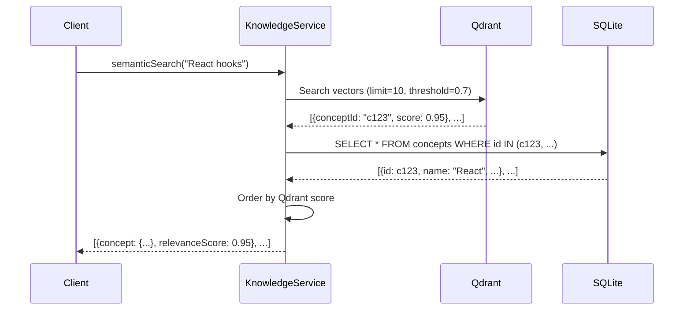
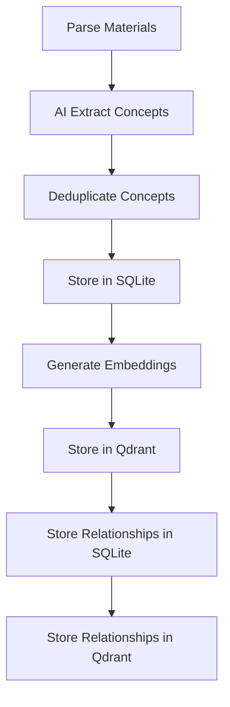

# Clean Database Architecture

## Overview

The Learning Catalyst application uses a **dual-database architecture** with a clean separation of concerns:

- **SQLite**: Source of truth for all relational data
- **Qdrant**: Vector search index only (no data duplication)

This document explains the architectural patterns and implementation details.

---

## Architecture Pattern

### Single Source of Truth Principle

```
┌─────────────────────────────────────────────────────────────┐
│                     CONCEPT STORAGE                         │
├─────────────────────────────────────────────────────────────┤
│                                                             │
│  1. AI Extracts Concepts                                    │
│     ↓                                                       │
│  2. Store in SQLite (SOURCE OF TRUTH)                      │
│     ┌─────────────────────────────────────────────────┐    │
│     │ SQLite: concepts table                          │    │
│     │ id: "concept-123"                                │    │
│     │ name: "React"                                    │    │
│     │ description: "A JavaScript library..."           │    │
│     │ type: "concept"                                  │    │
│     │ metadata: {...}                                  │    │
│     └─────────────────────────────────────────────────┘    │
│     ↓ conceptId reference                                │
│  3. Store in Qdrant (SEARCH INDEX)                         │
│     ┌─────────────────────────────────────────────────┐    │
│     │ Qdrant Point: "concept:concept-123"              │    │
│     │ Vector: [0.1, -0.3, 0.5, ...]                   │    │
│     │ Payload: {                                      │    │
│     │   conceptId: "concept-123",  ← LINK TO SQLITE   │    │
│     │   type: "concept"                               │    │
│     │ }                                               │    │
│     └─────────────────────────────────────────────────┘    │
│                                                             │
└─────────────────────────────────────────────────────────────┘
```

### Key Principles

1. **No Data Duplication**: Each piece of information exists in exactly one place
2. **SQLite as Source**: Full concept data lives in SQLite tables
3. **Qdrant as Index**: Only stores vectors + ID references
4. **Fast Queries**: Vector similarity in Qdrant → Full data in SQLite

---

## Implementation Details

### 1. Concept Storage

#### SQLite (Source of Truth)
```sql
CREATE TABLE concepts (
  id TEXT PRIMARY KEY,
  name TEXT NOT NULL,
  description TEXT,
  type TEXT,
  difficulty TEXT,
  confidence REAL,
  tags TEXT, -- JSON array
  sourceMaterialId TEXT,
  createdAt TEXT,
  updatedAt TEXT
);
```

#### Qdrant (Search Index)
```typescript
{
  id: "concept:concept-123",
  vector: [0.1, -0.3, 0.5, ...],  // Embedding vector
  payload: {
    conceptId: "concept-123",      // ← Links to SQLite
    type: "concept"
  }
}
```

**Pattern**: `concept:{conceptId}` for clear identification

### 2. Relationship Storage

#### SQLite (Source of Truth)
```sql
CREATE TABLE relationships (
  id TEXT PRIMARY KEY,
  sourceId TEXT NOT NULL,         -- References concepts.id
  targetId TEXT NOT NULL,         -- References concepts.id
  type TEXT,
  strength REAL,
  confidence REAL,
  description TEXT,
  FOREIGN KEY (sourceId) REFERENCES concepts(id),
  FOREIGN KEY (targetId) REFERENCES concepts(id)
);
```

#### Qdrant (Search Index)
```typescript
{
  id: "rel:concept-123:concept-456",
  vector: [0.2, 0.1, -0.4, ...],  // Embedding of relationship
  payload: {
    type: "relationship",
    sourceConceptId: "concept-123",
    targetConceptId: "concept-456",
    relationshipId: "concept-123:concept-456"
  }
}
```

**Pattern**: `rel:{sourceId}:{targetId}` for clear identification

---

## Semantic Search Flow

### How It Works



### Code Implementation

```typescript
const semanticSearch = async (query: string, limit: number = 10) => {
  // 1. Search Qdrant for similar vectors
  const qdrantResults = await vectorDatabase.search(query, {
    limit,
    threshold: 0.7,
  });

  // 2. Extract conceptIds from results
  const conceptIds = qdrantResults
    .map((result) => result.document.metadata.conceptId)
    .filter(Boolean);

  // 3. Fetch full concept data from SQLite
  const rows = await db
    .selectFrom('concepts')
    .selectAll()
    .where('id', 'in', conceptIds)
    .execute();

  // 4. Restore order by relevance score
  const conceptMap = new Map(rows.map((row) => [row.id, row]));
  const results = qdrantResults
    .map((result) => {
      const conceptId = result.document.metadata.conceptId;
      const concept = conceptMap.get(conceptId);
      if (!concept) return null;

      return {
        concept: mapConceptRowToDisplay(concept),
        relevanceScore: result.score,
      };
    })
    .filter(Boolean);

  return results;
};
```

---

## Concept Parsing Flow

### Storage Sequence



### Code: Concept Storage

```typescript
// In concept-parsing-service.ts
const addConceptsToVector = async (
  concepts: ParsedConcept[],
  providerFactory: ProviderFactory,
  vectorDatabase?: VectorDatabase
) => {
  if (!vectorDatabase || concepts.length === 0) return;

  const embeddingModel = await providerFactory.getEmbeddingModel();

  for (const concept of concepts) {
    const text = `${concept.name}\n\n${concept.description}`;
    const embedding = await embeddingModel.embed(text);

    await vectorDatabase.addDocumentWithEmbedding(
      {
        id: `concept:${concept.id}`,  // ← concept: prefix
        content: text,
        metadata: {
          conceptId: concept.id,      // ← Links to SQLite
          type: 'concept',
        },
      },
      embedding,
    );
  }
};
```

### Code: Relationship Storage

```typescript
// In concept-parsing-service.ts
const addRelationshipsToVector = async (
  relationships: ParsedRelationship[],
  providerFactory: ProviderFactory,
  vectorDatabase?: VectorDatabase
) => {
  if (!vectorDatabase || relationships.length === 0) return;

  const embeddingModel = await providerFactory.getEmbeddingModel();

  for (const relationship of relationships) {
    const relationshipText = [
      `Relationship: ${relationship.type}`,
      `From concept ${relationship.sourceId}`,
      `To concept ${relationship.targetId}`,
    ].join(' | ');

    const embedding = await embeddingModel.embed(relationshipText);

    await vectorDatabase.addDocumentWithEmbedding(
      {
        id: `rel:${relationship.sourceId}:${relationship.targetId}`,  // ← rel: prefix
        content: relationshipText,
        metadata: {
          type: 'relationship',
          sourceConceptId: relationship.sourceId,
          targetConceptId: relationship.targetId,
          relationshipId: `${relationship.sourceId}:${relationship.targetId}`,
        },
      },
      embedding,
    );
  }
};
```

---

## Benefits

### 1. Data Integrity
- **Single source of truth** eliminates inconsistencies
- SQLite transactions ensure ACID properties
- Foreign key constraints maintain referential integrity

### 2. Performance
- **Fast semantic search** via vector similarity in Qdrant
- **Efficient filtering** via SQL queries in SQLite
- **Optimal storage**: Each database stores what it does best

### 3. Maintainability
- **Clear separation**: No ambiguity about where data lives
- **Easy to reason about**: Simple mental model
- **Consistent patterns**: `concept:{id}` and `rel:{source}:{target}` IDs

### 4. Scalability
- **Qdrant**: Optimized for vector operations
- **SQLite**: Mature, reliable relational database
- **Independent scaling**: Can optimize each database separately

---

## Migration Guide

### If You're Adding New Features

#### 1. Storing New Concept Data
```typescript
// ✓ DO: Store full data in SQLite
await db
  .insertInto('concepts')
  .values({
    id: 'concept-123',
    name: 'New Concept',
    description: '...',
    // ... full data
  })
  .execute();

// ✓ DO: Store minimal data in Qdrant
await vectorDatabase.addDocumentWithEmbedding(
  {
    id: `concept:concept-123`,
    content: 'New Concept\n\nDescription',
    metadata: {
      conceptId: 'concept-123',  // ← Link to SQLite
      type: 'concept',
    },
  },
  embedding,
);

// ✗ DON'T: Store full data in Qdrant
await vectorDatabase.addDocumentWithEmbedding(
  {
    id: `concept:concept-123`,
    content: 'New Concept\n\nDescription',
    metadata: {
      conceptId: 'concept-123',
      type: 'concept',
      name: 'New Concept',      // ← DUPLICATION!
      description: '...',       // ← DUPLICATION!
    },
  },
  embedding,
);
```

#### 2. Implementing Search
```typescript
// ✓ DO: Query Qdrant then SQLite
const semanticSearch = async (query: string) => {
  const qdrantResults = await vectorDatabase.search(query);
  const conceptIds = qdrantResults.map(r => r.metadata.conceptId);
  const concepts = await db.selectFrom('concepts').where('id', 'in', conceptIds).execute();
  return concepts;
};

// ✗ DON'T: Store everything in Qdrant
const badSearch = async (query: string) => {
  const results = await vectorDatabase.search(query);
  return results.map(r => r.metadata);  // ← Missing data!
};
```

---

## Testing

### Test Coverage

All architectural patterns are validated by existing tests:

1. **Concept Storage Tests**
   - `concept-parsing.relationships-vector.test.ts`
   - `concept-parsing.chunk-boundaries.test.ts`
   - `concept-parsing.deduplication.test.ts`

2. **Semantic Search Tests**
   - `knowledge-service.test.ts`
   - `find-related-by-prompt.test.ts`
   - `topicParse-node.test.ts`

### Running Tests

```bash
# All concept parsing tests
npm run test:main -- concept-parsing

# All knowledge service tests
npm run test:main -- knowledge-service

# Full test suite
npm test
```

---

## Troubleshooting

### Issue: "No data found" in search results

**Check**: Are conceptIds properly stored in Qdrant metadata?

```typescript
// Look for this pattern in Qdrant:
{
  id: "concept:concept-123",
  metadata: {
    conceptId: "concept-123",  // ← Must match SQLite ID
    type: "concept"
  }
}
```

### Issue: Data duplication between databases

**Solution**: Follow the single source of truth pattern

- **SQLite**: Stores full concept data
- **Qdrant**: Stores only `conceptId` reference

### Issue: Slow semantic search

**Solution**: Optimize Qdrant queries

```typescript
await vectorDatabase.search(query, {
  limit: 10,        // Don't return more than needed
  threshold: 0.7,   // Adjust based on precision needs
});
```

---

## Conclusion

The clean database architecture provides:

- ✅ **No data duplication**
- ✅ **Fast semantic search**
- ✅ **Data integrity**
- ✅ **Clear separation of concerns**
- ✅ **Maintainable codebase**

This pattern should be followed for all future database interactions in the Learning Catalyst application.
