# Database Design & Architecture

## Overview

Learning Catalyst uses **Kysely** as a type-safe query builder with **SQLite** as the primary
database and **Qdrant** for vector storage. This document describes the database schema, migration
system, and access patterns.

## Architecture

### Core Components

```
Database Layer
├── Kysely (Type-safe query builder)
├── SQLite (Relational data storage)
├── Qdrant (Vector similarity search)
└── Electron Store (Configuration)
```

### Database Location

- **Path**: `.catalyst/learning_catalyst.db`
- **Created**: Automatically on first run
- **Schema Version**: Tracked via migrations

## Entity Relationship Diagram

```mermaid
erDiagram
    LEARNING_SESSIONS {
        string id PK
        string title
        string description
        string start_time
        string end_time
        string metadata
        string created_at
        string updated_at
        number total_messages
    }

    MESSAGES {
        string id PK
        string session_id FK
        string role
        string content
        string thinking_content
        string provider
        string model
        string tokens_used
        string timestamp
        number message_order
        string tool_calls
        string created_at
    }

    CONCEPTS {
        string id PK
        string name
        string description
        string category
        string domain
        string difficulty
        string content
        string summary
        string tags
        string metadata
        number confidence
        string created_at
        string updated_at
    }

    RELATIONSHIPS {
        string id PK
        string source_concept_id FK
        string target_concept_id FK
        string relationship_type
        number strength
        string metadata
        string created_at
        string updated_at
    }

    CONCEPT_PROGRESS {
        string id PK
        string user_id
        string concept_id FK
        string status
        number proficiency_level
        string last_reviewed
        number review_count
        string next_review
        string created_at
        string updated_at
    }

    KNOWLEDGE_GRAPH_CACHE {
        string id PK
        string session_id FK
        string graph_data
        number node_count
        number edge_count
        number computation_time
        string created_at
    }

    MEMORY_ENTRIES {
        string id PK
        string type
        string importance
        string content
        string metadata
        number retrieval_strength
        string consolidation_state
        string associations
        string user_id
        string session_id
        string created_at
        string updated_at
    }

    EPISODIC_MEMORIES {
        string id PK
        string session_id FK
        string user_id
        string sequence
        string context
        string outcomes
        string reflections
        string emotional_tags
        string temporal_markers
        string created_at
        string updated_at
    }

    SEMANTIC_MEMORIES {
        string id PK
        string concept
        string definition
        string attributes
        string relationships
        string examples
        string misconceptions
        string category
        string domain
        string difficulty
        number confidence
        number verification_count
        string created_at
        string updated_at
    }

    PROCEDURAL_MEMORIES {
        string id PK
        string skill_name
        string steps
        string prerequisites
        string context_conditions
        string success_criteria
        string common_errors
        number mastery_level
        number practice_count
        number success_rate
        number automaticity_level
        string created_at
        string updated_at
    }

    AGENTS {
        string id PK
        string name
        string type
        string status
        string description
        string model_config
        string tools
        string capabilities
        string metadata
        number activated_at
        number deactivated_at
        number created_at
        number updated_at
    }

    AGENT_LIFECYCLE_EVENTS {
        string id PK
        string agent_id FK
        string event
        string from_state
        string to_state
        number timestamp
        string metadata
        number created_at
    }

    SETTINGS {
        string id PK
        string user_id
        string category
        string key
        string value
        string created_at
        string updated_at
    }

    CHECKPOINTS {
        string id PK
        string name
        string description
        string session_id FK
        string user_id
        string snapshot_data
        string created_at
    }

    ANALYTICS {
        string id PK
        string user_id
        string event_type
        string event_data
        string session_id
        string timestamp
        string created_at
    }

    %% Relationships
    LEARNING_SESSIONS ||--o{ MESSAGES : "has"
    LEARNING_SESSIONS ||--o{ CHECKPOINTS : "has"
    LEARNING_SESSIONS ||--o{ EPISODIC_MEMORIES : "has"
    LEARNING_SESSIONS ||--o{ KNOWLEDGE_GRAPH_CACHE : "cached_in"

    CONCEPTS ||--o{ RELATIONSHIPS : "source"
    CONCEPTS ||--o{ RELATIONSHIPS : "target"
    CONCEPTS ||--o{ CONCEPT_PROGRESS : "tracked_in"
    CONCEPTS ||--o{ SEMANTIC_MEMORIES : "stores"

    CONCEPTS ||--o{ KNOWLEDGE_GRAPH_CACHE : "graphed_in"

    AGENTS ||--o{ AGENT_LIFECYCLE_EVENTS : "generates"

    LEARNING_SESSIONS ||--o{ MEMORY_ENTRIES : "context_for"
    MEMORY_ENTRIES ||--o{ EPISODIC_MEMORIES : "refines_to"
```



## Kysely Setup

### Database Instance Creation

**File**: `src/main/services/core/database/kysely-database.ts`

```typescript
import { Kysely, SqliteAdapter, SqliteQueryCompiler, SqliteIntrospector } from 'kysely';
import { Database } from './kysely-schema';

// Create driver factory
export async function createSqliteDriverFactory(dbPath: string) {
  await ensureDatabasePath(dbPath);

  return () => ({
    async executeQuery(compiledQuery) {
      const sql = compiledQuery.sql;
      const params = compiledQuery.parameters as (string | number | null)[];

      // Use sqlite-electron for execution
      const isSelectLike = sql.trim().toLowerCase().startsWith('select');

      if (isSelectLike) {
        const rows = await fetchAll(sql, params);
        return { rows };
      }

      await sqliteExecuteQuery(sql, params);
      return { rows: [] };
    },
    // ... transaction methods
  });
}

// Create database instance
export function createDatabase(driverFactory: () => Driver): Kysely<Database> {
  const dialect = {
    createDriver: driverFactory,
    createQueryCompiler: () => new SqliteQueryCompiler(),
    createAdapter: () => new SqliteAdapter(),
    createIntrospector: (db: Kysely<Database>) => new SqliteIntrospector(db),
  };

  return new Kysely<Database>({ dialect });
}
```

### Schema Definition

**File**: `src/main/services/core/database/kysely-schema.ts`

```typescript
import type { Database as SharedDatabase } from '@/shared/types/database';

export interface Database extends SharedDatabase {
  // Multi-layer memory system
  memory_entries: MemoryEntryRow;
  episodic_memories: EpisodicMemoryRow;
  semantic_memories: SemanticMemoryRow;
  procedural_memories: ProceduralMemoryRow;
  memory_associations: MemoryAssociationRow;

  // Agent lifecycle management
  agents: AgentRow;
  agent_lifecycle_events: AgentLifecycleEventRow;
  agent_states: AgentStateRow;
  agent_archives: AgentArchiveRow;
}
```

## Database Schema

### Core Learning Tables

#### 1. Learning Sessions

**Purpose**: Store learning session metadata and state

```typescript
interface LearningSessionRow {
  id: string; // Primary key
  title: string; // Session title
  description: string | null; // Optional description
  start_time: string; // ISO timestamp
  end_time: string | null; // End timestamp
  metadata: string; // JSON: tags, category, model config
  created_at: string; // ISO timestamp
  updated_at: string; // ISO timestamp
  total_messages: number; // Message count
}
```

**Example Query**:

```typescript
// Get active sessions
const sessions = await db
  .selectFrom('learning_sessions')
  .selectAll()
  .where('end_time', 'is', null)
  .orderBy('updated_at', 'desc')
  .execute();
```

#### 2. Messages

**Purpose**: Store chat messages and AI responses

```typescript
interface MessageRow {
  id: string; // Primary key
  session_id: string; // Foreign key → learning_sessions.id
  role: 'user' | 'assistant' | 'system' | 'tool';
  content: string; // Message content
  thinking_content: string | null; // AI reasoning (ChatGLM)
  provider: string | null; // AI provider name
  model: string | null; // Model used
  tokens_used: string | null; // JSON: token counts
  timestamp: string; // ISO timestamp
  message_order: number; // Order within session
  tool_calls: string | null; // JSON: function calls
  created_at: string; // ISO timestamp
}
```

**Example Query**:

```typescript
// Get messages for a session
const messages = await db
  .selectFrom('messages')
  .selectAll()
  .where('session_id', '=', sessionId)
  .orderBy('message_order', 'asc')
  .execute();
```

#### 3. Concepts

**Purpose**: Store learned concepts and knowledge

```typescript
interface ConceptRow {
  id: string; // Primary key
  name: string; // Concept name
  description: string; // Detailed description
  category: string; // Concept category
  domain: string; // Knowledge domain
  difficulty: string; // Difficulty level
  content: string; // Full content
  summary: string | null; // Brief summary
  tags: string; // JSON array
  metadata: string; // JSON object
  confidence: number; // Confidence score (0-1)
  created_at: string; // ISO timestamp
  updated_at: string; // ISO timestamp
}
```

**Example Query**:

```typescript
// Search concepts by category
const concepts = await db
  .selectFrom('concepts')
  .selectAll()
  .where('category', '=', 'programming')
  .where('difficulty', 'in', ['beginner', 'intermediate'])
  .execute();
```

#### 4. Relationships

**Purpose**: Store concept relationships and dependencies

```typescript
interface RelationshipRow {
  id: string; // Primary key
  source_concept_id: string; // Foreign key → concepts.id
  target_concept_id: string; // Foreign key → concepts.id
  relationship_type: string; // Relationship type
  strength: number; // Relationship strength (0-1)
  metadata: string; // JSON object
  created_at: string; // ISO timestamp
  updated_at: string; // ISO timestamp
}
```

**Example Query**:

```typescript
// Get related concepts
const related = await db
  .selectFrom('relationships')
  .selectAll()
  .where('source_concept_id', '=', conceptId)
  .execute();
```

#### 5. Concept Progress

**Purpose**: Track user mastery of concepts

```typescript
interface ConceptProgressRow {
  id: string; // Primary key
  user_id: string; // User identifier
  concept_id: string; // Foreign key → concepts.id
  status: 'not_started' | 'in_progress' | 'mastered';
  proficiency_level: number; // 0-100
  last_reviewed: string | null; // ISO timestamp
  review_count: number; // Number of reviews
  next_review: string | null; // ISO timestamp
  created_at: string; // ISO timestamp
  updated_at: string; // ISO timestamp
}
```

#### 6. Knowledge Graph Cache

**Purpose**: Cache computed knowledge graphs for performance

```typescript
interface KnowledgeGraphCacheRow {
  id: string; // Primary key
  session_id: string | null; // Optional session reference
  graph_data: string; // JSON: graph structure
  node_count: number; // Number of nodes
  edge_count: number; // Number of edges
  computation_time: number; // Time to compute (ms)
  created_at: string; // ISO timestamp
}
```

### Memory System Tables

#### 1. Memory Entries

**Purpose**: Multi-layer memory system for AI context

```typescript
interface MemoryEntryRow {
  id: string;
  type: 'working' | 'episodic' | 'semantic' | 'procedural' | 'long_term';
  importance: 'critical' | 'high' | 'medium' | 'low';
  content: string; // Memory content
  metadata: string; // JSON object
  retrieval_strength: number; // 0-1 strength score
  consolidation_state: 'pending' | 'in_progress' | 'completed' | 'failed';
  associations: string; // JSON array
  user_id?: string;
  session_id?: string;
  created_at: string;
  updated_at: string;
}
```

#### 2. Episodic Memories

**Purpose**: Store specific learning episodes

```typescript
interface EpisodicMemoryRow {
  id: string;
  session_id: string;
  user_id: string;
  sequence: string; // JSON: event sequence
  context: string; // JSON: learning context
  outcomes: string; // JSON: learning outcomes
  reflections: string; // JSON: user reflections
  emotional_tags: string; // JSON array
  temporal_markers: string; // JSON object
  created_at: string;
  updated_at: string;
}
```

#### 3. Semantic Memories

**Purpose**: Store conceptual knowledge

```typescript
interface SemanticMemoryRow {
  id: string;
  concept: string; // Core concept
  definition: string; // Concept definition
  attributes: string; // JSON object
  relationships: string; // JSON object
  examples: string; // JSON array
  misconceptions: string; // JSON array
  category: string;
  domain: string;
  difficulty: string;
  confidence: number;
  verification_count: number;
  created_at: string;
  updated_at: string;
}
```

#### 4. Procedural Memories

**Purpose**: Store skills and procedures

```typescript
interface ProceduralMemoryRow {
  id: string;
  skill_name: string;
  steps: string; // JSON array
  prerequisites: string; // JSON array
  context_conditions: string; // JSON object
  success_criteria: string; // JSON object
  common_errors: string; // JSON array
  mastery_level: number; // 0-100
  practice_count: number;
  success_rate: number;
  automaticity_level: number; // 0-100
  created_at: string;
  updated_at: string;
}
```

### Agent Lifecycle Tables

#### 1. Agents

**Purpose**: Store AI agent configurations

```typescript
interface AgentRow {
  id: string;
  name: string;
  type: 'learning' | 'assessment' | 'tutoring' | 'practice' | 'general';
  status: 'inactive' | 'active' | 'error' | 'deleted';
  description?: string;
  model_config: string; // JSON object
  tools: string; // JSON array
  capabilities: string; // JSON array
  metadata: string; // JSON object
  activated_at?: number;
  deactivated_at?: number;
  created_at: number;
  updated_at: number;
}
```

#### 2. Agent Lifecycle Events

**Purpose**: Track agent state changes

```typescript
interface AgentLifecycleEventRow {
  id: string;
  agent_id: string;
  event: 'created' | 'activated' | 'deactivated' | 'updated' | 'deleted' | 'error';
  from_state?: string;
  to_state?: string;
  timestamp: number;
  metadata: string; // JSON object
  created_at: number;
}
```

### Additional Tables

#### 1. Settings

**Purpose**: User preferences and configuration

```typescript
interface SettingsRow {
  id: string;
  user_id: string;
  category: string; // 'learning' | 'ui' | 'ai' | 'system'
  key: string; // Setting key
  value: string; // Setting value (JSON)
  created_at: string;
  updated_at: string;
}
```

#### 2. Checkpoints

**Purpose**: Session state snapshots

```typescript
interface CheckpointRow {
  id: string;
  name: string;
  description?: string;
  session_id: string;
  user_id: string;
  snapshot_data: string; // JSON: session state
  created_at: string;
}
```

#### 3. Analytics

**Purpose**: Usage statistics and metrics

```typescript
interface AnalyticsRow {
  id: string;
  user_id: string;
  event_type: string;
  event_data: string; // JSON object
  session_id?: string;
  timestamp: string;
  created_at: string;
}
```

## Migration System

### Migration Structure

**File**: `src/main/services/core/database/migrations/index.ts`

```typescript
export const migrations = [
  // Initial schema
  import('./20251029_create_categories'),
  import('./20251029_create_concepts'),
  import('./20251029_create_learning_sessions'),
  import('./20251029_create_messages'),
  import('./20251029_create_relationships'),
  import('./20251029_create_concept_progress'),
  import('./20251029_create_knowledge_graph_cache'),
  import('./20251029_create_settings'),
  import('./20251029_create_user_stats'),
  import('./20251029_create_achievements'),
  import('./20251029_create_analytics'),
  import('./20251029_create_checkpoints'),
  import('./20251029_insert_default_data'),

  // Memory system (Phase 8)
  import('./20251111_create_memory_system_tables'),

  // Agent system
  import('./20251107_create_agents'),
  import('./20251107_create_agent_lifecycle_events'),
  import('./20251107_create_agent_states'),
  import('./20251107_create_agent_archives'),

  // Concept progress
  import('./20251030_create_concept_progress'),
];
```

### Migration Manager

**File**: `src/main/services/core/database/migrations/tools.ts`

```typescript
export class MigrationManager {
  constructor(
    private db: Kysely<Database>,
    private migrations: Migration[],
  ) {}

  async migrateToLatest(): Promise<void> {
    // Get current schema version
    const currentVersion = await this.getCurrentVersion();

    // Apply pending migrations
    for (const migration of this.migrations) {
      if (migration.version > currentVersion) {
        await this.runMigration(migration);
      }
    }
  }

  private async runMigration(migration: Migration): Promise<void> {
    await this.db.transaction().execute(async (trx) => {
      // Apply migration
      await migration.up(trx);

      // Record migration
      await trx
        .insertInto('schema_migrations')
        .values({
          version: migration.version,
          name: migration.name,
          applied_at: new Date().toISOString(),
        })
        .execute();
    });
  }
}
```

### Example Migration

**File**: `src/main/services/core/database/migrations/20251029_create_concepts.ts`

```typescript
import type { Kysely } from 'kysely';
import type { Database } from '../kysely-schema';

export async function up(db: Kysely<Database>): Promise<void> {
  await db.schema
    .createTable('concepts')
    .addColumn('id', 'text', (col) => col.primaryKey())
    .addColumn('name', 'text', (col) => col.notNull())
    .addColumn('description', 'text', (col) => col.notNull())
    .addColumn('category', 'text', (col) => col.notNull())
    .addColumn('domain', 'text', (col) => col.notNull())
    .addColumn('difficulty', 'text', (col) => col.notNull())
    .addColumn('content', 'text', (col) => col.notNull())
    .addColumn('summary', 'text')
    .addColumn('tags', 'text', (col) => col.notNull())
    .addColumn('metadata', 'text', (col) => col.notNull())
    .addColumn('confidence', 'real', (col) => col.notNull().defaultTo(0))
    .addColumn('created_at', 'text', (col) => col.notNull())
    .addColumn('updated_at', 'text', (col) => col.notNull())
    .execute();

  // Create indexes
  await db.schema.createIndex('idx_concepts_category').on('concepts').column('category').execute();

  await db.schema.createIndex('idx_concepts_domain').on('concepts').column('domain').execute();
}
```

## Query Patterns

### Type-Safe Queries

```typescript
// ✅ Good: Type-safe query
const sessions = await db
  .selectFrom('learning_sessions')
  .selectAll()
  .where('end_time', 'is', null)
  .execute();

// ✅ Good: Complex query with joins
const sessionWithMessages = await db
  .selectFrom('learning_sessions as s')
  .selectAll('s')
  .select(db.fn.count('m.id').as('message_count'))
  .leftJoin('messages as m', 's.id', 'm.session_id')
  .groupBy('s.id')
  .execute();
```

### JSON Field Handling

```typescript
// Helper functions for JSON fields
export const JSONField = {
  parse: <T>(jsonString: string | null, fallback: T): T => {
    try {
      return jsonString ? JSON.parse(jsonString) : fallback;
    } catch {
      return fallback;
    }
  },

  stringify: (obj: any): string => {
    return JSON.stringify(obj);
  },
};

// Usage
const session = await db.selectFrom('learning_sessions').selectAll().executeTakeFirst();

if (session) {
  const metadata = JSONField.parse(session.metadata, {});
  console.log('Tags:', metadata.tags);
}
```

### Insert Operations

```typescript
// Insert with type safety
const newSession = await db
  .insertInto('learning_sessions')
  .values({
    id: generateId(),
    title: 'My Learning Session',
    description: null,
    start_time: new Date().toISOString(),
    metadata: JSON.stringify({ category: 'programming' }),
    created_at: new Date().toISOString(),
    updated_at: new Date().toISOString(),
    total_messages: 0,
  })
  .returningAll()
  .executeTakeFirst();
```

### Update Operations

```typescript
// Update with type safety
await db
  .updateTable('concepts')
  .set({
    updated_at: new Date().toISOString(),
    confidence: 0.95,
  })
  .where('id', '=', conceptId)
  .execute();
```

### Delete Operations

```typescript
// Delete with cascade
await db.transaction().execute(async (trx) => {
  // Delete messages first
  await trx.deleteFrom('messages').where('session_id', '=', sessionId).execute();

  // Delete session
  await trx.deleteFrom('learning_sessions').where('id', '=', sessionId).execute();
});
```

## Service Layer Integration

### Example: Chat Service

**File**: `src/main/services/domain/chat/chat-service.ts`

```typescript
export function createChatService({ db, loggerService }: Dependencies) {
  return {
    async sendMessage(content: string, sessionId?: string) {
      // Use type-safe Kysely query
      const session = await db
        .selectFrom('learning_sessions')
        .selectAll()
        .where('id', '=', sessionId || '')
        .executeTakeFirst();

      // Store message
      const messageId = generateId();
      await db
        .insertInto('messages')
        .values({
          id: messageId,
          session_id: sessionId || session!.id,
          role: 'user',
          content,
          timestamp: new Date().toISOString(),
          message_order: Date.now(),
          created_at: new Date().toISOString(),
        })
        .execute();

      // Return result
      return { id: messageId, content, role: 'user' };
    },
  };
}
```

## Performance Optimization

### Indexes

```typescript
// Essential indexes for performance
await db.schema
  .createIndex('idx_messages_session_id')
  .on('messages')
  .column('session_id')
  .execute();

await db.schema.createIndex('idx_messages_timestamp').on('messages').column('timestamp').execute();

await db.schema
  .createIndex('idx_concepts_search')
  .on('concepts')
  .columns(['name', 'description'])
  .execute();
```

### Query Optimization

```typescript
// ✅ Good: Selective queries
const sessions = await db
  .selectFrom('learning_sessions')
  .select(['id', 'title', 'start_time'])
  .where('end_time', 'is', null)
  .limit(50)
  .execute();

// ❌ Bad: Select *
const sessions = await db
  .selectFrom('learning_sessions')
  .selectAll() // Selects unnecessary columns
  .execute();
```

### Connection Management

```typescript
// Reuse database instance
const db = createDatabase(driverFactory);

// Don't create new instances
// const db2 = createDatabase(driverFactory); // ❌ Bad
```

## Vector Database Integration

### Qdrant Setup

**Purpose**: Semantic search for knowledge discovery

```typescript
// Create Qdrant collection
await qdrantClient.createCollection('concepts', {
  vectors: { size: 1536, distance: 'Cosine' },
});

// Store concept embeddings
await qdrantClient.upsert('concepts', {
  points: concepts.map((c) => ({
    id: c.id,
    vector: c.embedding,
    payload: { name: c.name, category: c.category },
  })),
});

// Search similar concepts
const results = await qdrantClient.search('concepts', {
  vector: queryEmbedding,
  limit: 10,
  with_payload: true,
});
```

### Hybrid Search

```typescript
// Combine keyword and semantic search
const keywordResults = await db
  .selectFrom('concepts')
  .selectAll()
  .where('name', 'like', `%${query}%`)
  .execute();

const semanticResults = await qdrantClient.search('concepts', {
  vector: embedQuery(query),
  limit: 10,
});

// Merge and rank results
const results = mergeResults(keywordResults, semanticResults);
```

## Backup & Recovery

### Backup

```typescript
// Create database backup
export async function backupDatabase(): Promise<string> {
  const backupPath = `.catalyst/backups/backup-${Date.now()}.db`;
  await fs.copy(learning_catalyst.db, backupPath);
  return backupPath;
}

// Export data as JSON
export async function exportData(): Promise<string> {
  const sessions = await db.selectFrom('learning_sessions').selectAll().execute();
  const messages = await db.selectFrom('messages').selectAll().execute();

  return JSON.stringify({ sessions, messages }, null, 2);
}
```

### Restore

```typescript
// Restore from backup
export async function restoreDatabase(backupPath: string): Promise<void> {
  // Close current connections
  await closeConnections();

  // Restore file
  await fs.copy(backupPath, databasePath);

  // Recreate connections
  await initializeDatabase();
}
```

## Testing

### Mock Database

```typescript
// Test setup with mock DB
const mockDb = createMock<Kysely<Database>>({
  selectFrom: jest.fn().mockReturnThis(),
  selectAll: jest.fn().mockReturnThis(),
  execute: jest.fn().mockResolvedValue([]),
});

const chatService = createChatService({ db: mockDb, loggerService });
```

### Test Queries

```typescript
// Test data factory
export function createTestSession(overrides: Partial<LearningSessionRow>) {
  return {
    id: 'test-id',
    title: 'Test Session',
    description: null,
    start_time: new Date().toISOString(),
    end_time: null,
    metadata: '{}',
    created_at: new Date().toISOString(),
    updated_at: new Date().toISOString(),
    total_messages: 0,
    ...overrides,
  };
}
```

## Best Practices

### 1. Always Use Transactions

```typescript
// ✅ Good: Transaction for multiple operations
await db.transaction().execute(async (trx) => {
  await trx.insertInto('learning_sessions').values(session).execute();
  await trx.insertInto('messages').values(message).execute();
});

// ❌ Bad: No transaction
await db.insertInto('learning_sessions').values(session).execute();
await db.insertInto('messages').values(message).execute();
```

### 2. Handle JSON Fields Safely

```typescript
// ✅ Good: Safe JSON parsing
const metadata = JSONField.parse(session.metadata, {});

// ❌ Bad: Unsafe parsing
const metadata = JSON.parse(session.metadata); // Could crash
```

### 3. Use Proper Indexes

```typescript
// Always create indexes on foreign keys and frequently queried columns
await db.schema
  .createIndex('idx_messages_session_id')
  .on('messages')
  .column('session_id')
  .execute();
```

### 4. Avoid N+1 Queries

```typescript
// ✅ Good: Single query with join
const sessions = await db
  .selectFrom('learning_sessions as s')
  .selectAll('s')
  .select(db.fn.count('m.id').as('message_count'))
  .leftJoin('messages as m', 's.id', 'm.session_id')
  .groupBy('s.id')
  .execute();

// ❌ Bad: N+1 queries
for (const session of sessions) {
  const count = await db
    .selectFrom('messages')
    .select(db.fn.count('id').as('count'))
    .where('session_id', '=', session.id)
    .execute();
}
```

## Related Documentation

- [Architecture Overview](./architecture.md)
- [Electron API](./electron-api.md)
- [Services Guide](./services.md)
- [Memory Leak Prevention Guide](../../technical/memory-leak-prevention-guide.md)

---

**Last Updated**: November 2025 **Version**: 1.0
