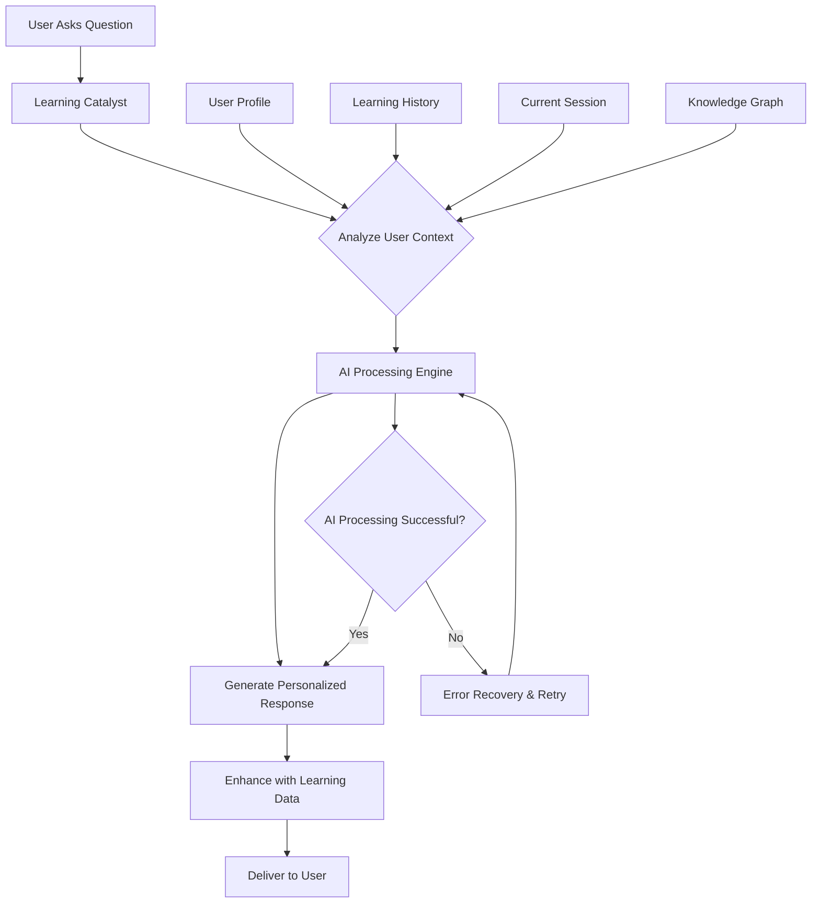
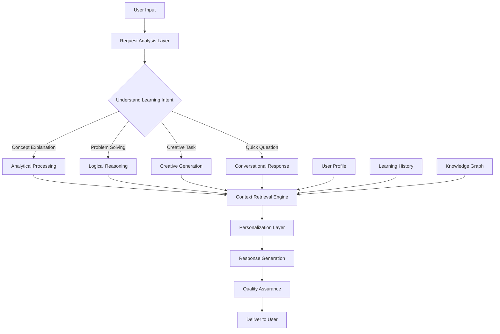
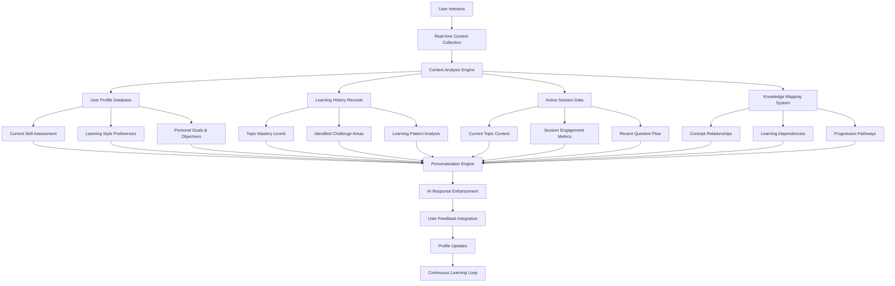
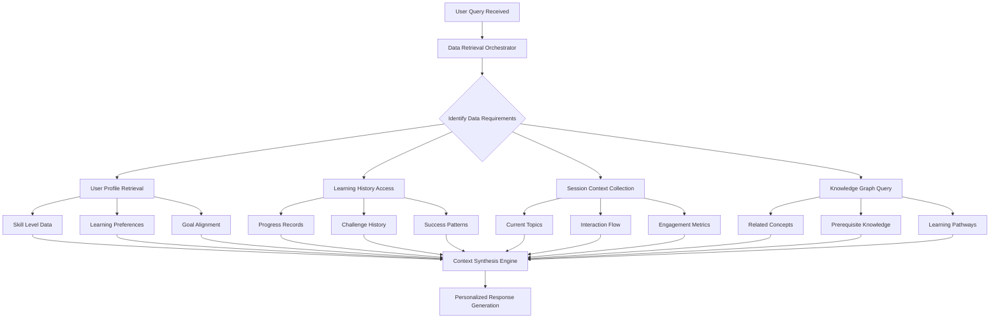
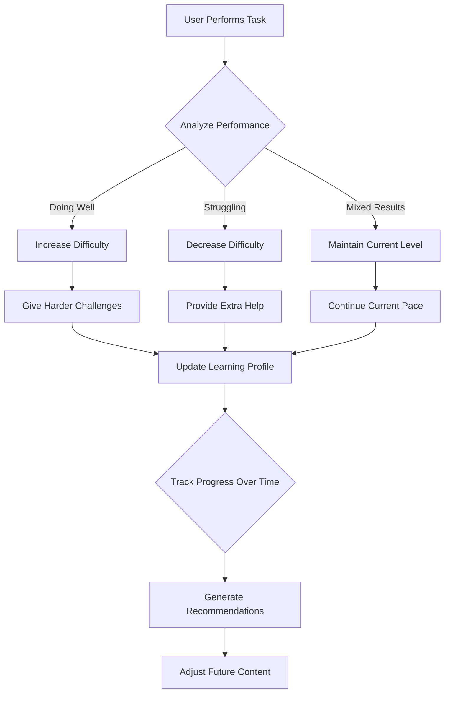

# AI Integration Guide - User-Centric Learning

---
title: How AI Works with Users in Learning Catalyst
description: Understanding how AI creates personalized learning experiences through intelligent data retrieval and user interaction
version: 4.0.0 (User-Focused)
last_updated: 2025-10-11
---

## 🎯 What This Is

Learning Catalyst uses AI to create smart, personalized learning experiences that adapt to your needs. The AI system communicates with you through intelligent conversations, understanding your questions and providing contextually relevant responses that support your learning journey.

**✅ Current Status**: Fully working and tested
- **Smart Features**: Personalized responses, adaptive difficulty, context-aware learning
- **User Benefits**: Tailored learning paths, progress tracking, intelligent recommendations

**🔧 Setup Requirements**: The AI provider and model should be configured before use to ensure optimal communication and response quality.

## 🏗️ How It Works - The Big Picture



### Key Components

**🧠 Smart Context Engine**
- Retrieves your learning history and preferences
- Understands your current skill level and learning style
- Analyzes your progress patterns over time

**🤖 Intelligent AI Processing**
- Uses appropriate AI capabilities for each learning task
- Adapts responses based on your context and needs
- Ensures consistent, helpful interactions

**📈 Adaptive Learning System**
- Adjusts content difficulty based on your performance
- Personalizes learning paths to match your goals
- Provides intelligent recommendations for next steps


## 🤖 Intelligent AI Response Architecture



### How AI Understands and Responds to You

**🧠 Intelligent Request Analysis**
- **Learning Intent Recognition**: AI identifies what type of learning help you need
- **Context Understanding**: Analyzes the educational context of your question
- **Skill Level Assessment**: Determines appropriate complexity for your current level

**🎯 Adaptive Response Generation**
- **Explanation Requests**: Provides clear, step-by-step explanations with relevant examples
- **Problem-Solving Tasks**: Offers structured approaches and multiple solution methods
- **Creative Exercises**: Generates innovative learning activities tailored to your interests
- **Quick Questions**: Delivers concise, accurate responses with additional context

**🔄 Continuous Personalization**
- The AI adapts its communication style based on your interactions
- Responses become more personalized as it learns your preferences
- Difficulty and complexity adjust automatically to match your progress

## 🧠 Context-Aware Learning Architecture



## 🔍 AI Data Retrieval Mechanisms



### How AI Retrieves and Uses Your Data

**🎯 Intelligent Data Collection**
- **Real-time Context Gathering**: Collects information about your current learning session
- **Historical Data Access**: Retrieves relevant learning history and progress patterns
- **Profile Integration**: Accesses your skill level, preferences, and goals
- **Knowledge Mapping**: Queries the knowledge graph for related concepts and prerequisites

**🔄 Data Processing and Synthesis**
- **Context Relevance Analysis**: Determines which data points are most relevant to your current query
- **Pattern Recognition**: Identifies learning patterns and preferences from your history
- **Knowledge Integration**: Combines different data sources to build a complete picture
- **Adaptation Rules**: Applies personalization rules based on your unique profile

**📊 Smart Data Utilization**
- **Personalized Content Selection**: Chooses examples and explanations that match your level
- **Difficulty Adjustment**: Modifies content complexity based on your performance history
- **Learning Path Optimization**: Suggests next steps based on your goals and progress
- **Experience Enhancement**: Uses context to make interactions more natural and helpful

### What Context Data Does AI Track?

**📊 User Profile Intelligence**
- **Dynamic Skill Assessment**: Continuously updated evaluation of your abilities
- **Learning Style Analysis**: How you prefer to learn and absorb information
- **Goal-Oriented Tracking**: Progress toward your specific learning objectives

**📈 Learning History Insights**
- **Mastery Progression**: Topics you've mastered and how you learned them
- **Challenge Identification**: Areas where you consistently need more support
- **Success Pattern Recognition**: Methods and approaches that work best for you

**🎯 Session Context Awareness**
- **Topic Continuity**: How your current questions relate to previous discussions
- **Engagement Patterns**: When you're most focused and receptive to learning
- **Interaction Flow**: Natural progression of your learning conversations

**🔗 Knowledge Mapping**
- **Concept Relationships**: How current topics connect to what you already know
- **Learning Dependencies**: What foundational knowledge supports your current learning
- **Progression Planning**: Logical next steps in your educational journey

### How This Creates Better Learning Experiences

**🎯 Hyper-Personalized Responses**
- Every answer is tailored to your specific context and needs
- Examples and references match your existing knowledge and experience
- Difficulty automatically adjusts to keep you in the optimal learning zone

**🤖 Intelligent Learning Guidance**
- The system anticipates your needs based on patterns in your learning
- Suggestions align with your goals and build on your strengths
- Support is provided proactively in areas where you typically struggle

**📊 Continuous Improvement**
- Your interactions constantly refine the system's understanding of you
- Learning becomes more efficient and enjoyable over time
- Progress tracking motivates and guides your educational journey

## 📊 Adaptive Learning in Action



### How Adaptive Learning Works

**🎯 Performance Tracking**
- Monitors how quickly and accurately you answer questions
- Tracks patterns in your learning over time
- Identifies where you excel and where you need help

**📈 Smart Difficulty Adjustment**
- **Exceling** → Gets harder challenges to keep you engaged
- **Struggling** → Gets simpler explanations and more practice
- **Steady Progress** → Maintains current difficulty level

**🎉 Personalized Recommendations**
- Celebrates your achievements with positive feedback
- Suggests next steps based on your progress
- Identifies topics that might need review

## 🌟 User Benefits - Why This Matters

### For Learners

**🎯 Better Learning Experience**
- Content adapts to your skill level automatically
- Explanations reference what you already know
- Progress feels natural and achievable

**⚡ Always Available Help**
- Intelligent AI processing ensures the system is always responsive
- Automatic error recovery maintains continuous learning support
- No more "service unavailable" interruptions

**📈 Real Progress Tracking**
- See how you're improving over time
- Get personalized next-step suggestions
- Celebrate your achievements

### For the Best Learning Experience

**🎯 Provide Clear Context**
- Share your learning goals and current challenges
- Let the system know your preferred learning style
- Mention any relevant background knowledge

**🔄 Engage Regularly**
- Consistent interactions help the AI understand you better
- Provide feedback when explanations are helpful or need adjustment
- Celebrate your learning milestones and progress

**📈 Track Your Growth**
- Review your learning history to see improvement patterns
- Use AI suggestions to plan your next learning steps
- Challenge yourself with progressively difficult content

### Real-World Learning Experiences

**Scenario 1: Learning Programming Fundamentals**
```bash
User: "I'm confused about how functions work in Python"
System: Analyzes learning history → Identifies beginner level concepts needed
Result: Step-by-step explanation with simple, relatable examples and practice exercises
```

**Scenario 2: Advanced Problem-Solving**
```bash
User: "I'm stuck on this complex mathematics problem"
System: Recognizes advanced topic → Retrieves relevant previous learning
Result: Detailed analytical breakdown with multiple solution approaches and connections to familiar concepts
```

**Scenario 3: Personalized Learning Style Adaptation**
```bash
User: "I learn better with visual examples"
System: Updates learning preferences → Adapts response style
Result: Future explanations include diagrams, visual aids, and illustrated examples
```

**Scenario 4: Progress-Based Challenge Adjustment**
```bash
User: "This feels too easy, can I try something harder?"
System: Evaluates current mastery level → Increases difficulty appropriately
Result: More challenging problems that build on demonstrated understanding
```

## 🚀 Best Practices Summary

### For Using the AI System

1. **Start Simple**
   - Begin with basic questions to establish your skill level
   - Let the system learn your preferences
   - Don't worry about "perfect" prompts

2. **Be Specific**
   - Tell the system what you're struggling with
   - Mention your learning goals
   - Ask for examples when needed

3. **Provide Feedback**
   - Let the system know if explanations help
   - Ask for different approaches if needed
   - Celebrate your progress!

### For Developers

1. **User Communication Design**
   - Focus on natural, conversational interactions
   - Design responses that support learning objectives
   - Ensure AI communication adapts to user skill level

2. **Context is Key**
   - Always pass user context when available
   - Track learning history and preferences
   - Use context to personalize responses

3. **Handle Errors Gracefully**
   - Always have fallback responses
   - Implement retry logic with exponential backoff
   - Log errors for debugging

4. **Test Everything**
   - Test user communication flows and conversation quality
   - Verify AI responses are helpful and educational
   - Test error scenarios and recovery

5. **Focus on Users**
   - Prioritize user experience over technical complexity
   - Make AI communication feel natural and supportive
   - Provide clear feedback and progress indicators

## 🎉 Summary

Learning Catalyst's AI integration creates a **truly personalized learning experience** that:

- **Understands** your unique learning style and current abilities
- **Retrieves** relevant context from your learning history and preferences
- **Adapts** responses to match your skill level and goals
- **Anticipates** your needs based on patterns in your learning journey
- **Evolves** continuously through every interaction to serve you better

The result is an intelligent learning companion that grows with you, understands your needs, and makes learning more effective and enjoyable - because it's designed around how you learn best! 🌟