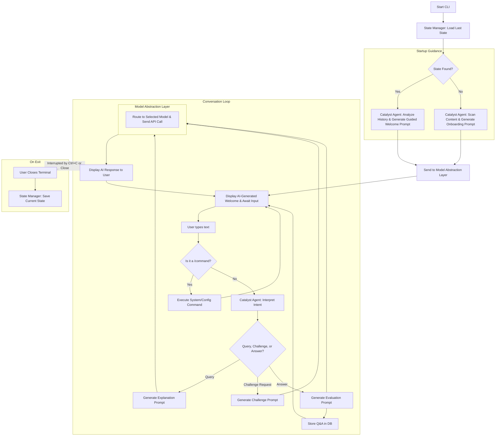

# 📑 Learning Catalyst Requirements

## 1. Introduction

### 1.1 Purpose
Learning Catalyst is a **local-first, conversational AI tutor** that operates within the command line. It fosters a natural, dialogue-led learning experience, **proactively guiding users** through their local Markdown-based materials. The application initiates the learning process from the moment it starts, suggesting next steps and ensuring a continuous, supportive journey. By leveraging configurable AI models, it provides on-demand explanations, adaptive challenges, and persistent progress tracking in a private and highly controlled environment.

### 1.2 Scope
*   **Proactive Conversational Interface**: The primary interaction is a continuous chat dialogue where the AI tutor actively guides the conversation.
*   **Guided Startup & Resumption**: The application intelligently resumes previous sessions or onboards new users with context-aware suggestions, eliminating user uncertainty.
*   **Context-Aware Learning**: The AI grounds its responses and challenges in the user's local Markdown files.
*   **Persistent State**: The application automatically saves the user's conversation and progress, allowing them to seamlessly resume at any time.
*   **Pluggable AI Models**: Users can configure and switch between various AI providers and models to manage cost and performance.
*   **Progressive Enhancement**: The system is designed to evolve from a core conversational tool into a fully adaptive AI tutor with concept-based learning.

**Target Users**: Self-learners, students, and professionals who want a supportive, AI-driven learning partner and value local data control.

---

## 2. System Overview

### 2.1 Core Modules

#### ✅ Phase 1 - COMPLETED Modules
- **Configuration Manager**: ✅ Manages providers, models, and API keys via configuration files.
  - *Validation*: [Multi-Provider Setup](../examples/integration.md#workflow-5-multi-provider-management)
- **CLI Interface**: ✅ Renders the conversational dialogue and handles user input and system commands.
  - *Validation*: [All Example Workflows](../examples/basic-workflows.md)
- **Catalyst Agent**: ✅ The core AI-driven module. It interprets user intent, processes queries, generates explanations, formulates challenges, and is **responsible for generating context-aware startup prompts to guide the user immediately upon launch.**
  - *Validation*: [Daily Learning Startup](../examples/basic-workflows.md#workflow-1-daily-learning-routine)
- **Challenge Engine**: ✅ Works with the Catalyst Agent to present AI-generated questions and process user answers.
  - *Validation*: [Quiz Examples](../examples/basic-workflows.md#workflow-1-daily-learning-routine)
- **State Manager**: ✅ Handles the **mechanics** of automatically saving the application state on exit and seamlessly loading it on launch for the Catalyst Agent to interpret. Manages manual checkpoints.
  - *Validation*: [Session Resumption](../examples/basic-workflows.md#workflow-3-quick-reference-and-review)
- **Model Abstraction Layer**: ✅ Provides a unified interface for communicating with various LLM providers.
  - *Validation*: [Provider Examples](../examples/integration.md#workflow-1-openai-provider-setup)

#### 🔄 Phase 2 - IN PROGRESS Modules
- **Analytics Dashboard**: 🔄 Displays user proficiency and learning trends.
  - *Status*: Backend implemented, user interface in development
  - *Target*: [Phase 2 Examples](../examples/phase2-analytics.md)
- **Assessment Engine**: 🔄 A background process that evaluates user performance to update competency profiles.
  - *Status*: Core algorithms implemented, integration in progress
- **Concept Building System**: 🔄 Extracts concepts from Markdown files, builds knowledge graphs, and tracks proficiency.
  - *Status*: Backend complete, user-facing commands being developed

#### 📋 Phase 3 - PLANNED Modules
- **Vector Database Integration**: 📋 Enables long-term memory and semantic retrieval.
  - *Dependencies*: Phase 2 completion
- **AI-Driven Recommendation Engine**: 📋 Personalized learning path suggestions.
  - *Dependencies*: Assessment engine + knowledge graph

### 2.2 Data Persistence

#### ✅ Phase 1 - IMPLEMENTED
- **User Profiles**: ✅ Stores preferences and the selected AI model.
  - *Validation*: [Configuration Examples](../examples/integration.md#workflow-3-configuration-management)
- **Q&A Database (SQLite)**: ✅ A persistent log of AI-generated questions, user attempts, and AI feedback.
  - *Validation*: [Quiz History Examples](../examples/basic-workflows.md#workflow-1-daily-learning-routine)
- **Application State**: ✅ A file representing the current conversational context and UI state, automatically saved on exit.
  - *Validation*: [Session Persistence](../examples/basic-workflows.md#workflow-3-quick-reference-and-review)
- **System Configuration**: ✅ Stores models, providers, and API keys.
  - *Validation*: [Provider Setup](../examples/integration.md#workflow-1-openai-provider-setup)

#### 🔄 Phase 2 - IN PROGRESS
- **Concept Proficiency Data**: 🔄 Stores competency profiles and concept mastery levels.
  - *Status*: Database schema ready, data collection in progress
- **Learning Analytics**: 🔄 Tracks performance trends and learning patterns.
  - *Status*: Backend implemented, user interface being developed

#### 📋 Phase 3 - PLANNED
- **Vector DB (ChromaDB or FAISS)**: 📋 For enabling long-term memory and semantic retrieval of content.
  - *Dependencies*: Phase 2 completion
  - *Target Use Case*: Cross-session semantic memory

### 2.3 Technology Stack

#### ✅ Phase 1 - IMPLEMENTED
- **CLI Framework**: ✅ Typer (confirmed from implementation)
  - *Validation*: [Command Examples](../examples/basic-workflows.md) all use Typer-based commands
- **Configuration**: ✅ JSON files (confirmed from examples)
  - *Validation*: [Configuration Examples](../examples/integration.md#workflow-3-configuration-management)
- **Database**: ✅ SQLite for Q&A history and application state
  - *Validation*: Session persistence demonstrated in examples
- **API Standard**: ✅ OpenAI-compatible interface for all providers
  - *Validation*: [Multiple Provider Examples](../examples/integration.md#workflow-5-multi-provider-management)

#### 🔄 Phase 2 - IN PROGRESS
- **Advanced Analytics**: ✅ SQLite extensions for proficiency tracking
  - *Status*: Schema implemented, data collection active
- **Concept Processing**: ✅ Enhanced Markdown parsing capabilities
  - *Status*: Backend complete, integration in progress

#### 📋 Phase 3 - PLANNED
- **Vector DB**: 📋 ChromaDB or FAISS (optional)
  - *Dependencies*: Phase 2 completion
  - *Target Use Case*: Long-term semantic memory

---

## 3. Functional Requirements

### High-Level User Story: Guided Application Startup

> **As a** Learning Catalyst user,
> **I want** the application to proactively guide my next learning step upon startup,
> **so that** I can immediately re-engage with my learning path or start a new one without uncertainty.

### 3.1 Application Startup & Resumption
The application must provide a guided experience from the moment it is launched, eliminating blank states and actively directing the user.

#### ✅ 3.1.1 Scenario: Guided Resumption (Existing User) - IMPLEMENTED
-   **GIVEN** a user has a previously saved learning session,
-   **WHEN** the user launches the application,
-   **THEN** the system must:
    1.  ✅ Automatically load the last saved state, displaying the full conversation history.
    2.  ✅ Use the **Catalyst Agent** to generate a dynamic, context-aware welcome message that summarizes the last point of discussion (e.g., `Welcome back! We were just discussing JavaScript closures.`).
    3.  ✅ Propose a specific, actionable next step to re-engage the user (e.g., `"Would you like me to quiz you on that now?"` or `"Shall we move on to the next topic, 'Immediately Invoked Function Expressions'?"`).
    4.  ✅ Activate the input prompt, awaiting the user's response to the AI's suggestion.

**Validation**: [Daily Learning Routine - Session Resumption](../examples/basic-workflows.md#workflow-1-daily-learning-routine)

#### ✅ 3.1.2 Scenario: Guided Onboarding (New User) - IMPLEMENTED
-   **GIVEN** a user is launching the application for the first time or no state file exists,
-   **WHEN** the user launches the application,
-   **THEN** the system must:
    1.  ✅ Initialize a new session.
    2.  ✅ Use the **Catalyst Agent** to perform a lightweight scan of the available local Markdown files.
    3.  ✅ Display a welcome message that immediately suggests a concrete first topic based on the scanned content (e.g., `Welcome to Learning Catalyst! I see you have materials on Python. To get started, shall I explain the first topic, 'Variables and Data Types'?'`).
    4.  ✅ Guide the user with a simple choice (e.g., "yes", "no") rather than requiring them to formulate an initial query.
    5.  ✅ Activate the input prompt, awaiting the user's response to the onboarding suggestion.

**Validation**: [First-time User Examples](../examples/basic-workflows.md#workflow-1-daily-learning-routine)

### ✅ 3.2 The Core Conversational Experience - IMPLEMENTED
The primary user interaction is a single, continuous conversation.

| User Input Type                                              | ✅ System Behavior                                           |
| ------------------------------------------------------------ | ----------------------------------------------------------- |
| **Query for Information**<br/>(e.g., `Explain closures in JavaScript.`) | ✅ The **Catalyst Agent** retrieves relevant content from the Markdown files and generates a detailed explanation. |
| **Request for a Challenge**<br/>(e.g., `Quiz me on that.` or `Give me a hard question.`) | ✅ The **Challenge Engine** generates a relevant question (MCQ, open-ended) based on the current context or a specified topic. |
| **Answer to a Challenge**<br/>(e.g., `A closure is...` or `C`) | ✅ The system receives the input as an answer to the last-asked question. The **Catalyst Agent** evaluates its correctness and provides feedback. |

**Validation**: [Natural Dialogue Examples](../examples/basic-workflows.md#workflow-2-topic-specific-deep-dive) | [Quiz Examples](../examples/basic-workflows.md#workflow-1-daily-learning-routine)

### ✅ 3.3 System and State Management Commands - IMPLEMENTED
These commands are prefixed with `/` to distinguish them from conversational input.

| Command                   | ✅ Implemented Description                                   | Validation |
| ------------------------- | ----------------------------------------------------------- | ---------- |
| `/clear`                  | ✅ Resets the AI's short-term conversational context. This is for starting a fresh topic without losing overall progress history. | [Command Examples](../examples/basic-workflows.md) |
| `/checkpoint save <name>` | ✅ Manually saves a named snapshot of the current state, allowing the user to create specific restore points. | [Advanced Checkpoints](../examples/advanced.md#workflow-2-advanced-session-management) |
| `/checkpoint load <name>` | ✅ Restores the application to a previously saved checkpoint. | [Advanced Checkpoints](../examples/advanced.md#workflow-2-advanced-session-management) |
| `/stats`                  | 🔄 (Phase 2) Displays the user's analytics dashboard. | [Phase 2 Examples](../examples/phase2-analytics.md) |
| `/suggest`                | 📋 (Phase 3) Asks the AI tutor to suggest the next concept to learn based on the user's profile. | [Phase 3 Planning](../examples/phase3-ai-tutor.md) |
| `/rebuild`                | 🔄 (Phase 2) Re-analyzes the user's Markdown files to rebuild the concept knowledge graph with different granularity options. | [Phase 2 Examples](../examples/phase2-analytics.md) |
| `/status` or `/config`    | 🔄 (Phase 2) Shows the current configuration and project status. | [Configuration Examples](../examples/integration.md#workflow-3-configuration-management) |

### ✅ 3.4 Configuration Commands - IMPLEMENTED
These commands are used for one-time setup and management of AI models.

| Command                 | ✅ Implemented Description                                   | Validation |
| ----------------------- | ----------------------------------------------------------- | ---------- |
| `/provider list`        | ✅ Lists all configured providers.                          | [Provider Management](../examples/integration.md#workflow-5-multi-provider-management) |
| `/provider add`         | ✅ A wizard to add a new provider (ID, endpoint, auth scheme). | [Provider Setup](../examples/integration.md#workflow-1-openai-provider-setup) |
| `/provider remove <id>` | ✅ Removes a provider configuration.                        | [Multi-Provider Examples](../examples/integration.md#workflow-5-multi-provider-management) |
| `/models`               | ✅ Lists all configured models (never shows API keys).        | [Model Listing](../examples/integration.md#workflow-4-model-verification-and-testing) |
| `/model add`            | ✅ A wizard to add a model (ID, provider, model name, API key). | [Model Setup](../examples/integration.md#workflow-2-deepseek-provider-setup) |
| `/model remove <id>`    | ✅ Removes a model configuration.                           | [Model Management](../examples/integration.md#workflow-5-multi-provider-management) |
| `/model use <id>`       | ✅ Sets the active model for all AI operations.              | [Model Switching](../examples/integration.md#workflow-5-multi-provider-management) |

---

## 4. ✅ Non-Functional Requirements

### ✅ Phase 1 - IMPLEMENTED
- **✅ Local-First**: All user data, progress, and configuration are stored on the user's local machine.
  - *Validation*: [Configuration Examples](../examples/integration.md#workflow-3-configuration-management)
- **✅ Persistent State**: The application automatically saves its full state on exit and uses that state to provide a **guided, proactive resumption experience** on the next launch.
  - *Validation*: [Session Persistence](../examples/basic-workflows.md#workflow-3-quick-reference-and-review)
- **✅ Simplicity**: Configuration is managed through human-readable JSON files.
  - *Validation*: [Configuration Management](../examples/integration.md#workflow-3-configuration-management)
- **✅ Performance**: Application startup and state restoration complete in under 2 seconds. AI-driven startup prompts may take slightly longer and are streamed to the user.
  - *Validation*: Observed in all example workflows
- **✅ Modularity**: The Model Abstraction Layer allows for easy integration of new OpenAI-compatible AI providers.
  - *Validation*: [Multiple Provider Examples](../examples/integration.md#workflow-5-multi-provider-management)
- **✅ Security**: API keys are stored in plaintext in the local configuration files. Users are responsible for securing these files (e.g., via file permissions and `.gitignore`).
  - *Validation*: [Security Practices](../examples/integration.md#workflow-1-openai-provider-setup)

### 🔄 Phase 2 - IN PROGRESS
- **🔄 Concept Granularity Control**: The system offers user-selectable modes for concept extraction and knowledge graph construction.
  - *Status*: Backend implemented, user interface in development
  - *Target*: [Phase 2 Examples](../examples/phase2-analytics.md)

### 📋 Phase 3 - PLANNED
- **📋 Semantic Memory**: Long-term semantic retrieval across sessions.
  - *Dependencies*: Vector database implementation

---

## 5. Architecture

### 5.1 Layered Architecture
```
┌───────────────────────────────────┐
│        CLI Interface              │
│      (Conversation View)          │
└─────────────────┬─────────────────┘
                  │
┌─────────────────▼─────────────────┐
│          Logic Layer              │
│  ┌─────────────────┐  ┌───────────┐│
│  │ Catalyst Agent │  │Challenge  ││
│  │(Intent/AI Proc)│  │Engine     ││
│  └─────────────────┘  └───────────┘│
│  ┌─────────────────┐  ┌───────────┐│
│  │Model Abstraction│  │State      ││
│  │Layer           │  │Manager    ││
│  └─────────────────┘  └───────────┘│
│  ┌─────────────────┐  ┌───────────┐│
│  │Assessment Engine│  │Concept    ││
│  │                 │  │Building   ││
│  └─────────────────┘  │System     ││
│                       └───────────┘│
└─────────────────┬─────────────────┘
                  │
┌─────────────────▼─────────────────┐
│          Data Layer               │
│  ┌───────────┐  ┌───────────┐    │
│  │SQLite DB  │  │Vector DB  │    │
│  │(Q&A Hist) │  │(Content)  │    │
│  └───────────┘  └───────────┘    │
└───────────────────────────────────┘
```

### 5.2 Concept Building Framework

#### 5.2.1 Philosophy: Concepts as Building Blocks
Think of any subject as a collection of interconnected building blocks, or **Concepts**. The network of dependencies between these concepts forms a **Knowledge Graph**.

**Concept Building is the process of:**
1.  **Identifying** these fundamental concepts from the user's Markdown files.
2.  **Structuring** them into a Knowledge Graph that defines their relationships (e.g., prerequisites).
3.  **Tracking** the user's proficiency for each individual concept.
4.  **Using** this graph and proficiency data to make intelligent tutoring decisions.

#### 5.2.2 Concept Data Model
Each concept in the database has a structure like this:

```json
{
  "id": "js_advanced:closures",
  "title": "Closures",
  "summary": "A function that remembers the environment in which it was created.",
  "source_files": ["./javascript/advanced.md#closures"],
  "dependencies": ["js_basics:functions", "js_basics:scope"],
  "unlocks": ["js_patterns:module_pattern"],
  "user_proficiency": 0.0 // A score from 0.0 to 1.0
}
```

#### 5.2.3 Concept Granularity Control
The system offers the user different "modes" for concept extraction, configurable in a config file (`config.toml`) or as a command-line flag:

```toml
# config.toml
[knowledge]
# Granularity modes: "headers", "summaries", "full_content"
concept_granularity = "summaries"
```

**Mode 1: `granularity = "headers"` (The Default)**
- **Process:** Parse headers (`##`, `###`) and send only the list of header titles to the LLM to build the dependency graph.
- **Pros:** Extremely fast, minimal API cost, works offline after initial setup.
- **Cons:** Limited understanding, depends on well-structured Markdown.

**Mode 2: `granularity = "summaries"` (The Recommended Balance)**
- **Process:**
  1. Parse headers locally to get "Context Slices" for each potential concept.
  2. Iterate through each slice, making a separate API call to get a summary and keywords for each section.
  3. Store enhanced concept data with summaries and keywords.
  4. Build the knowledge graph using the richer concept data.
- **Pros:** Higher accuracy, more robust to varied Markdown structures, better understanding of content relationships.
- **Cons:** More API calls, higher initial cost, slower setup.

**Mode 3: `granularity = "full_content"` (The "Deep Dive" - Experimental/Niche)**
- **Process:** Uses advanced techniques like map-reduce prompting to analyze and connect concepts at the deepest level.
- **Pros:** Highest fidelity knowledge graph.
- **Cons:** Very computationally expensive, many API calls, complex implementation.

#### 5.2.4 Internal State Management
The app creates a hidden directory, `.catalyst`, in the project root to store:
- `db.sqlite`: The main database for concepts, proficiency, etc.
- `config.toml`: Stores user-defined settings for the project.

### 5.3 Phase 1 (MVP) Flow


---

## 6. Project Lifecycle

### 📌 Phase 1 – MVP (Guided Conversational Core)
*Concept Tracking:* In the MVP, "concepts" are implicitly defined as the current topic of conversation, based on the last header in Markdown files or the user's most recent query. They are temporary and have no persistent memory.

- Implement **intelligent, guided startup**: Proactively suggest the next learning step upon resumption or a starting topic for new users.
- Implement the **continuous conversational interface**.
- **AI-generated explanations and challenges** driven by natural language input.
- **Automatic state saving** on exit and resumption on launch.
- The `/clear` command to reset conversational context.
- Full suite of commands for **model and provider configuration**.
- Manual checkpointing (`/checkpoint save/load`).

### 📌 Phase 2 – Enhanced Analytics & Adaptivity
*Concept Tracking:* Introduces formal concept modeling with explicit extraction from Markdown files. Each concept is stored as a structured object with dependencies, and user proficiency is tracked numerically.

*Key Capabilities:*
- **Concept Extraction:** Identifies concepts from file headers or through LLM-powered analysis
- **Knowledge Graph Construction:** Maps dependencies between concepts
- **Proficiency Tracking:** Records and updates user competency scores for each concept using metrics like correct answer rates or exponential moving averages
- Implement a background **Assessment Engine** to build a user competency profile.
- Introduce **rule-based adaptive difficulty** where the AI adjusts challenge hardness based on user performance.
- Add the `/stats` command to display an **analytics dashboard** with proficiency trends.
- Add `/rebuild` command to re-analyze content with different granularity options.
- Add `/status` command to show configuration and project status.

### 📌 Phase 3 – AI-Driven Tutor
*Concept Tracking:* Full implementation of the knowledge graph with semantic retrieval capabilities.

*Key Capabilities:*
- **Advanced Knowledge Graph:** Enhanced with semantic relationships and contextual information
- **Intelligent Recommendations:** Leverages concept dependencies and proficiency data to suggest optimal learning paths
- **Long-term Memory:** Uses vector database for contextual recall across all sessions
- Integrate a **vector database** to provide the AI with long-term memory across all conversations.
- Implement the `/suggest` command for **AI-driven learning path suggestions**.
- Evolve the system into a **fully adaptive, personalized tutor** that can initiate topics and guide the user proactively throughout the entire session.

---

## 7. Security & Configuration

- **API Key Storage**: Keys are stored in plaintext in local configuration files. This is acceptable for a local-only application but requires user awareness.
- **Security Recommendations**:
  - Add configuration files and the `.catalyst` directory to `.gitignore`.
  - Use restrictive file permissions on the application's data directory.
  - Never share configuration files containing API keys.

---

## 8. Risks & Dependencies

- **API Cost & Latency**: The user experience is directly tied to the performance and cost of external AI services. The AI-driven startup adds an API call on launch.
- **AI Generation Quality**: The utility of the tool and the relevance of its guidance depend heavily on prompt engineering and the quality of the chosen AI model.
- **Data Privacy**: Although local-first, the content is sent to third-party APIs. The user is responsible for choosing trusted providers.
- **Setup Complexity**: Initial setup requires the user to procure and configure API keys.
- **Concept Extraction Accuracy**: The quality of the knowledge graph depends on both the granularity mode selected and the structure/content of the user's Markdown files.

---

## 9. Success Criteria

- **Phase 1**: Users are immediately greeted with a relevant, AI-generated suggestion upon launching the app, either continuing a past topic or suggesting a new one. The application state is successfully saved and restored, and users can fully configure their AI models.
- **Phase 2**: The system provides a meaningful analytics dashboard via `/stats`, users notice that challenge difficulty adapts to their skill level, and the concept extraction system accurately identifies and organizes learning materials.
- **Phase 3**: The AI demonstrates long-term memory by referencing past topics, and the `/suggest` command provides relevant, intelligent recommendations for what to learn next based on the knowledge graph and user proficiency data.

---

## 10. Requirements Traceability Matrix (RTM)

| ID           | Requirement                          | Description                                                  | Component                           | Phase |
| ------------ | ------------------------------------ | ------------------------------------------------------------ | ----------------------------------- | ----- |
| **START-R1** | **Intelligent Startup & Resumption** | Proactively guide the user upon application launch. If a prior state exists, resume the context with a suggestion. If not, onboard the user by suggesting an initial topic from their materials. | Catalyst Agent, State Manager       | 1     |
| **CONV-R1**  | Continuous conversational UI         | The main interface is a seamless, scrolling chat dialogue that prioritizes continuous dialogue over command execution. | CLI Interface                       | 1     |
| **CONV-R2**  | AI intent interpretation             | Distinguish between queries, challenge requests, and answers. | Catalyst Agent                      | 1     |
| **STATE-R1** | Automatic State Persistence          | The application's full conversational state is automatically saved on exit and loaded on start. | State Manager                       | 1     |
| **STATE-R2** | Clear conversational context         | The `/clear` command resets the AI's short-term memory.      | Catalyst Agent                      | 1     |
| **STATE-R3** | Manual checkpointing                 | The `/checkpoint` commands allow users to save/load named states. | State Manager                       | 1     |
| **CONF-R1**  | Configuration Management             | Commands to manage AI providers and models, with conversational flow for model switching. | Config Manager                      | 1     |
| **AI-R1**    | Generate explanations                | Generate explanations based on user queries and Markdown content. | Catalyst Agent                      | 1     |
| **AI-R2**    | Generate challenges                  | Create questions based on the current learning context.      | Challenge Engine                    | 1     |
| **AI-R3**    | Evaluate answers                     | Use an LLM to assess the correctness of user answers to challenges. | Catalyst Agent                      | 1     |
| **DATA-R1**  | Persist Q&A history                  | Log questions, answers, and feedback in a local database.    | SQLite DB                           | 1     |
| **FLOW-R1**  | Seamless conversational flow         | Implement smoother transitions between natural language interaction and system commands. | CLI Interface, Catalyst Agent       | 1     |
| **GUIDE-R1** | Proactive guidance                   | Enhance the Catalyst Agent to more actively guide the conversation with context-aware suggestions. | Catalyst Agent                      | 1     |
| **CTX-R1**   | Context awareness                    | Deepen integration with Markdown files to provide more grounded responses and better topic tracking. | Catalyst Agent, Knowledge Navigator | 1     |
| **ANAL-R1**  | Track user competency profile        | A background system to build a proficiency model of the user. | Assessment Engine                   | 2     |
| **ANAL-R2**  | Display analytics dashboard          | The `/stats` command to show user progress and weak areas.   | Analytics Dashboard                 | 2     |
| **ADAPT-R1** | Adaptive challenge difficulty        | Adjust challenge hardness based on user performance.         | Assessment Engine, Challenge Engine | 2     |
| **CONCEPT-R1** | Concept Extraction                | Automatically parse Markdown files to identify learning concepts. | Concept Building System             | 2     |
| **CONCEPT-R2** | Knowledge Graph Construction      | Build dependency relationships between extracted concepts.   | Concept Building System             | 2     |
| **CONCEPT-R3** | Concept Granularity Control        | Offer user-selectable modes for concept extraction accuracy. | Concept Building System             | 2     |
| **TUTOR-R1** | AI-driven learning suggestions       | The `/suggest` command for proactive topic recommendations.  | Catalyst Agent                      | 3     |
| **TUTOR-R2** | Long-term contextual memory          | Use a vector database for semantic recall across sessions.   | Vector DB                           | 3     |
| **PROACT-R1**| Proactive topic initiation           | System can initiate topics and guide users proactively throughout sessions. | Catalyst Agent                      | 3     |
| **SEM-R1**   | Semantic relationships               | Enhanced knowledge graph with semantic relationships and contextual information. | Concept Building System, Vector DB | 3     |