# Data Model Architecture

---
title: Learning Catalyst Data Model Architecture
description: Domain-driven design of data structures and entity relationships for CLI operations
version: 1.0.0
last_updated: 2025-10-10
---

## Overview

This document describes the concrete data models and entity relationships in Learning Catalyst from a domain-driven perspective. The data model architecture provides specific, implementable entity definitions, relationships, and validation rules that form the foundation of the CLI system. This is a single-user CLI application with implicit workspace context derived from the current working directory and configuration files. For infrastructure concerns, storage patterns, and data flow architecture, see the [Data Layer Architecture](../system-architecture/data-layer.md) document.

## Document Scope and Boundaries

**This Document Covers:**
- Concrete entity definitions with fields and types
- Explicit relationships and cardinality between entities
- Business validation rules and constraints
- Domain-specific behaviors and state transitions
- Configuration file architecture and mapping to data models

**Covered in Data Layer Architecture:**
- Physical storage patterns and infrastructure
- Data flow and integration architecture
- Performance optimization and caching
- Security implementation details

**Covered in Configuration API:**
- File-based configuration storage in `./.catalyst/`
- Configuration hierarchy and validation
- Provider management and security
- Real-time configuration updates

## Core Entity Relationship Model

### Database Design

#### Database Entity Relationship Diagram

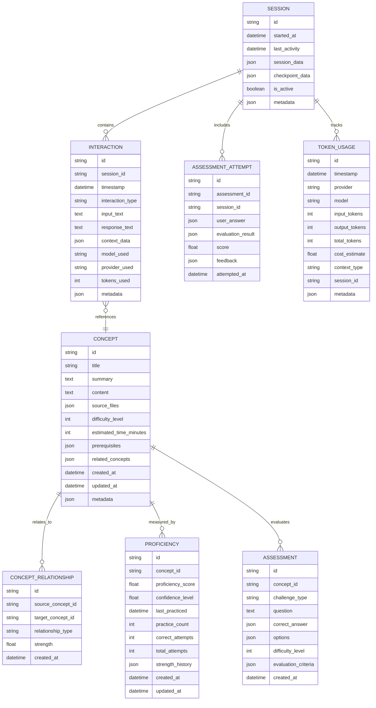

**Note:** The database entities are influenced by configuration settings. See [Configuration File Design](#configuration-file-design) for the complete configuration entity relationships and their influence on core entities.

### Configuration File Design

#### Configuration Entity Relationship Diagram

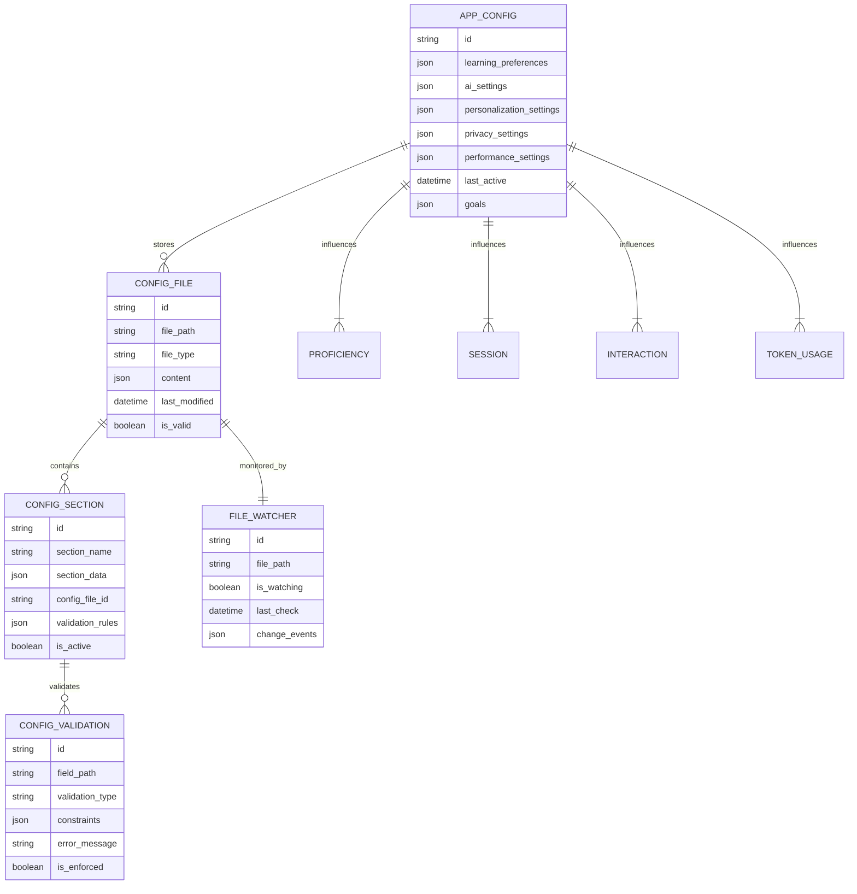

**Note:** The configuration entities (`APP_CONFIG`, `CONFIG_FILE`, `CONFIG_SECTION`, `CONFIG_VALIDATION`, `FILE_WATCHER`) store and manage application settings that influence the behavior of core database entities (see [Database Design](#database-design)). The `..>` relationships represent configuration influence rather than data relationships.

#### Configuration Entity Specifications

**CONFIG_FILE Entity Specifications:**

| Field | Type | Constraints | Description |
|-------|------|-------------|-------------|
| `id` | string | PK, UNIQUE | Configuration file identifier |
| `file_path` | string | UNIQUE, NOT NULL | File system path |
| `file_type` | string | NOT NULL | config.json, preferences.json |
| `content` | json | NOT NULL | File content |
| `last_modified` | datetime | NOT NULL | Last modification timestamp |
| `is_valid` | boolean | DEFAULT TRUE | Validation status |

**CONFIG_SECTION Entity Specifications:**

| Field | Type | Constraints | Description |
|-------|------|-------------|-------------|
| `id` | string | PK, UNIQUE | Section identifier |
| `section_name` | string | NOT NULL | ai, learning, ui, privacy, performance |
| `section_data` | json | NOT NULL | Section configuration data |
| `config_file_id` | string | FK to CONFIG_FILE.id, NOT NULL | Parent configuration file |
| `validation_rules` | json | NULLABLE | Section-specific validation rules |
| `is_active` | boolean | DEFAULT TRUE | Section activation status |

**CONFIG_VALIDATION Entity Specifications:**

| Field | Type | Constraints | Description |
|-------|------|-------------|-------------|
| `id` | string | PK, UNIQUE | Validation rule identifier |
| `field_path` | string | NOT NULL | Dot notation path (e.g., ai.temperature) |
| `validation_type` | string | NOT NULL | range, enum, pattern, required |
| `constraints` | json | NOT NULL | Validation constraints |
| `error_message` | string | NOT NULL | Validation error message |
| `is_enforced` | boolean | DEFAULT TRUE | Rule enforcement status |

**FILE_WATCHER Entity Specifications:**

| Field | Type | Constraints | Description |
|-------|------|-------------|-------------|
| `id` | string | PK, UNIQUE | Watcher identifier |
| `file_path` | string | UNIQUE, NOT NULL | Monitored file path |
| `is_watching` | boolean | DEFAULT TRUE | Watching status |
| `last_check` | datetime | NOT NULL | Last check timestamp |
| `change_events` | json | NULLABLE | File change events |

### Relationship Type Legend

| Symbol | Relationship Type | Description |
|--------|------------------|-------------|
| `||--||` | One-to-One | Strong mandatory relationship |
| `||--o{` | One-to-Many | Parent to multiple children |
| `}o--||` | Many-to-One | Multiple children to one parent |
| `}o--o{` | Many-to-Many | Optional many-to-many |
| `..>` | Influence | Configuration affects behavior |

## Core Domain Models

### Application Configuration Models

#### App Configuration Entity

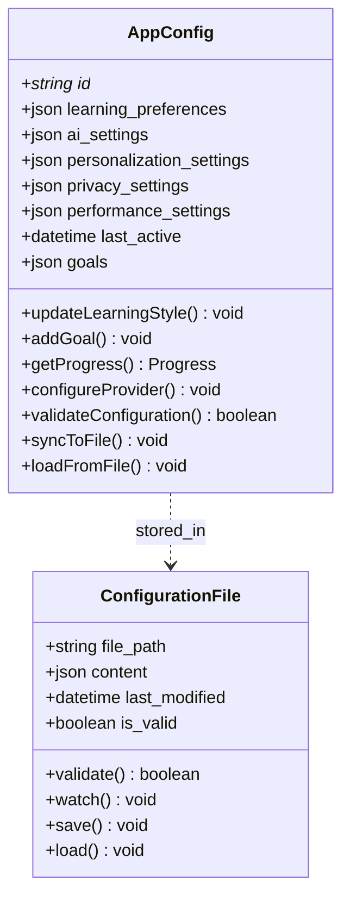

**AppConfig Entity Specifications:**

| Field | Type | Constraints | Description |
|-------|------|-------------|-------------|
| `id` | string | PK, UNIQUE | Configuration identifier |
| `learning_preferences` | json | NULLABLE | Learning preference settings |
| `ai_settings` | json | NULLABLE | AI provider and model settings |
| `personalization_settings` | json | NULLABLE | Personalization options |
| `privacy_settings` | json | NULLABLE | Privacy and security settings |
| `performance_settings` | json | NULLABLE | Performance and caching settings |
| `last_active` | datetime | NULLABLE | Last activity timestamp |
| `goals` | json | NULLABLE | Learning goals array |

**Configuration File Storage:**
- **Primary Storage**: `./.catalyst/config.json` - Main configuration with AI, learning, UI, privacy, and performance sections
- **Preferences Storage**: `./.catalyst/preferences.json` - User preferences and goals
- **Real-time Updates**: Configuration changes are immediately persisted and hot-reloaded
- **Validation**: All configuration changes are validated against entity constraints before persistence

#### Learning Style Value Object

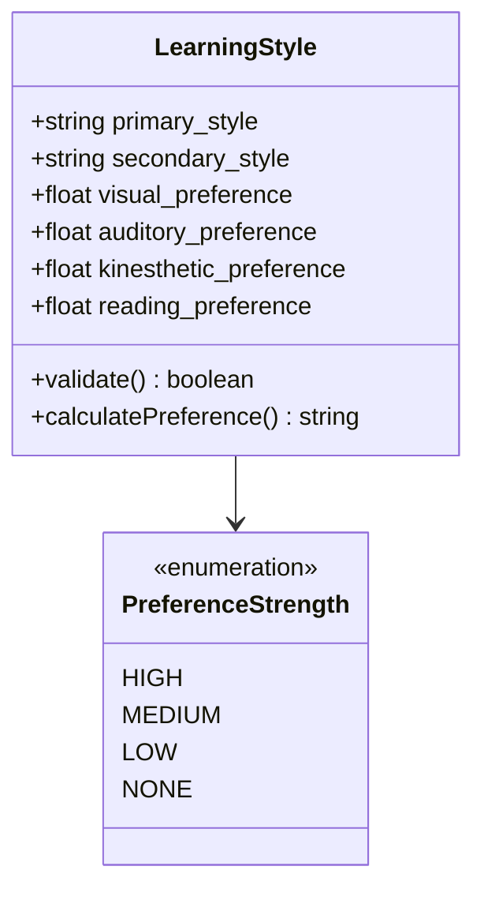

### Learning Domain Models

#### Concept Entity

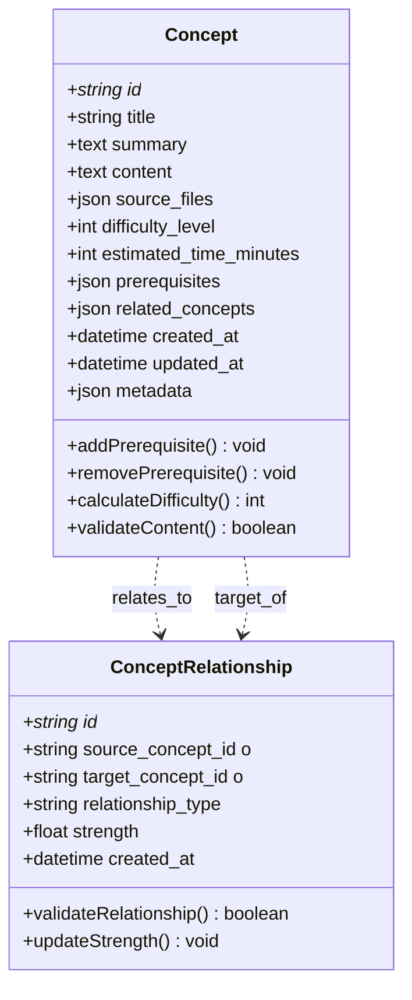

**Concept Entity Specifications:**

| Field | Type | Constraints | Description |
|-------|------|-------------|-------------|
| `id` | string | PK, UNIQUE | Concept identifier |
| `title` | string | NOT NULL, MAX 255 | Concept title |
| `summary` | text | NULLABLE | Brief description |
| `content` | text | NULLABLE | Full content |
| `source_files` | json | NULLABLE | Source file references |
| `difficulty_level` | int | DEFAULT 1, MIN 1, MAX 10 | Difficulty rating |
| `estimated_time_minutes` | int | MIN 1 | Estimated learning time |
| `prerequisites` | json | NULLABLE | Prerequisite concept IDs |
| `related_concepts` | json | NULLABLE | Related concept mappings |
| `created_at` | datetime | NOT NULL | Creation timestamp |
| `updated_at` | datetime | NOT NULL | Update timestamp |
| `metadata` | json | NULLABLE | Additional metadata |

#### Proficiency Models

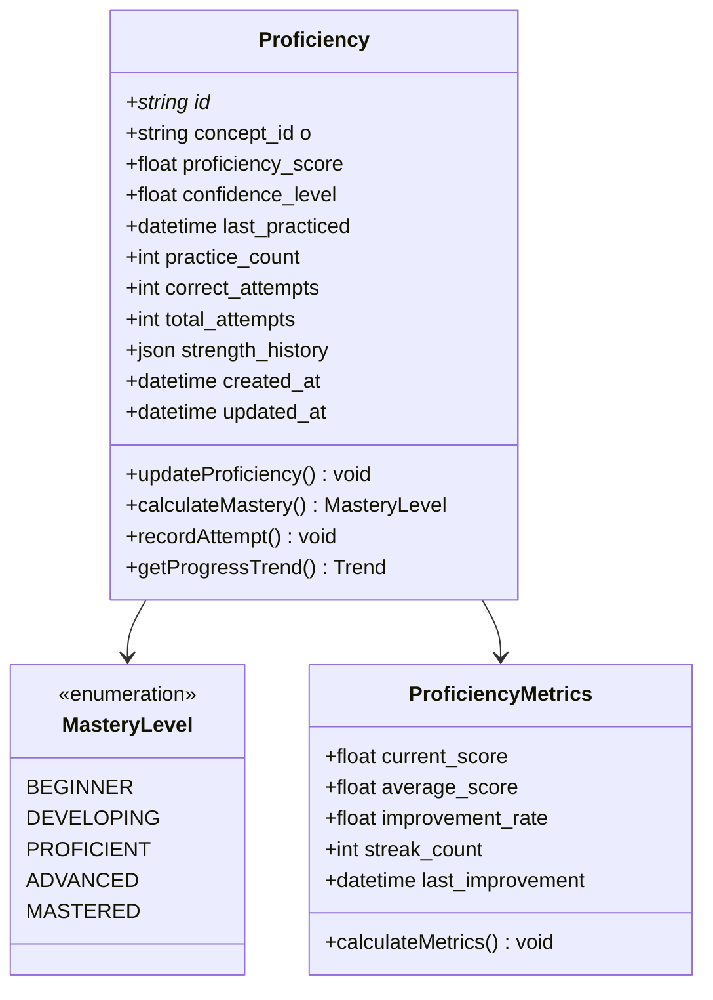

**Proficiency Entity Specifications:**

| Field | Type | Constraints | Description |
|-------|------|-------------|-------------|
| `id` | string | PK, UNIQUE | Proficiency record ID |
| `concept_id` | string | FK to Concept.id, NOT NULL | Concept identifier |
| `proficiency_score` | float | MIN 0.0, MAX 1.0 | Current proficiency |
| `confidence_level` | float | MIN 0.0, MAX 1.0 | User confidence |
| `last_practiced` | datetime | NULLABLE | Last practice session |
| `practice_count` | int | DEFAULT 0, MIN 0 | Total practice attempts |
| `correct_attempts` | int | DEFAULT 0, MIN 0 | Correct answers count |
| `total_attempts` | int | DEFAULT 0, MIN 0 | Total attempts count |
| `strength_history` | json | NULLABLE | Historical strength data |
| `created_at` | datetime | NOT NULL | Record creation |
| `updated_at` | datetime | NOT NULL | Last update |

### Assessment Models

#### Assessment Entity

```mermaid
classDiagram
    class Assessment {
        +string id *
        +string concept_id o
        +string challenge_type
        +text question
        +json correct_answer
        +json options
        +int difficulty_level
        +json evaluation_criteria
        +datetime created_at
        +generateQuestion() string
        +validateAnswer() boolean
        +calculateDifficulty() int
        +adaptDifficulty() void
    }

    class AssessmentAttempt {
        +string id *
        +string assessment_id o
        +string session_id o
        +json user_answer
        +json evaluation_result
        +float score
        +json feedback
        +datetime attempted_at
        +evaluateAnswer() EvaluationResult
        +generateFeedback() string
        +recordAttempt() void
    }

    class ChallengeType {
        <<enumeration>>
        MULTIPLE_CHOICE
        TRUE_FALSE
        SHORT_ANSWER
        CODING_CHALLENGE
        PRACTICAL_EXERCISE
        CONCEPTUAL_QUESTION
    }

    Assessment ||--o{ AssessmentAttempt : generates
    Assessment --> ChallengeType
```

**Assessment Entity Specifications:**

| Field | Type | Constraints | Description |
|-------|------|-------------|-------------|
| `id` | string | PK, UNIQUE | Assessment identifier |
| `concept_id` | string | FK to Concept.id, NOT NULL | Related concept |
| `challenge_type` | string | NOT NULL | Type of challenge |
| `question` | text | NOT NULL | Assessment question |
| `correct_answer` | json | NOT NULL | Correct answer data |
| `options` | json | NULLABLE | Answer options |
| `difficulty_level` | int | MIN 1, MAX 10 | Challenge difficulty |
| `evaluation_criteria` | json | NULLABLE | Scoring criteria |
| `created_at` | datetime | NOT NULL | Creation timestamp |

### Session Domain Models

#### Session Entity

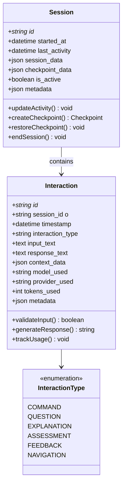

**Session Entity Specifications:**

| Field | Type | Constraints | Description |
|-------|------|-------------|-------------|
| `id` | string | PK, UNIQUE | Session identifier |
| `started_at` | datetime | NOT NULL | Session start time |
| `last_activity` | datetime | NOT NULL | Last activity |
| `session_data` | json | NULLABLE | Session state data |
| `checkpoint_data` | json | NULLABLE | Checkpoint data |
| `is_active` | boolean | DEFAULT TRUE | Active status |
| `metadata` | json | NULLABLE | Session metadata |

**Interaction Entity Specifications:**

| Field | Type | Constraints | Description |
|-------|------|-------------|-------------|
| `id` | string | PK, UNIQUE | Interaction ID |
| `session_id` | string | FK to Session.id, NOT NULL | Session |
| `timestamp` | datetime | NOT NULL | Interaction time |
| `interaction_type` | string | NOT NULL | Type of interaction |
| `input_text` | text | NULLABLE | User input |
| `response_text` | text | NULLABLE | System response |
| `context_data` | json | NULLABLE | Context information |
| `model_used` | string | NULLABLE | AI model used |
| `provider_used` | string | NULLABLE | AI provider |
| `tokens_used` | int | DEFAULT 0, MIN 0 | Tokens consumed |
| `metadata` | json | NULLABLE | Interaction metadata |

## Business Rules and Validation

### Entity Validation Rules

#### Concept Validation Rules

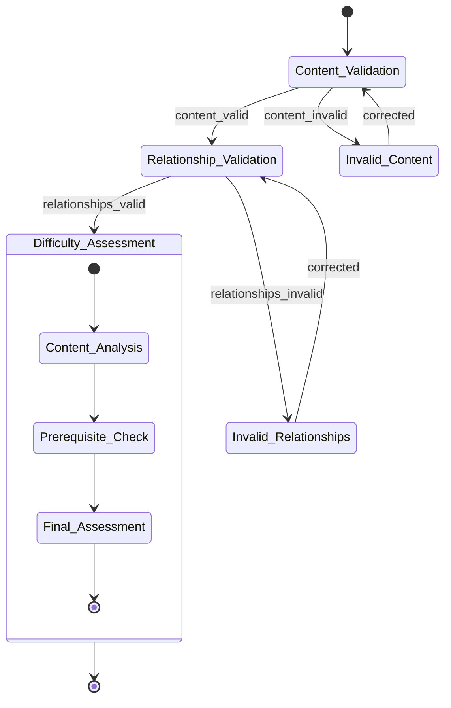

**Concept Entity Validation:**
- **Title**: Required, max 255 characters, unique within domain
- **Content**: Valid markdown or HTML structure
- **Difficulty**: Integer 1-10, validated against content complexity
- **Prerequisites**: All referenced concepts must exist
- **Relationships**: No circular dependencies allowed

#### Proficiency Validation Rules

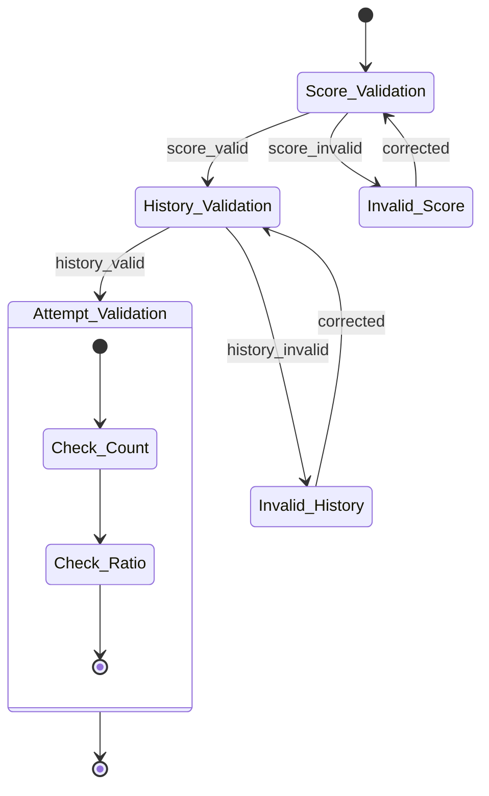

**Proficiency Entity Validation:**
- **Score**: Float 0.0-1.0, calculated from attempts
- **Confidence**: Float 0.0-1.0, user confidence level
- **Attempts**: Non-negative integers, total >= correct
- **History**: Valid JSON with timestamp-score pairs
- **Consistency**: Score must reflect attempt accuracy

## State Transitions and Workflows

### Session Lifecycle

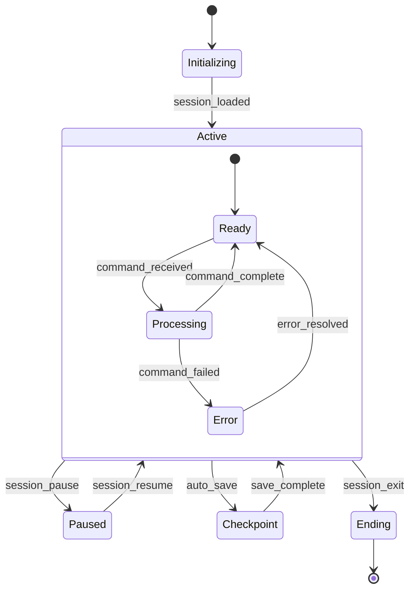

### Learning Progress Flow

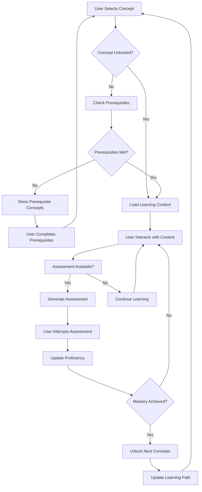

### Assessment Workflow

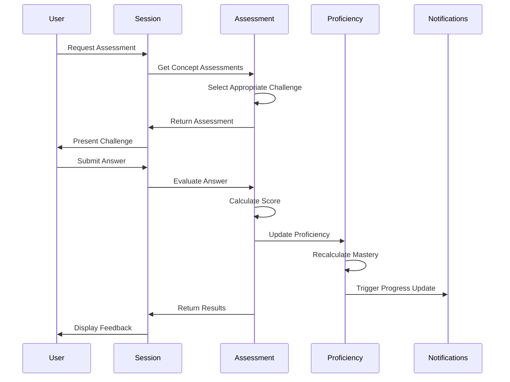

## Configuration File Architecture

### File-Based Configuration System

Learning Catalyst uses a file-based configuration system with a single-user design. The configuration is stored in JSON files within the `./.catalyst/` directory and maps directly to the application configuration entity.

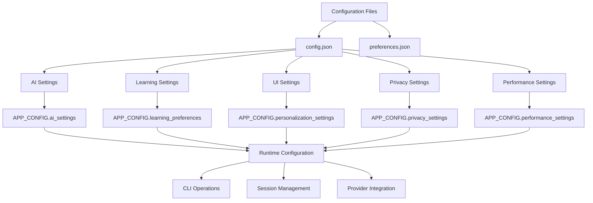

### Configuration Storage Structure

```text
./.catalyst/
├── config.json              # Main configuration file
├── preferences.json         # User preferences and goals
└── logs/                    # Configuration change logs
```

### Configuration-to-Entity Mapping

The file-based configuration system maps directly to the `APP_CONFIG` entity fields (see [Configuration File Design](#configuration-file-design) for the complete entity relationships):

| Configuration File | Section | Entity Field | Description |
|-------------------|---------|--------------|-------------|
| `config.json` | `ai` | `ai_settings` | Provider and model configuration |
| `config.json` | `learning` | `learning_preferences` | Learning style and preferences |
| `config.json` | `ui` | `personalization_settings` | Display and interaction settings |
| `config.json` | `privacy` | `privacy_settings` | Data handling and security settings |
| `config.json` | `performance` | `performance_settings` | Caching and optimization settings |
| `preferences.json` | * | `goals` | Learning goals and objectives |

### Detailed Field Mapping

**AI Settings Mapping (`config.ai` → `ai_settings`)**
```json
// Configuration File (config.json)
{
  "ai": {
    "default_provider": "openai",
    "default_model": "gpt-4o",
    "temperature": 0.7,
    "max_tokens": 4096
  }
}

// Entity Field (ai_settings)
{
  "ai_settings": {
    "default_provider": "openai",
    "default_model": "gpt-4o",
    "temperature": 0.7,
    "max_tokens": 4096
  }
}
```

**Learning Preferences Mapping (`config.learning` → `learning_preferences`)**
```json
// Configuration File (config.json)
{
  "learning": {
    "difficulty": "adaptive",
    "pace": "moderate",
    "content_type": ["text", "visual"],
    "auto_save": true,
    "session_timeout_minutes": 120
  }
}

// Entity Field (learning_preferences)
{
  "learning_preferences": {
    "difficulty": "adaptive",
    "pace": "moderate",
    "content_type": ["text", "visual"],
    "auto_save": true,
    "session_timeout_minutes": 120
  }
}
```

**Personalization Settings Mapping (`config.ui` → `personalization_settings`)**
```json
// Configuration File (config.json)
{
  "ui": {
    "theme": "dark",
    "show_token_usage": true,
    "display_format": "detailed",
    "session_duration": 45
  }
}

// Entity Field (personalization_settings)
{
  "personalization_settings": {
    "theme": "dark",
    "show_token_usage": true,
    "display_format": "detailed",
    "session_duration": 45
  }
}
```

### Configuration Validation Rules

Configuration values must satisfy the same validation rules as entity fields:

| Configuration Path | Type | Validation Rules | Entity Constraint |
|-------------------|------|------------------|-------------------|
| `ai.temperature` | float | 0.0 ≤ value ≤ 2.0 | MIN 0.0, MAX 2.0 |
| `ai.max_tokens` | integer | 1 ≤ value ≤ 32768 | MIN 1, MAX 32768 |
| `learning.session_timeout_minutes` | integer | 5 ≤ value ≤ 480 | MIN 5, MAX 480 |
| `ui.session_duration` | integer | 15 ≤ value ≤ 180 | MIN 15, MAX 180 |
| `performance.cache_size_mb` | integer | 10 ≤ value ≤ 1024 | MIN 10, MAX 1024 |
| `privacy.retention_days` | integer | 1 ≤ value ≤ 3650 | MIN 1, MAX 3650 |

### Real-Time Configuration Updates

Configuration changes are immediately reflected in the data model through:

1. **File Watching**: `FILE_WATCHER` entities monitor configuration files for changes
2. **Validation**: `CONFIG_VALIDATION` entities enforce constraint validation
3. **Hot Reload**: Configuration changes trigger entity updates via `CONFIG_FILE → APP_CONFIG` relationships
4. **Entity Synchronization**: Configuration influence relationships (`..>`) propagate changes to affected entities

### Configuration Workflow Integration

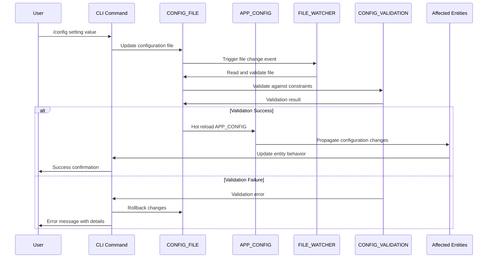

### Configuration Entity Impact Matrix

| Configuration Change | Primary Entity Affected | Secondary Impact | Real-time Update |
|---------------------|------------------------|------------------|------------------|
| `ai.default_provider` | `APP_CONFIG.ai_settings` | `INTERACTION.provider_used`, `TOKEN_USAGE.provider` | Yes |
| `learning.session_timeout` | `APP_CONFIG.learning_preferences` | `SESSION.session_data` | Yes |
| `ui.theme` | `APP_CONFIG.personalization_settings` | `INTERACTION` presentation | Yes |
| `privacy.retention_days` | `APP_CONFIG.privacy_settings` | `SESSION`, `INTERACTION` retention | Yes |
| `performance.cache_size` | `APP_CONFIG.performance_settings` | All entity performance | Yes |

> **For detailed configuration management and CLI commands**, see the [Configuration API](configuration-api.md) document.

## CLI Integration Patterns

The CLI interacts with both database entities and configuration entities as defined in the [Database Design](#database-design) and [Configuration File Design](#configuration-file-design) sections.

### Command to Entity Mapping

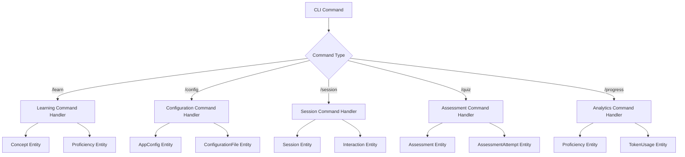

### Data Access Patterns

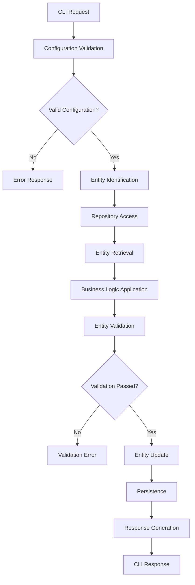

## Sample Data Instances

### Configuration Example

**Configuration File Structure (./.catalyst/config.json):**
```json
{
  "ai": {
    "default_provider": "openai",
    "default_model": "gpt-4o",
    "temperature": 0.7,
    "max_tokens": 4096,
    "providers": {
      "openai": {
        "api_key": "encrypted_storage",
        "base_url": "https://api.openai.com/v1",
        "models": {
          "chat": ["gpt-4o", "gpt-3.5-turbo"],
          "embedding": ["text-embedding-3-small"]
        }
      }
    }
  },
  "learning": {
    "difficulty": "adaptive",
    "pace": "moderate",
    "content_type": ["text", "visual"],
    "auto_save": true,
    "session_timeout_minutes": 120,
    "checkpoint_frequency": 300
  },
  "ui": {
    "theme": "dark",
    "show_token_usage": true,
    "display_format": "detailed",
    "session_duration": 45,
    "auto_scroll": true,
    "show_suggestions": true
  },
  "privacy": {
    "store_conversations": true,
    "anonymize_data": false,
    "retention_days": 365,
    "local_processing": false
  },
  "performance": {
    "cache_enabled": true,
    "cache_size_mb": 100,
    "parallel_requests": 3,
    "timeout_seconds": 30
  }
}
```

**Preferences File (./.catalyst/preferences.json):**
```json
{
  "goals": [
    {
      "title": "Master Python Basics",
      "target_date": "2025-06-01",
      "priority": "high",
      "progress": 0.65,
      "milestones": [
        {
          "title": "Complete Variables and Data Types",
          "completed": true,
          "completed_date": "2025-01-18T10:30:00Z"
        },
        {
          "title": "Understand Functions",
          "completed": false,
          "target_date": "2025-01-25T10:30:00Z"
        }
      ]
    }
  ],
  "last_active": "2025-01-20T14:22:00Z",
  "recent_concepts": [
    "con_python_variables",
    "con_python_data_types",
    "con_python_functions"
  ],
  "proficiency_highlights": {
    "con_python_variables": {
      "score": 0.85,
      "last_practiced": "2025-01-20T12:15:00Z",
      "mastery_level": "PROFICIENT"
    }
  }
}
```

**AppConfig Entity (Runtime Representation):**
```json
{
  "learning_preferences": {
    "difficulty": "adaptive",
    "pace": "moderate",
    "content_type": ["text", "visual"],
    "auto_save": true,
    "session_timeout_minutes": 120,
    "checkpoint_frequency": 300
  },
  "ai_settings": {
    "default_provider": "openai",
    "default_model": "gpt-4o",
    "temperature": 0.7,
    "max_tokens": 4096
  },
  "personalization_settings": {
    "session_duration": 45,
    "theme": "dark",
    "show_token_usage": true,
    "auto_scroll": true,
    "show_suggestions": true
  },
  "privacy_settings": {
    "store_conversations": true,
    "anonymize_data": false,
    "retention_days": 365,
    "local_processing": false
  },
  "performance_settings": {
    "cache_enabled": true,
    "cache_size_mb": 100,
    "parallel_requests": 3,
    "timeout_seconds": 30
  },
  "last_active": "2025-01-20T14:22:00Z",
  "goals": [
    {
      "title": "Master Python Basics",
      "target_date": "2025-06-01",
      "priority": "high",
      "progress": 0.65
    }
  ]
}
```

### Concept Example

```json
{
  "concept": {
    "id": "con_python_functions",
    "title": "Python Functions and Methods",
    "summary": "Understanding function definition, parameters, and return values in Python",
    "content": "# Python Functions\n\nFunctions are reusable blocks of code...",
    "difficulty_level": 3,
    "estimated_time_minutes": 45,
    "prerequisites": ["con_python_variables", "con_python_data_types"],
    "metadata": {
      "category": "programming",
      "tags": ["python", "functions", "basics"],
      "content_type": "tutorial"
    }
  }
}
```

### Session Example

```json
{
  "session": {
    "id": "sess_abc123def",
    "started_at": "2025-01-20T15:30:00Z",
    "last_activity": "2025-01-20T16:15:00Z",
    "is_active": true,
    "session_data": {
      "current_concept": "con_python_functions",
      "progress": 0.65,
      "interaction_count": 12
    },
    "checkpoint_data": {
      "last_checkpoint": "2025-01-20T16:00:00Z",
      "checkpoint_data": {
        "completed_concepts": ["con_python_variables"],
        "current_position": 3
      }
    }
  }
}
```

## Related Documentation

- **[Data Layer Architecture](../system-architecture/data-layer.md)**: Storage patterns, data flow, and infrastructure concerns
- **[Provider Interface](provider-interfaces.md)**: Provider integration architecture and patterns
- **[Configuration API](configuration-api.md)**: Configuration management architecture with entity validation
- **[CLI Commands API](cli-commands.md)**: Command-line interface specifications and integration

### Bidirectional Integration

**Data Models ↔ Configuration API Integration**:
- **Configuration Storage**: Configuration files (`./.catalyst/config.json`) store `APP_CONFIG` entity data
- **Real-time Synchronization**: Configuration changes immediately update entity fields and vice versa
- **Validation Integration**: Configuration values validated against entity field constraints
- **Entity Impact**: Configuration changes affect multiple entities (`INTERACTION`, `SESSION`, `PROFICIENCY`, `TOKEN_USAGE`)

**Key Integration Points**:
- `ai` configuration section → `APP_CONFIG.ai_settings` → `INTERACTION.provider_used`, `TOKEN_USAGE.provider`
- `learning` configuration section → `APP_CONFIG.learning_preferences` → `SESSION.session_data`, `PROFICIENCY` progression
- `ui` configuration section → `APP_CONFIG.personalization_settings` → `INTERACTION` presentation and user experience
- `privacy` configuration section → `APP_CONFIG.privacy_settings` → `SESSION` and `INTERACTION` data retention policies

---

*Last updated: October 10, 2025*
*Version: 1.0.0*
*Category: Data Architecture*