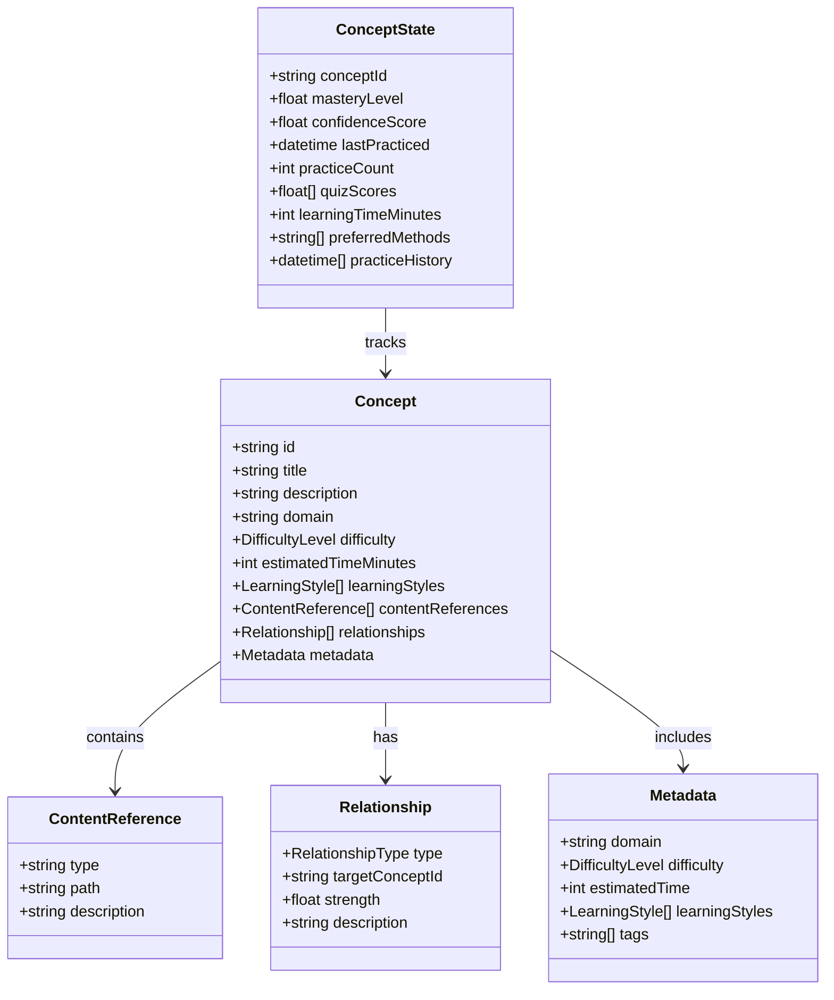

# Knowledge Management API

---
title: Learning Catalyst Knowledge Management API
description: Abstract class interfaces for knowledge graph operations, concept management, and content discovery in CLI application
version: 1.0.0
last_updated: 2025-10-12
difficulty: "Advanced"
estimated_time: "45 minutes"
---

## Overview

The Knowledge Management API provides abstract interfaces for Learning Catalyst's CLI knowledge management system, enabling concept management, relationship operations, and content discovery through well-defined Python abstract classes. These interfaces serve as contracts for implementing the knowledge management functionality within the CLI application.

### API Scope and Purpose

**Core Capabilities**:
- **Concept Management**: Retrieve, search, and manage knowledge concepts
- **Relationship Operations**: Query and navigate semantic connections between concepts
- **Content Discovery**: Trigger automated knowledge extraction from workspace materials
- **Knowledge Graph Operations**: Access structured knowledge networks
- **Search and Discovery**: Semantic search across knowledge concepts

### Integration with System Architecture

These abstract interfaces implement the [Knowledge Management System Architecture](../system-architecture/knowledge-management-system.md) components:

- **Knowledge Graph Engine**: Concept modeling and relationship access
- **Content Discovery System**: Workspace analysis triggering and monitoring
- **Knowledge Storage & Retrieval**: Query interfaces for local knowledge data

### Security and Access Control

**Security Model**:
- **Local-First Security**: No external API keys required for core operations
- **Workspace Isolation**: All operations scoped to current workspace directory
- **Data Encryption**: Knowledge data encrypted at rest
- **Permission-Based Access**: File system permissions control write operations

**Access Requirements**:
- **Read Operations**: Read access to workspace knowledge files
- **Write Operations**: Write permissions for concept and relationship modifications
- **Discovery Operations**: Read access to workspace files for content analysis

## Abstract Class Interfaces

### Main Knowledge Manager Interface

```python
from abc import ABC, abstractmethod
from typing import List, Optional, Dict, Any
from dataclasses import dataclass
from datetime import datetime
from enum import Enum

class RelationshipType(Enum):
    """Enumeration of relationship types between concepts."""
    PREREQUISITE = "PREREQUISITE"
    ENABLES = "ENABLES"
    RELATED_TO = "RELATED_TO"
    CONTAINS = "CONTAINS"

class DifficultyLevel(Enum):
    """Enumeration of concept difficulty levels."""
    BEGINNER = 1
    INTERMEDIATE = 2
    ADVANCED = 3
    EXPERT = 4

@dataclass
class Concept:
    """Core knowledge representation entity."""
    id: str
    title: str
    description: str
    domain: str
    difficulty: int  # 1-10 scale
    estimated_time_minutes: int
    prerequisites: List[str]
    content_references: List['ContentReference']
    metadata: 'ConceptMetadata'

@dataclass
class ContentReference:
    """Reference to learning materials for a concept."""
    type: str  # "markdown", "code", "example", "quiz", "video"
    path: str
    description: str
    relevance_score: float
    last_updated: datetime

@dataclass
class ConceptMetadata:
    """Additional metadata for concepts."""
    created_at: datetime
    updated_at: datetime
    tags: List[str]

@dataclass
class Relationship:
    """Semantic connection between concepts."""
    id: str
    source_concept_id: str
    target_concept_id: str
    relationship_type: RelationshipType
    strength: float  # 0.0 - 1.0
    description: str
    created_at: datetime
    metadata: 'RelationshipMetadata'

@dataclass
class RelationshipMetadata:
    """Additional metadata for relationships."""
    discovered_via: str  # "semantic", "structural", "user_feedback", "ai_analysis"
    confidence_score: float

class AbstractKnowledgeManager(ABC):
    """Abstract base class for knowledge management operations in CLI."""

    @abstractmethod
    def get_concept(self, concept_id: str) -> Optional[Concept]:
        """
        Retrieve concept by ID with complete metadata and relationships.

        Args:
            concept_id: Unique identifier for the concept

        Returns:
            Concept object with complete metadata or None if not found

        Raises:
            ConceptNotFoundError: If concept_id does not exist
            KnowledgeStoreError: If underlying storage is unavailable
        """
        pass

    @abstractmethod
    def search_concepts(self, query: str, domain: Optional[str] = None) -> List[Concept]:
        """
        Search concepts by text query with optional domain filtering.

        Uses semantic search to find concepts matching the query, with optional
        domain filtering to narrow results to specific knowledge areas.

        Args:
            query: Search query text
            domain: Optional domain filter (e.g., "programming", "mathematics")

        Returns:
            List of matching concepts ordered by relevance score

        Raises:
            InvalidQueryError: If query is empty or malformed
            KnowledgeStoreError: If search service is unavailable
        """
        pass

    @abstractmethod
    def get_related_concepts(
        self,
        concept_id: str,
        relationship_type: Optional[RelationshipType] = None
    ) -> List[Concept]:
        """
        Get concepts related to the specified concept.

        Traverses the knowledge graph to find connected concepts, optionally
        filtered by relationship type (PREREQUISITE, ENABLES, RELATED_TO).

        Args:
            concept_id: Source concept identifier
            relationship_type: Optional relationship type filter

        Returns:
            List of related concepts ordered by relationship strength

        Raises:
            ConceptNotFoundError: If source concept does not exist
            InvalidRelationshipTypeError: If relationship_type is invalid
        """
        pass
```

### Relationship Management Interface

```python
class AbstractRelationshipManager(ABC):
    """Abstract base class for relationship operations in CLI."""

    @abstractmethod
    def add_relationship(self, relationship: Relationship) -> str:
        """
        Add new relationship between concepts.

        Creates a semantic connection between two concepts with specified
        relationship type and strength. Validates against circular dependencies
        and existing relationships.

        Args:
            relationship: Relationship object with connection details

        Returns:
            ID of the created relationship

        Raises:
            ConceptNotFoundError: If source or target concept does not exist
            CircularDependencyError: If relationship would create circular dependency
            RelationshipExistsError: If relationship already exists
            InvalidRelationshipError: If relationship parameters are invalid
        """
        pass

    @abstractmethod
    def update_relationship_strength(
        self,
        relationship_id: str,
        new_strength: float,
        feedback_source: str = "user_interaction"
    ) -> bool:
        """
        Update relationship strength based on user feedback or AI analysis.

        Adjusts the weight of a relationship based on new information,
        user interactions, or refined semantic analysis.

        Args:
            relationship_id: Unique relationship identifier
            new_strength: New strength value (0.0 - 1.0)
            feedback_source: Source of the strength update

        Returns:
            True if update was successful

        Raises:
            RelationshipNotFoundError: If relationship_id does not exist
            InvalidStrengthError: If new_strength is outside valid range
        """
        pass

    @abstractmethod
    def get_relationship(self, relationship_id: str) -> Optional[Relationship]:
        """
        Retrieve relationship by its unique identifier.

        Args:
            relationship_id: Unique relationship identifier

        Returns:
            Relationship object or None if not found

        Raises:
            RelationshipNotFoundError: If relationship_id does not exist
        """
        pass
```

### Content Discovery Interface

```python
@dataclass
class DiscoveryResult:
    """Result of workspace content discovery."""
    discovery_id: str
    workspace_path: str
    new_concepts: List[Concept]
    new_relationships: List[Relationship]
    updated_concepts: List[str]
    processing_statistics: 'ProcessingStatistics'
    recommendations: List[str]

@dataclass
class ProcessingStatistics:
    """Statistics from content processing operations."""
    files_processed: int
    concepts_extracted: int
    relationships_created: int
    processing_time_seconds: float
    accuracy_estimate: float

class AbstractContentDiscovery(ABC):
    """Abstract base class for content discovery operations in CLI."""

    @abstractmethod
    def discover_concepts_from_workspace(
        self,
        workspace_path: str,
        file_patterns: Optional[List[str]] = None,
        analysis_options: Optional[Dict[str, Any]] = None
    ) -> DiscoveryResult:
        """
        Analyze workspace and extract new concepts and relationships.

        Scans workspace files for learning materials, extracts concepts using
        natural language processing, and builds relationships based on content
        analysis and semantic similarity.

        Args:
            workspace_path: Path to workspace directory to analyze
            file_patterns: List of file patterns to include (default: ["*.md", "*.txt", "*.py", "*.js"])
            analysis_options: Dictionary of analysis configuration options

        Returns:
            DiscoveryResult with extracted concepts, relationships, and metadata

        Raises:
            WorkspaceNotFoundError: If workspace_path does not exist
            PermissionError: If lacking read permissions for workspace
            ContentAnalysisError: If content processing fails
        """
        pass

    @abstractmethod
    def update_knowledge_graph(
        self,
        update_type: str = "incremental",
        force_rebuild: bool = False,
        affected_paths: Optional[List[str]] = None
    ) -> 'UpdateResult':
        """
        Process content changes and update knowledge graph.

        Monitors workspace for file changes, processes updated content,
        and incrementally updates the knowledge graph with new concepts
        and relationships.

        Args:
            update_type: Type of update ("incremental" or "full")
            force_rebuild: Whether to force full rebuild
            affected_paths: List of specific file paths to process

        Returns:
            UpdateResult with changes applied and update statistics

        Raises:
            KnowledgeStoreError: If underlying storage is unavailable
            ContentProcessingError: If content analysis fails
        """
        pass
```

### Knowledge Graph Operations Interface

```python
class AbstractKnowledgeGraph(ABC):
    """Abstract base class for knowledge graph operations in CLI."""

    @abstractmethod
    def get_concept_dependencies(self, concept_id: str) -> List[str]:
        """
        Get all direct and indirect prerequisites for a concept.

        Args:
            concept_id: Target concept identifier

        Returns:
            List of prerequisite concept IDs ordered by dependency level

        Raises:
            ConceptNotFoundError: If concept_id does not exist
        """
        pass

    @abstractmethod
    def get_concept_descendants(self, concept_id: str) -> List[str]:
        """
        Get all concepts that depend on the specified concept.

        Args:
            concept_id: Source concept identifier

        Returns:
            List of dependent concept IDs ordered by dependency level

        Raises:
            ConceptNotFoundError: If concept_id does not exist
        """
        pass

    @abstractmethod
    def find_learning_path(
        self,
        start_concept_id: str,
        target_concept_id: str
    ) -> List[str]:
        """
        Find shortest learning path between two concepts.

        Args:
            start_concept_id: Starting concept identifier
            target_concept_id: Target concept identifier

        Returns:
            List of concept IDs representing the learning path

        Raises:
            ConceptNotFoundError: If either concept does not exist
            PathNotFoundError: If no path exists between concepts
        """
        pass
```

### Search and Analytics Interface

```python
@dataclass
class SearchResult:
    """Search result with relevance scoring."""
    concept: Concept
    relevance_score: float
    match_reasons: List[str]

class AbstractSearchEngine(ABC):
    """Abstract base class for search operations in CLI."""

    @abstractmethod
    def semantic_search(
        self,
        query: str,
        max_results: int = 20,
        domain_filter: Optional[str] = None
    ) -> List[SearchResult]:
        """
        Perform semantic search across knowledge concepts.

        Args:
            query: Search query text
            max_results: Maximum number of results to return
            domain_filter: Optional domain to filter results

        Returns:
            List of search results ordered by relevance

        Raises:
            SearchEngineError: If search service is unavailable
        """
        pass

    @abstractmethod
    def get_popular_concepts(
        self,
        domain: Optional[str] = None,
        limit: int = 10
    ) -> List[Concept]:
        """
        Get most frequently accessed or highly-rated concepts.

        Args:
            domain: Optional domain filter
            limit: Maximum number of concepts to return

        Returns:
            List of popular concepts ordered by usage or rating

        Raises:
            KnowledgeStoreError: If storage service is unavailable
        """
        pass
```

## Data Models

### Knowledge Graph Data Model

The Knowledge Management System uses a rich data model to represent concepts, relationships, and learning state. This architectural view shows the high-level data structures and their relationships:



### Concept Architecture Components

**Core Data Structures**:
- **Concept Entity**: Primary knowledge representation with rich metadata
- **Relationship Types**: PREREQUISITE, ENABLES, RELATED_TO with strength weights
- **Content References**: Links to learning materials (markdown, code, examples)
- **Concept State**: User-specific learning progress and mastery tracking

**Relationship Types**:
- **PREREQUISITE**: Required foundation concepts
- **ENABLES**: Concepts unlocked by current knowledge
- **RELATED_TO**: Similar or connected topics
- **CONTAINS**: Hierarchical concept inclusion

### Core Data Structures

**Concept Object Structure**:
```python
from dataclasses import dataclass, field
from typing import List, Optional, Dict, Any
from datetime import datetime
from enum import Enum

class LearningStyle(Enum):
    """Learning style preferences for concepts."""
    VISUAL = "visual"
    AUDITORY = "auditory"
    KINESTHETIC = "kinesthetic"
    READING = "reading"
    HANDS_ON = "hands_on"

@dataclass
class Concept:
    """Core knowledge representation entity."""
    id: str
    title: str
    description: str
    domain: str
    difficulty: DifficultyLevel  # Aligned with architectural model
    estimated_time_minutes: int
    learning_styles: List[LearningStyle]  # From architectural model
    content_references: List[ContentReference]
    relationships: List[Relationship]  # Direct relationship access
    metadata: ConceptMetadata

@dataclass
class ContentReference:
    """Reference to learning materials for a concept."""
    type: str  # "markdown", "code", "example", "quiz", "video"
    path: str
    description: str
    relevance_score: float  # 0.0-1.0
    last_updated: datetime

@dataclass
class ConceptMetadata:
    """Additional metadata for concepts."""
    created_at: datetime
    updated_at: datetime
    tags: List[str]
```

**Relationship Object Structure**:
```python
@dataclass
class Relationship:
    """Semantic connection between concepts."""
    id: str
    source_concept_id: str
    target_concept_id: str
    relationship_type: RelationshipType
    strength: float  # 0.0-1.0
    description: str
    created_at: datetime
    metadata: RelationshipMetadata

@dataclass
class RelationshipMetadata:
    """Additional metadata for relationships."""
    discovered_via: str  # "semantic", "structural", "user_feedback", "ai_analysis"
    confidence_score: float
```

**Extended Data Models**:
```python
@dataclass
class ConceptState:
    """User-specific learning progress and mastery tracking."""
    concept_id: str
    mastery_level: float  # 0.0 - 1.0
    confidence_score: float  # 0.0 - 1.0
    last_practiced: datetime
    practice_count: int
    quiz_scores: List[float]
    learning_time_minutes: int
    preferred_methods: List[str]
    practice_history: List[datetime]

@dataclass
class ProcessingStatistics:
    """Statistics from content processing operations."""
    files_processed: int
    concepts_extracted: int
    relationships_created: int
    processing_time_seconds: float
    accuracy_estimate: float

@dataclass
class UpdateResult:
    """Result of knowledge graph update operations."""
    update_id: str
    concepts_added: int
    concepts_updated: int
    relationships_added: int
    relationships_updated: int
    processing_time: float
    affected_files: List[str]
```

**Search Result Structure**:
```python
@dataclass
class SearchResult:
    """Search result with relevance scoring."""
    concept: Concept
    relevance_score: float
    match_reasons: List[str]

@dataclass
class SearchMetadata:
    """Metadata about search operation."""
    execution_time_ms: int
    algorithm_used: str
    total_results: int
```

## Error Handling

### Exception Hierarchy

**Base Exception Classes**:
```python
class KnowledgeManagementError(Exception):
    """Base exception for all knowledge management operations."""
    pass

class ConceptError(KnowledgeManagementError):
    """Base exception for concept-related errors."""
    pass

class RelationshipError(KnowledgeManagementError):
    """Base exception for relationship-related errors."""
    pass

class DiscoveryError(KnowledgeManagementError):
    """Base exception for content discovery errors."""
    pass

class SearchError(KnowledgeManagementError):
    """Base exception for search operation errors."""
    pass
```

### Specific Exception Types

**Concept Exceptions**:
```python
class ConceptNotFoundError(ConceptError):
    """Raised when concept ID does not exist."""
    def __init__(self, concept_id: str, suggestions: Optional[List[str]] = None):
        self.concept_id = concept_id
        self.suggestions = suggestions or []
        super().__init__(f"Concept with ID '{concept_id}' not found")

class ConceptAlreadyExistsError(ConceptError):
    """Raised when attempting to create duplicate concept."""
    def __init__(self, concept_id: str):
        self.concept_id = concept_id
        super().__init__(f"Concept with ID '{concept_id}' already exists")

class InvalidConceptDataError(ConceptError):
    """Raised when concept data validation fails."""
    def __init__(self, field: str, value: Any, reason: str):
        self.field = field
        self.value = value
        self.reason = reason
        super().__init__(f"Invalid {field}: {reason}")
```

**Relationship Exceptions**:
```python
class RelationshipNotFoundError(RelationshipError):
    """Raised when relationship ID does not exist."""
    def __init__(self, relationship_id: str):
        self.relationship_id = relationship_id
        super().__init__(f"Relationship with ID '{relationship_id}' not found")

class CircularDependencyError(RelationshipError):
    """Raised when relationship would create circular dependency."""
    def __init__(self, source_id: str, target_id: str):
        self.source_id = source_id
        self.target_id = target_id
        super().__init__(f"Relationship from '{source_id}' to '{target_id}' would create circular dependency")

class InvalidRelationshipError(RelationshipError):
    """Raised when relationship parameters are invalid."""
    def __init__(self, parameter: str, value: Any, valid_range: str):
        self.parameter = parameter
        self.value = value
        self.valid_range = valid_range
        super().__init__(f"Invalid {parameter} value '{value}'. Valid range: {valid_range}")
```

**Discovery Exceptions**:
```python
class WorkspaceNotFoundError(DiscoveryError):
    """Raised when workspace path does not exist."""
    def __init__(self, workspace_path: str):
        self.workspace_path = workspace_path
        super().__init__(f"Workspace path '{workspace_path}' does not exist")

class ContentAnalysisError(DiscoveryError):
    """Raised when content processing fails."""
    def __init__(self, file_path: str, error_details: str):
        self.file_path = file_path
        self.error_details = error_details
        super().__init__(f"Content analysis failed for '{file_path}': {error_details}")

class PermissionError(DiscoveryError):
    """Raised when lacking permissions for workspace access."""
    def __init__(self, workspace_path: str, required_permission: str):
        self.workspace_path = workspace_path
        self.required_permission = required_permission
        super().__init__(f"Permission denied for '{workspace_path}'. Requires: {required_permission}")
```

**Search Exceptions**:
```python
class SearchEngineError(SearchError):
    """Raised when search service is unavailable."""
    def __init__(self, service_name: str):
        self.service_name = service_name
        super().__init__(f"Search service '{service_name}' is unavailable")

class InvalidQueryError(SearchError):
    """Raised when search query is invalid."""
    def __init__(self, query: str, reason: str):
        self.query = query
        self.reason = reason
        super().__init__(f"Invalid search query '{query}': {reason}")
```

## Performance

### Performance Targets

- **Concept retrieval**: < 200ms for database queries
- **Search operations**: < 100ms for typical queries
- **Relationship traversal**: < 30ms per hop
- **Content discovery**: < 5 seconds for average workspace
- **Method call overhead**: < 50ms for cached operations

### Optimization Features

**Indexing Strategy**:
- **Concept Index**: Fast lookup by ID, title, and domain
- **Vector Index**: Semantic similarity search
- **Relationship Index**: Efficient traversal by type and strength
- **Content Index**: Full-text search across learning materials

**Caching Layers**:
- **Memory Cache**: Frequently accessed concepts
- **Disk Cache**: Persistent cache for faster startup
- **Semantic Cache**: Query results cached by semantic similarity

## Versioning

### Interface Version Strategy

**Semantic Versioning**: `MAJOR.MINOR.PATCH`
- **MAJOR**: Breaking changes to abstract method signatures
- **MINOR**: New abstract methods, backward-compatible changes
- **PATCH**: Bug fixes, documentation updates

**Current Version**: `v1.0.0`

### Version Compatibility

**Backward Compatibility**:
- All v1.x abstract interfaces will remain compatible
- New abstract methods may be added (with default implementations where possible)
- Deprecated abstract methods will be supported for at least 6 months
- Breaking changes will increment MAJOR version

**Version Detection**:
```python
class AbstractKnowledgeManager(ABC):
    """Knowledge management interface v1.0.0"""
    VERSION = "1.0.0"

    @abstractmethod
    def get_version(self) -> str:
        """Return the interface version."""
        return self.VERSION
```

## Integration Guidelines

### Access Requirements

- **Read Operations**: Read access to workspace knowledge files
- **Write Operations**: Write permissions for concept and relationship modifications
- **Discovery Operations**: Read access to workspace files for content analysis

### CLI Usage Patterns

**Basic Concept Retrieval**:
```python
# Initialize knowledge manager
km = KnowledgeManagerImplementation()

# Retrieve concept by ID
try:
    concept = km.get_concept("con_python_basics")
    print(f"Concept: {concept.title}")
    print(f"Description: {concept.description}")
except ConceptNotFoundError as e:
    print(f"Concept not found: {e}")
```

**Semantic Search**:
```python
# Search for concepts
search_engine = SearchEngineImplementation()
results = search_engine.semantic_search(
    query="python functions",
    max_results=10,
    domain_filter="programming"
)

for result in results:
    print(f"{result.concept.title} (relevance: {result.relevance_score:.2f})")
```

**Relationship Navigation**:
```python
# Get related concepts
related = km.get_related_concepts(
    concept_id="con_python_basics",
    relationship_type=RelationshipType.PREREQUISITE
)

for concept in related:
    print(f"Prerequisite: {concept.title}")
```

**Content Discovery**:
```python
# Discover concepts from workspace
discovery = ContentDiscoveryImplementation()
result = discovery.discover_concepts_from_workspace(
    workspace_path="./my_project",
    file_patterns=["*.py", "*.md", "*.txt"]
)

print(f"Discovered {len(result.new_concepts)} new concepts")
print(f"Created {len(result.new_relationships)} relationships")
```

### Implementation Best Practices

**Error Handling**:
```python
try:
    concept = km.get_concept(concept_id)
except ConceptNotFoundError as e:
    # Handle concept not found
    if e.suggestions:
        print(f"Did you mean: {', '.join(e.suggestions)}?")
except KnowledgeManagementError as e:
    # Handle other knowledge management errors
    print(f"Knowledge management error: {e}")
```

**Resource Management**:
```python
# Use context managers for resource cleanup
with KnowledgeManagerImplementation() as km:
    concept = km.get_concept("con_example")
    # Automatic cleanup on context exit
```

**Performance Optimization**:
```python
# Batch operations for better performance
concepts = km.get_multiple_concepts(concept_ids)
search_results = search_engine.batch_search(queries)
```

## Implementation Examples

### Content Discovery Engine

```python
from typing import List
from pathlib import Path

class ContentDiscoveryEngine:
    """Implementation of content discovery for knowledge extraction."""

    def __init__(self, file_scanner, content_reader, concept_extractor, relationship_builder):
        self.file_scanner = file_scanner
        self.content_reader = content_reader
        self.concept_extractor = concept_extractor
        self.relationship_builder = relationship_builder

    def analyze_workspace(self, workspace_path: str) -> KnowledgeGraph:
        """
        Analyze workspace and extract knowledge graph.

        Args:
            workspace_path: Path to workspace directory

        Returns:
            KnowledgeGraph with extracted concepts and relationships
        """
        # Scan for learning materials
        content_files = self.file_scanner.scan(workspace_path, ["*.md", "*.txt", "*.py", "*.js"])

        # Extract concepts and build relationships
        concepts = []
        for file_path in content_files:
            content = self.content_reader.read(file_path)
            concepts.extend(self.concept_extractor.extract(content))

        relationships = self.relationship_builder.build(concepts)
        return KnowledgeGraph(concepts, relationships)
```

### Query Optimization Engine

```python
from abc import ABC, abstractmethod
from dataclasses import dataclass
from typing import List, Dict, Any

@dataclass
class GraphQuery:
    """Represents a knowledge graph query."""
    query_type: str  # "shortest_path", "related_concepts", "general"
    source: str
    target: Optional[str] = None
    filters: Dict[str, Any] = None

@dataclass
class OptimizedQuery:
    """Optimized query with execution strategy."""
    algorithm: str
    indexes: List[str]
    cache_key: str
    parameters: Dict[str, Any]

class KnowledgeGraphQueryOptimizer:
    """Optimizes knowledge graph queries for better performance."""

    def __init__(self, index_manager, cache_manager):
        self.index_manager = index_manager
        self.cache_manager = cache_manager

    def optimize_query(self, query: GraphQuery) -> OptimizedQuery:
        """
        Select optimal traversal strategy for graph queries.

        Args:
            query: GraphQuery to optimize

        Returns:
            OptimizedQuery with execution strategy
        """
        if query.query_type == "shortest_path":
            return self._optimize_bfs_query(query)
        elif query.query_type == "related_concepts":
            return self._optimize_similarity_query(query)
        else:
            return self._optimize_general_query(query)

    def _optimize_bfs_query(self, query: GraphQuery) -> OptimizedQuery:
        """Use bidirectional BFS for shortest path queries."""
        return OptimizedQuery(
            algorithm="bidirectional_bfs",
            indexes=["concept_index", "relationship_index"],
            cache_key=f"bfs_{query.source}_{query.target}",
            parameters={"max_depth": 10, "heuristic": "relationship_strength"}
        )

    def _optimize_similarity_query(self, query: GraphQuery) -> OptimizedQuery:
        """Use vector similarity for related concept queries."""
        return OptimizedQuery(
            algorithm="vector_similarity",
            indexes=["vector_index", "concept_index"],
            cache_key=f"sim_{query.source}",
            parameters={"similarity_threshold": 0.7, "max_results": 20}
        )

    def _optimize_general_query(self, query: GraphQuery) -> OptimizedQuery:
        """Use optimized graph traversal for general queries."""
        return OptimizedQuery(
            algorithm="optimized_traversal",
            indexes=["concept_index", "relationship_index"],
            cache_key=f"general_{hash(str(query))}",
            parameters={"use_caching": True, "parallel": True}
        )
```

### Knowledge Graph Storage Operations

```python
import json
import sqlite3
from typing import List, Optional, Dict, Any
from pathlib import Path

class KnowledgeGraphStorage:
    """Local-first storage implementation for knowledge graph data."""

    def __init__(self, storage_path: Path):
        self.storage_path = storage_path
        self.db_path = storage_path / "knowledge_graph.db"
        self.vector_index_path = storage_path / "vector_index.idx"
        self._initialize_storage()

    def _initialize_storage(self):
        """Initialize SQLite database and indexes."""
        with sqlite3.connect(self.db_path) as conn:
            conn.execute("""
                CREATE TABLE IF NOT EXISTS concepts (
                    id TEXT PRIMARY KEY,
                    title TEXT NOT NULL,
                    description TEXT,
                    domain TEXT,
                    difficulty INTEGER,
                    metadata TEXT,
                    created_at TIMESTAMP DEFAULT CURRENT_TIMESTAMP
                )
            """)

            conn.execute("""
                CREATE TABLE IF NOT EXISTS relationships (
                    id TEXT PRIMARY KEY,
                    source_concept_id TEXT,
                    target_concept_id TEXT,
                    relationship_type TEXT,
                    strength REAL,
                    description TEXT,
                    metadata TEXT,
                    created_at TIMESTAMP DEFAULT CURRENT_TIMESTAMP,
                    FOREIGN KEY (source_concept_id) REFERENCES concepts (id),
                    FOREIGN KEY (target_concept_id) REFERENCES concepts (id)
                )
            """)

            # Create indexes for performance
            conn.execute("CREATE INDEX IF NOT EXISTS idx_concepts_domain ON concepts (domain)")
            conn.execute("CREATE INDEX IF NOT EXISTS idx_relationships_source ON relationships (source_concept_id)")
            conn.execute("CREATE INDEX IF NOT EXISTS idx_relationships_target ON relationships (target_concept_id)")
            conn.execute("CREATE INDEX IF NOT EXISTS idx_relationships_type ON relationships (relationship_type)")

    def store_concept(self, concept: Concept) -> bool:
        """Store a concept in the knowledge graph."""
        try:
            with sqlite3.connect(self.db_path) as conn:
                conn.execute(
                    "INSERT OR REPLACE INTO concepts VALUES (?, ?, ?, ?, ?, ?, ?)",
                    (
                        concept.id,
                        concept.title,
                        concept.description,
                        concept.domain,
                        concept.difficulty,
                        json.dumps(concept.metadata.__dict__),
                        datetime.now()
                    )
                )
            return True
        except Exception as e:
            print(f"Error storing concept: {e}")
            return False

    def get_concept(self, concept_id: str) -> Optional[Concept]:
        """Retrieve a concept by ID."""
        try:
            with sqlite3.connect(self.db_path) as conn:
                conn.row_factory = sqlite3.Row
                cursor = conn.execute(
                    "SELECT * FROM concepts WHERE id = ?", (concept_id,)
                )
                row = cursor.fetchone()
                if row:
                    return self._row_to_concept(row)
        except Exception as e:
            print(f"Error retrieving concept: {e}")
        return None

    def get_related_concepts(self, concept_id: str, relationship_type: Optional[str] = None) -> List[Concept]:
        """Get concepts related to the specified concept."""
        try:
            with sqlite3.connect(self.db_path) as conn:
                conn.row_factory = sqlite3.Row

                if relationship_type:
                    cursor = conn.execute("""
                        SELECT c.* FROM concepts c
                        JOIN relationships r ON c.id = r.target_concept_id
                        WHERE r.source_concept_id = ? AND r.relationship_type = ?
                        ORDER BY r.strength DESC
                    """, (concept_id, relationship_type))
                else:
                    cursor = conn.execute("""
                        SELECT c.* FROM concepts c
                        JOIN relationships r ON c.id = r.target_concept_id
                        WHERE r.source_concept_id = ?
                        ORDER BY r.strength DESC
                    """, (concept_id,))

                return [self._row_to_concept(row) for row in cursor.fetchall()]
        except Exception as e:
            print(f"Error retrieving related concepts: {e}")
        return []

    def _row_to_concept(self, row: sqlite3.Row) -> Concept:
        """Convert database row to Concept object."""
        metadata_dict = json.loads(row['metadata'])
        metadata = ConceptMetadata(**metadata_dict)

        return Concept(
            id=row['id'],
            title=row['title'],
            description=row['description'],
            domain=row['domain'],
            difficulty=row['difficulty'],
            estimated_time_minutes=0,  # Would be stored in extended metadata
            prerequisites=[],  # Would be stored in separate relationships table
            content_references=[],  # Would be stored in separate content table
            metadata=metadata
        )
```

---

*Last updated: October 12, 2025*
*Version: 1.0.0*
*Category: Knowledge Management API*