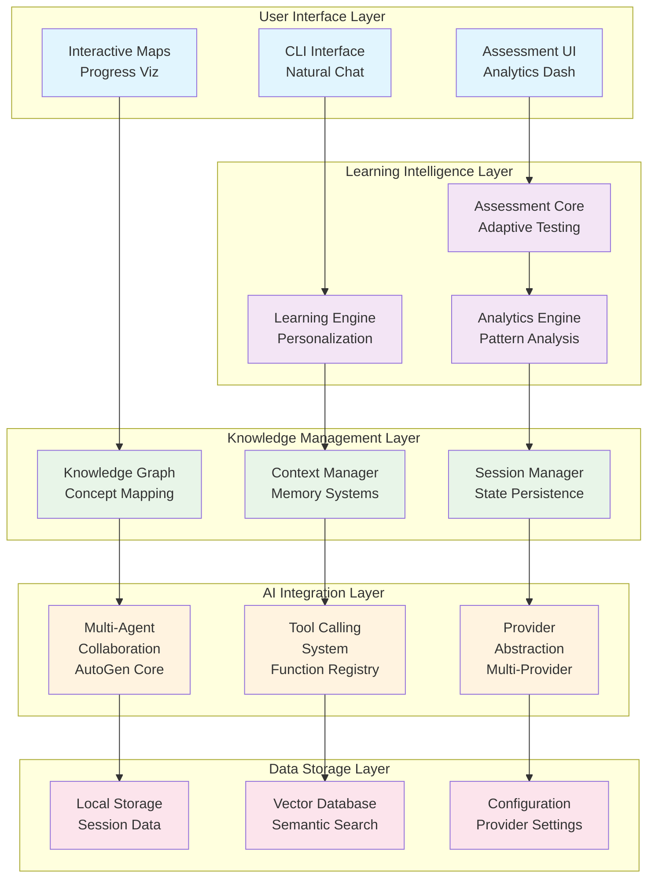

# System Architecture

---
title: Learning Catalyst System Architecture
description: Core architectural design, patterns, and component relationships
version: 1.0.0
last_updated: 2025-10-10
difficulty: "Advanced"
estimated_time: "60 minutes"
---

## Overview

Learning Catalyst is an AI-powered learning companion built with a modular, extensible architecture. The system is designed around a 5-layer architecture that emphasizes privacy-first design, adaptive intelligence, and multi-agent collaboration to create personalized learning experiences.

### Core Architectural Principles

- **Modular Architecture**: Clear component boundaries with well-defined interfaces
- **Local-First Design**: User data remains primarily on local machines with privacy by design
- **Provider Abstraction**: Pluggable AI providers with seamless switching capabilities
- **Extensible System**: Plugin architecture supporting system evolution and feature additions
- **User-Centric Design**: Architecture prioritizes learning effectiveness and user experience

### 🗺️ Complete Learning Catalyst AI System Architecture

```mermaid
graph TB
    %% User Interface Layer
    subgraph "👤 USER INTERFACE LAYER"
        CLI[CLI Commands]
        UI[User Input]
        PROMPT[User Prompts]
        AUTOMENU[AutoGen Menu System]
    end

    %% AutoGen Multi-Agent Orchestration Layer
    subgraph "🤖 AUTOGEN MULTI-AGENT LAYER"
        LA[Learning Agent Management]
        CO[Conversation Orchestration]
        WC[Workflow Coordination]
        TA[Tutor Agents]
        AA[Assessment Agents]
        RA[Recommendation Agents]
    end

    %% Core Processing Engine
    subgraph "🧠 CORE PROCESSING ENGINE"
        CONTEXT[Context Manager]
        ANALYZER[Intent Analyzer]
        ROUTER[Smart Router]
        TP[Tool Planning & Sequencing]
    end

    %% Context Management System
    subgraph "📊 CONTEXT MANAGEMENT SYSTEM"
        PROFILE[User Profile]
        HISTORY[Learning History]
        SESSION[Session Manager]
        KNOWLEDGE[Knowledge Graph]

        PROFILE --> |Skill Level| CONTEXT
        HISTORY --> |Progress Patterns| CONTEXT
        SESSION --> |Current State| CONTEXT
        KNOWLEDGE --> |Concept Links| CONTEXT
    end

    %% AI Provider Selection Engine
    subgraph "🎯 AI PROVIDER SELECTION ENGINE"
        SELECTOR[Provider Selector]
        BALANCER[Load Balancer]
        MONITOR[Health Monitor]

        SELECTOR --> |Task Analysis| BALANCER
        MONITOR --> |Provider Status| SELECTOR
    end

    %% Multi-Provider Support
    subgraph "🤖 MULTI-PROVIDER SUPPORT"
        OPENAI[OpenAI<br/>GPT-3.5/4]
        DEEPSEEK[DeepSeek<br/>Chat/Coder]
        SILICON[SiliconFlow<br/>Qwen2/Baichuan]
        CHATGLM[ChatGLM<br/>Chinese Models]
        CUSTOM[Custom API<br/>OpenAI Compatible]
    end

    %% Tool Orchestration System
    subgraph "🛠️ TOOL ORCHESTRATION SYSTEM"
        TE[Tool Execution Coordination]
        LC[Learning Tools]
        AC[Analytics Tools]
        SC[Session Tools]
        DM[Data Management Tools]
    end

    %% Adaptive Learning Engine
    subgraph "📈 ADAPTIVE LEARNING ENGINE"
        PERFORMANCE[Performance Tracker]
        DIFFICULTY[Difficulty Adjuster]
        RECOMMEND[Recommendation Engine]

        PERFORMANCE --> |Learning Metrics| DIFFICULTY
        DIFFICULTY --> |Content Level| RECOMMEND
    end

    %% Error Recovery System
    subgraph "🛡️ ERROR RECOVERY SYSTEM"
        CIRCUIT[Circuit Breaker]
        FALLBACK[Fallback Manager]
        RETRY[Retry Logic]
        ERR[Collaborative Error Resolution]

        CIRCUIT --> |Failure Detection| FALLBACK
        FALLBACK --> |Provider Switch| RETRY
        ERR --> |Multi-Agent Recovery| CIRCUIT
    end

    %% Response Processing
    subgraph "✨ RESPONSE PROCESSING"
        ENHANCER[Context Enhancer]
        FORMATTER[Response Formatter]
        PERSONALIZER[Personalizer]
        RI[Result Integration]

        ENHANCER --> |Add Context| FORMATTER
        FORMATTER --> |Structure Output| PERSONALIZER
        RI --> |Tool Results| ENHANCER
    end

    %% Security Layer
    subgraph "🔒 SECURITY LAYER"
        AS[Agent Sandbox]
        IV[Input Validation]
        OS[Output Sanitization]
        AC_CTRL[Access Control]

        IV --> |Secure Input| CONTEXT
        OS --> |Secure Output| PERSONALIZER
        AS --> |Isolated Execution| TE
    end

    %% Main Flow Connections
    UI --> CONTEXT
    AUTOMENU --> LA
    CONTEXT --> ANALYZER
    ANALYZER --> ROUTER

    %% AutoGen Integration
    LA --> CO
    CO --> WC
    WC --> TP
    TA --> |Tutoring Logic| TP
    AA --> |Assessment Logic| TP
    RA --> |Recommendation Logic| TP

    ROUTER --> SELECTOR
    SELECTOR --> BALANCER

    BALANCER --> OPENAI
    BALANCER --> DEEPSEEK
    BALANCER --> SILICON
    BALANCER --> CHATGLM
    BALANCER --> CUSTOM

    OPENAI --> MONITOR
    DEEPSEEK --> MONITOR
    SILICON --> MONITOR
    CHATGLM --> MONITOR
    CUSTOM --> MONITOR

    MONITOR --> CIRCUIT
    CIRCUIT --> TE

    TE --> LC
    TE --> AC
    TE --> SC
    TE --> DM

    LC --> RI
    AC --> RI
    SC --> RI
    DM --> RI

    RI --> ENHANCER
    ENHANCER --> PERFORMANCE
    PERFORMANCE --> CONTEXT

    PERSONALIZER --> UI

    %% AutoGen Feedback Loops
    PERFORMANCE -.-> |Update Profile| PROFILE
    PERFORMANCE -.-> |Track Progress| HISTORY
    CONTEXT -.-> |Session State| SESSION
    TA -.-> |Learning Insights| PERFORMANCE
    AA -.-> |Assessment Data| PERFORMANCE
    RA -.-> |Recommendation Data| PERFORMANCE

    %% Tool Orchestration Flow
    TP --> |Tool Selection| TE
    TE --> |Execution Results| RI

    %% Error Recovery Flow
    CIRCUIT --> |Provider Failed| FALLBACK
    FALLBACK --> |Try Next Provider| BALANCER
    RETRY --> |Exponential Backoff| CIRCUIT
    ERR --> |Multi-Agent Recovery| FALLBACK

    %% Security Flow
    IV --> CONTEXT
    OS --> PERSONALIZER
    AS --> TE

    %% Styling
    classDef userInterface fill:#e1f5fe,stroke:#01579b,stroke-width:2px
    classDef autogenLayer fill:#f3e5f5,stroke:#4a148c,stroke-width:2px
    classDef coreEngine fill:#e8f5e8,stroke:#1b5e20,stroke-width:2px
    classDef contextSystem fill:#fff3e0,stroke:#e65100,stroke-width:2px
    classDef providerSystem fill:#fce4ec,stroke:#880e4f,stroke-width:2px
    classDef toolSystem fill:#f1f8e9,stroke:#33691e,stroke-width:2px
    classDef adaptiveEngine fill:#e0f2f1,stroke:#004d40,stroke-width:2px
    classDef errorSystem fill:#ffebee,stroke:#b71c1c,stroke-width:2px
    classDef responseSystem fill:#f9fbe7,stroke:#827717,stroke-width:2px
    classDef securitySystem fill:#fafafa,stroke:#424242,stroke-width:2px

    class CLI,UI,PROMPT,AUTOMENU userInterface
    class LA,CO,WC,TA,AA,RA autogenLayer
    class CONTEXT,ANALYZER,ROUTER,TP coreEngine
    class PROFILE,HISTORY,SESSION,KNOWLEDGE contextSystem
    class SELECTOR,BALANCER,MONITOR,OPENAI,DEEPSEEK,SILICON,CHATGLM,CUSTOM providerSystem
    class TE,LC,AC,SC,DM toolSystem
    class PERFORMANCE,DIFFICULTY,RECOMMEND adaptiveEngine
    class CIRCUIT,FALLBACK,RETRY,ERR errorSystem
    class ENHANCER,FORMATTER,PERSONALIZER,RI responseSystem
    class AS,IV,OS,AC_CTRL securitySystem
```

### How the Complete System Works Together

**🔄 Complete Request Flow with AutoGen Integration**:
1. **User Input** enters through CLI commands and AutoGen menu system
2. **Context Manager** gathers user profile, history, and current session data
3. **AutoGen Agent Management** orchestrates specialized learning agents
4. **Intent Analyzer** understands what type of help is needed
5. **Smart Router** directs the request to the optimal provider
6. **Load Balancer** selects the best available AI provider
7. **Health Monitor** ensures providers are responsive
8. **Tool Planning & Sequencing** coordinates intelligent tool orchestration
9. **Tool Execution** runs learning, analytics, and session tools in parallel
10. **Result Integration** combines tool outputs with AI responses
11. **Response Enhancer** adds personalized context
12. **Performance Tracker** learns from each interaction and updates agents

**🤖 AutoGen Multi-Agent Collaboration**:
- **Learning Agents** provide tutoring and concept explanations
- **Assessment Agents** handle quizzes and knowledge evaluation
- **Recommendation Agents** suggest learning paths and resources
- **Conversation Orchestration** manages agent coordination
- **Workflow Coordination** ensures seamless agent collaboration

**🛡️ Advanced Error Recovery**:
- Circuit breakers detect provider failures
- Fallback manager automatically switches providers
- Collaborative error resolution uses multiple agents for recovery
- Retry logic handles temporary issues with exponential backoff

**🔒 Security Integration**:
- Agent sandboxing ensures isolated execution
- Input validation and output sanitization
- Access control for different tool categories
- Secure multi-agent communication protocols

**📈 Adaptive Learning Loop with Multi-Agent Intelligence**:
- Performance metrics update user profiles
- Difficulty adjuster personalizes content complexity
- Recommendation engine suggests next learning steps
- Specialized agents provide domain-specific insights
- Collaborative intelligence enhances learning outcomes

## System Architecture Overview

## Sub-architecture Documentation

### 🏛️ [Knowledge Management System Architecture](knowledge-management-system.md)

**What it is:**
The complete system architecture overview that encompasses the entire Learning Catalyst platform design, including the 5-layer architecture, multi-agent collaboration patterns, and comprehensive learning workflows.

**How it works:**
- Defines the 5-layer system architecture with clear separation of concerns
- Implements Microsoft AutoGen for multi-agent collaboration (Tutor, Assessor, Recommender agents)
- Provides adaptive learning intelligence through personalization engines and assessment systems
- Manages knowledge graphs for concept relationships and learning pathways
- Handles session management, persistence, and long-term memory systems

### 🖥️ [CLI Architecture](cli-architecture.md)

**What it is:**
The command-line interface architectural design that handles all user interactions, command processing, and session management through the terminal interface.

**How it works:**
- Processes user commands through a sophisticated command palette system
- Maintains persistent session state across command executions
- Provides interactive elements like knowledge maps and progress visualization
- Implements responsive error handling and user guidance systems
- Supports command completion, suggestion systems, and natural language interactions

### 🤖 [AI Integration Architecture](ai-integration.md)

**What it is:**
The AI provider integration and multi-agent orchestration system that enables intelligent learning assistance through specialized AI agents and tool calling capabilities.

**How it works:**
- Orchestrates multiple specialized AI agents using Microsoft AutoGen framework
- Provides tool calling system where AI determines and executes appropriate learning tools
- Abstracts AI providers behind common interfaces for seamless switching
- Handles context building, response processing, and learning state integration
- Implements resilience patterns including circuit breakers and graceful degradation

### 🗄️ [Data Layer Architecture](data-layer.md)

**What it is:**
The data storage and management system that implements local-first architecture for privacy, performance, and offline capability while maintaining efficient data access patterns.

**How it works:**
- Implements local-first data architecture with primary storage on user machines
- Manages multiple data domains: user data, system data, and configuration data
- Provides repository pattern abstraction for consistent data access
- Implements multi-level caching for performance optimization
- Handles data flow between CLI commands, AI systems, and storage backends

### 🔄 [Session Management Architecture](session-management.md)

**What it is:**
System architecture for session persistence, checkpointing, and state management that enables users to save their learning progress and resume it later with full context.

**How it works:**
- Manages session lifecycle with Session Store, Checkpoint Manager, and State Manager
- Implements auto-naming engine for meaningful checkpoint names using context analysis
- Provides context preservation using sliding window for conversation history
- Handles session recovery with integrity validation and rollback capabilities
- Supports memory-first design with lazy serialization and automatic cleanup

### 🔌 [Provider Integration Architecture](provider-integration.md)

**What it is:**
Complete guide to integrating AI providers and models with Learning Catalyst, covering provider abstraction, model management, authentication, and multi-provider architecture.

**How it works:**
- Implements provider abstraction layer with consistent AIProvider interface
- Supports built-in providers (OpenAI, DeepSeek, SiliconFlow, ChatGLM) and custom OpenAI-compatible providers
- Provides configuration-driven factory pattern for dynamic provider creation
- Handles authentication framework with multiple methods (API keys, OAuth, custom headers)
- Enables model discovery through automatic detection and manual model input

---

*Last updated: October 10, 2025*
*Version: 1.0.0*
*Category: System Architecture*