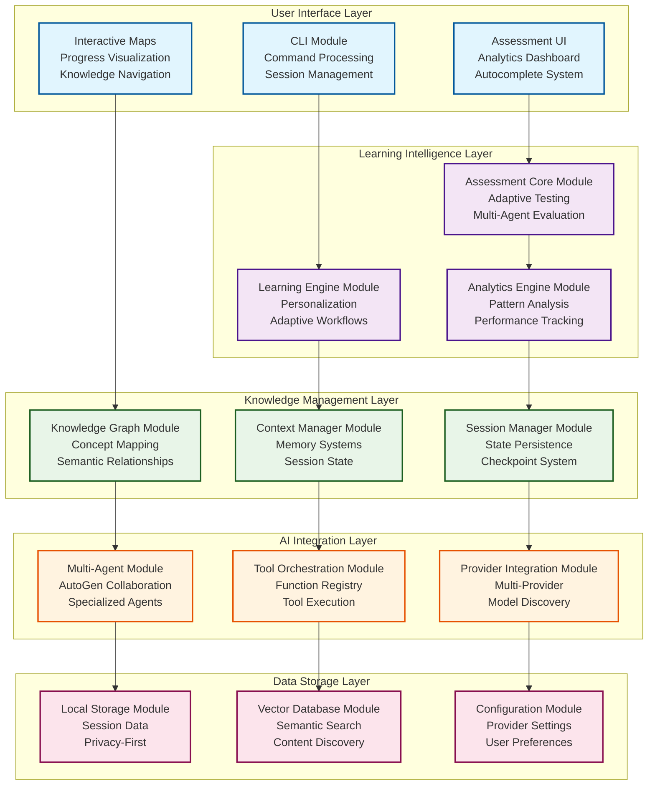
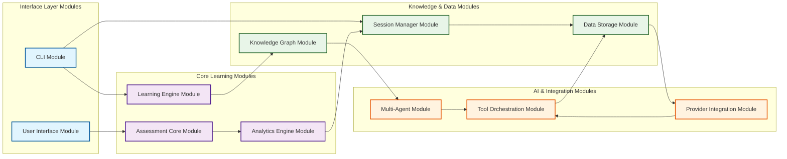

# System Architecture

---
title: Learning Catalyst System Architecture
description: Core architectural design, patterns, and component relationships
version: 1.0.0
last_updated: 2025-10-12
difficulty: "Advanced"
estimated_time: "30 minutes"
---

## Overview

Learning Catalyst is an AI-powered learning companion built with a modular, extensible architecture. The system is designed around a 5-layer architecture that emphasizes privacy-first design, adaptive intelligence, and multi-agent collaboration to create personalized learning experiences.

### Core Architectural Principles

- **Modular Architecture**: Clear component boundaries with well-defined interfaces and module-first design
- **Local-First Design**: User data remains primarily on local machines with privacy by design
- **Provider Abstraction**: Pluggable AI providers with seamless switching capabilities
- **Extensible System**: Plugin architecture supporting system evolution and feature additions
- **User-Centric Design**: Architecture prioritizes learning effectiveness and user experience

## Module Architecture Principles

### 🏗️ Module-First Architecture Philosophy

Learning Catalyst is built on a **module-first architecture** where each system component is a well-defined architectural module with clear boundaries, responsibilities, and interfaces. This approach ensures maintainability, extensibility, and clear understanding of system evolution.

### 📋 What-How-Relationship Framework

Every architectural module follows this documentation framework:

- **🎯 What It Is**: Clear module definition, purpose, scope, and role in the system
- **⚙️ How It Works**: Internal architecture, design patterns, and operational logic
- **🔗 Relationships**: Dependencies, integration points, communication patterns, and evolution paths

### 🎯 Module Design Principles

**Boundary Definition**: Clear interfaces and responsibilities with protected boundaries and hidden implementation details.

**Dependency Management**: Explicit dependencies with minimal footprint, dependency inversion, and forbidden circular dependencies.

**Interface-Driven Design**: Standardized interfaces with versioned contracts and semantic versioning for evolution.

**Evolution Support**: Independent module evolution with extension points and adapter patterns for legacy interfaces.

## System Architecture Overview

## Module Relationship Mapping

### 📊 Module Dependencies and Communication Patterns

### 🔄 Module Communication Protocols

**Synchronous Communication Patterns**
- **Direct Method Calls**: CLI Module → Learning Engine Module
- **Request-Response**: User Interface Module → Assessment Core Module
- **Data Queries**: Knowledge Graph Module → Data Storage Module

**Asynchronous Communication Patterns**
- **Event-Driven Updates**: Analytics Engine Module → Session Manager Module
- **Callback Patterns**: Multi-Agent Module → Tool Orchestration Module
- **Message Queues**: Provider Integration Module → Data Storage Module

**Data Flow Patterns**
- **Unidirectional Flow**: CLI Module → Learning Engine Module → Knowledge Graph Module
- **Bidirectional Exchange**: Session Manager Module ↔ Data Storage Module
- **Broadcast Patterns**: Multi-Agent Module → All Learning Modules

## Module Documentation

This system follows the **What-How-Relationship Framework**. Detailed documentation for each module is available in the individual module files.

### 🖥️ Interface Layer Modules

#### [CLI Architecture](cli-architecture.md)
**What It Is**: Command-line interface module for user interaction, command processing, and session management.

#### [Async Key Handling System](key_handling_system.md)
**What It Is**: Async key input system with keyboard library integration for responsive CLI interactions.

#### [Assessment UI Architecture](knowledge-management-system.md#assessment-components)
**What It Is**: User interface module for assessment delivery and analytics visualization.

### 🧠 Learning Intelligence Modules

#### [Learning Engine Architecture](knowledge-management-system.md#learning-engine-components)
**What It Is**: Core module for personalized learning orchestration and adaptive workflows.

#### [Assessment Core Architecture](knowledge-management-system.md#assessment-components)
**What It Is**: Module for adaptive testing capabilities and knowledge evaluation.

#### [Analytics Engine Architecture](knowledge-management-system.md#analytics-components)
**What It Is**: Module for pattern analysis and performance tracking.

### 🗄️ Knowledge & Data Modules

#### [Knowledge Management System Architecture](knowledge-management-system.md)
**What It Is**: Core module for semantic knowledge relationships and intelligent content discovery.

#### [Session Management Architecture](session-management.md)
**What It Is**: Module for session persistence, checkpointing, and state management.

#### [Data Layer Architecture](data-layer.md)
**What It Is**: Module for local-first data storage and management.

### 🤖 AI Integration Modules

#### [AI Integration Architecture](ai-integration.md)
**What It Is**: Module for multi-agent orchestration and intelligent user interactions.

#### [Provider Integration Architecture](provider-integration.md)
**What It Is**: Module for AI provider management and model integration.

## Module Quick Reference

| Module Category | Module | Primary Responsibility | Key Dependencies |
|----------------|--------|----------------------|------------------|
| **Interface Layer** | [CLI Module](cli-architecture.md) | User interaction & command processing | Session Manager, Key Handler |
| **Interface Layer** | [Async Key Handler](key_handling_system.md) | Async key input & keyboard library integration | CLI Module, Event Loop |
| **Learning Intelligence** | [Learning Engine](knowledge-management-system.md#learning-engine-components) | Personalized learning orchestration | Knowledge Graph, Analytics |
| **Learning Intelligence** | [Assessment Core](knowledge-management-system.md#assessment-components) | Adaptive testing & evaluation | Analytics, Learning Engine |
| **Knowledge & Data** | [Knowledge Graph](knowledge-management-system.md) | Semantic knowledge management | Data Layer, AI Integration |
| **Knowledge & Data** | [Session Manager](session-management.md) | Session persistence & state | Data Layer, CLI |
| **Knowledge & Data** | [Data Layer](data-layer.md) | Storage & data management | File system, Database |
| **AI Integration** | [Multi-Agent System](ai-integration.md) | AI orchestration & collaboration | Provider Integration |
| **AI Integration** | [Provider Integration](provider-integration.md) | AI provider management | External APIs, Configuration |

## Module Development Guidelines

**Documentation Standards**: Each module follows the **What-How-Relationship Framework** with clear module definition, internal architecture, and relationship documentation.

**Creating New Modules**: Define clear boundaries, document dependencies, follow interface standards, implement evolution points, and provide comprehensive documentation.

**Modifying Existing Modules**: Maintain interface compatibility, update documentation, consider impact on dependent modules, test integration, and follow semantic versioning.

---

*Last updated: October 12, 2025*
*Version: 1.0.0*
*Category: System Architecture*
*Focus: Module Architecture Index & Development Guidelines*