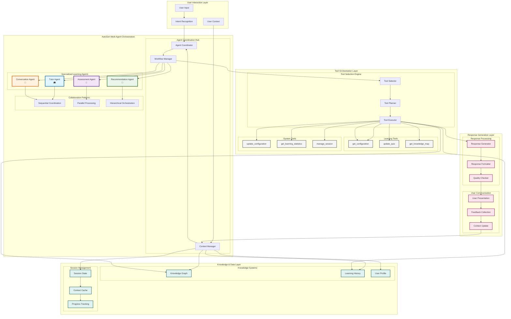

# AI Integration Architecture

---
title: Learning Catalyst AI Communication Architecture
description: AI user communication, AutoGen multi-agent orchestration, and intelligent conversation management
version: 1.0.0
last_updated: 2025-10-10
---

## Overview

Learning Catalyst's AI communication architecture enables intelligent user interactions through **Microsoft AutoGen** multi-agent orchestration, delivering adaptive learning experiences via specialized collaborative agents. The system focuses on natural AI-user communication with context-aware responses.

**Note**: AI provider and model should be configured before use to ensure optimal communication quality.

## Core Architectural Principles

### 1. **User Communication Focus**
- Natural language conversation design for learning interactions
- Context-aware response generation based on user needs
- Adaptive communication styles for different learning scenarios

### 2. **AutoGen Multi-Agent Orchestration**
- Specialized agents for tutoring, assessment, and recommendation
- Collaborative intelligence and adaptive coordination
- Dynamic agent assignment based on learning context

### 3. **Context-Driven Architecture**
- Sophisticated context construction and session continuity
- Integration with learning progress and knowledge graphs
- Optimized context management for AI responses

### 4. **Intelligent Response Design**
- AI-driven response generation based on user intent and learning goals
- Multi-agent collaboration for comprehensive answer formation
- Integrated response generation with error resilience

### 5. **Communication Optimization**
- Response caching and parallel processing for faster interactions
- Resource management for minimal latency in conversations
- Efficient flow patterns for natural user experience

## AI Communication Data Flow Architecture

### Core Communication Flow

The AI communication architecture flows through five main layers: User Input → Agent Coordination → Tool Orchestration → Response Generation → User Display.

## AutoGen Multi-Agent Orchestration

### Agent Coordination & Workflow Management

AutoGen provides intelligent multi-agent coordination through:
- **Collaborative Tool Selection**: Agents collaborate on tool selection decisions with context-aware orchestration
- **Dynamic Workflow Planning**: Real-time workflow adaptation with structured inter-agent communication
- **Consensus-Based Decision Making**: Agents reach consensus through collaborative planning and execution

### Comprehensive Agent Workflow Diagram

### Workflow Explanation

#### 1. **User Interaction Initiation**
- User provides input through CLI interface
- Intent Recognition analyzes the request type and learning needs
- User Context is gathered from session history and profile

#### 2. **Agent Coordination**
- Agent Coordinator determines which specialized agents are needed
- Workflow Manager orchestrates the collaboration pattern (sequential, parallel, or hierarchical)
- Context Manager maintains conversation state and learning context

#### 3. **Specialized Agent Roles**
- **Tutor Agent**: Provides explanations, breaks down concepts, adapts teaching style
- **Assessment Agent**: Creates challenges, evaluates answers, tracks progress
- **Recommendation Agent**: Suggests next learning steps, personalizes content
- **Conversation Agent**: Manages dialogue flow, handles general conversation

#### 4. **Tool Orchestration**
- Tool Selector determines appropriate tools based on agent requirements
- Tool Planner sequences tool execution for optimal workflow
- Tool Executor coordinates parallel or sequential tool execution

#### 5. **Knowledge Integration**
- Agents access Knowledge Graph for concept relationships
- Learning History informs personalization decisions
- User Profile guides response adaptation

#### 6. **Response Generation**
- Response Generator synthesizes agent outputs and tool results
- Response Formatter ensures consistent, user-friendly presentation
- Quality Checker validates response accuracy and helpfulness

#### 7. **Feedback Loop**
- User feedback is collected and analyzed
- Context is updated based on interaction outcomes
- Learning progress is tracked and stored

### Agent Roles & Collaboration Patterns

**Specialized Agents**:
- **Tutor Agent**: Adaptive explanations and multi-modal teaching
- **Assessment Agent**: Formative/summative evaluation with diagnostic feedback
- **Recommendation Agent**: Personalized learning path optimization
- **Conversation Agent**: Dialogue flow management and general conversation

**Collaboration Patterns**:
- **Sequential**: Step-by-step coordination with context preservation
- **Parallel**: Concurrent processing with distributed problem-solving
- **Hierarchical**: Lead agents orchestrating specialized sub-agents

### Conversation Management

Coordinated dialogue patterns with turn management, topic coherence, and periodic summarization across agent interactions.

## Tool Integration & Communication Patterns

### Tool Selection & Execution

**AI-Driven Workflow**: User input → Intent analysis → Tool selection → Parallel execution → Response integration

### System Tools Used by AI Agents

| System Tool | Category | What System Provides | AI Agents That Use It | How AI Uses It | System Data Accessed |
|-------------|----------|----------------------|----------------------|----------------|---------------------|
| **get_concept** | 🎓 Learning | System tool that retrieves concept information | All Agents | AI searches and retrieves concept data, then generates explanations | Knowledge Graph, Concept Database |
| **update_quiz** | 📝 Assessment | System tool for managing and updating quiz data | Assessment Agent | AI updates quiz questions and manages assessment state | Learning History, Quiz Database |
| **get_knowledge_map** | 🗺️ Learning | System tool for accessing concept relationships | All Agents | AI uses tool to understand how concepts connect and depend on each other | Knowledge Graph, Concept Database |
| **get_configuration** | ⚙️ System | System tool for retrieving user configuration | All Agents | AI calls tool to access user preferences and system settings | User Profile, Session Management |
| **update_configuration** | ⚙️ System | System tool for updating user preferences | All Agents | AI uses tool to update user settings when requested | User Profile, Configuration Store |
| **manage_ai_provider** | 🤖 System | System tool for AI provider management | All Agents | AI calls tool to configure AI services and models | AI Service, Configuration Store |
| **get_learning_statistics** | 📊 Analytics | System tool for accessing learning analytics | Assessment Agent | AI uses tool to retrieve user progress and performance data | Learning History, Progress Database |
| **assess_knowledge** | 📊 Analytics | System tool for evaluating user knowledge | Assessment Agent | AI calls tool to assess user skill levels and knowledge gaps | Learning History, Knowledge Graph |
| **manage_session** | 🔄 Session | System tool for session management | All Agents | AI uses tool to maintain conversation context and user session | Session Store, Context Cache |
| **get_help_information** | ❓ Support | System tool for providing help and guidance | Conversation Agent | AI calls tool to get system help when user requests assistance | Help Database, Documentation System |

### AI Agent Usage Patterns

**How AI Agents Combine System Tools**:
- **Learning Feature**: AI Agent uses `get_concept` tool → AI generates explanation → AI Agent delivers complete learning experience
- **Assessment Feature**: AI Agent uses `get_learning_statistics` tool → AI Agent uses `update_quiz` tool → AI Agent provides adaptive assessment
- **Configuration Feature**: AI Agent uses `get_configuration` tool → AI Agent uses `update_configuration` tool → AI Agent manages user preferences
- **Knowledge Discovery**: AI Agent uses `get_knowledge_map` tool → AI Agent uses `get_concept` tool → AI Agent provides contextual learning

**AI Agent Tool Access Patterns**:
- **Tutor Agent**: Uses `get_concept`, `get_knowledge_map`, `get_configuration` system tools to deliver explanations
- **Assessment Agent**: Uses `update_quiz`, `get_learning_statistics`, `assess_knowledge` system tools to create evaluations
- **Recommendation Agent**: Uses `get_knowledge_map`, `get_learning_statistics`, `get_configuration` system tools to provide guidance
- **Conversation Agent**: Uses `manage_session`, `get_help_information`, `get_configuration` system tools to maintain dialogue

### Communication Patterns

**User-AI Pipeline**: User input → Intent analysis → Context building → Response planning → Communication processing → Response generation → Content formatting → Context-aware presentation → User display → Feedback integration

**Multi-Agent Orchestration**: Intent analysis → Agent-based planning → Consensus sequencing → Resource coordination → Result integration

**Common Workflows**:
- **Learning**: Context analysis → get_concept → AI generates explanation → Response
- **Assessment**: Progress assessment → update_quiz → get_knowledge_map → Response
- **Configuration**: get_configuration → Context update → Tool execution → Response integration

## Session Context & Workflow Management

### Context Integration

**Session Lifecycle**: Session start → Context initialization → Interaction processing → Context evolution → Session persistence

**Multi-Source Integration**: Learning history + Session data + Tool results + System state

### Tool Selection & Execution Patterns

**AI Agent Intent-Based Tool Selection**:
- **Explanation Request**: User asks "explain X" → AI Agent selects `get_concept` tool → AI generates explanation | User shows confusion → AI Agent uses `get_concept` + `get_knowledge_map` tools
- **Assessment Request**: User asks "test me" → AI Agent selects `update_quiz` tool | User requests progress check → AI Agent uses `get_learning_statistics` + `update_quiz` tools
- **Recommendation Request**: User asks "what next" → AI Agent uses `get_knowledge_map` + `get_learning_statistics` tools → AI generates suggestions | User completes topic → AI Agent uses `get_configuration` tools to update progress

**Execution Patterns**:
- **Parallel**: Multiple tools execute concurrently with result synthesis
- **Sequential**: Dependent tools execute in context-aware sequence

**Response Integration**: Multi-tool result synthesis with personalized responses and collaborative error handling.

## Security Framework

### Multi-Layer Security

**Input Security**: Type validation, content sanitization, size limits, pattern validation

**Execution Security**: Agent sandboxing, resource limits, permission enforcement, role-based access

**Output Security**: Data filtering, privacy protection, output validation, secure transmission

**Agent Security**: Agent authentication, encrypted inter-agent communication, adaptive security policies

## Error Handling & Resilience

### Multi-Agent Error Management

**Collaborative Resolution**: Error classification agents + Recovery strategies + Consensus-based error handling

**Circuit Breaker**: Automatic failure detection + Circuit activation + Agent-based recovery + Collaborative fallback

**Graceful Degradation**: Gradual functionality reduction + Alternative workflows + Clear user communication + Collaborative recovery

## Knowledge & Learning State Management

**Knowledge Graph**: Structured content representation with concept relationships, semantic consistency, dynamic updates, and version control

**Learning State**: Progress tracking, mastery assessment, retention monitoring, adaptation history, and performance analytics

## Related Documentation

### System Architecture
- **[System Architecture Overview](README.md)**: Complete 5-layer system design
- **[CLI Architecture](cli-architecture.md)**: Command-line interface patterns
- **[Data Layer Architecture](data-layer.md)**: Data storage and management
- **[Knowledge Management System](knowledge-management-system.md)**: Knowledge graph systems

### API Reference
- **[AI Toolcalls API](../api-reference/toolcalls-api.md)**: Tool calling API with AutoGen integration
- **[CLI Commands API](../api-reference/cli-commands.md)**: Command-line specifications
- **[Configuration API](../api-reference/configuration-api.md)**: Configuration management

### Implementation
- **[Implementation Guides](../implementation-guides/)**: Setup and patterns

---

*Last updated: October 10, 2025 | Version: 1.0.0 | Category: System Architecture*