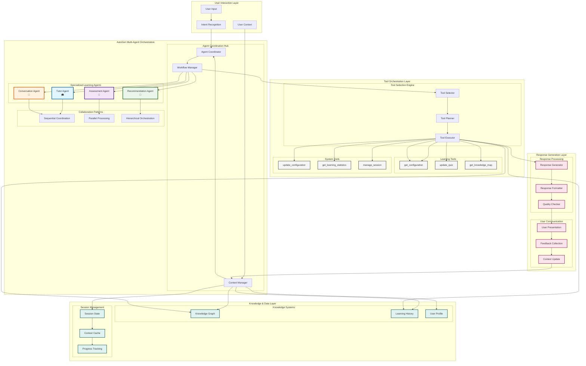

# AI Integration Architecture

---
title: Learning Catalyst AI Communication Architecture
description: AI user communication, AutoGen multi-agent orchestration, and intelligent conversation management
version: 1.0.0
last_updated: 2025-10-10
---

## Overview

Learning Catalyst's AI communication architecture enables intelligent user interactions through **Microsoft AutoGen** multi-agent orchestration, delivering adaptive learning experiences via specialized collaborative agents. The system focuses on natural AI-user communication with context-aware responses.

**Note**: AI provider and model should be configured before use to ensure optimal communication quality.

**For complete API specifications and technical details of AI system integration, see the [AI Toolcalls API Reference](../api-reference/toolcalls-api.md) document.**

## Core Architectural Principles

### 1. **User Communication Focus**
- Natural language conversation design for learning interactions
- Context-aware response generation based on user needs
- Adaptive communication styles for different learning scenarios

### 2. **AutoGen Multi-Agent Orchestration**
- Specialized agents for tutoring, assessment, and recommendation
- Collaborative intelligence and adaptive coordination
- Dynamic agent assignment based on learning context

### 3. **Context-Driven Architecture**
- Sophisticated context construction and session continuity
- Integration with learning progress and knowledge graphs
- Optimized context management for AI responses

### 4. **Intelligent Response Design**
- AI-driven response generation based on user intent and learning goals
- Multi-agent collaboration for comprehensive answer formation
- Integrated response generation with error resilience

### 5. **Communication Optimization**
- Response caching and parallel processing for faster interactions
- Resource management for minimal latency in conversations
- Efficient flow patterns for natural user experience

## AI Communication Data Flow Architecture

### Core Communication Flow

The AI communication architecture flows through five main layers: User Input → Agent Coordination → Tool Orchestration → Response Generation → User Display.

## AutoGen Multi-Agent Orchestration

### Agent Coordination & Workflow Management

AutoGen provides intelligent multi-agent coordination through:
- **Collaborative Tool Selection**: Agents collaborate on tool selection decisions with context-aware orchestration
- **Dynamic Workflow Planning**: Real-time workflow adaptation with structured inter-agent communication
- **Consensus-Based Decision Making**: Agents reach consensus through collaborative planning and execution

### Comprehensive Agent Workflow Diagram

### Workflow Explanation

#### 1. **User Interaction Initiation**
- User provides input through CLI interface
- Intent Recognition analyzes the request type and learning needs
- User Context is gathered from session history and profile

#### 2. **Agent Coordination**
- Agent Coordinator determines which specialized agents are needed
- Workflow Manager orchestrates the collaboration pattern (sequential, parallel, or hierarchical)
- Context Manager maintains conversation state and learning context

#### 3. **Specialized Agent Roles**
- **Tutor Agent**: Provides explanations, breaks down concepts, adapts teaching style
- **Assessment Agent**: Creates challenges, evaluates answers, tracks progress
- **Recommendation Agent**: Suggests next learning steps, personalizes content
- **Conversation Agent**: Manages dialogue flow, handles general conversation

#### 4. **Tool Orchestration**
- Tool Selector determines appropriate tools based on agent requirements
- Tool Planner sequences tool execution for optimal workflow
- Tool Executor coordinates parallel or sequential tool execution

#### 5. **Knowledge Integration**
- Agents access Knowledge Graph for concept relationships
- Learning History informs personalization decisions
- User Profile guides response adaptation

#### 6. **Response Generation**
- Response Generator synthesizes agent outputs and tool results
- Response Formatter ensures consistent, user-friendly presentation
- Quality Checker validates response accuracy and helpfulness

#### 7. **Feedback Loop**
- User feedback is collected and analyzed
- Context is updated based on interaction outcomes
- Learning progress is tracked and stored

### Agent Roles & Collaboration Patterns

**Specialized Agents**:
- **Tutor Agent**: Adaptive explanations and multi-modal teaching
- **Assessment Agent**: Formative/summative evaluation with diagnostic feedback
- **Recommendation Agent**: Personalized learning path optimization
- **Conversation Agent**: Dialogue flow management and general conversation

**Collaboration Patterns**:
- **Sequential**: Step-by-step coordination with context preservation
- **Parallel**: Concurrent processing with distributed problem-solving
- **Hierarchical**: Lead agents orchestrating specialized sub-agents

### Conversation Management

Coordinated dialogue patterns with turn management, topic coherence, and periodic summarization across agent interactions.

## AI System Integration Patterns

### AutoGen Integration Architecture

The AI integration leverages **Microsoft AutoGen** as the foundational multi-agent orchestration framework, enabling sophisticated collaborative learning experiences through specialized agent coordination and intelligent workflow management.

**Core Integration Components**:
- **Agent Creation & Configuration**: Dynamic agent instantiation with role-specific capabilities
- **Conversation Management**: Multi-agent dialogue orchestration with context preservation
- **Workflow Coordination**: Complex learning sequence management across agent interactions
- **Tool Access Integration**: Seamless agent access to system tools through standardized interfaces

### AI System Architecture Patterns

#### Multi-Agent Learning Patterns

**Collaborative Problem Solving**:
- **Expert Consultation**: Specialized agents contribute domain-specific knowledge
- **Peer Review**: Multiple agents validate and refine responses
- **Hierarchical Orchestration**: Lead agents coordinate specialized sub-agent interactions
- **Consensus Building**: Agents collaborate to reach optimal solutions

**Adaptive Learning Workflows**:
- **Dynamic Agent Selection**: Context-aware agent assignment based on learning needs
- **Responsive Strategy Adjustment**: Real-time workflow adaptation based on user interactions
- **Progressive Complexity**: Gradual difficulty adjustment through agent collaboration
- **Personalized Path Optimization**: Learning route adaptation based on performance metrics

#### Context Management Architecture

**Session Context Integration**:
- **Multi-Source Context Fusion**: Learning history + Session state + Tool results + System configuration
- **Dynamic Context Evolution**: Real-time context updates based on interaction outcomes
- **Cross-Agent Context Sharing**: Seamless information flow between collaborating agents
- **Persistent Session Management**: Long-term context preservation across learning sessions

**Knowledge Graph Integration**:
- **Concept Relationship Mapping**: Dynamic knowledge graph navigation for contextual learning
- **Prerequisite Chain Analysis**: Intelligent dependency tracking for concept mastery
- **Learning Path Optimization**: Graph-based route planning for efficient skill acquisition
- **Knowledge Gap Identification**: Automated weakness detection and remediation planning

## Session Context & Workflow Management

### Context Integration

**Session Lifecycle**: Session start → Context initialization → Interaction processing → Context evolution → Session persistence

**Multi-Source Integration**: Learning history + Session data + Tool results + System state

### AI Workflow Orchestration

**Learning Workflow Architecture**:
- **Intent Analysis**: AI agents analyze user requests to determine learning objectives and required resources
- **Resource Coordination**: Dynamic allocation of agents, tools, and knowledge resources based on learning context
- **Adaptive Execution**: Real-time workflow adjustment based on user feedback and learning progress
- **Result Synthesis**: Intelligent combination of multi-agent outputs and tool results into coherent learning experiences

**Multi-Agent Coordination Patterns**:
- **Sequential Processing**: Step-by-step agent collaboration with context preservation
- **Parallel Problem Solving**: Concurrent agent work on different aspects of complex learning tasks
- **Hierarchical Orchestration**: Lead agent coordination of specialized sub-agent interactions
- **Consensus-Based Decision Making**: Collaborative agent reasoning for optimal learning strategies

**Intelligent Response Generation**:
- **Context-Aware Synthesis**: Response generation based on user profile, learning history, and current session state
- **Multi-Modal Output Integration**: Combination of explanations, examples, assessments, and recommendations
- **Adaptive Complexity Adjustment**: Dynamic response complexity based on user comprehension and feedback
- **Personalized Learning Paths**: Individualized content sequencing based on mastery and goals

## Security Framework

### Multi-Layer Security

**Input Security**: Type validation, content sanitization, size limits, pattern validation

**Execution Security**: Agent sandboxing, resource limits, permission enforcement, role-based access

**Output Security**: Data filtering, privacy protection, output validation, secure transmission

**Agent Security**: Agent authentication, encrypted inter-agent communication, adaptive security policies

## Error Handling & Resilience

### Multi-Agent Error Management

**Collaborative Resolution**: Error classification agents + Recovery strategies + Consensus-based error handling

**Circuit Breaker**: Automatic failure detection + Circuit activation + Agent-based recovery + Collaborative fallback

**Graceful Degradation**: Gradual functionality reduction + Alternative workflows + Clear user communication + Collaborative recovery

## Knowledge & Learning State Management

**Knowledge Graph**: Structured content representation with concept relationships, semantic consistency, dynamic updates, and version control

**Learning State**: Progress tracking, mastery assessment, retention monitoring, adaptation history, and performance analytics

## AI System Performance & Scalability

### Performance Optimization Architecture

**Multi-Agent Efficiency Patterns**:
- **Intelligent Agent Caching**: Context caching for frequently used agent configurations and conversation patterns
- **Parallel Agent Execution**: Concurrent agent processing for independent learning tasks
- **Resource Pool Management**: Dynamic allocation of computational resources based on agent workload
- **Load-Balanced Agent Distribution**: Intelligent distribution of agent requests across available resources

**Context Optimization Strategies**:
- **Smart Context Pruning**: Intelligent context reduction to maintain relevant information while optimizing performance
- **Incremental Context Updates**: Efficient context modification through differential updates
- **Context Compression**: Advanced compression techniques for large conversation histories
- **Predictive Context Loading**: Pre-loading likely-needed context based on learning patterns

### Scalability Architecture

**Horizontal Scaling Patterns**:
- **Agent Cluster Management**: Distributed agent deployment across multiple service instances
- **Stateless Agent Design**: Agents designed for horizontal scalability with external state management
- **Dynamic Resource Allocation**: Automatic scaling of agent resources based on demand patterns
- **Fault-Tolerant Agent Coordination**: Resilient agent communication with automatic failover mechanisms

**Vertical Scaling Optimization**:
- **Resource-Intensive Agent Management**: Specialized handling for computationally expensive agent operations
- **Memory-Optimized Context Storage**: Efficient memory usage for large-scale context management
- **CPU-Bound Task Distribution**: Intelligent distribution of processor-intensive tasks across available cores

## AI Learning Intelligence Framework

### Adaptive Learning Architecture

**Personalization Engine**:
- **Learning Style Detection**: AI-powered identification of individual learning preferences and optimal content delivery methods
- **Competency-Based Progression**: Dynamic adjustment of learning pace based on demonstrated mastery and retention
- **Interest-Driven Content Curation**: Intelligent selection of learning materials based on user interests and goals
- **Cognitive Load Management**: Automatic adjustment of content complexity to optimize learning efficiency

**Intelligent Assessment Systems**:
- **Dynamic Difficulty Adjustment**: Real-time modification of assessment complexity based on performance
- **Multi-Dimensional Skill Evaluation**: Comprehensive assessment across knowledge retention, application, and synthesis
- **Predictive Gap Analysis**: AI-powered identification of potential learning obstacles and knowledge gaps
- **Adaptive Testing Strategies**: Personalized assessment approaches based on individual learning patterns

### Knowledge Intelligence Architecture

**Concept Relationship Intelligence**:
- **Semantic Concept Mapping**: AI-driven understanding of conceptual relationships and dependencies
- **Learning Path Optimization**: Intelligent sequencing of concepts for optimal knowledge acquisition
- **Cross-Domain Knowledge Integration**: Connection of related concepts across different subject areas
- **Knowledge Retention Prediction**: AI-based forecasting of knowledge decay and optimal review timing

**Learning Analytics Intelligence**:
- **Pattern Recognition**: Identification of learning patterns, bottlenecks, and optimization opportunities
- **Predictive Learning Modeling**: AI-powered forecasting of learning outcomes and time requirements
- **Engagement Optimization**: Intelligent strategies for maintaining learner motivation and participation
- **Performance Trend Analysis**: Long-term learning progress tracking and trend identification

## Related Documentation

### System Architecture
- **[System Architecture Overview](README.md)**: Complete 5-layer system design
- **[CLI Architecture](cli-architecture.md)**: Command-line interface patterns
- **[Data Layer Architecture](data-layer.md)**: Data storage and management
- **[Knowledge Management System](knowledge-management-system.md)**: Knowledge graph systems

### API Reference
- **[AI Toolcalls API](../api-reference/toolcalls-api.md)**: Complete API specifications and AI integration patterns
- **[CLI Commands API](../api-reference/cli-commands.md)**: Command-line specifications
- **[Configuration API](../api-reference/configuration-api.md)**: Configuration management

### Implementation
- **[Implementation Guides](../implementation-guides/)**: Setup and patterns
- **[AutoGen Integration Guide](../implementation-guides/autogen-integration.md)**: Multi-agent system setup and configuration

## 🔗 Relationships

### Dependencies & Integration Points

**Upstream Dependencies**:
- **Provider Integration Module**: Access to AI models and inference capabilities for all agents
- **Knowledge Management System**: Concept relationships and learning context for agent decision-making
- **Session Management Module**: Session context and conversation history for continuity
- **Configuration Module**: AI system settings, agent configurations, and workflow parameters

**Downstream Dependencies**:
- **CLI Module**: User interface for AI interactions and agent coordination
- **Learning Engine Module**: Learning orchestration and adaptive workflow management
- **Assessment Core Module**: Assessment creation and evaluation through AI agents
- **Data Storage Module**: Agent interaction logs, performance metrics, and analytics data

**Peer Dependencies**:
- **Analytics Engine Module**: Learning pattern analysis and performance tracking
- **Context Manager Module**: Context preservation and session state management

### Communication Patterns

**Synchronous Communication**:
- **Agent Coordination**: AutoGen Framework ↔ Specialized Agents for real-time collaboration
- **Tool Execution**: Agent Orchestration → Tool Registry for immediate tool invocation
- **User Interaction**: CLI Module → AI Integration for real-time response generation

**Asynchronous Communication**:
- **Background Processing**: Multi-Agent System → Tool Registry for batch processing
- **Context Updates**: AI Integration → Session Management for continuous context evolution
- **Performance Analytics**: AI Integration → Data Storage for agent performance tracking

**Data Flow Patterns**:
- **Request Processing**: CLI → Intent Recognition → Agent Coordination → Tool Orchestration → Response Generation
- **Context Flow**: Session Management → Context Manager → Multi-Agent System → Knowledge Graph
- **Learning Flow**: Analytics Engine → Learning Engine → AI Integration → Agent Adaptation

### Evolution & Extension Points

**Agent Evolution**:
- **New Agent Types**: Specialized agents for specific learning domains (mathematics, programming, languages)
- **Agent Capabilities**: Enhanced reasoning, multi-modal understanding, and emotional intelligence
- **Agent Collaboration**: Advanced coordination patterns and consensus-building mechanisms

**Workflow Evolution**:
- **Complex Workflows**: Multi-step learning sequences with conditional branching and adaptive progression
- **Cross-Domain Integration**: Agents collaborating across different knowledge domains
- **Personalized Workflows**: AI-driven workflow adaptation based on learning styles and performance

**Integration Evolution**:
- **External Tool Integration**: Connection to external learning platforms and educational resources
- **Multi-Modal AI**: Integration of vision, audio, and text processing capabilities
- **Real-Time Collaboration**: Multi-user AI sessions and collaborative learning environments

---

*Last updated: October 12, 2025 | Version: 1.0.0 | Category: System Architecture*