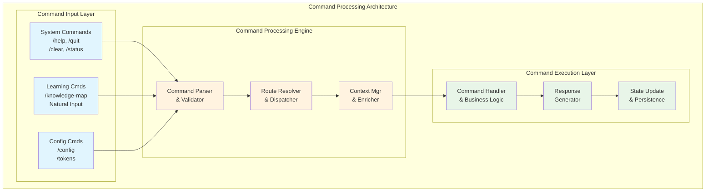
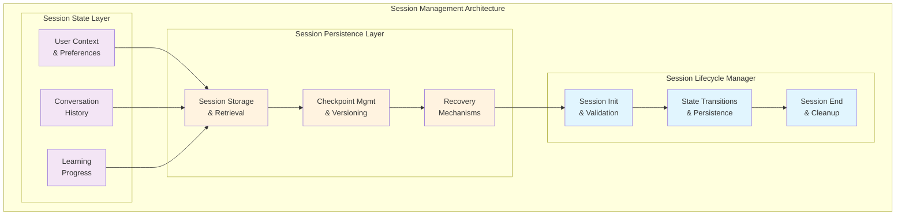
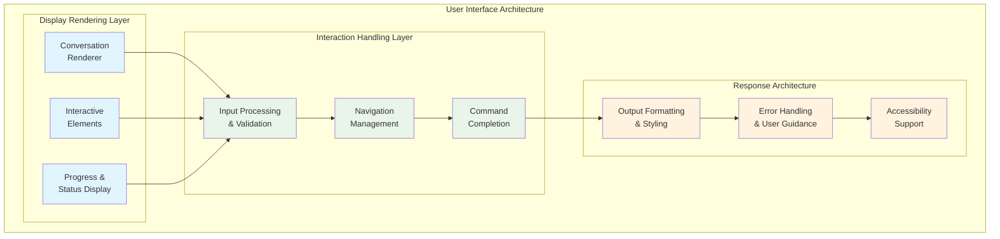
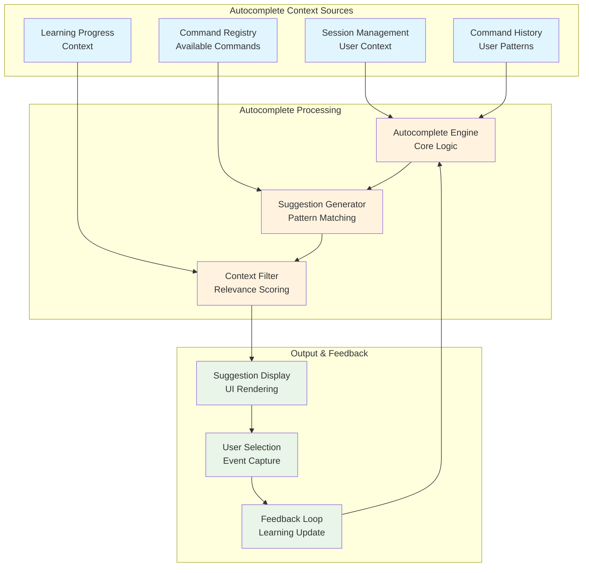

# CLI Architecture

---
title: Learning Catalyst CLI Architecture
description: Command-line interface architectural design, command processing patterns, and user interaction architecture
version: 1.0.0
last_updated: 2025-10-10
difficulty: "Advanced"
estimated_time: "45 minutes"
---

## Overview

This document covers the architectural design of Learning Catalyst's command-line interface, focusing on command processing, user interaction patterns, session management, and integration with the underlying AI system. The CLI provides a responsive, intuitive, and extensible command-line experience.

## CLI Principles

### Core Foundations

**Command-Centric Design**: Pattern-based commands with hierarchical structure, context-aware processing, and extensible system for new command types.

**Session Management**: Persistent session state with context preservation, state synchronization, and robust recovery mechanisms.

**User Interaction**: Responsive interface with immediate feedback, intelligent command completion, comprehensive error handling, and accessible design.

**Integration Architecture**: Seamless AI integration with efficient data flow, event-driven communication, and modular integration points.

## Command Processing

### Command Palette Input System

The CLI implements a sophisticated command palette with intelligent command discovery, autocomplete, and interactive navigation.

#### Command Palette Design

### Command Processing Pipeline

#### **Input Processing**
**Pattern Recognition**: Commands are classified into patterns:
- **System Commands**: CLI management and system operations
- **Learning Commands**: Educational and knowledge-related operations
- **Configuration Commands**: System configuration and management
- **Natural Input**: Conversational AI interactions

#### **Command Resolution**
**Hierarchical Processing**: Commands processed through layers:
1. **Syntax Validation**: Command structure and parameter validation
2. **Semantic Analysis**: Command intent and context interpretation
3. **Route Resolution**: Mapping commands to appropriate handlers
4. **Context Enrichment**: Session and user context integration

#### **Execution Patterns**
**Command Implementation**: Each command type follows specific patterns:
- **Immutable Commands**: Read-only operations with no state changes
- **Mutable Commands**: Operations that modify system state
- **Interactive Commands**: Multi-step user interaction workflows
- **Batch Commands**: Operations on multiple items or contexts

## Session Management

### Session State Design

The CLI implements sophisticated session management with persistent state across command executions.

#### Session Architecture

### Session State Components

#### **Context Management**
**User Context Layer**: Maintains comprehensive user session context:
- **Identity Context**: User identification and authentication state
- **Learning Context**: Current learning topics, progress, and preferences
- **Interaction Context**: Recent commands, conversation history, and patterns
- **System Context**: Current configuration, active providers, and system state

#### **State Persistence**
**Checkpoint System**: Robust state persistence mechanisms:
- **Automatic Checkpoints**: Periodic state saving during interactions
- **Manual Checkpoints**: User-initiated state preservation
- **Incremental Updates**: Efficient state change tracking and storage
- **Recovery Mechanisms**: State restoration after interruptions

#### **Session Lifecycle**
**Lifecycle Management**: Comprehensive session lifecycle control:
1. **Session Initialization**: Context establishment and validation
2. **Active Session Management**: State maintenance and updates
3. **Session Persistence**: Checkpoint creation and state storage
4. **Session Restoration**: Recovery and state reconstruction
5. **Session Termination**: Cleanup and resource deallocation

### Command-to-Session Integration

#### **Context-Aware Command Processing**
**Session Integration**: Commands leverage session context for intelligent processing:
- **Personalized Responses**: Commands adapt based on user learning history
- **Context Preservation**: Command execution maintains conversation context
- **State Synchronization**: Commands update session state appropriately
- **Progress Tracking**: Session state tracks learning progress across commands

#### **Session State in Command Workflows**
**Command Workflows**: Session state enables sophisticated workflows:
- **Multi-Command Operations**: Session state maintains context across command sequences
- **Interactive Workflows**: Session state supports multi-step user interactions
- **Learning Continuity**: Session state preserves learning context between sessions
- **Progressive Disclosure**: Session state enables contextually relevant command suggestions

## User Interface

### Interactive Display System

The CLI implements a comprehensive user interface with responsive, intuitive, and accessible interactions.

#### UI Components

### Interactive Elements

#### **Knowledge Map Interface**
**Interactive Navigation**: Sophisticated navigation for knowledge exploration:
- **Hierarchical Navigation**: Multi-level knowledge structure browsing
- **Contextual Interactions**: Commands adapt based on selected knowledge elements
- **Visual Feedback**: Real-time status updates and progress indication
- **Keyboard Navigation**: Efficient keyboard-based interaction patterns

#### **Command Completion**
**Intelligent Suggestions**: Context-aware command completion and suggestion system:
- **Pattern Recognition**: Identifies likely command completions based on context
- **Historical Suggestions**: Learns from user command patterns and preferences
- **Contextual Help**: Provides relevant help information during command input
- **Error Prevention**: Suggests corrections for common command mistakes

### Autocomplete Architecture

The CLI implements a sophisticated autocomplete system with real-time, context-aware command suggestions. This architecture integrates with the command processing pipeline, session management, and user context for intelligent, responsive autocomplete functionality.

#### Autocomplete Workflow Architecture

```mermaid
graph TB
    subgraph "Autocomplete Processing Pipeline"
        subgraph "Input Trigger Layer"
            UI[User Input<br/>Capture]
            TT[Typing Trigger<br/>Detection]
            CC[Command Context<br/>Analysis]
        end

        subgraph "Suggestion Generation Engine"
            CP[Command Pattern<br/>Matching]
            HC[Historical Context<br/>Analysis]
            SC[Session State<br/>Integration]
            FT[Fuzzy Search<br/>Algorithm]
        end

        subgraph "Filtering & Ranking Layer"
            CF[Context Filtering<br/>& Validation]
            RF[Relevance Ranking<br/>Algorithm]
            WF[Weighted Scoring<br/>System]
        end

        subgraph "Display & Interaction"
            SR[Suggestion Rendering<br/>& Display]
            SE[Selection Event<br/>Handling]
            AC[Auto-completion<br/>Execution]
        end
    end

    UI --> TT
    TT --> CC
    CC --> CP
    CP --> HC
    HC --> SC
    SC --> FT
    FT --> CF
    CF --> RF
    RF --> WF
    WF --> SR
    SR --> SE
    SE --> AC

    style UI fill:#e1f5fe
    style TT fill:#e1f5fe
    style CC fill:#e1f5fe
    style CP fill:#fff3e0
    style HC fill:#fff3e0
    style SC fill:#fff3e0
    style FT fill:#fff3e0
    style CF fill:#e8f5e8
    style RF fill:#e8f5e8
    style WF fill:#e8f5e8
    style SR fill:#f3e5f5
    style SE fill:#f3e5f5
    style AC fill:#f3e5f5
```

#### Autocomplete Integration Architecture

#### **Autocomplete Processing Pipeline**

**Input Analysis**: The autocomplete system continuously monitors user input and triggers suggestion generation based on typing patterns:
- **Trigger Detection**: Activates on specific keystrokes (Tab, partial commands)
- **Context Parsing**: Analyzes current command context and cursor position
- **Intent Recognition**: Identifies whether user is entering commands, arguments, or options

**Suggestion Generation**: Multi-layered suggestion generation based on various context sources:
- **Command Registry Matching**: Direct matching against available commands and subcommands
- **Pattern-Based Completion**: Uses regex and pattern matching for command structures
- **Historical Context**: Leverages user's command history and usage patterns
- **Session Context**: Integrates current learning progress and active topics

**Filtering & Ranking**: Intelligent filtering and ranking of suggestions:
- **Relevance Scoring**: Ranks suggestions based on context match, frequency, and recency
- **Context Filtering**: Removes irrelevant suggestions based on current state
- **Learning Adaptation**: Adapts ranking based on user selection patterns over time

#### **Autocomplete Context Integration**

**Session-Aware Suggestions**: Autocomplete adapts based on current session state:
- **Learning Context**: Suggests commands relevant to current learning topics
- **Progress-Based Suggestions**: Recommends next logical commands based on learning progress
- **Preference Adaptation**: Adjusts suggestions based on user's demonstrated preferences

**Command Pattern Integration**: Autocomplete understands command structure and semantics:
- **Hierarchical Completion**: Provides contextually appropriate subcommands and arguments
- **Parameter Validation**: Suggests only valid parameters and options for current command
- **Syntax Awareness**: Maintains awareness of command syntax and argument requirements

**Real-Time Performance**: Optimized for responsive user experience:
- **Incremental Processing**: Processes suggestions incrementally as user types
- **Caching Strategy**: Caches frequently used suggestions for instant display
- **Async Processing**: Handles complex suggestion generation asynchronously to maintain responsiveness

#### **Progress Visualization**
**Visual Progress Systems**: Comprehensive progress indication:
- **Learning Progress**: Visual representation of learning advancement
- **Command Progress**: Real-time feedback for long-running operations
- **System Status**: Current system state and health indicators
- **Interactive Feedback**: Responsive interface elements for user actions

### Error Handling

**Multi-layered error handling** approach with immediate feedback, graceful failure recovery, and intelligent user guidance through contextual help and error explanations.

## Command Integration

### Command-to-System Integration Patterns

The CLI implements sophisticated integration patterns connecting user commands with system components for seamless interaction.

#### Command Integration Flow

```mermaid
graph TB
    subgraph "Command Integration Architecture"
        subgraph "Command Entry Point"
            CI[CLI Input<br/>Capture]
            CP[Command Parsing<br/>& Validation]
            CX[Context<br/>Integration]
        end

        subgraph "System Integration Layer"
            LE[Learning Engine<br/>Integration]
            AI[AI Integration<br/>& Processing]
            DL[Data Layer<br/>Integration]
        end

        subgraph "Response Processing Architecture"
            RA[Response<br/>Aggregation]
            SU[State Update<br/>& Persistence]
            UR[User Display<br/>Rendering]
        end
    end

    CI --> CP
    CP --> CX
    CX --> LE
    LE --> AI
    AI --> DL
    DL --> RA
    RA --> SU
    SU --> UR

    style CI fill:#e1f5fe
    style CP fill:#e1f5fe
    style CX fill:#e1f5fe
    style LE fill:#f3e5f5
    style AI fill:#f3e5f5
    style DL fill:#f3e5f5
    style RA fill:#e8f5e8
    style SU fill:#e8f5e8
    style UR fill:#e8f5e8
```

### Command Category Integration

#### **System Commands Integration**
**Integration Pattern**: Direct system interaction with API calls, state management, and immediate feedback.
**Examples**: `/help`, `/quit`, `/clear`, `/status`

#### **Learning Commands Integration**
**Integration Pattern**: Learning engine and AI integration with context management and content processing.
**Examples**: `/knowledge-map`, natural learning interactions

#### **Configuration Commands Integration**
**Integration Pattern**: System configuration and provider management with validation and persistence.
**Examples**: `/config`, `/tokens`, provider management commands

### Command-to-AI Integration

#### **Natural Language Processing Integration**
**Integration Pattern**: Seamless AI provider integration with context building, provider communication, and response processing.

#### **Learning Workflow Integration**
**Integration Pattern**: AI response integration with learning workflows, progress tracking, and analytics processing.

## CLI Evolution

### Extensibility

#### **Command Extension Patterns**
**Plugin Architecture**: Extensible CLI with command registration, parameter handling, integration hooks, and automatic documentation.

#### **UI Extension**
**Interface Extensibility**: Modular UI components, customizable themes, accessibility extensions, and multi-language support.

### Performance

#### **Responsive Interaction & Scalability**
**Performance Patterns**: Optimized user interaction with async processing, multi-level caching, resource management, and real-time progress feedback.

## CLI Quality Attributes

### Usability
**User Experience Focus**: Intuitive navigation, contextual help, error recovery, and accessible design for diverse users.

### Reliability
**System Reliability**: Comprehensive error management, state consistency, session recovery, and graceful degradation.

### Maintainability
**System Maintenance**: Modular design, consistent interfaces, comprehensive testing support, and integrated documentation.

## CLI Success Patterns

### Success Stories

#### **Knowledge Map Command**
Demonstrates successful CLI architecture through interactive navigation, context integration, visual feedback, and extensible design for knowledge exploration.

#### **Configuration Management**
Shows architectural excellence with hierarchical commands, validation architecture, provider integration, and reliable state management.

#### **Natural Learning Integration**
Exemplifies seamless AI integration through sophisticated context building, response processing, session integration, and progress tracking.

### Key Architectural Insights

**Critical Learning Patterns**:
- Pipeline architecture enables extensibility and maintainability
- Context awareness enhances user experience
- State persistence ensures continuity and sophisticated interactions
- Well-designed abstractions enable system extensibility and loose coupling
- Comprehensive error handling and performance optimization essential for reliability

---

*This CLI architecture documentation demonstrates how architectural principles and patterns enable the creation of a sophisticated, extensible, and user-friendly command-line interface that seamlessly integrates with AI systems and learning workflows.*

---

*Last updated: October 10, 2025*
*Version: 1.0.0*
*Category: System Architecture*

## Related Documentation

### System Architecture Integration
- **[System Architecture Overview](README.md)**: Complete system architecture and 5-layer design
- **[Data Layer Architecture](data-layer.md)**: Data storage and management patterns
- **[AI Integration Architecture](ai-integration.md)**: AI provider integration and multi-agent orchestration
- **[Knowledge Management System](knowledge-management-system.md)**: Knowledge graph and learning systems

### API Reference Documentation
- **[CLI Commands API](../api-reference/cli-commands.md)**: Complete command-line interface specification
- **[Configuration API](../api-reference/configuration-api.md)**: Configuration management and settings architecture
- **[Provider Interface](../api-reference/provider-interfaces.md)**: AI provider integration and extension architecture
- **[Data Models](../api-reference/data-models.md)**: Data structure specifications for CLI operations

### Implementation and Usage
- **[Implementation Guides](../implementation-guides/)**: Development setup and guidelines
- **[Configuration Commands](../../commands/configuration.md)**: Complete CLI command reference

