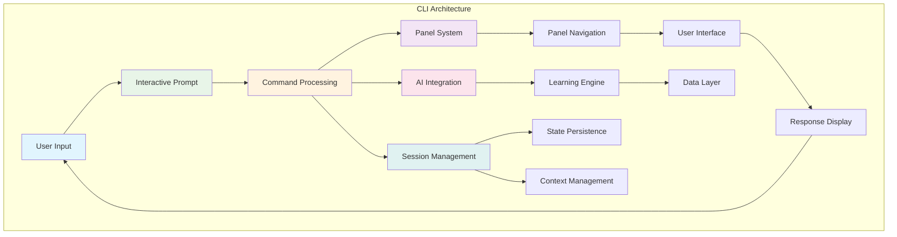

# CLI Architecture

---
title: Learning Catalyst CLI Architecture
description: Command-line interface architectural design and user interaction patterns
version: 1.0.0
last_updated: 2025-10-10
difficulty: "Advanced"
estimated_time: "30 minutes"
---

## Overview

Learning Catalyst's CLI implements a sophisticated command-line interface with panel-based navigation, session management, and seamless AI integration. The architecture prioritizes user experience through responsive interactions and intelligent command processing.

## Core Principles

- **Panel-Based Interface**: Always-active prompt with temporary command dialogs
- **Session Persistence**: Continuous context across interactions and checkpoints
- **Async Key Handling**: Responsive input with cross-platform support
- **AI Integration**: Natural language processing with contextual awareness

## Command Processing

### Command Classification

Commands are processed through a hierarchical pipeline:

**Command Types**:
- **System Commands**: `/help`, `/quit`, `/clear` - CLI management
- **Learning Commands**: `/knowledge-map`, natural queries - Educational operations
- **Configuration Commands**: `/config`, `/tokens` - System management
- **Natural Input**: Conversational AI interactions

**Processing Pipeline**:
1. **Syntax Validation** - Command structure and parameters
2. **Semantic Analysis** - Intent and context interpretation
3. **Route Resolution** - Map to appropriate handlers
4. **Context Enrichment** - Session and user context integration

**Execution Patterns**:
- **Interactive Commands**: Multi-step workflows with user input
- **Immediate Commands**: Single-action operations
- **Batch Commands**: Operations on multiple items

## Session Management

### Session Architecture

**Session Layers**:
- **State Layer**: User context, conversation history, learning progress
- **Persistence Layer**: Session storage, checkpoints, recovery mechanisms
- **Lifecycle Manager**: Session initialization, transitions, cleanup

**State Components**:
- **User Context**: Identity, learning topics, preferences, patterns
- **Checkpoint System**: Auto-saving, manual checkpoints, incremental updates
- **Session Lifecycle**: Init → Active → Persist → Restore → Cleanup

**Command Integration**:
- **Context-Aware Processing**: Commands adapt based on learning history
- **State Synchronization**: Updates maintain conversation continuity
- **Progress Tracking**: Learning progress maintained across commands
- **Multi-Command Workflows**: Context preserved across command sequences

## User Interface

### Interactive Display System

The CLI implements a comprehensive user interface with responsive, intuitive, and accessible interactions.

#### UI Components

**Interface Architecture**:
- **Display Layer**: Conversation rendering, interactive elements, progress indicators
- **Interaction Layer**: Input validation, navigation management, command completion
- **Response Layer**: Output formatting, error handling, accessibility support

### Interactive Elements

#### **Panel-Based Interface System**
**CLI Prompt Architecture**: The CLI implements an interactive command-line prompt system with temporary dialogs for specific commands, prioritizing simplicity and continuous interaction flow:

- **Always-Active Prompt**: The main prompt is always ready for input like a shell (bash/zsh)
- **Temporary Dialogs**: Commands show temporary interfaces that return to the prompt
- **Dual Input Modes**: Natural language for AI + slash commands for system functions
- **Consistent Return Path**: ESC or completion always returns to the prompt
- **Shell-Like Behavior**: Familiar CLI patterns with enhanced AI capabilities

**Panel Types**:
1. **Conversation Prompt (Default)**: Interactive CLI prompt for commands and AI conversation
2. **Configuration Dialog**: Interactive setup invoked by `/config` command (modal overlay)
3. **Statistics View**: Show learning analytics when `/stats` command is used (temporary display)
4. **Help Display**: Show command reference and help text (temporary output)
5. **Checkpoint Interface**: Save/load session functionality via `/checkpoint` command (dialog)

#### **Knowledge Map Interface**
**Interactive Navigation**: Sophisticated navigation for knowledge exploration:
- **Hierarchical Navigation**: Multi-level knowledge structure browsing
- **Contextual Interactions**: Commands adapt based on selected knowledge elements
- **Visual Feedback**: Real-time status updates and progress indication
- **Keyboard Navigation**: Efficient keyboard-based interaction patterns

#### **Command Completion**
**Intelligent Suggestions**: Context-aware command completion and suggestion system:
- **Pattern Recognition**: Identifies likely command completions based on context
- **Historical Suggestions**: Learns from user command patterns and preferences
- **Contextual Help**: Provides relevant help information during command input
- **Error Prevention**: Suggests corrections for common command mistakes

#### **Async Key Input Integration**
**Responsive Key Handling**: Integration with async key handling system for optimal responsiveness:
- **Dual Mode Support**: Native terminal I/O and keyboard library integration
- **Event Streaming**: Real-time key event processing with async generators
- **Cross-Platform Compatibility**: Works across Windows, macOS, and Linux with automatic fallbacks
- **Non-blocking Input**: Async key processing prevents UI blocking during operations

### Autocomplete Architecture

**Context-Aware Suggestions**: Real-time command completion with session awareness and learning adaptation.

**Processing Pipeline**:
1. **Input Analysis**: Trigger detection, context parsing, intent recognition
2. **Suggestion Generation**: Command matching, pattern recognition, historical context
3. **Filtering & Ranking**: Relevance scoring, context filtering, learning adaptation

**Context Integration**:
- **Session-Aware**: Learning context, progress-based suggestions, preference adaptation
- **Pattern Recognition**: Hierarchical completion, parameter validation, syntax awareness
- **Performance**: Incremental processing, caching, async responsiveness

**Input Analysis**: Trigger detection, context parsing, and intent recognition based on user typing patterns.

**Suggestion Generation**: Multi-layered approach using command registry matching, pattern recognition, historical context, and session state.

**Filtering & Ranking**: Intelligent scoring based on relevance, context matching, frequency, and adaptive learning patterns.

**Progress Visualization**: Visual feedback for learning progress, command execution, system status, and user interactions.

**Error Handling**: Multi-layered approach with immediate feedback, graceful recovery, and contextual user guidance.

## Command Integration

### Command Integration Patterns

**Integration Flow**: CLI commands connect to system components through a structured pipeline:

1. **Command Entry**: Input capture, parsing, and context integration
2. **System Integration**: Learning engine, AI processing, and data layer access
3. **Response Processing**: Result aggregation, state updates, and user display

### Command Category Integration

**Command Categories**:
- **System Commands**: Direct system interaction (`/help`, `/quit`, `/clear`)
- **Learning Commands**: Learning engine and AI integration (`/knowledge-map`, natural queries)
- **Configuration Commands**: System configuration and provider management (`/config`, `/tokens`)

**AI Integration**:
- **Natural Language Processing**: Context building, provider communication, response processing
- **Learning Workflows**: Progress tracking, analytics integration, adaptive learning

## Panel Navigation System

**Panel-Based Navigation**: Temporary dialog overlays that return to the always-active prompt:

**Core Principles**:
- **Always-Active Prompt**: Shell-like continuous input readiness
- **Temporary Dialogs**: Focused interfaces for specific commands
- **Consistent Navigation**: Universal ESC/complete return path
- **State Preservation**: Context maintained across panel transitions
- **Async Key Integration**: Responsive cross-platform key handling

**Panel Management**:
- **Lifecycle**: Activate → Navigate → Interact → Complete → Return
- **Event Routing**: Context-aware key event distribution
- **State Tracking**: Active panel, navigation history, context integration

**Navigation Flow**:
1. **Command to Panel**: Slash commands activate specialized interfaces
2. **Panel Interaction**: Arrow keys, Enter, panel-specific controls
3. **Panel to Prompt**: ESC or completion returns to conversation
4. **State Restoration**: Previous context preserved and restored

## CLI Evolution

### Extensibility

**Panel Extensions**: Plugin architecture with standardized registration, lifecycle management, and consistent navigation patterns. New panels integrate seamlessly while maintaining user experience.

**UI Extensions**: Modular components, customizable themes, accessibility support, and multi-language capabilities built on consistent interaction patterns.

### Performance

**Responsive Interaction**: Async processing, multi-level caching, resource management, and real-time feedback for optimal user experience.

**Panel Optimization**: Non-blocking rendering, progressive loading, cancellation support, memory efficiency, and efficient lifecycle management.

## Quality Attributes

**Usability**: Intuitive navigation, contextual help, error recovery, and accessible design.

**Reliability**: Comprehensive error management, state consistency, session recovery, and graceful degradation.

**Maintainability**: Modular design, consistent interfaces, comprehensive testing, and integrated documentation.

## Success Patterns

**Key Examples**:
- **Knowledge Map**: Interactive navigation with context integration and extensible design
- **Configuration Management**: Hierarchical commands with validation and reliable state management
- **Natural Learning**: Seamless AI integration with context building and progress tracking

**Architectural Insights**:
- Pipeline architecture enables extensibility and maintainability
- Context awareness and state persistence enhance user experience
- Well-designed abstractions enable system extensibility
- Comprehensive error handling and performance optimization are essential

---

*This CLI architecture documentation demonstrates how architectural principles and patterns enable the creation of a sophisticated, extensible, and user-friendly command-line interface that seamlessly integrates with AI systems and learning workflows.*

---

*Last updated: October 10, 2025*
*Version: 1.0.0*
*Category: System Architecture*

## Related Documentation

### System Architecture Integration
- **[System Architecture Overview](README.md)**: Complete system architecture and 5-layer design
- **[Async Key Handling System](key_handling_system.md)**: Async key input with keyboard library integration
- **[Data Layer Architecture](data-layer.md)**: Data storage and management patterns
- **[AI Integration Architecture](ai-integration.md)**: AI provider integration and multi-agent orchestration
- **[Knowledge Management System](knowledge-management-system.md)**: Knowledge graph and learning systems

### API Reference Documentation
- **[CLI Commands API](../api-reference/cli-commands.md)**: Complete command-line interface specification
- **[Configuration API](../api-reference/configuration-api.md)**: Configuration management and settings architecture
- **[Provider Interface](../api-reference/provider-interfaces.md)**: AI provider integration and extension architecture
- **[Data Models](../api-reference/data-models.md)**: Data structure specifications for CLI operations

### Implementation and Usage
- **[Panel System Design](../../../panel_system_design.md)**: Complete panel system design specification
- **[Implementation Guides](../implementation-guides/)**: Development setup and guidelines
- **[Configuration Commands](../../commands/configuration.md)**: Complete CLI command reference

