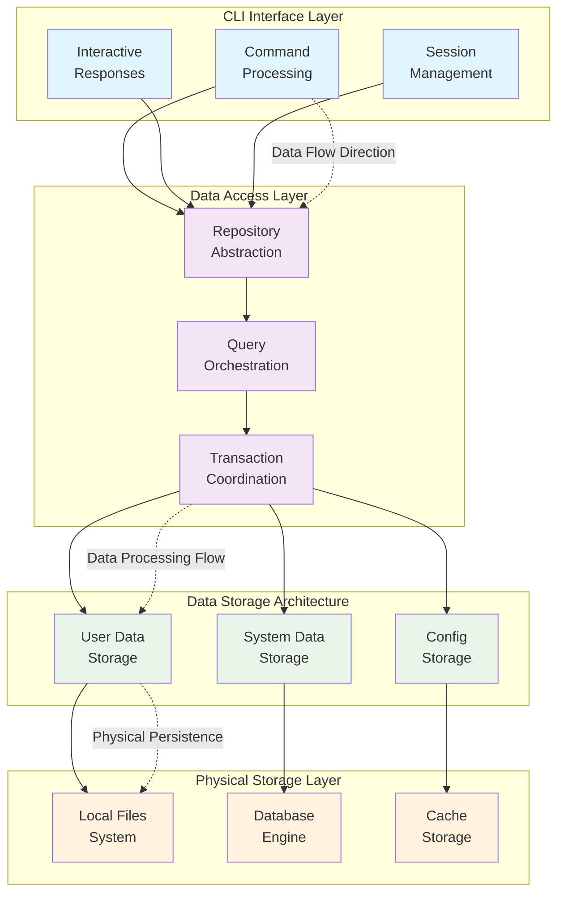

# Data Layer Architecture

---
title: Learning Catalyst Data Layer Architecture
description: Data flow architectural design, storage patterns, and integration architecture
version: 1.0.0
last_updated: 2025-10-10
difficulty: "Advanced"
estimated_time: "35 minutes"
---

## Overview

This document describes Learning Catalyst's data layer architecture, focusing on data flow patterns, storage architectural design, and integration mechanisms between CLI components. The data layer architecture enables reliable data persistence, efficient access patterns, and seamless integration with interactive learning workflows while maintaining performance and privacy standards.

## Core Architectural Principles

### 1. **Local-First Data Architecture**
- **Data Sovereignty**: User data remains under user control through local-first design
- **Offline Capability**: System functionality preserved without network connectivity
- **Privacy by Design**: Privacy considerations embedded in core data architecture
- **Data Portability**: Users maintain ownership and control over their learning data

### 2. **Layered Data Architecture**
- **Separation of Concerns**: Clear boundaries between data access, business logic, and storage
- **Abstraction Layers**: Consistent interfaces hiding storage implementation details
- **Domain Separation**: Logical separation of user data, system data, and configuration
- **Interface Consistency**: Uniform data access patterns across all components

### 3. **Flow-Oriented Design**
- **Data Lifecycle**: Clear data flow from CLI commands through processing to storage
- **Event-Driven Patterns**: Data changes triggered by CLI interactions and system events
- **State Transitions**: Predictable data state evolution during user sessions
- **Integration Points**: Well-defined data integration boundaries

### 4. **Performance Architecture**
- **Access Optimization**: Architectural patterns optimized for CLI interaction patterns
- **Caching Strategy**: Multi-level caching for responsive CLI performance
- **Connection Efficiency**: Optimized data connection management
- **Resource Management**: Efficient resource utilization patterns

## Data Flow Architecture

### Architectural Overview

### Data Flow Patterns

#### **CLI Command Data Flow**
**Command Processing Flow**:
1. **Command Reception**: CLI commands received and parsed
2. **Data Request**: Data access requests generated based on command type
3. **Repository Interaction**: Repository layer processes data requests
4. **Storage Operation**: Physical storage operations executed
5. **Response Generation**: Results formatted for CLI response
6. **State Update**: System state updated and persisted

#### **Session Data Flow**
**Interactive Session Flow**:
1. **Session Initialization**: Session context created and stored
2. **Interaction Processing**: Each interaction triggers data flow
3. **Context Preservation**: Session state maintained across interactions
4. **Checkpoint Creation**: Periodic state snapshots created
5. **Session Persistence**: Final session state stored for recovery

#### **Learning Data Flow**
**Learning Progress Flow**:
1. **Content Access**: Learning content retrieved from storage
2. **Interaction Capture**: User interactions captured and stored
3. **Progress Calculation**: Learning progress computed and updated
4. **Proficiency Update**: User proficiency models updated
5. **Analytics Generation**: Learning analytics generated and stored

## Storage Architecture Patterns

### Data Domain Organization

#### **User Data Domain**
**Data Types**:
- **Learning Progress**: User proficiency, concept mastery, progress tracking
- **Session Data**: Conversation history, interaction patterns, session state
- **Personalization**: User preferences, learning styles, customization
- **Analytics**: Behavior patterns, usage statistics, learning insights

#### **System Data Domain**
**Data Types**:
- **Content Repository**: Learning materials, concepts, educational content
- **Knowledge Graph**: Concept relationships, learning dependencies
- **System Configuration**: Settings, operational parameters, metadata
- **Content Metadata**: Structural information, categorization, provenance

#### **Configuration Data Domain**
**Data Types**:
- **User Preferences**: Individual settings and customization options
- **Provider Configuration**: AI provider settings and authentication
- **System Settings**: Global configuration and operational parameters
- **Environment Data**: Environment-specific configuration

### Storage Strategy Architecture

#### **Primary Storage Architecture**
**Database Storage Patterns**:
- **Structured Data**: Relational storage for user profiles, sessions, progress
- **Relationship Management**: Foreign key relationships maintaining data integrity
- **Transaction Consistency**: ACID compliance for reliable operations
- **Performance Optimization**: Strategic indexing for query efficiency

#### **Configuration Storage Architecture**
**File-Based Storage Patterns**:
- **Structured Configuration**: Standardized configuration file formats
- **Version Management**: Configuration versioning and migration support
- **Validation Architecture**: Configuration schema validation
- **Security Integration**: Secure credential storage and access control

#### **Cache Storage Architecture**
**Multi-Level Caching Patterns**:
- **Application Cache**: In-memory caching for high-frequency data
- **Persistent Cache**: Disk-based caching for session and content data
- **Cache Coordination**: Synchronized cache invalidation and refresh
- **Performance Optimization**: Intelligent cache population and eviction

## Access Layer Architecture

### Repository Pattern Architecture

#### **Data Access Abstraction**
**Repository Interface Design**:
- **CRUD Operations**: Standardized create, read, update, delete operations
- **Query Building**: Flexible query construction and optimization
- **Transaction Management**: Coordinated transaction handling
- **Error Handling**: Consistent error propagation and handling

#### **Query Architecture**
**Query Processing Patterns**:
- **Type Safety**: Structured query validation and type checking
- **Optimization**: Automatic query optimization and performance tuning
- **Security**: Parameter binding and injection prevention
- **Caching**: Query result caching for performance

#### **Transaction Architecture**
**Transaction Management Patterns**:
- **Atomic Operations**: Transactional consistency across data operations
- **Isolation Levels**: Configurable transaction isolation
- **Rollback Support**: Comprehensive error recovery mechanisms
- **Deadlock Prevention**: Proactive conflict detection and resolution

### Data Integrity Architecture

#### **Constraint Architecture**
**Data Integrity Patterns**:
- **Primary Constraints**: Unique identification and referential integrity
- **Foreign Constraints**: Relationship integrity and cascade behavior
- **Unique Constraints**: Data uniqueness and duplicate prevention
- **Business Constraints**: Domain-specific validation rules

#### **Validation Architecture**
**Multi-Layer Validation**:
- **Input Validation**: Command input validation and sanitization
- **Business Logic Validation**: Domain rule enforcement
- **Data Type Validation**: Type checking and conversion validation
- **Referential Validation**: Relationship integrity verification

## Integration Architecture

### CLI Integration Patterns

#### **Command Data Integration**
**Command Processing Integration**:
- **Command Routing**: Efficient routing to appropriate data handlers
- **Parameter Processing**: Command parameter validation and transformation
- **Response Formatting**: Consistent data formatting for CLI output
- **Error Integration**: Unified error handling and user feedback

#### **Session Integration**
**Session State Integration**:
- **State Synchronization**: Real-time session state consistency
- **Context Preservation**: Context maintenance across interactions
- **Persistence Coordination**: Coordinated session state persistence
- **Recovery Integration**: Session recovery and restoration mechanisms

#### **Configuration Integration**
**Configuration Management Integration**:
- **Real-time Updates**: Dynamic configuration propagation
- **Validation Integration**: Configuration validation within CLI context
- **Security Integration**: Secure configuration management
- **Migration Support**: Configuration evolution and migration

### External System Integration

#### **Provider Data Integration**
**AI Provider Data Flow**:
- **Request Mapping**: CLI requests to provider requests transformation
- **Response Processing**: Provider response to CLI response conversion
- **Error Translation**: Provider error to CLI error mapping
- **State Synchronization**: Provider state synchronization with system state

#### **Analytics Integration**
**Analytics Data Flow**:
- **Event Collection**: Systematic data event capture
- **Data Aggregation**: Real-time analytics computation
- **Metric Storage**: Efficient metrics storage and retrieval
- **Report Generation**: Automated analytics report creation

## Evolution Architecture

### Extensibility Patterns

#### **Storage Evolution**
**Scalable Architecture**:
- **Pluggable Storage**: Support for multiple storage backends
- **Schema Evolution**: Structured data schema evolution
- **Migration Support**: Automated data migration patterns
- **Backward Compatibility**: Support for legacy data formats

#### **Integration Evolution**
**Integration Growth**:
- **API Evolution**: Backward-compatible interface evolution
- **Provider Integration**: Extensible provider integration patterns
- **Data Format Evolution**: Support for evolving data formats
- **Feature Expansion**: Architectural support for new features

---

*This data layer architecture documentation focuses on the architectural patterns, data flow, and integration mechanisms that enable robust and scalable data management for the Learning Catalyst CLI application.*

---

## Related Documentation

- **[CLI Architecture](cli-architecture.md)**: Command-line interface design and integration
- **[AI Integration Architecture](ai-integration.md)**: AI provider integration patterns
- **[Data Models](../api-reference/data-models.md)**: Data model specifications and architecture

---

*Last updated: October 10, 2025*
*Version: 1.0.0*
*Category: System Architecture*