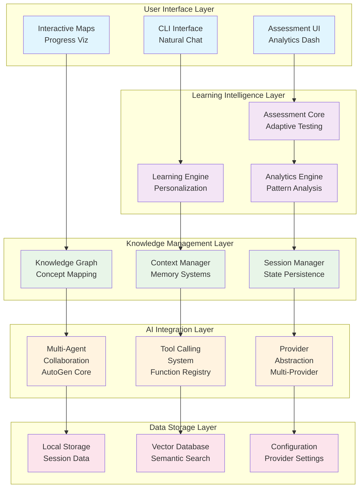
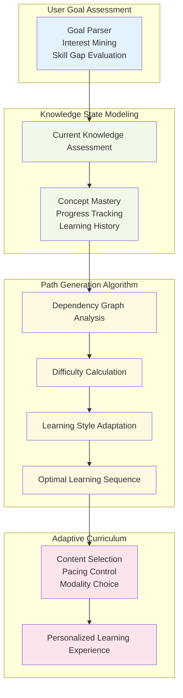
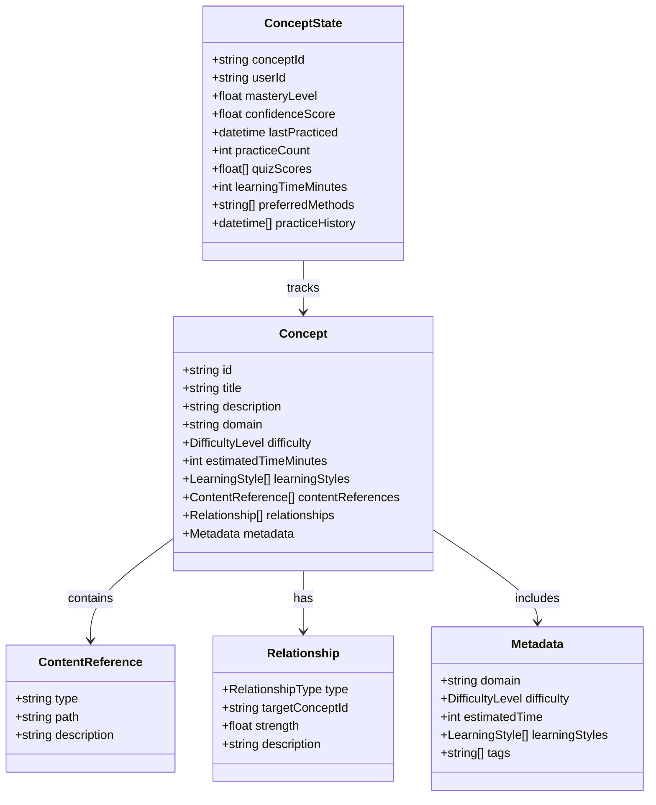
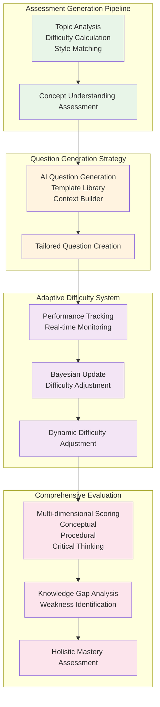
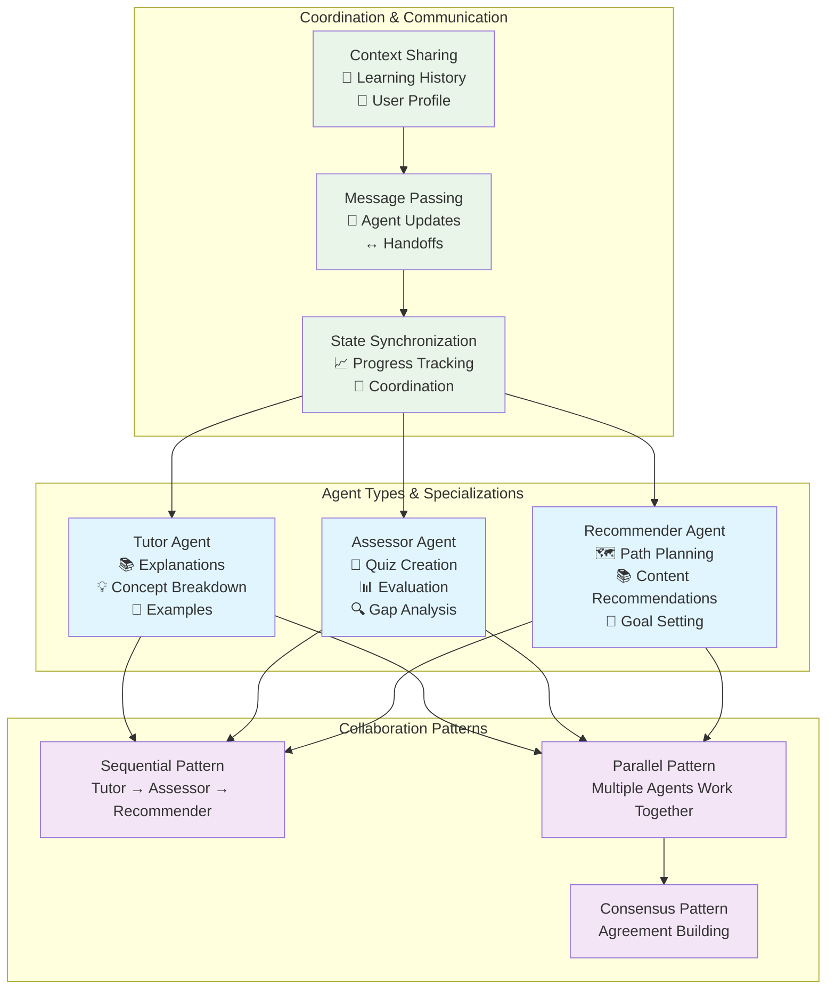
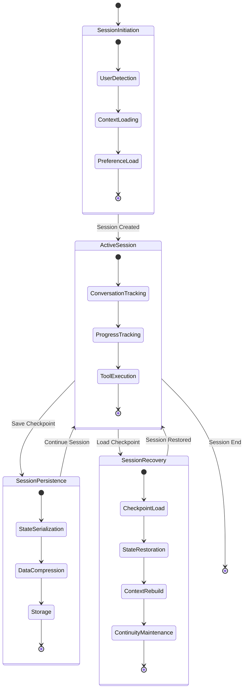
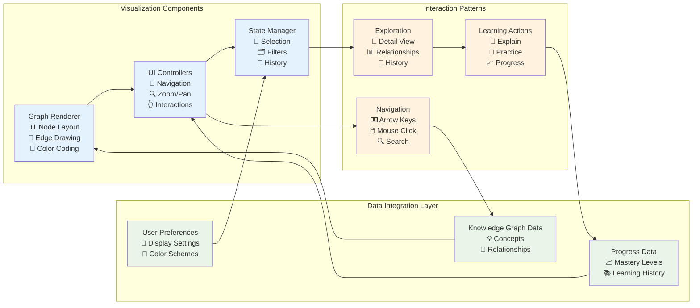
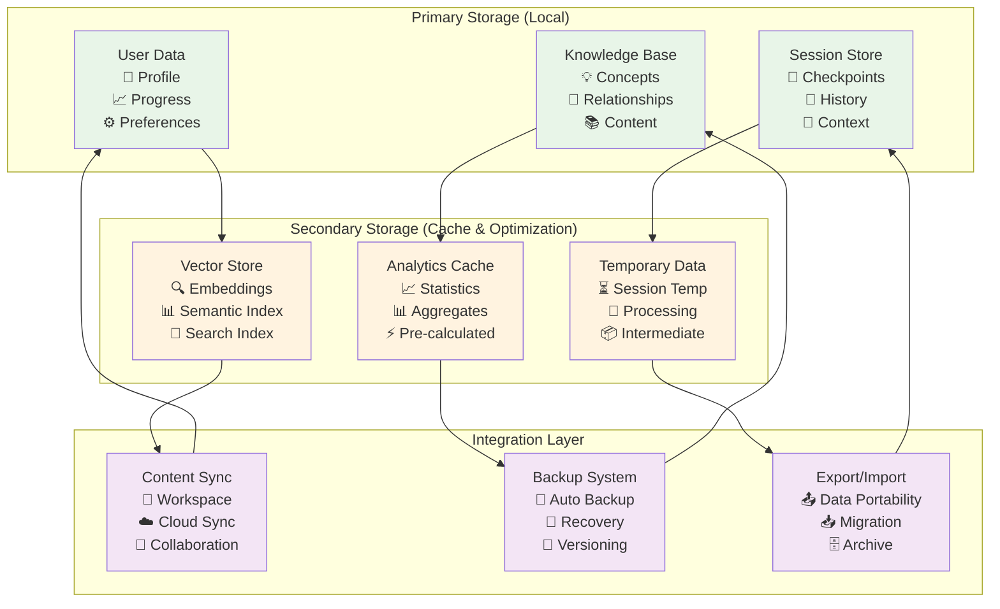
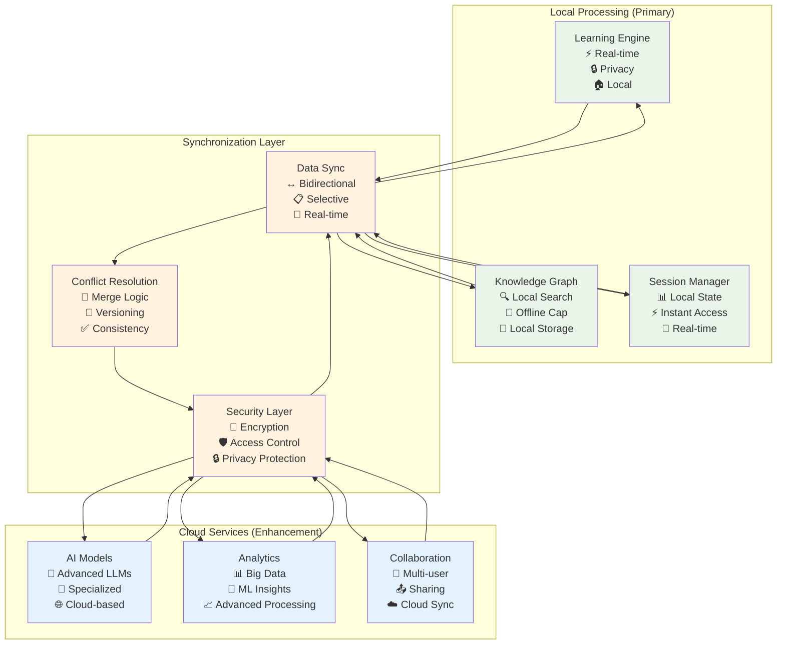

# Knowledge Management System Architecture

---
title: Learning Catalyst Knowledge Management System Architecture
description: Comprehensive architectural design for intelligent learning, assessment, and knowledge management
version: 1.0.0
last_updated: 2025-10-10
difficulty: "Advanced"
estimated_time: "90 minutes"
---

## Overview

This document presents the complete architectural design of Learning Catalyst's Knowledge Management System (KMS) - an intelligent, AI-powered learning companion that orchestrates personalized education through adaptive content delivery, comprehensive assessment, and deep learning analytics. The system leverages multi-agent collaboration, natural language processing, and sophisticated knowledge representation to create a transformative learning experience.

### System Vision

**Learning Catalyst's Knowledge Management System** is designed to be a lifelong learning companion that:

- **Adapts to Individual Learning Styles**: Personalizes content delivery based on user preferences and performance patterns
- **Maintains Deep Learning Context**: Preserves and leverages complete learning history for intelligent recommendations
- **Provides Intelligent Assessment**: Generates adaptive quizzes and evaluates mastery through multiple dimensions
- **Visualizes Knowledge Relationships**: Maps concept dependencies and learning pathways through interactive visualizations
- **Supports Collaborative Learning**: Enables multi-agent collaboration for comprehensive learning support

### Architectural Philosophy

The KMS architecture is built on four core principles:

1. **Adaptive Intelligence**: The system learns from user interactions and continuously optimizes the learning experience
2. **Knowledge Graph Centric**: All learning activities are contextualized within a rich knowledge representation model
3. **Multi-Modal Learning**: Supports various learning styles through diverse content types and interaction patterns
4. **Privacy-First Design**: Maintains user data sovereignty while enabling powerful AI-driven features

## System Architecture Overview

### High-Level Architecture



### Core Architectural Components

#### 1. Learning Intelligence Engine
**Purpose**: Orchestrates personalized learning experiences through adaptive algorithms

**Key Capabilities**:
- **Learning Path Generation**: Creates personalized curriculum based on user goals and current knowledge
- **Content Adaptation**: Modifies explanation complexity and examples based on learning style
- **Progress Assessment**: Evaluates mastery through multiple dimensions (quizzes, interactions, time spent)
- **Recommendation System**: Suggests next learning steps and related concepts

#### 2. Knowledge Graph System
**Purpose**: Maintains rich semantic relationships between concepts and learning materials

**Key Capabilities**:
- **Concept Modeling**: Represents concepts with metadata, prerequisites, and relationships
- **Dependency Tracking**: Maps learning prerequisites and concept hierarchies
- **Relationship Discovery**: Identifies cross-domain connections and related topics
- **Visual Mapping**: Generates interactive knowledge visualizations

#### 3. Assessment & Analytics Core
**Purpose**: Comprehensive evaluation and insight generation for learning optimization

**Key Capabilities**:
- **Adaptive Testing**: Generates questions that adjust difficulty based on performance
- **Performance Analytics**: Tracks learning patterns, strengths, and improvement areas
- **Knowledge Gap Analysis**: Identifies weak areas and suggests targeted practice
- **Progress Visualization**: Displays learning milestones and achievement patterns

#### 4. Multi-Agent Collaboration System
**Purpose**: Leverages specialized AI agents for comprehensive learning support

**Key Capabilities**:
- **Agent Specialization**: Creates agents for tutoring, assessment, and recommendation
- **Collaborative Learning**: Coordinates multiple agents for complex learning scenarios
- **Context Sharing**: Maintains shared understanding across agent interactions
- **Workflow Orchestration**: Manages complex multi-step learning processes

## Core Learning Engine Architecture

### Learning Path Generation System



### Adaptive Content Delivery System

**Architectural Components**:

1. **Content Analysis Engine**
   - **Difficulty Assessment**: Analyzes content complexity and prerequisites
   - **Learning Style Matching**: Maps content to visual, auditory, or kinesthetic preferences
   - **Context Relevance**: Evaluates content appropriateness for current learning state

2. **Personalization Pipeline**
   ```python
   class PersonalizationPipeline:
       def process_content(self, content: LearningContent, user_profile: UserProfile) -> PersonalizedContent:
           # 1. Analyze user's current knowledge state
           knowledge_state = self.knowledge_assessor.evaluate(user_profile)

           # 2. Determine optimal content difficulty
           target_difficulty = self.difficulty_calculator.calculate(
               knowledge_state.level,
               user_profile.learning_style
           )

           # 3. Adapt content presentation
           adapted_content = self.content_adapter.adapt(
               content,
               target_difficulty,
               user_profile.preferences
           )

           # 4. Generate learning context
           learning_context = self.context_builder.build(
               adapted_content,
               knowledge_state,
               user_profile.goals
           )

           return PersonalizedContent(
               content=adapted_content,
               context=learning_context,
               delivery_method=self.delivery_selector.select(user_profile)
           )
   ```

3. **Interactive Learning Patterns**
   - **Socratic Dialogue**: Guided discovery through questioning
   - **Explanatory Mode**: Direct instruction with examples
   - **Practice-Oriented**: Hands-on learning with exercises
   - **Collaborative Exploration**: Multi-agent guided discovery

## Knowledge Graph Management Architecture

### Concept Modeling System



### Dynamic Knowledge Discovery

**Content Processing Pipeline**:

1. **Workspace Content Analysis**
   ```python
   class ContentDiscoveryEngine:
       def analyze_workspace(self, workspace_path: str) -> KnowledgeGraph:
           # 1. Scan for learning materials
           content_files = self.file_scanner.scan(workspace_path, ["*.md", "*.txt", "*.py", "*.js"])

           # 2. Extract concepts from content
           concepts = []
           for file_path in content_files:
               content = self.file_reader.read(file_path)
               extracted_concepts = self.concept_extractor.extract(content)
               concepts.extend(extracted_concepts)

           # 3. Build relationships between concepts
           relationships = self.relationship_builder.build(concepts)

           # 4. Create knowledge graph
           knowledge_graph = KnowledgeGraph(concepts, relationships)

           return knowledge_graph
   ```

2. **Concept Relationship Mapping**
   - **Semantic Analysis**: Natural language processing to identify concept relationships
   - **Structural Analysis**: Heading hierarchy and document structure analysis
   - **Content Similarity**: Vector similarity and content overlap analysis
   - **User Interaction Analysis**: Learning patterns and concept co-occurrence

3. **Knowledge Graph Evolution**
   - **Automatic Updates**: Detect changes in workspace content
   - **Relationship Refinement**: Improve relationship accuracy through user interactions
   - **Concept Enrichment**: Add metadata and context through AI analysis
   - **Version Management**: Track knowledge graph evolution over time

## Assessment & Analytics Architecture

### Adaptive Assessment Engine



### Multi-Dimensional Assessment System

**Assessment Dimensions**:

1. **Conceptual Understanding**
   - **Definition Mastery**: Ability to explain concepts clearly
   - **Relationship Recognition**: Understanding of concept connections
   - **Application Knowledge**: Practical application of concepts

2. **Procedural Skills**
   - **Problem Solving**: Step-by-step solution approaches
   - **Implementation**: Code writing and practical execution
   - **Debugging**: Error identification and correction

3. **Critical Thinking**
   - **Analysis**: Breaking down complex problems
   - **Synthesis**: Combining multiple concepts
   - **Evaluation**: Assessing solution quality

**Adaptive Question Generation**:
```python
class AdaptiveQuestionGenerator:
    def generate_question(self, topic: str, user_profile: UserProfile) -> Question:
        # 1. Assess current knowledge level
        mastery_level = self.knowledge_tracker.get_mastery(user_profile.user_id, topic)

        # 2. Select appropriate difficulty
        target_difficulty = self.difficulty_calculator.calculate_target(mastery_level)

        # 3. Choose question type based on learning style
        question_type = self.style_matcher.select_type(user_profile.learning_style)

        # 4. Generate contextual question
        question_context = self.context_builder.build(
            topic,
            user_profile.learning_history,
            target_difficulty
        )

        # 5. Create question with adaptive parameters
        question = Question(
            topic=topic,
            type=question_type,
            difficulty=target_difficulty,
            context=question_context,
            expected_answer_type=self.answer_type_selector.select(question_type),
            hints=self.hint_generator.generate(topic, target_difficulty)
        )

        return question
```

### Analytics & Progress Tracking System

**Learning Analytics Dashboard**:

1. **Progress Metrics**
   - **Concept Mastery**: Overall knowledge state visualization
   - **Learning Velocity**: Speed of concept acquisition
   - **Retention Rates**: Long-term knowledge maintenance
   - **Practice Frequency**: Regularity of learning activities

2. **Performance Analytics**
   - **Quiz Performance**: Accuracy trends and improvement patterns
   - **Response Times**: Speed of understanding and application
   - **Error Patterns**: Common mistakes and knowledge gaps
   - **Strength Areas Topics and skills with high performance

3. **Engagement Metrics**
   - **Session Statistics**: Duration, frequency, and timing patterns
   - **Interaction Types**: Preferred learning modalities and content types
   - **Goal Achievement**: Learning objective completion rates
   - **Collaborative Learning**: Multi-agent interaction patterns

**Predictive Analytics**:
```python
class LearningAnalytics:
    def generate_insights(self, user_id: str, time_period: str) -> LearningInsights:
        # 1. Collect learning data
        learning_data = self.data_collector.get_user_data(user_id, time_period)

        # 2. Analyze learning patterns
        patterns = self.pattern_analyzer.analyze(learning_data)

        # 3. Identify knowledge gaps
        gaps = self.gap_analyzer.identify(learning_data)

        # 4. Predict learning outcomes
        predictions = self.prediction_engine.predict(learning_data, patterns)

        # 5. Generate recommendations
        recommendations = self.recommendation_engine.generate(
            patterns, gaps, predictions
        )

        return LearningInsights(
            patterns=patterns,
            knowledge_gaps=gaps,
            predictions=predictions,
            recommendations=recommendations
        )
```

## Multi-Agent Collaboration Architecture

### AutoGen Integration System



### Agent Lifecycle Management

**Agent Creation and Configuration**:
```python
class AgentFactory:
    def create_tutor_agent(self, specialization: str, user_context: UserContext) -> TutorAgent:
        return TutorAgent(
            config=AgentConfig(
                specialization=specialization,
                personality=self._select_personality(user_context.learning_style),
                interaction_style=self._select_interaction_style(user_context.preferences),
                knowledge_domains=[specialization]
            ),
            tools=[
                ExplanationTool(),
                ExampleGeneratorTool(),
                ConceptBreakdownTool()
            ],
            autogen_config=AutoGenConfig(
                model=user_context.preferred_model,
                temperature=0.7,
                max_tokens=2000
            )
        )

    def create_assessor_agent(self, assessment_focus: str) -> AssessorAgent:
        return AssessorAgent(
            config=AgentConfig(
                specialization="assessment",
                personality="analytical",
                interaction_style="instructional",
                knowledge_domains=[assessment_focus]
            ),
            tools=[
                QuizGeneratorTool(),
                GapAnalysisTool(),
                PerformanceEvaluatorTool()
            ]
        )
```

**Collaborative Learning Workflows**:

1. **Sequential Learning Pattern**
   ```
   User Request → Tutor Agent (Explain) → Assessor Agent (Test) → Recommender Agent (Next Steps)
   ```

2. **Parallel Learning Pattern**
   ```
   Complex Topic → Multiple Specialist Agents → Consensus Building → Integrated Response
   ```

3. **Peer Review Pattern**
   ```
   Agent A Generates → Agent B Reviews → Agent C Validates → Final Output
   ```

### Tool Calling Integration Architecture

**Function Calling System**:
```python
class ToolRegistry:
    def __init__(self):
        self.tools = {
            "explain_concept": ExplainConceptTool(),
            "generate_quiz": GenerateQuizTool(),
            "suggest_learning": SuggestLearningTool(),
            "get_knowledge_map": GetKnowledgeMapTool(),
            "create_learning_agent": CreateLearningAgentTool(),
            "orchestrate_learning_session": OrchestrateLearningSessionTool()
        }

    def execute_tool_call(self, tool_name: str, parameters: dict, context: LearningContext) -> ToolResult:
        tool = self.tools.get(tool_name)
        if not tool:
            raise ValueError(f"Unknown tool: {tool_name}")

        # Validate parameters
        validation_result = tool.validate_parameters(parameters)
        if not validation_result.is_valid:
            return ToolResult(success=False, errors=validation_result.errors)

        # Execute tool with context
        try:
            result = tool.execute(parameters, context)
            return ToolResult(success=True, data=result)
        except Exception as e:
            return ToolResult(success=False, error=str(e))
```

## Session Management & Persistence Architecture

### Session State Management



### Long-Term Memory System

**Memory Consolidation Architecture**:

1. **Working Memory** (Current Session)
   - **Active Context**: Recent conversations and current learning state
   - **Short-term Goals**: Immediate learning objectives
   - **Session Data**: Temporary information for current interaction

2. **Long-Term Memory** (Persistent Storage)
   - **Concept Mastery**: Long-term knowledge state and proficiency levels
   - **Learning History**: Complete record of learning activities and progress
   - **Interaction Patterns**: Preferred learning methods and successful strategies

**Memory Management Strategy**:
```python
class MemoryManager:
    def consolidate_session(self, session_data: SessionData) -> None:
        # 1. Extract key learning insights
        insights = self.insight_extractor.extract(session_data)

        # 2. Update long-term knowledge state
        self.knowledge_state_updater.update(insights)

        # 3. Store interaction patterns
        self.pattern_analyzer.record_patterns(session_data.interactions)

        # 4. Compress and archive session data
        compressed_data = self.compression_engine.compress(session_data)
        self.archive_manager.store(compressed_data)

        # 5. Update user preferences based on behavior
        self.preference_updater.update(insights.learning_patterns)
```

### Context Optimization System

**Context Compression Pipeline**:

1. **Relevance Analysis**: Evaluate importance of conversation elements
2. **Semantic Clustering**: Group related concepts and discussions
3. **Priority Ranking**: Prioritize recent and important interactions
4. **Compression**: Reduce context size while preserving essential information
5. **Reconstruction**: Rebuild context for AI interactions

```python
class ContextOptimizer:
    def optimize_context(self, raw_context: ConversationContext, token_limit: int) -> OptimizedContext:
        # 1. Analyze relevance scores
        relevance_scores = self.relevance_analyzer.score(raw_context)

        # 2. Select high-value content
        selected_content = self.content_selector.select(
            raw_context,
            relevance_scores,
            token_limit
        )

        # 3. Preserve learning continuity
        continuity_context = self.continuity_preserver.preserve(raw_context)

        # 4. Compress selected content
        compressed_content = self.compression_engine.compress(selected_content)

        # 5. Rebuild optimized context
        optimized_context = OptimizedContext(
            compressed_content=compressed_content,
            continuity_context=continuity_context,
            metadata=ContextMetadata(
                original_tokens=len(raw_context),
                compressed_tokens=len(compressed_content),
                compression_ratio=len(compressed_content)/len(raw_context),
                preservation_score=self._calculate_preservation_score(raw_context, compressed_content)
            )
        )

        return optimized_context
```

## User Experience Architecture

### Interactive Knowledge Maps

**Visualization System Architecture**:



**Adaptive Interface System**:

1. **Responsive Layout**
   - **Terminal Optimization**: Efficient rendering for command-line interfaces
   - **Screen Size Adaptation**: Dynamic layout adjustment for different terminal sizes
   - **Color Scheme Optimization**: Accessibility and visual hierarchy

2. **Interaction Adaptation**
   - **Learning Style Matching**: Interface adaptation based on user preferences
   - **Skill Level Adjustment**: Complexity scaling based on user expertise
   - **Contextual Tools**: Dynamic tool availability based on current state

3. **Performance Optimization**
   - **Lazy Loading**: Load map sections on demand
   - **Caching Strategy**: Cache frequently accessed visualizations
   - **Progressive Rendering**: Render complex maps incrementally

### Natural Learning Interface

**Conversational Learning Architecture**:

```python
class NaturalLearningInterface:
    def process_user_input(self, input_text: str, context: LearningContext) -> LearningResponse:
        # 1. Intent classification
        intent = self.intent_classifier.classify(input_text, context)

        # 2. Entity extraction
        entities = self.entity_extractor.extract(input_text)

        # 3. Context enhancement
        enhanced_context = self.context_enhancer.enhance(context, entities)

        # 4. Generate response
        if intent.type == "explanation_request":
            response = self.explanation_generator.generate(
                topic=entities.topic,
                context=enhanced_context,
                style=self._select_learning_style(context.user_profile)
            )
        elif intent.type == "practice_request":
            response = self.practice_generator.generate(
                topic=entities.topic,
                difficulty=self._calculate_difficulty(context),
                context=enhanced_context
            )
        elif intent.type == "assessment_request":
            response = self.assessment_generator.generate(
                topics=entities.topics,
                context=enhanced_context
            )

        # 5. Update learning state
        self.learning_state_updater.update(context.user_profile, input_text, response)

        return response
```

## Data Storage & Integration Architecture

### Local-First Data Architecture

**Storage System Design**:



### Knowledge Representation System

**Data Modeling Architecture**:

1. **Concept Entity Model**
   ```python
   @dataclass
   class Concept:
       id: str
       title: str
       description: str
       domain: str
       difficulty: DifficultyLevel
       prerequisites: List[str]
       content_references: List[ContentReference]
       metadata: ConceptMetadata

   @dataclass
   class ConceptState:
       concept_id: str
       user_id: str
       mastery_level: float  # 0.0 - 1.0
       confidence_score: float  # 0.0 - 1.0
       last_practiced: datetime
       practice_count: int
       learning_time_minutes: int
       quiz_scores: List[float]
       preferred_methods: List[str]
   ```

2. **Learning Session Model**
   ```python
   @dataclass
   class LearningSession:
       id: str
       user_id: str
       start_time: datetime
       end_time: Optional[datetime]
       topics_covered: List[str]
       interactions: List[LearningInteraction]
       progress_made: Dict[str, float]
       context_snapshot: SessionContext
   ```

3. **Analytics Data Model**
   ```python
   @dataclass
   class LearningAnalytics:
       user_id: str
       time_period: DateRange
       concepts_mastered: List[str]
       total_learning_time: int
       average_session_duration: float
       quiz_performance: PerformanceMetrics
       engagement_patterns: EngagementMetrics
       learning_velocity: float
       knowledge_gaps: List[KnowledgeGap]
   ```

### Performance Optimization Architecture

**Caching Strategy**:

1. **Multi-Level Caching**
   - **Memory Cache**: Frequently accessed data in RAM
   - **Disk Cache**: Persistent cache for faster startup
   - **Semantic Cache**: Cache by concept similarity

2. **Intelligent Preloading**
   - **Predictive Loading**: Anticipate user needs based on patterns
   - **Background Processing**: Process data during idle time
   - **Progressive Loading**: Load essential data first

3. **Database Optimization**
   - **Index Strategy**: Optimized queries for knowledge graphs
   - **Connection Pooling**: Efficient database connections
   - **Batch Operations**: Bulk operations for better performance

## Implementation Patterns & Best Practices

### Architectural Patterns

**1. Strategy Pattern - Learning Style Adaptation**
```python
class LearningStyleStrategy(ABC):
    @abstractmethod
    def generate_explanation(self, concept: Concept, context: LearningContext) -> Explanation:
        pass

class VisualLearningStrategy(LearningStyleStrategy):
    def generate_explanation(self, concept: Concept, context: LearningContext) -> Explanation:
        # Generate visual explanations with diagrams and examples
        return VisualExplanation(diagrams=self._create_diagrams(concept), examples=self._find_visual_examples(concept))

class KinestheticLearningStrategy(LearningStyleStrategy):
    def generate_explanation(self, concept: Concept, context: LearningContext) -> Explanation:
        # Generate hands-on explanations with exercises
        return PracticalExplanation(exercises=self._create_exercises(concept), labs=self._design_labs(concept))
```

**2. Observer Pattern - Progress Tracking**
```python
class ProgressObserver(ABC):
    @abstractmethod
    def on_progress_update(self, user_id: str, concept_id: str, progress: float):
        pass

class AchievementSystem(ProgressObserver):
    def on_progress_update(self, user_id: str, concept_id: str, progress: float):
        if progress >= 1.0:  # Concept mastered
            self.award_achievement(user_id, "concept_mastered", concept_id)
            self.check_milestone_achievements(user_id)

class RecommendationEngine(ProgressObserver):
    def on_progress_update(self, user_id: str, concept_id: str, progress: float):
        if progress >= 0.8:  # Near mastery
            self.suggest_next_concepts(user_id, concept_id)
```

**3. Repository Pattern - Data Access**
```python
class ConceptRepository(ABC):
    @abstractmethod
    def get_concept(self, concept_id: str) -> Optional[Concept]:
        pass

    @abstractmethod
    def save_concept_state(self, state: ConceptState) -> None:
        pass

    @abstractmethod
    def get_prerequisites(self, concept_id: str) -> List[str]:
        pass

class LocalConceptRepository(ConceptRepository):
    def __init__(self, db_connection: DatabaseConnection):
        self.db = db_connection

    def get_concept(self, concept_id: str) -> Optional[Concept]:
        query = "SELECT * FROM concepts WHERE id = ?"
        result = self.db.execute(query, (concept_id,))
        return self._row_to_concept(result.fetchone()) if result else None
```

### Quality Attributes

**Performance Requirements**:
- **Response Time**: AI interactions < 2 seconds, local operations < 200ms
- **Throughput**: Support 100+ concurrent learning sessions
- **Memory Usage**: < 500MB for typical usage patterns
- **Storage Efficiency**: Compress session data to < 10% original size

**Security Requirements**:
- **Data Privacy**: All user data encrypted at rest
- **API Security**: Secure credential management for AI providers
- **Access Control**: User data isolation and permission management
- **Audit Logging**: Track all data access and modifications

**Maintainability Requirements**:
- **Modularity**: Clear component boundaries and interfaces
- **Testability**: 90%+ code coverage with automated tests
- **Documentation**: Comprehensive architectural documentation
- **Evolution**: Support for backward compatibility and smooth upgrades

### Integration Examples

**Complete Learning Workflow Architecture**:
```python
class LearningWorkflow:
    def execute_learning_session(self, user_input: str, user_id: str) -> LearningResponse:
        # 1. Load user context and session state
        user_context = self.context_manager.load_context(user_id)
        session_state = self.session_manager.get_active_session(user_id)

        # 2. Process user input through natural language understanding
        intent = self.nlu_engine.process(user_input, user_context)

        # 3. Route to appropriate learning service
        if intent.is_explanation_request():
            # Multi-agent collaboration for comprehensive explanation
            tutor_agent = self.agent_factory.create_tutor_agent(intent.topic, user_context)
            visualizer_agent = self.agent_factory.create_visualizer_agent(user_context)

            explanation = self.collaboration_engine.orchestrate([
                ("explain_concept", {"concept": intent.topic, "style": user_context.learning_style}),
                ("create_visualization", {"concept": intent.topic})
            ])

        elif intent.is_practice_request():
            # Adaptive assessment generation
            assessor_agent = self.agent_factory.create_assessor_agent(intent.topic)
            practice_questions = assessor_agent.generate_practice(
                topic=intent.topic,
                difficulty=self.adaptation_engine.calculate_difficulty(user_context, intent.topic),
                count=5
            )

        # 4. Update learning state and progress
        self.progress_tracker.update(user_id, intent.topic, interaction_result)

        # 5. Generate recommendations for next steps
        recommendations = self.recommendation_engine.generate(user_context, intent.topic)

        # 6. Persist session state
        self.session_manager.save_session(user_id, session_state)

        return LearningResponse(
            content=explanation if intent.is_explanation_request() else practice_questions,
            recommendations=recommendations,
            updated_progress=self.progress_tracker.get_progress(user_id, intent.topic)
        )
```

## Evolution Strategy & Future Architecture

### Extensibility Architecture

**Plugin System Design**:
```python
class LearningPlugin(ABC):
    @abstractmethod
    def initialize(self, system_context: SystemContext) -> None:
        pass

    @abstractmethod
    def process_request(self, request: LearningRequest) -> LearningResponse:
        pass

    @abstractmethod
    def get_capabilities(self) -> List[str]:
        pass

class PluginManager:
    def __init__(self):
        self.plugins: Dict[str, LearningPlugin] = {}

    def register_plugin(self, plugin_name: str, plugin: LearningPlugin) -> None:
        self.plugins[plugin_name] = plugin
        plugin.initialize(self.system_context)

    def process_request(self, request: LearningRequest) -> LearningResponse:
        # Route to appropriate plugin based on request type
        plugin = self.plugins.get(request.plugin_name)
        if plugin:
            return plugin.process_request(request)
        else:
            raise ValueError(f"Unknown plugin: {request.plugin_name}")
```

### Migration Architecture

**Version Compatibility Strategy**:
- **Semantic Versioning**: Clear version compatibility requirements
- **Data Migration**: Automated data format migration between versions
- **Backward Compatibility**: Support for older data formats
- **Graceful Degradation**: Fallback mechanisms for unsupported features

### Cloud Integration Architecture

**Hybrid Cloud Design**:


### Complete Learning Workflow Architecture

```mermaid
sequenceDiagram
    participant User as "👤 User"
    participant CLI as "🖥️ CLI Interface"
    participant Session as "📁 Session Manager"
    participant Engine as "🧠 Learning Engine"
    participant Agents as "🤖 Multi-Agent System"
    participant Knowledge as "📚 Knowledge Graph"
    participant Storage as "💾 Data Storage"

    User->>CLI: Natural Learning Request
    CLI->>Session: Load/Restore Session
    Session->>Storage: Retrieve User Context
    Storage-->>Session: User Profile & History
    Session-->>CLI: Active Session Context

    CLI->>Engine: Process Learning Request
    Engine->>Knowledge: Analyze Current Knowledge State
    Knowledge-->>Engine: Concept Mastery & Relationships

    Engine->>Agents: Orchestrate Multi-Agent Response
    par Parallel Agent Collaboration
        Agents->>Agents: Create Tutor Agent
        Agents->>Agents: Create Assessor Agent
        Agents->>Agents: Create Recommender Agent
    end

    Agents->>Agents: Collaborative Learning Process
    Note over Agents: Sequential: Explain → Assess → Recommend

    Agents->>Knowledge: Update Concept State
    Agents->>Storage: Persist Learning Progress

    Agents-->>Engine: Comprehensive Learning Response
    Engine-->>CLI: Personalized Content & Recommendations
    CLI-->>User: Interactive Learning Experience

    User->>CLI: Practice/Quiz Request
    CLI->>Agents: Generate Adaptive Assessment
    Agents->>Knowledge: Identify Knowledge Gaps
    Agents->>Agents: Create Targeted Questions

    Agents-->>CLI: Adaptive Quiz
    CLI-->>User: Interactive Assessment

    User->>CLI: Checkpoint Save Request
    CLI->>Session: Save Session State
    Session->>Storage: Compress & Persist Data
    Storage-->>Session: Confirmation
    Session-->>CLI: Save Confirmation
    CLI-->>User: Session Saved Successfully

    Note over User,Storage "Complete Learning Workflow with<br/>Multi-Agent Collaboration and<br/>Persistent Knowledge Management"
```

## Conclusion

The Learning Catalyst Knowledge Management System Architecture represents a comprehensive approach to intelligent, adaptive learning. By integrating multi-agent collaboration, sophisticated knowledge representation, and personalized learning pathways, the system creates a transformative educational experience that evolves with each user.

### Key Architectural Strengths

1. **Adaptive Intelligence**: The system continuously learns and optimizes the learning experience
2. **Modular Design**: Clear separation of concerns enables independent evolution
3. **Privacy-First**: Local-first design ensures user data sovereignty
4. **Extensible Architecture**: Plugin system and clear interfaces support future growth
5. **Multi-Modal Learning**: Support for diverse learning styles and preferences

### Implementation Roadmap

**Phase 1**: Core Learning Engine
- Knowledge graph management
- Basic assessment system
- Session management
- Natural language interactions

**Phase 2**: Intelligence Enhancement
- Multi-agent collaboration
- Adaptive assessments
- Analytics dashboard
- Personalization engine

**Phase 3**: Advanced Features
- Collaborative learning
- Cloud integration
- Advanced analytics
- Plugin ecosystem

This architecture provides a solid foundation for building a next-generation learning platform that combines the best of AI technology with sound pedagogical principles, creating an educational experience that is both highly effective and deeply personalized.

---

*Last updated: October 10, 2025*
*Version: 1.0.0*
*Category: System Architecture*