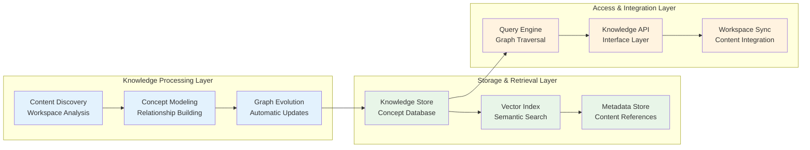
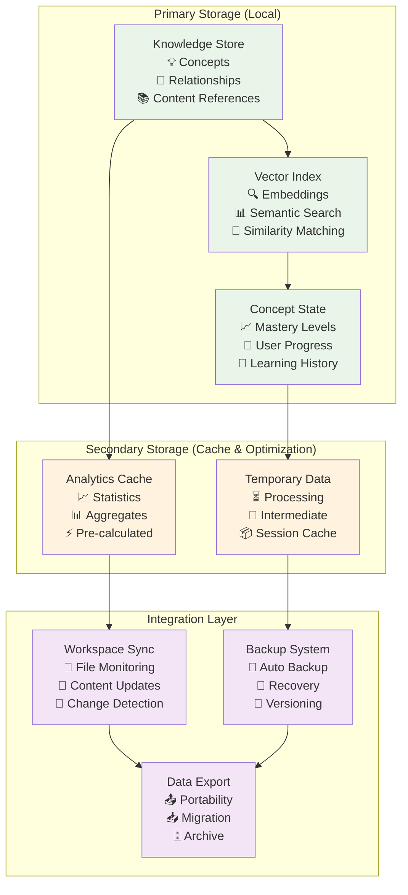

# Knowledge Management System Architecture

---
title: Learning Catalyst Knowledge Management System Architecture
description: Focused architectural design for knowledge management, concept modeling, and learning data organization
version: 1.0.0
last_updated: 2025-10-12
difficulty: "Advanced"
estimated_time: "45 minutes"
---

## Overview

This document focuses on the Knowledge Management System (KMS) architecture - the core component that maintains rich semantic relationships between concepts, manages learning data, and enables intelligent content discovery. The KMS serves as the foundation for all learning activities by providing structured knowledge representation and efficient data management.

### Knowledge Management Philosophy

The KMS architecture is built on three core principles:

1. **Knowledge Graph Centric**: All learning activities are contextualized within a rich knowledge representation model
2. **Dynamic Discovery**: Automatic content analysis and relationship identification from workspace materials
3. **Privacy-First Storage**: Local-first design ensures user data sovereignty while enabling powerful features

## Core Knowledge Management Architecture

### Knowledge Graph System

### Core Knowledge Management Components

#### 1. Knowledge Graph Engine
**Purpose**: Maintains semantic relationships between concepts and learning materials

**Key Capabilities**:
- **Concept Modeling**: Rich representation with metadata, prerequisites, and relationships
- **Dependency Tracking**: Maps learning prerequisites and concept hierarchies
- **Relationship Discovery**: Identifies cross-domain connections through semantic analysis
- **Graph Evolution**: Automatic updates based on workspace content changes

#### 2. Content Discovery System
**Purpose**: Analyzes workspace materials to extract and organize knowledge

**Key Capabilities**:
- **Workspace Scanning**: Identifies learning materials across multiple file formats
- **Concept Extraction**: Natural language processing to identify key concepts
- **Relationship Building**: Maps connections between concepts through content analysis
- **Semantic Indexing**: Creates searchable embeddings for intelligent discovery

#### 3. Knowledge Storage & Retrieval
**Purpose**: Efficient data management for knowledge operations

**Key Capabilities**:
- **Local-First Storage**: Privacy-focused data persistence with optional cloud sync
- **Vector Search**: Semantic similarity matching for concept discovery
- **Metadata Management**: Rich content references and learning material organization
- **Query Optimization**: Fast graph traversal and relationship resolution

## Concept Modeling System

### Knowledge Graph Data Architecture

The Knowledge Management System uses a comprehensive data model to represent concepts, relationships, and learning state. For detailed data model specifications, class diagrams, and Python implementation details, see the **[Knowledge Management API Reference](../api-reference/knowledge-management.md)**.

**Key Data Architecture Components**:
- **Concept Entity**: Primary knowledge representation with rich metadata and learning structures
- **Relationship Network**: Semantic connections between concepts with strength weighting and discovery tracking
- **Content Reference System**: Multi-format learning material links with relevance scoring and dynamic validation
- **Learning State Tracking**: User-specific progress monitoring, mastery assessment, and interaction history

**Data Model Design Principles**:
- **Rich Metadata**: Comprehensive concept metadata supporting domain classification, difficulty assessment, and learning preferences
- **Semantic Relationships**: Multiple relationship types (PREREQUISITE, ENABLES, RELATED_TO, CONTAINS) with strength indicators
- **User State Integration**: Direct linkage between concepts and individual learning progress and mastery tracking
- **Extensible Structure**: Flexible architecture supporting new relationship types, content formats, and learning metrics

## Dynamic Knowledge Discovery

### Content Processing Pipeline

```mermaid
flowchart LR
    subgraph "Workspace Analysis"
        FileScanner["File Scanner<br/>Multi-format Support"]
        ContentReader["Content Reader<br/>Text Extraction"]
    end

    subgraph "Concept Extraction"
        ConceptExtractor["Concept Extractor<br/>NLP Processing"]
        EntityRecognizer["Entity Recognizer<br/>Named Entity Detection"]
    end

    subgraph "Relationship Building"
        SemanticAnalyzer["Semantic Analyzer<br/>Context Analysis"]
        SimilarityEngine["Similarity Engine<br/>Vector Matching"]
        RelationshipBuilder["Relationship Builder<br/>Graph Construction"]
    end

    subgraph "Knowledge Graph"
        KnowledgeGraph["Knowledge Graph<br/>Concept Network"]
        MetadataEnrichment["Metadata Enrichment<br/>AI Enhancement"]
    end

    FileScanner --> ContentReader
    ContentReader --> ConceptExtractor
    ConceptExtractor --> EntityRecognizer
    EntityRecognizer --> SemanticAnalyzer
    SemanticAnalyzer --> SimilarityEngine
    SimilarityEngine --> RelationshipBuilder
    RelationshipBuilder --> KnowledgeGraph
    KnowledgeGraph --> MetadataEnrichment
```

### Discovery Architecture

**Core Processing Components**:

1. **Workspace Content Analysis Architecture**
   - **Multi-Format Scanning**: The system recursively scans workspace directories, identifying learning materials across supported formats (markdown, code files, documentation, configuration files)
   - **Content Extraction Pipeline**: Each identified file passes through a content extraction process that normalizes text, extracts code blocks, and identifies structural elements
   - **Concept Identification Engine**: Natural language processing algorithms identify key concepts, technical terms, and learning objectives within the extracted content
   - **Knowledge Graph Synthesis**: Extracted concepts and relationships are synthesized into a cohesive knowledge graph that represents the intellectual structure of the workspace

2. **Relationship Mapping Strategies**
   - **Semantic Analysis Engine**: Advanced NLP techniques analyze text semantics to identify conceptual relationships, dependencies, and thematic connections
   - **Structural Pattern Recognition**: Document organization, code hierarchies, and file system structures reveal implicit relationships between concepts
   - **Vector Similarity Processing**: Content embeddings are compared using vector similarity algorithms to identify related concepts across different contexts
   - **Behavioral Pattern Analysis**: User interaction patterns, learning sequences, and concept co-occurrence inform relationship strength and relevance

3. **Graph Evolution System**
   - **Continuous Monitoring**: File system watchers and content change detectors monitor workspace modifications in real-time
   - **Incremental Updates**: Changes are processed incrementally, updating only affected portions of the knowledge graph to maintain performance
   - **Feedback Integration**: User interactions, learning outcomes, and explicit feedback continuously refine relationship strengths and concept metadata
   - **Automated Enhancement**: AI algorithms continuously enhance the knowledge graph by identifying missing connections, suggesting new concepts, and improving categorization

## Data Storage & Knowledge Representation

### Local-First Data Architecture

### Knowledge Data Architecture

**Core Data Organization**:

The KMS organizes knowledge through three primary data architecture patterns that work together to create a rich, interconnected knowledge representation. For detailed data model specifications and implementation details, see the **[Knowledge Management API Reference](../api-reference/knowledge-management.md)**.

1. **Concept Entity Architecture**
   - **Identity & Metadata**: Each concept carries a unique identifier, descriptive metadata, domain classification, and difficulty assessment
   - **Learning Structure**: Concepts include estimated learning time, prerequisite dependencies, and curated content references
   - **Dynamic Evolution**: Concept metadata tracks creation, modification, and usage patterns to support continuous improvement
   - **User State Integration**: Concepts link to user-specific learning progress, mastery levels, and interaction history

2. **Content Reference System**
   - **Multi-Format Support**: References link to various learning materials (markdown documentation, code examples, interactive exercises, videos)
   - **Relevance Scoring**: Each reference is weighted by relevance to the concept, updated through user feedback and usage analytics
   - **Dynamic Validation**: The system continuously validates reference availability and updates content metadata
   - **Contextual Organization**: References are organized by learning style, difficulty progression, and topic relevance

3. **Relationship Network Architecture**
   - **Semantic Connections**: Relationships represent meaningful connections between concepts (prerequisites, dependencies, similarities)
   - **Strength Weighting**: Each relationship carries a strength indicator that reflects the degree of conceptual connection
   - **Discovery Origins**: Relationships are tracked by discovery method (semantic analysis, user feedback, structural patterns, AI inference)
   - **Evolution Mechanisms**: Relationship strengths are refined through user interactions and automated analysis

**Data Flow Architecture**:
- **Ingestion Processing**: Raw content flows through extraction, analysis, and relationship mapping
- **Storage Optimization**: Data is distributed across multiple storage layers based on access patterns and query requirements
- **Index Management**: Multiple index types support different query patterns (traversal, similarity, metadata queries)
- **Consistency Maintenance**: Background processes ensure data consistency across all storage layers and indexes

### Performance Optimization

**Query Optimization Strategies**:

1. **Multi-Level Caching**
   - **Memory Cache**: Frequently accessed concepts and relationships in RAM
   - **Disk Cache**: Persistent cache for faster startup and data retrieval
   - **Semantic Cache**: Cache queries by concept similarity for intelligent reuse

2. **Graph Traversal Optimization Architecture**
   - **Adaptive Algorithm Selection**: The query analyzer automatically selects the optimal traversal algorithm based on query patterns (bidirectional BFS for shortest paths, vector similarity for related concepts, optimized traversal for complex queries)
   - **Index-Aware Routing**: Queries are routed through the most efficient index combinations based on query type and access patterns
   - **Caching Strategy Integration**: Query results are cached using intelligent cache keys that consider query semantics and result sets
   - **Performance Monitoring**: Real-time query performance metrics continuously inform optimization strategies and index management

3. **Intelligent Index Strategy**
   - **Multi-Dimensional Indexing**: Concepts are indexed across multiple dimensions (semantic, structural, temporal, usage patterns) to support diverse query types
   - **Relationship Index Optimization**: Relationship traversal is optimized through specialized indexes that account for relationship types, strength weights, and directional queries
   - **Vector Index Management**: Semantic similarity is supported through approximate nearest neighbor indexes optimized for fast concept matching
   - **Content Index Integration**: Full-text search capabilities integrate with knowledge graph queries to enable content-based concept discovery

**Storage Architecture Optimization**:
- **Intelligent Compression**: Knowledge graph data is compressed using domain-aware algorithms that maintain query performance while reducing storage footprint
- **Batch Processing Architecture**: Bulk updates are processed through optimized pipelines that maintain data consistency while improving throughput
- **Resource Management**: Connection pooling, memory management, and I/O optimization ensure efficient resource utilization
- **Progressive Loading**: Knowledge graph sections are loaded on-demand based on access patterns and query requirements

## Internal KMS Operations

### Knowledge Processing Workflows

**Content Ingestion Pipeline**:
The KMS continuously processes workspace content through a multi-stage pipeline that transforms raw files into structured knowledge:

1. **File Discovery**: Background scanners monitor workspace directories for new, modified, or deleted learning materials
2. **Content Extraction**: Text, code, and structural elements are extracted and normalized for processing
3. **Concept Analysis**: Natural language processing identifies concepts, entities, and relationships within the content
4. **Knowledge Integration**: New concepts and relationships are integrated into the existing knowledge graph
5. **Index Updates**: All relevant indexes are updated to maintain query performance

**Graph Evolution Mechanisms**:
The knowledge graph continuously evolves through automated processes:

- **Change Detection**: File system watchers and content hash comparison identify modifications
- **Incremental Processing**: Only changed content is processed to maintain efficiency
- **Relationship Refinement**: Existing relationships are strengthened or weakened based on new evidence
- **Conflict Resolution**: Automated processes resolve inconsistencies and maintain graph integrity
- **Quality Assurance**: Continuous validation ensures knowledge graph accuracy and completeness

### Query Processing Architecture

**Query Analysis and Optimization**:
Incoming queries undergo sophisticated analysis to determine optimal execution strategies:

1. **Query Classification**: Queries are classified by type (traversal, similarity, lookup, analytical)
2. **Algorithm Selection**: The optimal algorithm is chosen based on query characteristics
3. **Index Planning**: The most efficient combination of indexes is selected
4. **Cache Checking**: Results are retrieved from cache when available
5. **Execution Monitoring**: Query performance is monitored for continuous optimization

**Result Processing Pipeline**:
Query results are processed through a multi-stage pipeline:

- **Result Assembly**: Data is gathered from multiple sources (graph traversal, indexes, cache)
- **Relevance Ranking**: Results are ranked using sophisticated relevance algorithms
- **Context Enhancement**: Additional context and metadata are added to results
- **Response Formatting**: Results are formatted according to the request type and usage context

### Performance Management

**Adaptive Optimization**:
The KMS continuously adapts its performance characteristics based on usage patterns:

- **Access Pattern Analysis**: Frequently accessed concepts and relationships are cached
- **Query Optimization**: Common query patterns are optimized and pre-computed
- **Resource Allocation**: System resources are dynamically allocated based on demand
- **Background Processing**: Non-critical operations are processed during low-usage periods

## Architecture Strengths & Implementation

### Key Design Principles

1. **Knowledge Graph Centric**: All learning activities contextualized within rich knowledge representation
2. **Privacy-First**: Local storage ensures data sovereignty with optional cloud enhancement
3. **Dynamic Discovery**: Automatic content analysis and relationship identification
4. **Performance Optimized**: Efficient caching, indexing, and query optimization
5. **Extensible Design**: Clear interfaces support future enhancement and integration

### Implementation Considerations

**Performance Targets**:
- Knowledge graph queries: < 100ms for typical traversals
- Content discovery: < 5 seconds for average workspace
- Semantic search: < 200ms for concept similarity matching
- Storage efficiency: Compress to < 20% of raw text size

**Scalability Patterns**:
- Horizontal scaling through knowledge graph partitioning
- Vertical scaling with optimized data structures
- Cache warming for frequently accessed knowledge domains
- Background processing for non-critical updates

## 🔗 Relationships

### Dependencies & Integration Points

**Upstream Dependencies**:
- **Provider Integration Module**: Embedding models for semantic search and concept similarity analysis
- **Configuration Module**: Knowledge graph settings, discovery parameters, and indexing preferences
- **CLI Module**: Workspace scanning commands and knowledge management interface

**Downstream Dependencies**:
- **AI Integration Module**: Knowledge context for agent decision-making and learning content generation
- **Learning Engine Module**: Concept relationships for personalized learning path creation
- **Assessment Core Module**: Knowledge dependencies for adaptive assessment design
- **Session Management Module**: Knowledge context persistence and learning state management

**Peer Dependencies**:
- **Data Storage Module**: Knowledge graph persistence and vector storage management
- **Analytics Engine Module**: Learning pattern analysis and knowledge gap identification

### Communication Patterns

**Synchronous Communication**:
- **Knowledge Queries**: AI Integration → Knowledge Graph for real-time concept retrieval
- **Content Discovery**: CLI Module → Content Discovery System for workspace analysis
- **Concept Search**: Learning Engine → Query Engine for learning path optimization

**Asynchronous Communication**:
- **Graph Evolution**: Content Discovery System → Knowledge Graph for continuous knowledge updates
- **Index Updates**: Query Engine → Vector Index for search optimization
- **Analytics Processing**: Knowledge Graph → Analytics Engine for usage pattern analysis

**Data Flow Patterns**:
- **Discovery Flow**: Workspace Files → Content Discovery → Concept Modeling → Knowledge Graph
- **Query Flow**: Learning Request → Query Engine → Knowledge Graph → Context Response
- **Evolution Flow**: Content Changes → Discovery System → Graph Updates → Index Refresh

### Evolution & Extension Points

**Knowledge Graph Evolution**:
- **Advanced Relationship Types**: Causal relationships, temporal dependencies, and conceptual hierarchies
- **Multi-Modal Knowledge**: Integration of visual, audio, and interactive content into knowledge graph
- **Cross-Lingual Knowledge**: Multi-language concept mapping and translation capabilities
- **Domain-Specific Ontologies**: Specialized knowledge structures for different learning domains

**Discovery Algorithm Evolution**:
- **AI-Enhanced Extraction**: Advanced NLP models for improved concept and relationship identification
- **Collaborative Curation**: User-guided knowledge graph refinement and validation
- **External Knowledge Integration**: Connection to external knowledge bases and ontologies
- **Real-Time Discovery**: Continuous workspace monitoring and incremental knowledge updates

**Query & Retrieval Evolution**:
- **Natural Language Queries**: Advanced semantic search with natural language understanding
- **Visual Knowledge Navigation**: Interactive graph visualization and exploration tools
- **Predictive Knowledge Suggestion**: Proactive content recommendations based on learning context
- **Cross-Domain Knowledge Discovery**: Identification of interdisciplinary connections

---

*Last updated: October 12, 2025*
*Version: 1.0.0*
*Focus: Knowledge Management Module Architecture*