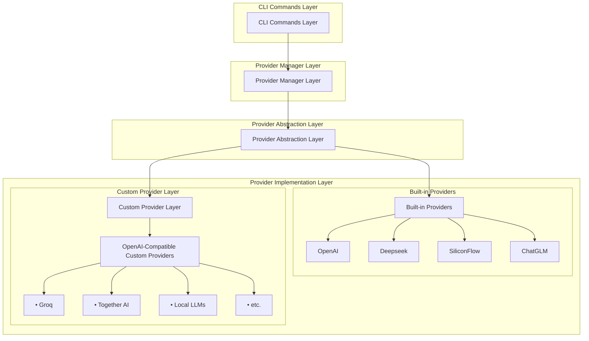
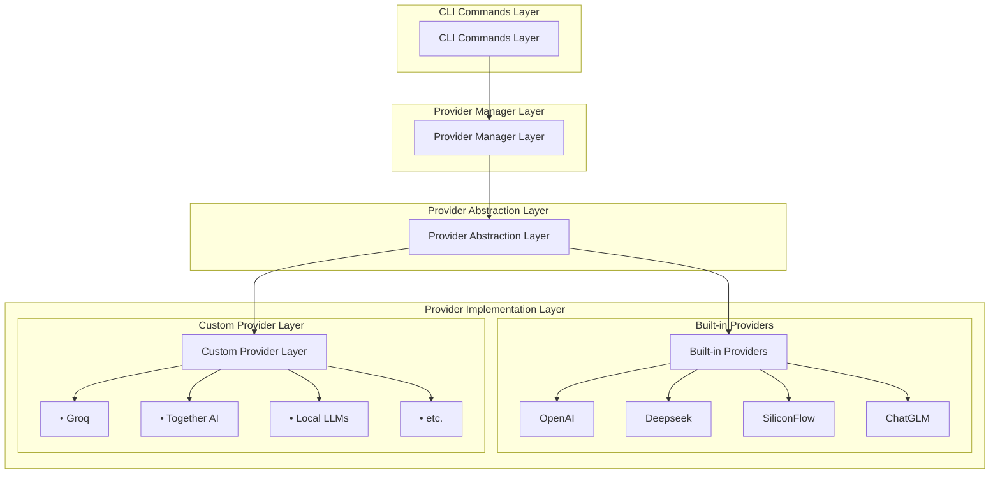
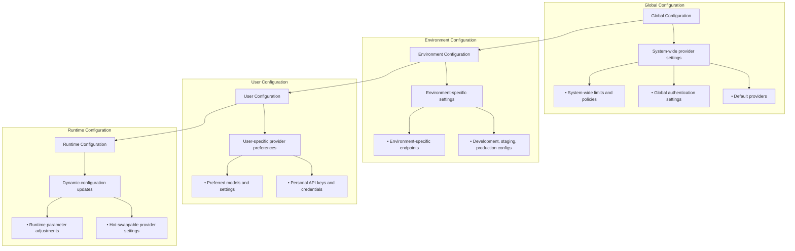
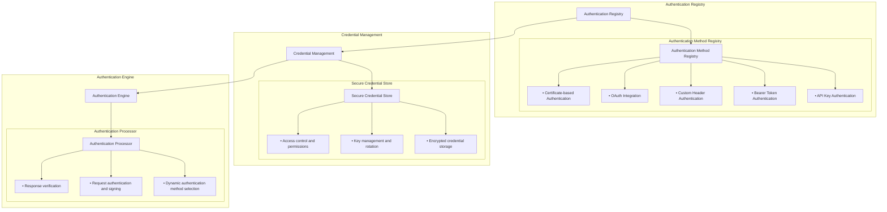
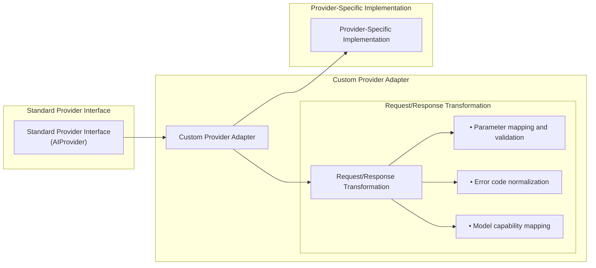
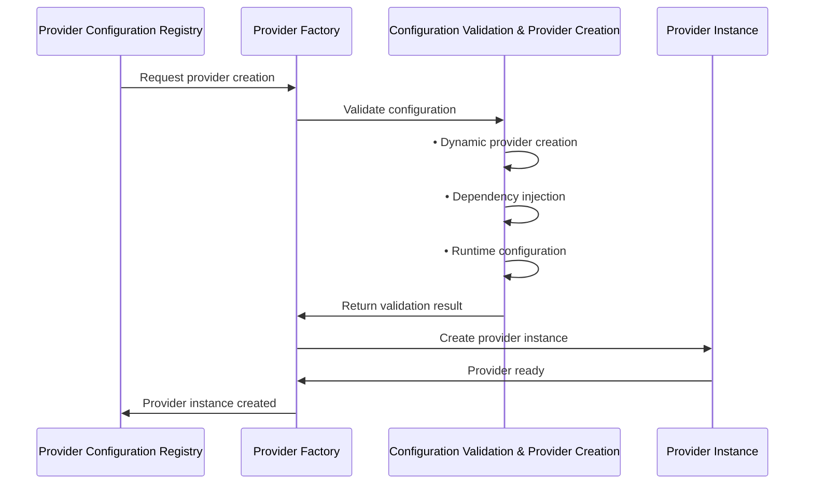
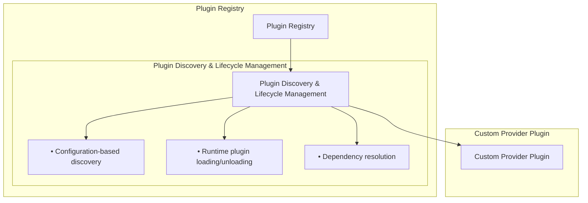
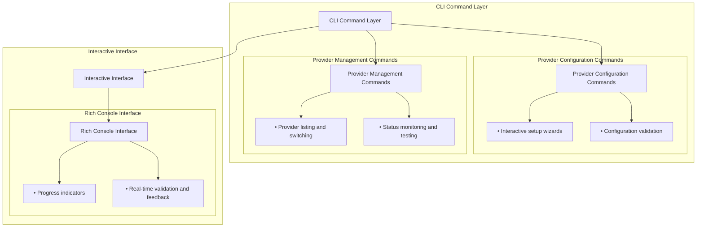
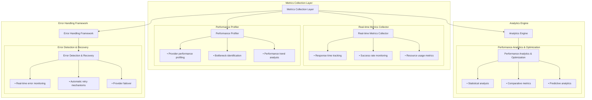

# Provider Integration Guide

---
title: Provider Integration Guide
description: Complete guide to integrating AI providers and models with Learning Catalyst
version: 1.0.0
last_updated: 2025-10-08
---

## 🎯 Overview

This guide provides comprehensive implementation patterns for integrating AI providers and models with Learning Catalyst CLI. It covers provider abstraction, model management, authentication, and the multi-provider architecture that enables seamless switching between different AI services.

## 🏗️ Provider Architecture

### Core Components

Learning Catalyst uses a layered provider architecture with custom provider support:



### Provider Abstraction Interface

All providers implement the same interface for consistency:

```python
from abc import ABC, abstractmethod
from typing import Dict, List, Optional, Any
import asyncio

class AIProvider(ABC):
    """Abstract base class for all AI providers"""

    def __init__(self, config: Dict[str, Any]):
        self.config = config
        self.name = config.get('name', self.__class__.__name__)
        self.models = []

    @abstractmethod
    async def initialize(self) -> bool:
        """Initialize the provider connection"""
        pass

    @abstractmethod
    async def get_available_models(self) -> List[str]:
        """Get list of available models"""
        pass

    @abstractmethod
    async def generate_response(self, prompt: str, **kwargs) -> str:
        """Generate AI response"""
        pass

    @abstractmethod
    async def validate_connection(self) -> bool:
        """Validate provider connection"""
        pass

    async def cleanup(self):
        """Cleanup resources"""
        pass
```

## 🔧 Provider Types

Learning Catalyst supports multiple provider categories that implement the `AIProvider` interface:

### Built-in Providers
- **OpenAI**: GPT models with standard OpenAI API integration
- **Deepseek**: Deepseek AI models with HTTP client integration
- **SiliconFlow**: Chinese language models (Qwen, ChatGLM, Yi)
- **ChatGLM**: ChatGLM model access through official API

### Custom/OpenAI-Compatible Providers
The architecture enables integration with any OpenAI-compatible endpoint, including:
- Third-party AI services (Groq, Together AI, Anthropic)
- Local LLM deployments (Ollama, LocalAI, custom serving)
- Enterprise API gateways and proxy services
- Specialized AI platforms with OpenAI-compatible endpoints

## 🔧 Custom Provider Architecture

### Core Design Principles

**1. Standardization Through Compatibility**
- Adheres to OpenAI API specification as universal interface
- Consistent request/response formats across all providers
- Standardized model discovery and configuration

**2. Configuration-Driven Architecture**
- Provider behavior defined through configuration rather than code
- Dynamic endpoint and model discovery based on settings
- Flexible authentication and header management

**3. Extensibility Without Modification**
- Plugin-like architecture for zero-code provider integration
- Runtime provider discovery and initialization
- Isolation of custom provider logic from core system

**4. Enterprise-Ready Integration**
- Support for corporate API gateways and proxy services
- Custom authentication schemes and security requirements
- Network topology flexibility

### Integration Architecture



### Key Integration Points

- **Provider Registration**: Configuration-based discovery and validation
- **Authentication Architecture**: Flexible patterns (API keys, OAuth, custom headers)
- **Model Discovery**: Automatic detection through OpenAI-compatible endpoints
- **Lifecycle Management**: Complete provider lifecycle from discovery to decommissioning

## 🔄 Provider Management

### Provider Manager Architecture

The Provider Manager serves as the central orchestrator for all AI providers, handling:

- **Provider Registration**: Dynamic addition and initialization of providers
- **Active Provider Management**: Seamless switching between providers and models
- **Request Routing**: Directing requests to the appropriate active provider
- **Health Monitoring**: Continuous validation of provider connections
- **Resource Management**: Proper cleanup and lifecycle management

### Core Capabilities

- **Multi-Provider Support**: Simultaneous management of multiple AI providers
- **Runtime Switching**: Dynamic provider and model switching without service interruption
- **Fallback Management**: Automatic provider failover and recovery
- **Model Discovery**: Automatic detection and cataloging of available models
- **Performance Tracking**: Monitoring of provider performance and availability

## ⚙️ Configuration Architecture

### Configuration Hierarchy



### Configuration Management Features

- **Multi-Level Support**: System, environment, user, and runtime configurations
- **Dynamic Updates**: Runtime configuration changes without system restart
- **Security Management**: Secure storage of sensitive configuration data
- **Schema Validation**: Comprehensive configuration validation and type checking

## 🔐 Authentication Architecture

### Authentication Framework



### Authentication Features

- **Flexible Authentication**: Support for multiple authentication methods (API keys, OAuth, custom headers)
- **Enterprise Integration**: Corporate authentication system integration (SAML, LDAP, SSO)
- **Security and Compliance**: Secure credential management with encryption and audit logging
- **Dynamic Selection**: Automatic authentication method selection based on provider requirements

## 🏗️ Core Architectural Patterns

### 1. Adapter Pattern

Enables custom providers to conform to the standard `AIProvider` interface while maintaining provider-specific characteristics:



**Benefits**: Interface consistency, provider isolation, extensibility

### 2. Configuration-Driven Factory Pattern

Dynamic provider creation based on configuration metadata:



**Benefits**: Dynamic creation, configuration validation, dependency management

### 3. Plugin Architecture

Zero-code integration through configuration-based discovery:



**Benefits**: Zero-code integration, isolation and security, dynamic management

## 🔧 CLI Integration Architecture

### Command Structure



### CLI Features
- **Interactive Setup**: Guided provider configuration wizards
- **Real-time Validation**: Immediate feedback on configuration changes
- **Status Monitoring**: Live provider health and availability information
- **Rich Interface**: Modern terminal experience with clear visual feedback

## 🔧 Model Discovery Architecture

### Model Discovery Process

```mermaid
graph TB
    subgraph "Model Discovery Engine"
        MDE[Model Discovery Engine]

        subgraph "Automatic Discovery"
            AD[Automatic Discovery]
            Endpoint[• OpenAI-compatible /models endpoint queries]
            Capability[• Model capability detection]
            Metadata[• Model metadata extraction]
        end

        subgraph "Manual Configuration"
            MC[Manual Configuration]
            Definition[• Manual model definition]
            UserInput[• Direct model ID input by user]
            Custom[• Custom model capabilities]
            Grouping[• Model grouping and categorization]
        end
    end

    subgraph "Model Registry"
        MR[Model Registry]
        subgraph "Model Metadata Store"
            MMS[Model Metadata Store]
            Features[• Model capabilities and features]
            Performance[• Performance characteristics]
            Usage[• Usage statistics and metrics]
            UserModels[• User-input model metadata]
            Validation[• Validation status and results]
        end
    end

    subgraph "Runtime Model Management"
        RMM[Runtime Model Management]
        subgraph "Model Availability Monitoring"
            MAM[Model Availability Monitoring]
            Health[• Health checks and status monitoring]
            Dynamic[• Dynamic model catalog updates]
            Fallback[• Model fallback and load balancing]
            UserValidation[• User-input model revalidation]
            Deprecation[• Deprecation monitoring and alerts]
        end
    end

    MDE --> AD
    AD --> Endpoint
    AD --> Capability
    AD --> Metadata

    MDE --> MC
    MC --> Definition
    MC --> UserInput
    MC --> Custom
    MC --> Grouping

    MDE --> MR
    MR --> MMS
    MMS --> Features
    MMS --> Performance
    MMS --> Usage
    MMS --> UserModels
    MMS --> Validation

    MR --> RMM
    RMM --> MAM
    MAM --> Health
    MAM --> Dynamic
    MAM --> Fallback
    MAM --> UserValidation
    MAM --> Deprecation
```



### Manual Model Input Workflow

**Direct Model ID Input**
Users can directly specify model IDs through:
- CLI commands: `lc provider add-model --provider openai --model-id "gpt-4-turbo-preview"`
- Interactive configuration prompts
- Configuration file entries
- REST API endpoints for programmatic access

**Model Validation Process**
When a user inputs a model ID, the system performs:
- **Format Validation**: Ensures model ID follows provider-specific patterns
- **Availability Check**: Queries provider to verify model exists and is accessible
- **Capability Detection**: Attempts to determine model features through API testing
- **Performance Testing**: Basic connectivity and response validation

**Use Cases for Manual Input**
- **Private/Fine-tuned Models**: Organization-specific models not in public catalogs
- **Beta Models**: New models not yet available through discovery endpoints
- **Custom Endpoints**: Models served through custom or internal endpoints
- **Model Variants**: Specific versions or configurations of base models
- **Enterprise Models**: Models accessible through corporate gateways or registries

### Model Validation & Capability Detection

**Input Validation Patterns**
- **OpenAI Models**: `gpt-4`, `gpt-3.5-turbo`, `text-davinci-003`, etc.
- **HuggingFace Models**: `meta-llama/Llama-2-70b-chat-hf`, `mistralai/Mistral-7B-v0.1`
- **Custom Providers**: Provider-specific formats and naming conventions
- **Local Models**: Custom identifiers for locally hosted models

**Capability Detection Process**
- **API Testing**: Send test prompts to determine model capabilities
- **Feature Detection**: Test for function calling, vision, code generation, etc.
- **Performance Profiling**: Measure response times and token limits
- **Error Pattern Analysis**: Identify limitations and special requirements

**Validation Status Tracking**
- **Pending**: Model ID received, validation in progress
- **Validated**: Model confirmed accessible and functional
- **Failed**: Model not found, inaccessible, or validation errors
- **Partial**: Model accessible but some capabilities could not be determined
- **Deprecated**: Model was previously available but is now deprecated or removed

### Unified Model Management

**Seamless Integration**
Both automatically discovered and user-input models are treated as first-class citizens in the system:
- **Unified Catalog**: Single model registry containing all model types
- **Consistent Interface**: Same API and CLI commands regardless of model source
- **Transparent Switching**: Users can switch between discovered and manual models seamlessly
- **Common Monitoring**: Same health checks and performance monitoring for all models

**Model Lifecycle Management**
- **Discovery**: Automatic detection or manual input of new models
- **Validation**: Comprehensive testing and capability assessment
- **Registration**: Addition to the unified model registry
- **Monitoring**: Continuous health and performance tracking
- **Deprecation**: Graceful handling of retired or unavailable models

**User Experience Benefits**
- **Zero Configuration**: Start with discovered models, add custom ones as needed
- **Progressive Enhancement**: Begin with basic setup, expand with specialized models
- **Enterprise Ready**: Support for corporate models and private deployments
- **Developer Friendly**: CLI commands and API access for all model management tasks

### Discovery Benefits
- **Automatic Integration**: Zero-configuration model discovery from OpenAI-compatible endpoints
- **User-Driven Integration**: Direct model ID input for custom, private, or beta models
- **Intelligent Classification**: Automatic model capability detection and use case recommendations
- **Runtime Management**: Real-time model availability monitoring and dynamic catalog updates
- **Flexibility**: Support for both discovered and manually specified models in unified interface
- **Enterprise Compatibility**: Handles corporate models, private endpoints, and specialized deployments
- **Developer Experience**: CLI and API access for comprehensive model management

## 📊 Performance and Monitoring Architecture

### Performance Monitoring Framework



### Monitoring Features
- **Real-time Performance Tracking**: Response times, success rates, resource usage
- **Intelligent Error Handling**: Automatic retry mechanisms and provider failover
- **Predictive Analytics**: Performance trends and capacity planning
- **Comprehensive Diagnostics**: Health monitoring and troubleshooting guidance

## 🔗 Integration References

### Related Documentation

- **[Integration Examples](../../examples/integration.md)** - User-facing provider setup guides
- **[Basic Workflows](../../examples/basic-workflows.md)** - Multi-provider usage patterns
- **[System Architecture](ai-integration.md)** - Core system architecture details
- **[Configuration API](../api-reference/configuration-api.md)** - Configuration management reference

---

This guide provides the architectural foundation for AI provider integration in Learning Catalyst, focusing on extensibility, standardization, and enterprise-ready design patterns.