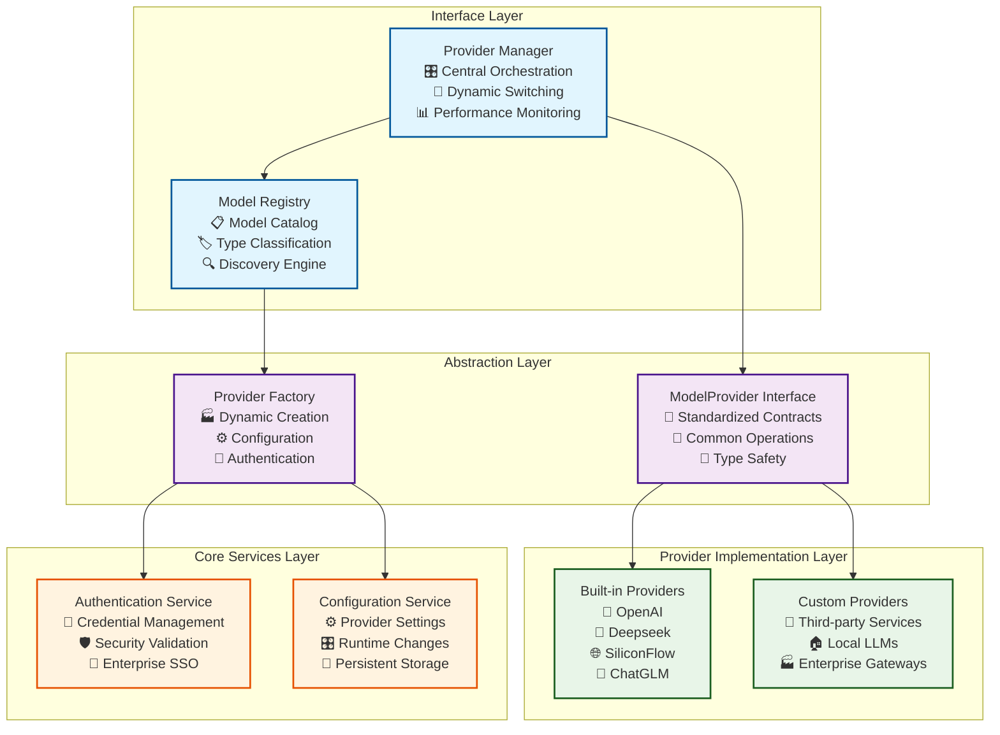
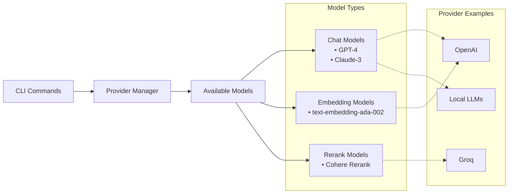

# Provider Integration Module Architecture

---
title: Provider Integration Module Architecture
description: AI provider management, model abstraction, and multi-provider orchestration architecture
version: 1.0.0
last_updated: 2025-10-12
difficulty: "Advanced"
estimated_time: "25 minutes"
---

## 🎯 What It Is

**Module Definition**: The Provider Integration Module is a core architectural component that enables seamless integration with multiple AI providers through standardized interfaces, providing model abstraction, dynamic provider switching, and enterprise-ready AI service orchestration.

**Core Purpose**: Create a unified, extensible interface for AI provider management that abstracts provider-specific complexities while maintaining flexibility for different deployment scenarios (cloud, local, enterprise gateways).

**Scope & Responsibilities**:
- AI provider interface standardization and abstraction
- Model discovery, cataloging, and lifecycle management
- Authentication and credential management across providers
- Dynamic provider switching and failover capabilities
- Performance monitoring
- Enterprise integration support for custom gateways

**Role in System**: Serves as the foundational bridge between Learning Core modules and external AI services, enabling all AI-powered functionality through a consistent, reliable interface.

## ⚙️ How It Works

### Internal Architecture Design

The Provider Integration Module follows a **layered abstraction architecture** with clear separation of concerns and provider-agnostic interfaces:



### Core Architectural Components

Learning Catalyst uses a layered provider architecture with model type selection:



**Simple Workflow:**
1. **CLI Command** executed (e.g., `lc chat`, `lc embed`, `lc rerank`)
2. **Provider Manager** accesses available models from configured providers
3. **Model Selection** chooses appropriate model type based on command:
   - **Chat Models** for conversational tasks and code generation
   - **Embedding Models** for semantic search and similarity matching
   - **Rerank Models** for content ranking and relevance scoring
4. **Provider Connection** routes to the provider that hosts the selected model

### Provider Interface Specifications

For detailed interface specifications, method signatures, and model definitions, see the **[Provider Interface API](../api-reference/provider-interfaces.md)** documentation.

The interface defines:
- `ModelProvider` abstract class with core provider contracts
- `AvailableModels` TypedDict for structured model discovery
- Model hierarchy (`Model`, `ChatModel`, `EmbeddingModel`, `RerankModel`)
- Method signatures and return types for all operations

### Provider Initialization

Providers are created with their API keys during initialization, ensuring immediate validation:

```python
# Example provider initialization
provider = OpenAIProvider(
    api_key="your-api-key-here",
    base_url="https://api.openai.com/v1"
)

# Provider validates credentials during creation
# Invalid credentials will cause initialization to fail immediately
```

**Key Principles:**
- **Fail-Fast Validation**: Providers validate API keys during initialization
- **No Runtime Validation**: No separate validation methods needed
- **Immediate Feedback**: Invalid credentials are caught at creation time
- **Secure Handling**: API keys are stored securely within provider instances

## 🔧 Provider Types

Learning Catalyst supports multiple provider categories that implement the `ModelProvider` interface:

### Built-in Providers
- **OpenAI**: GPT models with standard OpenAI API integration
- **Deepseek**: Deepseek AI models with HTTP client integration
- **SiliconFlow**: Chinese language models (Qwen, ChatGLM, Yi)
- **ChatGLM**: ChatGLM model access through official API

### Custom/OpenAI-Compatible Providers
The architecture enables integration with any OpenAI-compatible endpoint, including:
- Third-party AI services (Groq, Together AI, Anthropic)
- Local LLM deployments (Ollama, LocalAI, custom serving)
- Enterprise API gateways and proxy services
- Specialized AI platforms with OpenAI-compatible endpoints

### Design Principles

**1. Standardization**: All providers implement the same `ModelProvider` interface with consistent request/response formats

**2. Simple Implementation**: Provider behavior defined through class implementation with direct endpoint discovery

**3. Easy Extension**: New providers added by implementing the interface with clear separation between built-in and custom providers

**4. Enterprise-Ready**: Support for corporate API gateways, flexible authentication, and network topology flexibility

### Key Integration Points

- **Provider Registration**: Direct class registration and initialization
- **Authentication**: Consistent patterns (API keys, custom headers)
- **Model Discovery**: Automatic detection through provider endpoints
- **Lifecycle Management**: Standard initialization to cleanup workflow

## 🔄 Provider Management

The Provider Manager serves as the central orchestrator for all AI providers, handling dynamic registration, runtime switching, request routing, and resource management.

**Core Capabilities:**
- Multi-provider support with simultaneous management
- Runtime switching without service interruption
- Automatic failover and recovery mechanisms
- Automatic model detection and cataloging
- Performance tracking

## ⚙️ Configuration Architecture

The system uses a hierarchical configuration model with global, environment, user, and runtime levels that cascade and support dynamic updates.

**Features:**
- Multi-level configuration support
- Runtime configuration changes without restart
- Secure storage of sensitive data
- Comprehensive validation and type checking

## 🔐 Authentication Architecture

Providers handle authentication during initialization with fail-fast validation, automatic header management, and secure storage. Invalid credentials cause immediate initialization failure, and enterprise authentication patterns are supported through custom headers and endpoints.

## 🏗️ Core Architectural Patterns

**1. Interface Pattern**: All providers implement the same `ModelProvider` interface, ensuring consistency while allowing provider-specific implementations. Benefits include interface consistency, clear contracts, and extensibility.

**2. Simple Factory Pattern**: Direct provider creation based on provider type with clear type mapping and minimal complexity.

**3. OpenAI-Compatible Pattern**: Standardized implementation for OpenAI-compatible endpoints with dynamic endpoint configuration, flexible authentication, and standard model discovery. This provides standardization, broad compatibility, and simple integration.

## 🔧 CLI Integration Architecture

The CLI provides provider configuration commands with interactive setup wizards, provider management commands for listing and switching, and a rich interface with progress indicators and real-time validation feedback.

**Features:**
- Interactive setup wizards for guided configuration
- Real-time validation with immediate feedback
- Status monitoring with performance information
- Modern terminal experience with clear visual feedback

## 🔧 Model Discovery Architecture

The system supports both automatic model discovery from provider endpoints and manual model configuration for custom deployments. Models are classified into three main types:

### Model Types

**Chat Models**: For conversational AI with context management, temperature control, streaming, and tool use (e.g., GPT-4, Claude).

**Embedding Models**: For semantic understanding and text similarity with vector output and batch processing (e.g., text-embedding-ada-002).

**Rerank Models**: For content ranking and relevance scoring with efficient query-document matching (e.g., Cohere rerank models).

### Model Management

**Discovery & Input**: Models can be automatically discovered or manually added via CLI commands, configuration files, or API endpoints.

**Validation**: System performs format validation, availability checks, capability detection, and performance testing for all models.

**Unified Catalog**: All models (discovered and manual) share a single registry with consistent interfaces, monitoring, and lifecycle management.

**Type Management**: Automatic type detection through pattern matching and API testing, with manual override capabilities for custom classifications.

## 📊 Performance and Monitoring

The system includes comprehensive performance monitoring with real-time metrics collection, performance profiling, analytics, and intelligent error handling.

**Monitoring Features:**
- Real-time performance tracking of response times, success rates, and resource usage
- Intelligent error handling with automatic retry mechanisms and provider failover
- Predictive analytics for performance trends and capacity planning
- Comprehensive diagnostics with performance monitoring and troubleshooting guidance

## 🔗 Integration References

### Related Documentation

- **[Provider Interface API](../api-reference/provider-interfaces.md)** - Complete interface specifications and method signatures
- **[Integration Examples](../../examples/integration.md)** - User-facing provider setup guides
- **[Basic Workflows](../../examples/basic-workflows.md)** - Multi-provider usage patterns
- **[System Architecture](ai-integration.md)** - Core system architecture details
- **[Configuration API](../api-reference/configuration-api.md)** - Configuration management reference

## 🔗 Relationships

### Dependencies & Integration Points

**Upstream Dependencies**:
- **Configuration Module**: Provider settings, API keys, and model configurations
- **Data Storage Module**: Provider credentials storage and performance metrics persistence
- **CLI Module**: Provider configuration commands and management interface

**Downstream Dependencies**:
- **AI Integration Module**: Primary consumer of provider services for multi-agent orchestration
- **Knowledge Management System**: Uses embedding models for semantic search and concept discovery
- **Session Management**: Stores provider usage patterns and preferences in session context

**Peer Dependencies**:
- **Learning Engine Module**: Coordinates with providers for adaptive learning content generation
- **Assessment Core Module**: Uses provider models for question generation and evaluation

### Communication Patterns

**Synchronous Communication**:
- **Direct API Calls**: AI Integration Module → Provider Manager for real-time model inference
- **Configuration Updates**: CLI Module → Provider Manager for provider settings changes

**Asynchronous Communication**:
- **Performance Metrics**: Provider Manager → Data Storage Module for usage analytics
- **Model Discovery**: Provider Manager → Provider Implementations for automatic model detection
- **Failover Events**: Provider Manager → AI Integration Module for provider switching notifications

**Data Flow Patterns**:
- **Configuration Flow**: CLI → Configuration → Provider Manager → Provider Implementations
- **Inference Flow**: AI Integration → Provider Manager → Selected Provider → Model Response

### Evolution & Extension Points

**Provider Evolution**:
- **New Provider Integration**: Implement ModelProvider interface with provider-specific logic
- **Model Type Extension**: Add new model categories (vision, audio, multimodal) through type system
- **Authentication Enhancement**: Support new auth methods (OAuth, SAML, mTLS) through auth service

**Interface Evolution**:
- **Backward Compatibility**: Interface versioning ensures existing providers continue working
- **Feature Enhancement**: Optional interface methods for advanced provider capabilities
- **Standard Extension**: New standardized operations across all providers (streaming, batching)

**Architecture Evolution**:
- **Multi-Region Support**: Provider routing based on geographic and performance considerations
- **Cost Optimization**: Intelligent provider selection based on usage patterns and pricing
- **Edge Computing**: Local provider caching and offline inference capabilities

---

This guide provides the architectural foundation for AI provider integration in Learning Catalyst, focusing on extensibility, standardization, and enterprise-ready design patterns.