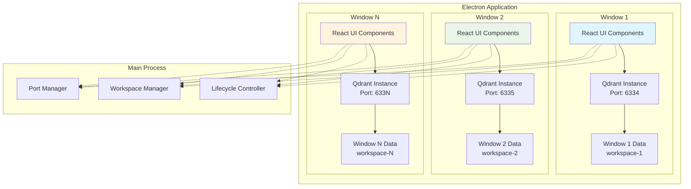
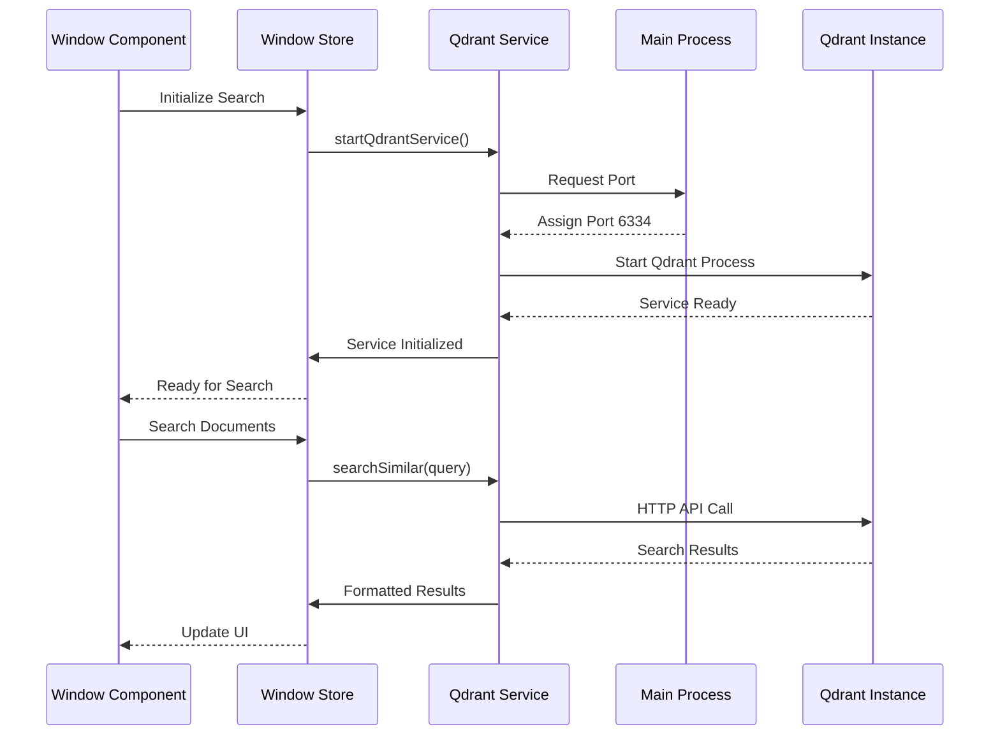
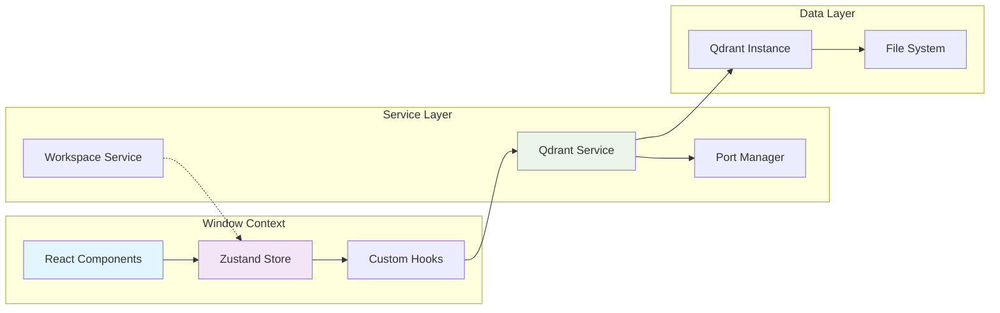
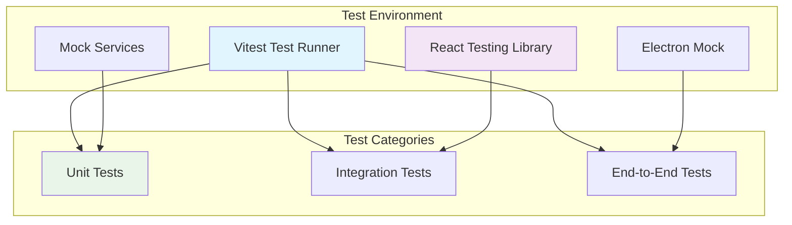
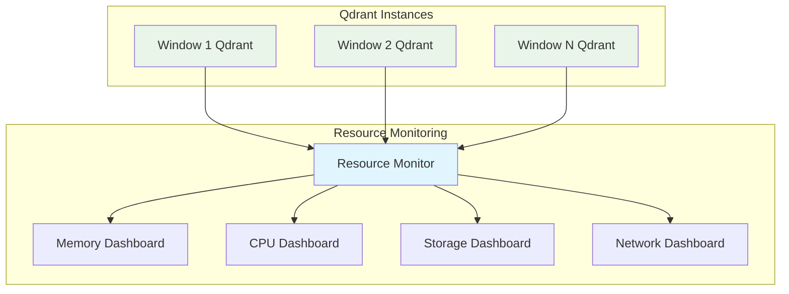

# Detailed Documentation for Integrating Qdrant with Electron


## 1. Solution Overview

### 1.1 Background and Objectives
Qdrant is a high-performance vector database that supports core functionalities such as similarity search and metadata filtering, widely used in semantic retrieval, recommendation systems, and other scenarios. This solution aims to integrate Qdrant into Electron desktop applications to enable **local vector storage and retrieval capabilities**. It also addresses issues like service conflicts and resource usage in multi-window scenarios, ultimately providing a stable and efficient local vector database service.


### 1.2 Core Advantages
- **Local Deployment**: No reliance on cloud services, supporting offline use with controllable data privacy.
- **Window-Scoped Services**: Each window runs its own Qdrant instance with independent data and resources.
- **Workspace Isolation**: Each workspace is bound to a specific window, ensuring complete data separation.
- **React Integration**: Seamless integration with existing React-based architecture and TypeScript.
- **Complete Function Chain**: Covers the entire workflow from vector generation (text-to-vector), data insertion, to similarity query.


### 1.3 Application Scenarios
- Local document semantic search (e.g., notes, codebase retrieval).
- Offline recommendation systems (e.g., local music, image recommendations).
- Embedded AI applications (combining large models for local knowledge base Q&A).


## 2. Technology Stack and Dependencies

### 2.1 Core Technology Stack
| Component               | Version Requirement | Role                                   |
|-------------------------|---------------------|----------------------------------------|
| Electron                | ≥25.0.0             | Cross-platform desktop application framework |
| Qdrant Client           | ≥1.7.0              | Node.js Qdrant client                  |
| @qdrant/qdrant-bin      | ≥1.7.0              | Qdrant binary (local service)          |
| @xenova/transformers    | ≥2.5.0              | Text embedding model (vector generation) |


### 2.2 Environment Preparation
- **Operating System**: Windows 10+/macOS 12+/Linux (Ubuntu 20.04+).
- **Node.js**: ≥16.0.0 (18.x LTS recommended).
- **Dependency Installation**:
  ```bash
  # Initialize project
  mkdir electron-qdrant && cd electron-qdrant
  npm init -y

  # Install core dependencies
  npm install electron qdrant-client @xenova/transformers
  npm install @qdrant/qdrant-bin --save-dev  # Dev dependency (Qdrant binary)
  ```


## 3. Architecture Design

### 3.1 Overall Architecture
Adopts a "**Window-Scoped Service Architecture**" where each window manages its own Qdrant instance, with core layers as follows:



- **React Components**: Window-specific UI components using TypeScript and Tailwind CSS
- **Window-Scoped Services**: Each window manages its own Qdrant instance with dynamic port allocation
- **Isolated Data Storage**: Each window stores vectors in separate directories
- **Workspace Binding**: Each workspace is assigned to a specific window for complete isolation
- **Main Process Coordination**: Port management, workspace binding, and lifecycle control


### 3.2 Key Design Decisions
1. **Window-Scoped Qdrant Services**:
   Each window manages its own Qdrant instance with dynamic port allocation to avoid conflicts and ensure complete workspace isolation.

2. **Workspace-Window Binding**:
   Each workspace is bound to a specific window, preventing cross-workspace data access and ensuring complete data separation.

3. **React Integration Architecture**:
   Uses React components with TypeScript, Tailwind CSS, and Zustand for state management, following the existing application patterns.

4. **Dynamic Port Management**:
   Implements automatic port allocation and conflict resolution to support multiple Qdrant instances simultaneously.

5. **Isolated Data Storage**:
   Each window stores Qdrant data in separate directories within the user data folder, ensuring workspace isolation.

6. **Local Vector Generation**:
   Uses `@xenova/transformers` to load lightweight embedding models (e.g., `all-MiniLM-L6-v2`) for local text-to-vector conversion, eliminating reliance on cloud APIs.


## 4. Detailed Implementation Steps

### 4.1 Project Structure
```
src/
├── services/storage/
│   ├── qdrantService.ts          # Window-scoped Qdrant service
│   ├── portManager.ts            # Dynamic port allocation
│   └── windowStorage.ts          # Window-specific data storage
├── stores/
│   └── windowKnowledgeStore.ts   # Window-scoped Zustand store
├── types/
│   └── qdrant.ts                 # TypeScript type definitions
├── components/knowledge/
│   ├── WindowVectorSearch.tsx    # React component for vector search
│   └── VectorSearchResults.tsx   # Results display component
├── hooks/
│   └── useWindowQdrantLifecycle.ts # Window lifecycle management
├── main/ipc/
│   └── qdrantHandlers.ts         # IPC handlers for Qdrant operations
└── utils/
    └── workspaceService.ts       # Workspace-window binding
```

### 4.2 TypeScript Type Definitions

```typescript
// src/types/qdrant.ts
export interface QdrantDocument {
  id: string;
  text: string;
  category: string;
  vector?: number[];
  metadata?: Record<string, any>;
}

export interface SearchResult {
  id: string;
  text: string;
  category: string;
  score: number;
  metadata?: Record<string, any>;
}

export interface WindowQdrantConfig {
  windowId: string;
  port: number;
  dataDirectory: string;
  collectionName: string;
  modelPath?: string;
}

export interface VectorSearchOptions {
  topK: number;
  threshold?: number;
  filter?: Record<string, any>;
}

// Store interface for Zustand
export interface WindowKnowledgeStore {
  windowId: string;
  qdrantService: QdrantService | null;
  isInitialized: boolean;
  isSearching: boolean;
  searchResults: SearchResult[];

  // Actions
  initializeQdrant: () => Promise<void>;
  searchInWindow: (query: string, options?: VectorSearchOptions) => Promise<SearchResult[]>;
  insertInWindow: (documents: QdrantDocument[]) => Promise<void>;
  createCollection: () => Promise<void>;
  clearResults: () => void;
}
```


### 4.3 Service Layer Architecture

#### 4.3.1 Window-Scoped Qdrant Service
Each window manages its own Qdrant instance with the following key components:

- **Dynamic Port Allocation**: Automatic port assignment to avoid conflicts
- **Isolated Data Storage**: Window-specific data directories
- **Embedding Model Management**: Local text-to-vector conversion
- **Lifecycle Management**: Service start/stop tied to window lifecycle

#### 4.3.2 Port Management System
Centralized port allocation and conflict resolution:

- **Available Port Detection**: Scan for free ports starting from base port
- **Port Tracking**: Maintain registry of allocated ports
- **Cleanup on Window Close**: Automatic port release when windows close
- **Conflict Resolution**: Handle port contention gracefully

#### 4.3.3 Workspace-Window Binding
Service to manage workspace-window relationships:

- **One-to-One Mapping**: Each workspace bound to specific window
- **Assignment Management**: Create, update, and remove bindings
- **Isolation Enforcement**: Prevent cross-workspace data access
- **Query Interface**: Lookup windows by workspace and vice versa

### 4.4 State Management Integration

#### 4.4.1 Window-Scoped Zustand Store
Each window maintains its own knowledge store instance:

- **Window ID Scoping**: Store instances keyed by window identifier
- **Service Integration**: Direct access to window's Qdrant service
- **React Component Binding**: Seamless integration with UI components
- **State Persistence**: Maintain state across window refreshes

#### 4.4.2 React Component Architecture
React components designed for window-specific operations:

- **Window Context**: Components aware of their window scope
- **Service Hooks**: Custom hooks for Qdrant operations
- **State Synchronization**: Real-time UI updates with search results
- **Error Boundaries**: Graceful error handling per window

### 4.5 IPC Communication Flow



### 4.6 React Component Integration

#### 4.6.1 Window-Scoped Vector Search Component
React components designed to work with specific window instances:

- **Window Context Awareness**: Components automatically detect their window scope
- **Service Integration**: Direct integration with window's Qdrant service
- **State Management**: Seamless integration with Zustand stores
- **Error Handling**: Graceful error boundaries for service failures

#### 4.6.2 Custom Hooks Architecture
Specialized hooks for window-specific Qdrant operations:

- **`useWindowQdrant()`**: Access window's Qdrant service
- **`useVectorSearch()`**: Handle search operations and results
- **`useQdrantLifecycle()`**: Manage service initialization and cleanup
- **`useWorkspaceBinding()`**: Access workspace-window relationships

#### 4.6.3 UI Component Hierarchy
Component structure following React best practices:

```
WindowVectorSearch
├── SearchInput (query input with debouncing)
├── SearchOptions (topK, threshold, filters)
├── SearchButton (trigger search)
└── SearchResults
    ├── ResultItem (individual search result)
    ├── ResultMetadata (category, score, metadata)
    └── ResultActions (view details, export)
```

### 4.7 Data Flow Architecture


const { execFile } = require('child_process');
const path = require('path');
const { QdrantClient } = require('qdrant-client');
const { pipeline } = require('@xenova/transformers');

// Global variables
let qdrantProcess = null;       // Qdrant service process
let qdrantClient = null;        // Qdrant client instance
let mainWindow = null;          // Main window reference
const QDRANT_PORT = 6333;       // Fixed port (to avoid conflicts)
const COLLECTION_NAME = 'electron_collection';  // Vector collection name


// 1. Restrict app to single instance (prevent multi-instance port conflicts)
const singleInstanceLock = app.requestSingleInstanceLock();
if (!singleInstanceLock) {
  app.quit();  // Exit if another instance is running
} else {
  app.on('second-instance', () => {
    // Activate existing window (when user re-launches)
    if (mainWindow) {
      if (mainWindow.isMinimized()) mainWindow.restore();
      mainWindow.focus();
    }
  });
}


// 2. Start Qdrant service
function startQdrantService() {
  return new Promise((resolve, reject) => {
    // Get Qdrant binary path (auto-downloaded by @qdrant/qdrant-bin)
    const qdrantBinPath = require('@qdrant/qdrant-bin').path;
    // Data storage path (user data directory, cross-platform compatible)
    const dataDir = path.join(app.getPath('userData'), 'qdrant_data');

    // Start Qdrant service with parameters
    qdrantProcess = execFile(
      qdrantBinPath,
      [
        '--port', QDRANT_PORT,         // Bind port
        '--storage-path', dataDir,     // Data storage directory
        '--log-level', 'warn'          // Log level (reduce output)
      ],
      (error) => { if (error) reject(new Error(`Service startup failed: ${error.message}`)); }
    );

    // Listen to service output to confirm successful startup
    qdrantProcess.stdout.on('data', (data) => {
      if (data.toString().includes('Started http server')) {
        console.log('Qdrant service started successfully');
        resolve();
      }
    });
  });
}


// 3. Stop Qdrant service (on app exit)
function stopQdrantService() {
  if (qdrantProcess) {
    qdrantProcess.kill('SIGINT');  // Graceful termination
    qdrantProcess = null;
    console.log('Qdrant service stopped');
  }
}
```


#### 4.2.2 Qdrant Client Initialization and Vector Operation Encapsulation
```javascript
// 4. Initialize Qdrant client and embedding model
async function initQdrantClient() {
  // Connect to local Qdrant service
  qdrantClient = new QdrantClient({ host: 'localhost', port: QDRANT_PORT });
  
  // Preload embedding model (generates 384-dimensional vectors; ~200MB download on first run)
  await pipeline('feature-extraction', 'Xenova/all-MiniLM-L6-v2');
  console.log('Qdrant client and embedding model initialized');
}


// 5. Encapsulate core vector database operations
const QdrantService = {
  // 5.1 Create collection (if not exists)
  async createCollection() {
    if (!qdrantClient) throw new Error('Qdrant client not initialized');

    const collections = await qdrantClient.getCollections();
    const exists = collections.collections.some(c => c.name === COLLECTION_NAME);
    if (exists) return { success: true, message: `Collection ${COLLECTION_NAME} already exists` };

    // Create collection (configure vector dimensions and distance metric)
    await qdrantClient.createCollection(COLLECTION_NAME, {
      vectors: {
        size: 384,          // Matches embedding model output dimension
        distance: 'Cosine'  // Cosine distance (suitable for text vectors)
      }
    });
    return { success: true, message: `Collection ${COLLECTION_NAME} created successfully` };
  },

  // 5.2 Insert text data (auto-generate vectors)
  async insertDocuments(documents) {
    if (!qdrantClient) throw new Error('Qdrant client not initialized');

    // Load embedding model to generate vectors
    const embedder = await pipeline('feature-extraction', 'Xenova/all-MiniLM-L6-v2');
    const points = await Promise.all(
      documents.map(async (doc, index) => {
        // Text to vector (normalized)
        const result = await embedder(doc.text, { pooling: 'mean', normalize: true });
        const vector = Array.from(result.data).map(x => parseFloat(x.toFixed(6)));

        // Build Qdrant point structure (id + vector + metadata)
        return {
          id: index + 1,  // Unique ID (customizable)
          vector: vector,
          payload: {      // Metadata (text content, category, etc.)
            text: doc.text,
            category: doc.category || 'default'
          }
        };
      })
    );

    // Insert data into Qdrant
    await qdrantClient.upsert(COLLECTION_NAME, { points });
    return { success: true, inserted: points.length };
  },

  // 5.3 Similarity search (text→vector→search)
  async searchSimilar(queryText, topK = 3) {
    if (!qdrantClient) throw new Error('Qdrant client not initialized');

    // Generate query vector
    const embedder = await pipeline('feature-extraction', 'Xenova/all-MiniLM-L6-v2');
    const result = await embedder(queryText, { pooling: 'mean', normalize: true });
    const queryVector = Array.from(result.data).map(x => parseFloat(x.toFixed(6)));

    // Execute similarity search
    const searchResult = await qdrantClient.search(COLLECTION_NAME, {
      vector: queryVector,
      limit: topK,          // Return top N results
      withPayload: true     // Return metadata (text, category, etc.)
    });

    // Format results (user-friendly)
    return {
      success: true,
      data: searchResult.map(item => ({
        text: item.payload.text,
        category: item.payload.category,
        score: item.score.toFixed(4)  // Similarity score (0~1, higher = more similar)
      }))
    };
  }
};
```


#### 4.2.3 IPC Interface Registration and Window Management
```javascript
// 6. Register IPC interfaces (for renderer process)
function registerIpcHandlers() {
  // Initialize Qdrant (start service + client)
  ipcMain.handle('qdrant:init', async () => {
    try {
      await startQdrantService();
      await initQdrantClient();
      return { success: true };
    } catch (err) {
      return { success: false, error: err.message };
    }
  });

  // Create collection
  ipcMain.handle('qdrant:createCollection', async () => {
    try {
      return await QdrantService.createCollection();
    } catch (err) {
      return { success: false, error: err.message };
    }
  });

  // Insert data
  ipcMain.handle('qdrant:insert', async (_, docs) => {
    try {
      return await QdrantService.insertDocuments(docs);
    } catch (err) {
      return { success: false, error: err.message };
    }
  });

  // Similarity search
  ipcMain.handle('qdrant:search', async (_, { queryText, topK }) => {
    try {
      return await QdrantService.searchSimilar(queryText, topK);
    } catch (err) {
      return { success: false, error: err.message };
    }
  });
}


// 7. Create window (support multi-window)
function createWindow(isMain = false) {
  const win = new BrowserWindow({
    width: 1000,
    height: 800,
    webPreferences: {
      preload: path.join(__dirname, 'preload.js'),  // Preload script
      nodeIntegration: false,    // Disable Node integration (security best practice)
      contextIsolation: true     // Enable context isolation
    }
  });

  win.loadFile('index.html');  // Load frontend page
  if (isMain) mainWindow = win;  // Mark main window
  return win;
}


// 8. Configure application menu (support new window)
function setupApplicationMenu() {
  const menuTemplate = [
    {
      label: 'Window',
      submenu: [
        {
          label: 'New Window',
          click: () => createWindow(false)  // Create new window
        },
        { type: 'separator' },
        {
          label: 'Close Window',
          role: 'close'
        }
      ]
    }
  ];
  Menu.setApplicationMenu(Menu.buildFromTemplate(menuTemplate));
}


// 9. App lifecycle management
app.whenReady().then(() => {
  registerIpcHandlers();    // Register IPC interfaces
  setupApplicationMenu();   // Configure menu
  createWindow(true);       // Create main window

  // Activate app (macOS)
  app.on('activate', () => {
    if (BrowserWindow.getAllWindows().length === 0) {
      createWindow(true);
    }
  });
});

// Stop Qdrant service on app exit
app.on('will-quit', () => {
  stopQdrantService();
});
```


### 4.3 Preload Script (`preload.js`)
Safely exposes IPC interfaces to the renderer process, avoiding security risks from directly exposing `ipcRenderer`.

```javascript
const { contextBridge, ipcRenderer } = require('electron');

// Expose limited API to renderer process (only necessary operations)
contextBridge.exposeInMainWorld('qdrantAPI', {
  init: () => ipcRenderer.invoke('qdrant:init'),
  createCollection: () => ipcRenderer.invoke('qdrant:createCollection'),
  insert: (documents) => ipcRenderer.invoke('qdrant:insert', documents),
  search: (params) => ipcRenderer.invoke('qdrant:search', params)
});
```


### 4.4 Renderer Process (`index.html`)
Frontend interaction page that invokes main process functions via the exposed `qdrantAPI`.

```html
<!DOCTYPE html>
<html>
<head>
  <meta charset="UTF-8">
  <title>Electron + Qdrant Demo</title>
  <style>
    .container { padding: 20px; max-width: 1200px; margin: 0 auto; }
    .control-panel { margin: 20px 0; padding: 15px; border: 1px solid #eee; border-radius: 8px; }
    button { margin: 0 8px 8px 0; padding: 8px 16px; cursor: pointer; background: #0078d7; color: white; border: none; border-radius: 4px; }
    button:hover { background: #005a9e; }
    #queryInput { padding: 8px; width: 300px; margin-right: 8px; }
    #result { margin-top: 20px; padding: 15px; border: 1px solid #eee; border-radius: 8px; white-space: pre-wrap; }
  </style>
</head>
<body>
  <div class="container">
    <h1>Electron Integration with Qdrant Vector Database</h1>
    
    <div class="control-panel">
      <h3>Operation Steps</h3>
      <div>
        <button id="initBtn">1. Start Qdrant Service</button>
        <button id="createBtn">2. Create Vector Collection</button>
        <button id="insertBtn">3. Insert Test Data</button>
      </div>
      <div style="margin-top: 10px;">
        <input type="text" id="queryInput" value="Apple is a fruit" placeholder="Enter query text">
        <button id="searchBtn">4. Search Similar Texts</button>
      </div>
    </div>

    <div id="result">Operation results will be displayed here...</div>
  </div>

  <script>
    const resultDiv = document.getElementById('result');

    // 1. Start Qdrant service
    document.getElementById('initBtn').addEventListener('click', async () => {
      resultDiv.textContent = 'Starting Qdrant service... (First run may download model and binary)';
      const res = await window.qdrantAPI.init();
      resultDiv.textContent = JSON.stringify(res, null, 2);
    });

    // 2. Create vector collection
    document.getElementById('createBtn').addEventListener('click', async () => {
      resultDiv.textContent = 'Creating collection...';
      const res = await window.qdrantAPI.createCollection();
      resultDiv.textContent = JSON.stringify(res, null, 2);
    });

    // 3. Insert test data
    document.getElementById('insertBtn').addEventListener('click', async () => {
      const testDocuments = [
        { text: 'Apple is a sweet fruit rich in vitamins', category: 'food' },
        { text: 'Banana is a tropical fruit with a soft texture', category: 'food' },
        { text: 'Cat is a common domestic pet that likes fish', category: 'animal' },
        { text: 'JavaScript is a programming language for web interaction', category: 'technology' },
        { text: 'Python is a concise programming language suitable for data analysis', category: 'technology' }
      ];
      resultDiv.textContent = 'Inserting data...';
      const res = await window.qdrantAPI.insert(testDocuments);
      resultDiv.textContent = JSON.stringify(res, null, 2);
    });

    // 4. Search for similar texts
    document.getElementById('searchBtn').addEventListener('click', async () => {
      const queryText = document.getElementById('queryInput').value;
      resultDiv.textContent = 'Searching for similar texts...';
      const res = await window.qdrantAPI.search({ queryText, topK: 2 });
      resultDiv.textContent = JSON.stringify(res, null, 2);
    });
  </script>
</body>
</html>
```


## 5. Testing and Validation

### 5.1 Testing Strategy Overview

#### 5.1.1 Multi-Window Isolation Testing
Verify complete data and service isolation between windows:

- **Port Conflict Resolution**: Multiple windows can simultaneously run Qdrant on different ports
- **Data Isolation**: Data inserted in one window is not accessible from other windows
- **Service Independence**: Stopping Qdrant in one window doesn't affect other windows
- **Workspace Binding**: Each workspace is correctly bound to its window

#### 5.1.2 Service Lifecycle Testing
Test service startup, operation, and cleanup:

- **Service Initialization**: Automatic service start when window opens
- **Graceful Shutdown**: Proper service cleanup when window closes
- **Error Recovery**: Service restart after failures
- **Resource Cleanup**: Port release and data directory cleanup

#### 5.1.3 Component Integration Testing
React component testing with window context:

- **Window Context**: Components correctly identify their window scope
- **State Management**: Zustand stores work correctly per window
- **Service Integration**: Custom hooks properly interact with services
- **UI Responsiveness**: Real-time updates during search operations

### 5.2 Test Categories

#### 5.2.1 Unit Tests
- **Port Manager**: Port allocation and release logic
- **Workspace Service**: Assignment and lookup operations
- **Qdrant Service**: Basic operations without external dependencies
- **React Components**: Component rendering and user interactions

#### 5.2.2 Integration Tests
- **Service Integration**: End-to-end service workflows
- **IPC Communication**: Main process and renderer process interaction
- **Data Persistence**: Data storage and retrieval across sessions
- **Window Management**: Multiple window scenarios

#### 5.2.3 End-to-End Tests
- **User Workflows**: Complete user scenarios from start to finish
- **Performance Tests**: Resource usage with multiple windows
- **Error Scenarios**: Handling of service failures and conflicts
- **Multi-Window Workflows**: Complex interactions between windows

### 5.3 Test Environment Setup




### 5.4 Troubleshooting Common Issues

#### 5.4.1 Port-Related Issues
- **Port Conflicts**: Multiple windows trying to use the same port
  - Solution: Implement dynamic port allocation with proper port release
  - Check port usage: `netstat -ano | findstr 633` on Windows
- **Port Not Released**: Port remains allocated after window close
  - Solution: Ensure proper cleanup in window lifecycle hooks
  - Implement port timeout mechanism for forced release

#### 5.4.2 Service-Related Issues
- **Qdrant Startup Failure**: Service fails to start in window
  - Check data directory permissions and accessibility
  - Verify Qdrant binary installation and permissions
  - Monitor service logs for specific error messages
- **Service Memory Leaks**: Qdrant processes not properly terminated
  - Implement process monitoring and cleanup
  - Use timeout mechanisms for forced termination

#### 5.4.3 Performance Issues
- **Slow Model Loading**: First-time embedding model download
  - Pre-bundle models with application
  - Implement model caching and progress indicators
  - Use lighter models for resource-constrained environments
- **High Memory Usage**: Multiple Qdrant instances consuming excessive memory
  - Monitor memory usage per window
  - Implement resource limits and alerts
  - Optimize collection configuration for smaller datasets

### 5.5 Performance Monitoring

#### 5.5.1 Resource Metrics
Track key performance indicators:
- **Memory Usage**: Monitor per-window Qdrant process memory
- **CPU Usage**: Track embedding model and search operation costs
- **Disk I/O**: Monitor vector storage and retrieval performance
- **Network Activity**: Track HTTP API calls between services

#### 5.5.2 Alerting Thresholds
Set up monitoring for:
- Memory usage > 500MB per Qdrant instance
- Search response time > 2 seconds
- Port allocation failures
- Service startup timeouts > 30 seconds


## 6. Packaging and Deployment

### 6.1 Packaging Configuration
Use `electron-builder` to package the app, ensuring the Qdrant binary is included.

1. Install packaging tools:  
   ```bash
   npm install electron-builder --save-dev
   ```

2. Configure `package.json`:  
   ```json
   {
     "name": "electron-qdrant-demo",
     "version": "1.0.0",
     "main": "main.js",
     "scripts": {
       "start": "electron .",
       "dist": "electron-builder"
     },
     "build": {
       "appId": "com.example.electron-qdrant",
       "productName": "Electron Qdrant Demo",
       "asar": true,  // Encrypt packaged resources
       "extraResources": [
         {
           "from": "node_modules/@qdrant/qdrant-bin/bin",
           "to": "resources/qdrant"  // Package Qdrant binary to resources
         }
       ],
       "win": { "target": "nsis" },    // Windows installer
       "mac": { "target": "dmg" },     // macOS image
       "linux": { "target": "deb" }    // Linux deb package
     }
   }
   ```


### 6.2 Execute Packaging
```bash
npm run dist  # Generate platform-specific installers in the dist directory
```


## 7. Resource Management and Monitoring

### 7.1 Resource Management Strategy

#### 7.1.1 Window Resource Allocation
Implement resource limits per window to prevent system overload:

- **Memory Limits**: Maximum 500MB per Qdrant instance
- **CPU Limits**: Restrict embedding model operations to prevent UI blocking
- **Disk Space**: Monitor and limit vector data storage per window
- **Network**: Limit concurrent API calls to prevent system saturation

#### 7.1.2 Resource Monitoring Dashboard
Real-time monitoring interface for administrators:



#### 7.1.3 Automated Resource Management
Implement self-healing and optimization:

- **Automatic Cleanup**: Remove unused Qdrant instances after inactivity
- **Memory Optimization**: Compact vector collections when memory usage is high
- **Load Balancing**: Distribute search queries across available instances
- **Resource Scaling**: Adjust resource limits based on system capacity

### 7.2 Performance Optimization

#### 7.2.1 Model Optimization
- **Model Caching**: Pre-download and cache embedding models per window
- **Model Selection**: Choose appropriate model size based on dataset
- **Batch Processing**: Process multiple documents simultaneously
- **Progressive Loading**: Load models incrementally to reduce startup time

#### 7.2.2 Database Optimization
- **Index Tuning**: Configure HNSW parameters for optimal search performance
- **Collection Partitioning**: Split large collections for better performance
- **Query Optimization**: Implement query caching and result pagination
- **Storage Optimization**: Compress vector data to reduce disk usage

#### 7.2.3 Application Performance
- **Lazy Loading**: Initialize Qdrant services only when needed
- **Connection Pooling**: Reuse HTTP connections for API calls
- **Debouncing**: Delay search queries to reduce server load
- **Background Processing**: Offload intensive operations to background threads


### 7.3 Security Considerations

#### 7.3.1 Multi-Window Security
- **Window Isolation**: Ensure complete data isolation between windows
- **Port Security**: Secure port allocation to prevent unauthorized access
- **Process Sandboxing**: Run Qdrant processes with restricted permissions
- **Data Encryption**: Encrypt sensitive vector data at rest

#### 7.3.2 Application Security
- **IPC Security**: Validate all IPC communications between processes
- **Input Sanitization**: Sanitize user inputs before processing
- **Resource Access Control**: Limit file system access per window
- **Network Security**: Secure HTTP API communications

#### 7.3.3 Data Privacy
- **Local-Only Storage**: Ensure no data leaves the local environment
- **Workspace Isolation**: Prevent cross-workspace data leakage
- **Secure Cleanup**: Properly sanitize data on workspace deletion
- **Audit Logging**: Track data access and modifications

### 7.4 Scalability Considerations

#### 7.4.1 Window Scaling
- **Maximum Windows**: Limit concurrent windows based on system resources
- **Resource Scaling**: Dynamically adjust resources per window
- **Load Distribution**: Balance computational load across instances
- **Memory Management**: Implement efficient memory sharing between windows

#### 7.4.2 Data Scaling
- **Collection Limits**: Set reasonable limits on collection sizes
- **Index Strategy**: Optimize indexes for different dataset sizes
- **Storage Management**: Implement efficient storage compaction
- **Performance Monitoring**: Track performance degradation with scale

## 8. Conclusion

### 8.1 Architectural Benefits
This window-scoped Qdrant integration provides several key advantages for the Learning Catalyst application:

- **Complete Workspace Isolation**: Each workspace operates independently with its own Qdrant instance
- **Simplified Architecture**: No complex state synchronization between windows
- **Enhanced Security**: Complete data separation prevents cross-contamination
- **Better Performance**: Resources are dedicated per window, preventing contention
- **Easier Debugging**: Issues are isolated to specific windows and workspaces

### 8.2 Implementation Advantages
- **React Integration**: Seamless integration with existing React architecture
- **TypeScript Support**: Full type safety and better developer experience
- **Modern Patterns**: Follows established patterns for Zustand and React hooks
- **Testability**: Comprehensive testing strategy at all levels
- **Maintainability**: Clear separation of concerns and modular design

### 8.3 Future Extensibility
The architecture supports future enhancements:

- **Advanced Search**: Add semantic search with hybrid approaches
- **Multiple Models**: Support different embedding models per workspace
- **Cloud Sync**: Optional cloud backup for workspace data
- **Collaboration**: Share workspaces between users with proper security
- **Analytics**: Advanced analytics and insights for workspace usage

This architecture provides a solid foundation for local vector search capabilities while maintaining the simplicity and isolation required for a multi-window desktop application.