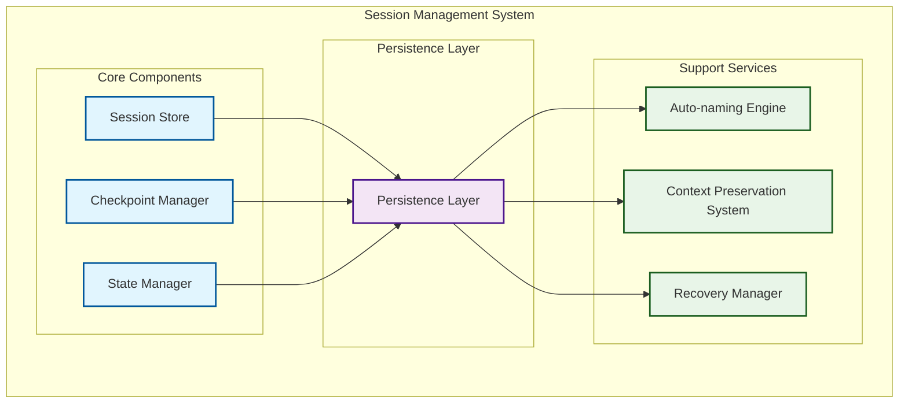
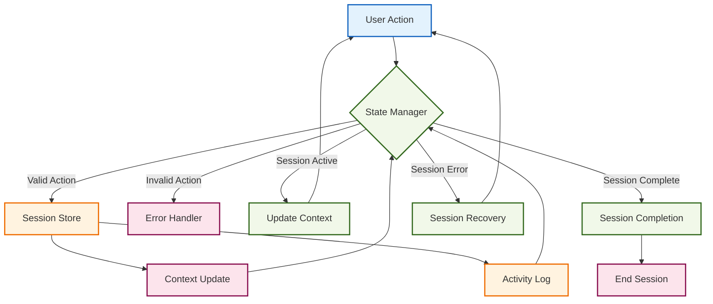
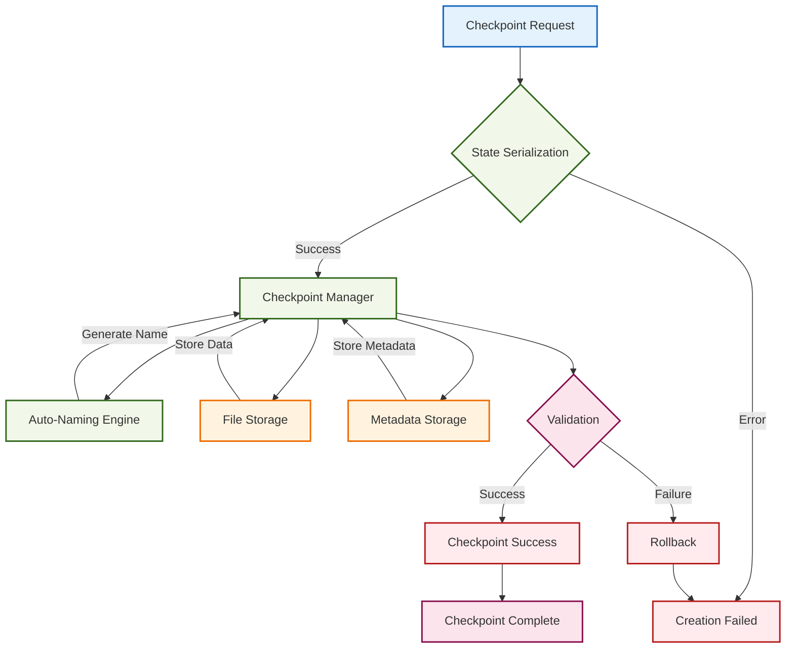
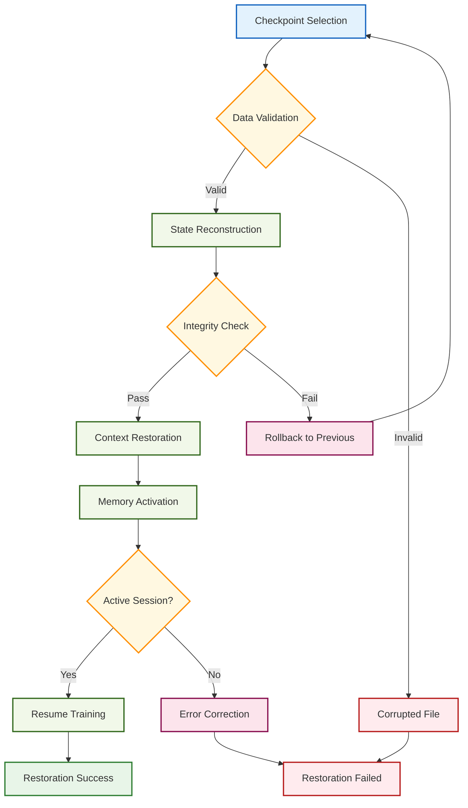

# Session Management Architecture

---
title: Session Management Architecture
description: System architecture for session persistence, checkpointing, and state management
version: 1.0.0
last_updated: 2025-10-11
difficulty: "Intermediate"
estimated_time: "20 minutes"
---

## Overview

Session management enables users to save their learning progress and resume it later with full context. This architecture focuses on the design patterns and system structure for session persistence, checkpointing, and state management in Learning Catalyst.

## System Architecture

### High-Level Architecture

### Core Architectural Components

1. **Session Store**: Manages active sessions and their metadata lifecycle
2. **Checkpoint Manager**: Creates and restores session checkpoints with integrity validation
3. **State Manager**: Maintains application state during sessions with serialization support
4. **Persistence Layer**: Handles data storage and retrieval with ACID compliance
5. **Auto-naming Engine**: Generates meaningful checkpoint names using context analysis
6. **Context Preservation**: Maintains conversation context across sessions using sliding window
7. **Recovery Manager**: Handles session recovery and error correction with rollback capabilities

## Architectural Design Patterns

### 1. Session Store Architecture

**Purpose**: Manages the lifecycle and metadata of learning sessions with ACID compliance.

**Key Design Decisions**:
- **SQLite Backend**: Provides atomic operations and referential integrity
- **Session Status State Machine**: Tracks session lifecycle (ACTIVE → PAUSED → COMPLETED → ARCHIVED)
- **Interaction Timeline**: Maintains chronological record of user interactions
- **Indexing Strategy**: Optimized queries for user sessions, status, and activity patterns

**Data Model**:
- **Sessions Table**: Core session metadata with timestamps and status tracking
- **Interactions Table**: Append-only log of user actions and system responses
- **Composite Indexes**: Support common query patterns and activity-based retrieval

### 2. Checkpoint Manager Architecture

**Purpose**: Provides atomic checkpoint creation and restoration with integrity validation.

**Key Design Decisions**:
- **File-Based Storage**: Large session data stored externally, metadata in database
- **Auto-Naming Engine**: Context-aware checkpoint naming using NLP pattern matching
- **Version Compatibility**: Forward and backward compatibility through schema versioning
- **Integrity Validation**: Checksums and validation during restore operations

**Auto-Naming Strategy**:
- **Topic Extraction**: Identifies learning domains from conversation context
- **Activity Classification**: Categorizes learning patterns (explanation, practice, troubleshooting)
- **Timestamp Fallback**: Ensures unique identifiers when context analysis fails

### 3. State Manager Architecture

**Purpose**: Maintains in-memory session state with efficient serialization and cleanup.

**Key Design Decisions**:
- **Memory-First Design**: Active sessions kept in memory for performance
- **Lazy Serialization**: State persisted only when checkpointing or on shutdown
- **Sliding Window Context**: Limited conversation history to manage memory usage
- **Automatic Cleanup**: Removes inactive sessions to prevent memory leaks

**State Components**:
- **Conversation Context**: Rolling window of recent interactions
- **Learning Progress**: Concept mastery tracking with temporal data
- **User Preferences**: Customizable session settings and themes
- **Application State**: Runtime configuration and feature flags

### 4. Persistence Layer Architecture

**Purpose**: Provides reliable data storage with transaction guarantees and performance optimization.

**Key Design Decisions**:
- **Hybrid Storage**: Database for metadata, file system for large objects
- **Transaction Safety**: ACID compliance for critical operations
- **Connection Pooling**: Efficient database connection management
- **Backup Integration**: Supports automated backup and recovery procedures

## Data Flow Architecture

### Session Lifecycle Flow

### Checkpoint Creation Flow

### Session Restoration Flow

## Performance Optimization Strategies

### Memory Management
- **State Culling**: Automatic removal of inactive sessions after configurable timeout
- **Context Windowing**: Limited conversation history to prevent unbounded memory growth
- **Lazy Loading**: Checkpoint data loaded only when explicitly requested
- **Connection Reuse**: Database connection pooling to reduce overhead

### Storage Optimization
- **Incremental Checkpoints**: Only changed state data persisted to reduce I/O
- **Data Compression**: JSON compression for checkpoint files to reduce storage footprint
- **Index Optimization**: Strategic database indexes for common query patterns
- **Cleanup Policies**: Automated removal of expired checkpoints and sessions

### Caching Strategies
- **Hot Session Cache**: Frequently accessed sessions kept in memory
- **Metadata Caching**: Session metadata cached to reduce database queries
- **Checkpoint Indexing**: In-memory index of available checkpoints for fast lookup
- **Context Preloading**: Recent conversation context preloaded for active sessions

## Security and Privacy Considerations

### Data Protection
- **Encryption at Rest**: Sensitive session data encrypted in storage
- **Secure Serialization**: Prevents injection attacks during state serialization
- **Access Control**: User-scoped session access with proper authorization
- **Data Retention**: Configurable retention policies for session data

### Integrity Guarantees
- **Checksum Validation**: Verify checkpoint integrity during restoration
- **Atomic Operations**: Ensure consistent state during checkpoint creation
- **Rollback Mechanisms**: Ability to restore previous state on failure
- **Audit Logging**: Complete audit trail of session management operations

## Integration Points

### CLI Interface Integration
- **Command Pattern**: Checkpoint commands follow established CLI patterns
- **Context Injection**: Session context automatically provided to commands
- **Response Formatting**: Consistent output formatting with other CLI commands
- **Error Handling**: Standardized error responses and recovery mechanisms

### Learning Engine Integration
- **State Synchronization**: Learning progress automatically tracked in session state
- **Context Awareness**: Learning engine receives full conversation context
- **Progress Persistence**: Learning milestones automatically checkpointed
- **Preference Integration**: User learning preferences incorporated into sessions

### Analytics Integration
- **Usage Tracking**: Session interaction patterns analyzed for insights
- **Progress Metrics**: Learning progress aggregated across sessions
- **Performance Analytics**: Session and checkpoint performance metrics
- **Behavioral Patterns**: User engagement patterns analyzed for optimization

## Scalability Considerations

### Horizontal Scaling
- **Session Sharding**: Sessions distributed across multiple storage nodes
- **Checkpoint Partitioning**: Large checkpoint datasets partitioned by user or time
- **Load Balancing**: Session management requests distributed across instances
- **State Replication**: Active session state replicated for high availability

### Vertical Scaling
- **Memory Optimization**: Efficient memory usage patterns for large session counts
- **Storage Tiering**: Hot session data on fast storage, cold data on economical storage
- **Database Optimization**: Query optimization and indexing for large datasets
- **Compression Algorithms**: Advanced compression for checkpoint data

## Monitoring and Observability

### Metrics Collection
- **Session Lifecycle Metrics**: Session creation, activity, and completion rates
- **Checkpoint Performance**: Checkpoint creation and restoration timing
- **Resource Utilization**: Memory and storage usage patterns
- **Error Rates**: Failure rates and error categorization

### Health Monitoring
- **Storage Health**: Disk space usage and I/O performance monitoring
- **Database Performance**: Query performance and connection pool health
- **Memory Usage**: Active session memory consumption and cleanup efficiency
- **Backup Status**: Automated backup success and restoration validation

## 🔗 Relationships

### Dependencies & Integration Points

**Upstream Dependencies**:
- **CLI Module**: Session commands, checkpoint operations, and user session initiation
- **Configuration Module**: Session settings, retention policies, and checkpoint preferences
- **Data Storage Module**: Database for session metadata and file system for checkpoint storage

**Downstream Dependencies**:
- **AI Integration Module**: Session context for agent conversations and learning continuity
- **Learning Engine Module**: Learning progress tracking and personalized workflow management
- **Knowledge Management System**: Knowledge context persistence and learning state integration

**Peer Dependencies**:
- **Analytics Engine Module**: Session interaction patterns and learning analytics
- **Context Manager Module**: Context preservation and session state coordination

### Communication Patterns

**Synchronous Communication**:
- **Session Operations**: CLI Module → Session Store for real-time session management
- **Checkpoint Creation**: State Manager → Checkpoint Manager for atomic session persistence
- **Context Retrieval**: AI Integration → Context Preservation for session continuity

**Asynchronous Communication**:
- **Background Cleanup**: Session Store → Recovery Manager for inactive session removal
- **Analytics Processing**: State Manager → Analytics Engine for usage pattern analysis
- **Auto-naming**: Context Preservation → Auto-naming Engine for intelligent checkpoint naming

**Data Flow Patterns**:
- **Session Creation**: CLI → Session Store → State Manager → Context Initialization
- **Checkpoint Flow: State Manager → Checkpoint Manager → File Storage → Metadata Update**
- **Restoration Flow**: CLI → Checkpoint Selection → State Reconstruction → Context Activation

### Evolution & Extension Points

**Session Evolution**:
- **Multi-User Sessions**: Collaborative learning environments with shared state management
- **Cross-Device Synchronization**: Session continuity across multiple devices and platforms
- **Session Templates**: Pre-configured session structures for different learning scenarios
- **Real-Time Collaboration**: Multi-user session sharing and interactive learning

**Checkpoint Evolution**:
- **Intelligent Checkpointing**: AI-driven checkpoint creation based on learning milestones
- **Differential Checkpoints**: Incremental state changes for efficient storage and transfer
- **Cloud Sync**: Optional cloud storage for checkpoint backup and cross-device access
- **Checkpoint Analytics**: Analysis of checkpoint usage patterns and optimization opportunities

**Context Management Evolution**:
- **Advanced Context Compression**: Intelligent context reduction for efficient session storage
- **Cross-Session Context**: Persistent learning context across multiple session instances
- **Context Visualization**: Interactive tools for session context exploration and understanding
- **Predictive Context Loading**: AI-driven context pre-loading based on learning patterns

---

*Last updated: October 12, 2025*
*Version: 1.0.0*
*Category: System Architecture*