# Workspace Markdown Auto-Initialization System

## Overview

This document outlines the design for automatically initializing Learning Catalyst concepts by scanning and processing markdown files in the workspace during app startup.

## Current System State Analysis

### What We Found

The current Learning Catalyst system implements a sophisticated **knowledge graph-based learning approach** but lacks integration with existing workspace markdown content. Here's what currently exists:

#### Existing Infrastructure
- **Knowledge Graph Module**: Concept-based learning with relationships
- **Database Schema**: Comprehensive SQLite database with concept, relationship, and session tables
- **Qdrant Integration**: Vector database for semantic search
- **Markdown Rendering**: Can display markdown using react-markdown
- **File System Access**: Basic file operations through Electron IPC

#### What's Missing
- **Workspace Scanning**: No mechanism to discover markdown files
- **Content Processing**: No markdown-to-concept conversion
- **File Watching**: No real-time monitoring for changes
- **Automatic Import**: No initialization from workspace content

### Current Architecture Gap

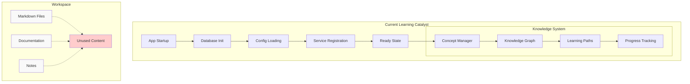

## Proposed Solution Architecture

### Enhanced System Flow

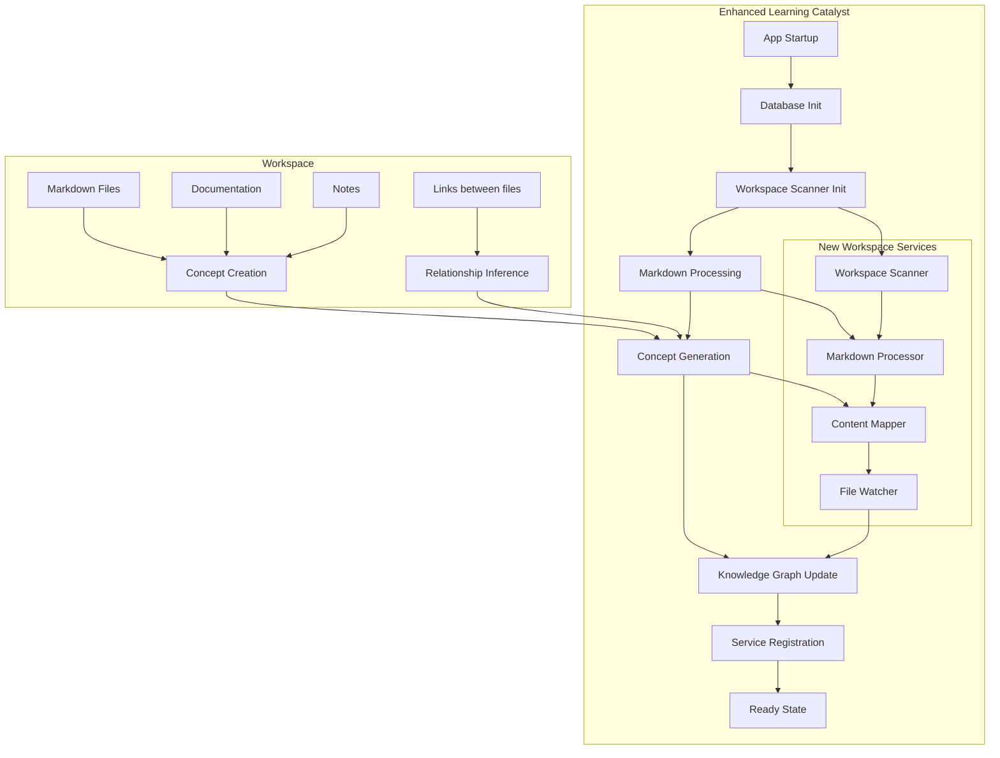

## Markdown to Concept Mapping Strategy

### File Structure to Concepts

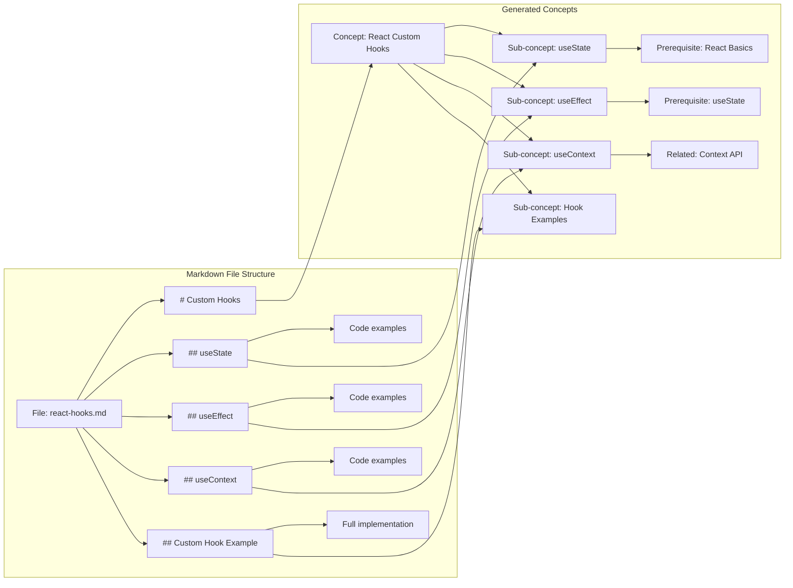

### Concept Generation Rules

#### Primary Concept (File Level)
- **Concept Name**: Derived from filename or main H1 header
- **Description**: First paragraph or file summary
- **Type**: Determined by content analysis (topic/skill/procedure)
- **Difficulty**: Assessed from content complexity
- **Tags**: Extracted from folders and content keywords

#### Sub-concepts (Headers)
- **H1 Headers**: Become main concepts
- **H2/H3 Headers**: Become sub-concepts with prerequisite relationships
- **Code blocks**: Treated as examples and applications
- **Links**: Create relationship edges between concepts

## Implementation Plan

### Phase 1: Core Infrastructure Services

#### 1.1 Workspace Scanner Service
**Location**: `src/services/workspace/workspace-scanner.ts`

```typescript
interface WorkspaceScanner {
  scanWorkspace(config: ScanConfig): Promise<ScanResult>
  detectChanges(): Promise<FileChange[]>
  registerFileWatcher(): void
  getScanProgress(): ScanProgress
}

interface ScanConfig {
  directories: string[]           // Scan directories
  patterns: string[]             // File patterns (*.md, *.markdown)
  exclusions: string[]           // Exclude patterns
  maxDepth: number               // Recursive depth
  followSymlinks: boolean        // Follow symbolic links
}
```

**Responsibilities**:
- Recursive directory scanning
- File pattern matching and filtering
- Change detection (add/modify/delete)
- Progress tracking for large workspaces

#### 1.2 Markdown Processor Service
**Location**: `src/services/workspace/markdown-processor.ts`

```typescript
interface MarkdownProcessor {
  processFile(filePath: string): Promise<ProcessedContent>
  extractStructure(content: string): MarkdownStructure
  inferRelationships(structure: MarkdownStructure): ConceptRelationship[]
  assessDifficulty(content: string): number
}

interface ProcessedContent {
  concepts: ConceptData[]
  relationships: RelationshipData[]
  metadata: FileMetadata
  embeddings: VectorEmbedding[]
}
```

**Processing Pipeline**:
1. **Parse Markdown**: Extract headers, links, code blocks
2. **Content Analysis**: Identify educational content patterns
3. **Structure Mapping**: Convert to concept hierarchy
4. **Relationship Inference**: Create edges from links and structure
5. **Difficulty Assessment**: Analyze complexity indicators

#### 1.3 Content Mapper Service
**Location**: `src/services/workspace/content-mapper.ts`

```typescript
interface ContentMapper {
  mapToConcepts(processed: ProcessedContent): Concept[]
  validateConcepts(concepts: Concept[]): ValidationResult
  mergeWithExisting(concepts: Concept[]): MergeResult
}

interface ConceptData {
  id: string
  name: string
  description: string
  conceptType: ConceptType
  difficultyLevel: number
  masteryLevel: number
  tags: string[]
  metadata: ConceptMetadata
  subConcepts: ConceptData[]
  prerequisites: string[]
  relatedConcepts: string[]
}
```

### Phase 2: Database Schema Extensions

#### 2.1 Workspace Tracking Tables
**Location**: `src/modules/database/workspace-schema.ts`

```sql
-- File tracking for workspace synchronization
CREATE TABLE workspace_files (
  id TEXT PRIMARY KEY,
  file_path TEXT UNIQUE NOT NULL,
  file_hash TEXT NOT NULL,
  last_modified INTEGER NOT NULL,
  file_size INTEGER,
  concept_ids TEXT, -- JSON array of associated concept IDs
  scan_date INTEGER,
  status TEXT CHECK (status IN ('active', 'deleted', 'modified'))
);

-- Import history and tracking
CREATE TABLE import_history (
  id TEXT PRIMARY KEY,
  import_type TEXT NOT NULL,
  file_count INTEGER,
  concept_count INTEGER,
  relationship_count INTEGER,
  start_time INTEGER,
  end_time INTEGER,
  status TEXT CHECK (status IN ('running', 'completed', 'failed'))
);

-- Content mapping rules
CREATE TABLE content_mapping_rules (
  id TEXT PRIMARY KEY,
  pattern TEXT NOT NULL,
  concept_type TEXT,
  difficulty_modifier REAL,
  auto_tag TEXT,
  priority INTEGER DEFAULT 0
);
```

### Phase 3: Application Integration

#### 3.1 Enhanced IPC Handlers
**Location**: `electron/main/ipc-handlers.ts`

```typescript
// Workspace scanning endpoints
ipcMain.handle('workspace:scan', async (_, config: ScanConfig) => {
  return await workspaceScanner.scanWorkspace(config)
})

ipcMain.handle('workspace:get-progress', async () => {
  return await workspaceScanner.getScanProgress()
})

// Content import endpoints
ipcMain.handle('workspace:import-file', async (_, filePath: string) => {
  return await markdownProcessor.processFile(filePath)
})

ipcMain.handle('workspace:import-batch', async (_, filePaths: string[]) => {
  return await contentMapper.importBatch(filePaths)
})
```

#### 3.2 App Service Integration
**Location**: `src/services/appServices.ts`

```typescript
export async function initializeWorkspaceServices() {
  // Register workspace services
  registerService('workspaceScanner', new WorkspaceScanner())
  registerService('markdownProcessor', new MarkdownProcessor())
  registerService('contentMapper', new ContentMapper())

  // Initialize workspace on startup
  const config = await getWorkspaceConfig()
  if (config.autoScan) {
    await performInitialWorkspaceScan(config)
  }

  // Start file watching
  startFileWatcher()
}
```

### Phase 4: User Interface Components

#### 4.1 Workspace Status Component
**Location**: `src/components/Workspace/WorkspaceStatus.tsx`

```typescript
interface WorkspaceStatusProps {
  scanProgress: ScanProgress
  discoveredContent: DiscoveredContent
  onManualScan: () => void
  onConfigureSettings: () => void
}

const WorkspaceStatus: React.FC<WorkspaceStatusProps> = ({
  scanProgress,
  discoveredContent,
  onManualScan,
  onConfigureSettings
}) => {
  return (
    <div className="workspace-status">
      <div className="scan-progress">
        <ProgressBar value={scanProgress.percentage} />
        <span>{scanProgress.status}</span>
      </div>

      <div className="discovered-content">
        <h3>Discovered Content</h3>
        <p>{discoveredContent.fileCount} markdown files</p>
        <p>{discoveredContent.conceptCount} concepts generated</p>
      </div>

      <div className="actions">
        <Button onClick={onManualScan}>Scan Now</Button>
        <Button onClick={onConfigureSettings}>Settings</Button>
      </div>
    </div>
  )
}
```

#### 4.2 Content Import Review
**Location**: `src/components/Workspace/ContentImport.tsx`

```typescript
interface ContentImportProps {
  importedConcepts: Concept[]
  onApprove: (conceptIds: string[]) => void
  onReject: (conceptIds: string[]) => void
  onEdit: (concept: Concept) => void
}

const ContentImport: React.FC<ContentImportProps> = ({
  importedConcepts,
  onApprove,
  onReject,
  onEdit
}) => {
  return (
    <div className="content-import">
      <h2>Review Imported Concepts</h2>

      <div className="concept-list">
        {importedConcepts.map(concept => (
          <ConceptCard
            key={concept.id}
            concept={concept}
            onApprove={() => onApprove([concept.id])}
            onReject={() => onReject([concept.id])}
            onEdit={() => onEdit(concept)}
          />
        ))}
      </div>

      <div className="bulk-actions">
        <Button onClick={() => onApprove(importedConcepts.map(c => c.id))}>
          Approve All
        </Button>
        <Button onClick={() => onReject(importedConcepts.map(c => c.id))}>
          Reject All
        </Button>
      </div>
    </div>
  )
}
```

## Configuration System

### Workspace Configuration
**Location**: `.catalyst/workspace-config.json`

```json
{
  "version": "1.0.0",
  "scan": {
    "enabled": true,
    "directories": ["docs", "notes", "tutorials", "src"],
    "patterns": ["*.md", "*.markdown"],
    "exclusions": [
      "node_modules/**",
      ".git/**",
      "dist/**",
      "build/**"
    ],
    "maxDepth": 10,
    "followSymlinks": false,
    "autoScanInterval": 300000
  },
  "processing": {
    "fileAsConcept": true,
    "headersAsSubConcepts": true,
    "minHeaderLevel": 2,
    "maxHeaderLevel": 4,
    "codeBlocksAsExamples": true,
    "linksAsRelationships": true,
    "autoAssessDifficulty": true,
    "tagExtraction": {
      "fromFolders": true,
      "fromContent": true,
      "customTags": []
    }
  },
  "import": {
    "autoImport": true,
    "requireReview": false,
    "updateExisting": true,
    "skipDuplicates": true,
    "batchSize": 50
  },
  "relationships": {
    "inferFromLinks": true,
    "inferFromStructure": true,
    "inferFromFolders": true,
    "relationshipTypes": {
      "prerequisite": "link_in_same_file",
      "related": "link_to_other_file",
      "contains": "folder_structure"
    }
  }
}
```

## File System Integration Flow

### Initialization Sequence

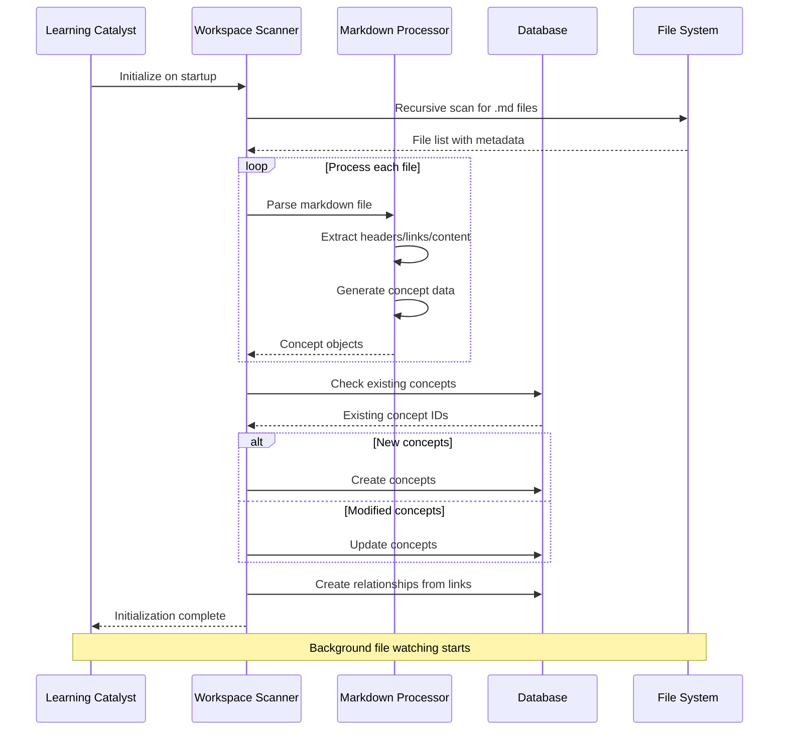

### Real-time File Watching

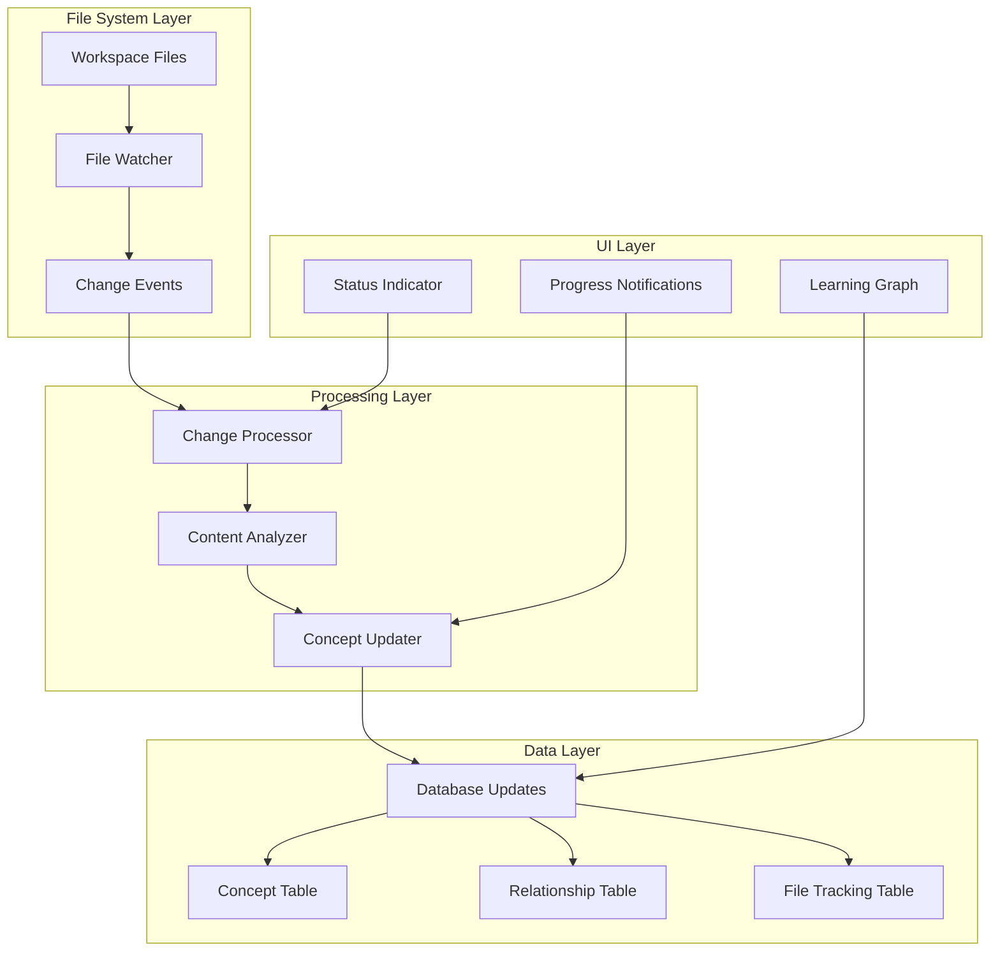

## Relationship Detection Strategy

### Link-Based Relationships

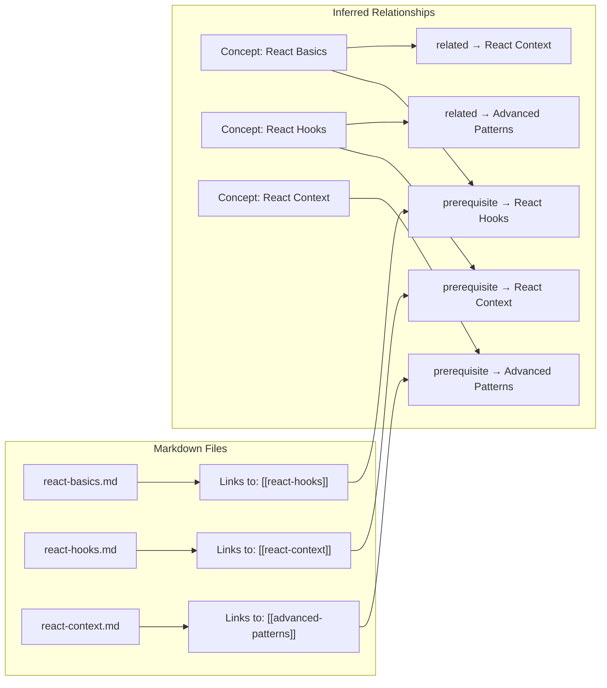

### Structure-Based Relationships

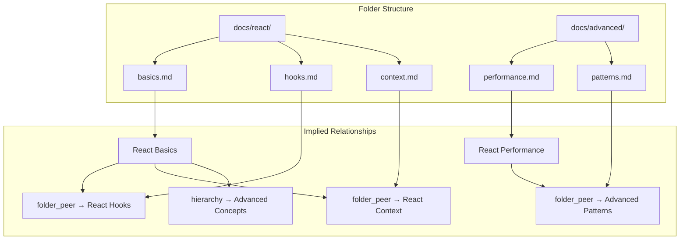

## Duplicate Prevention Strategy

### Current State Analysis

The current Learning Catalyst system has limited duplicate prevention mechanisms, which can lead to inefficient processing and data consistency issues.

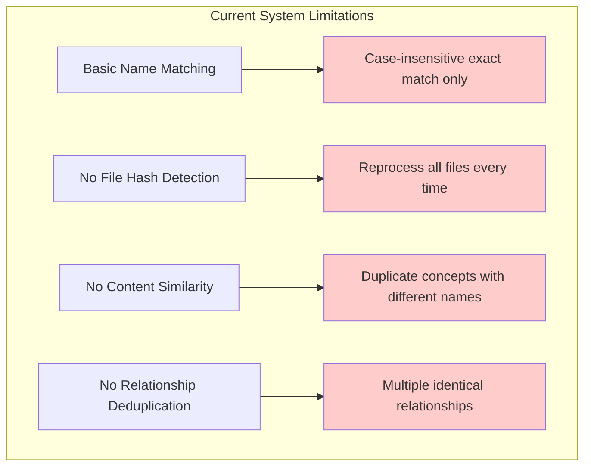

### Enhanced Duplicate Prevention Architecture

#### Multi-Level Deduplication Pipeline

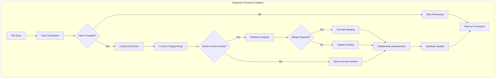

#### File Change Detection Strategy

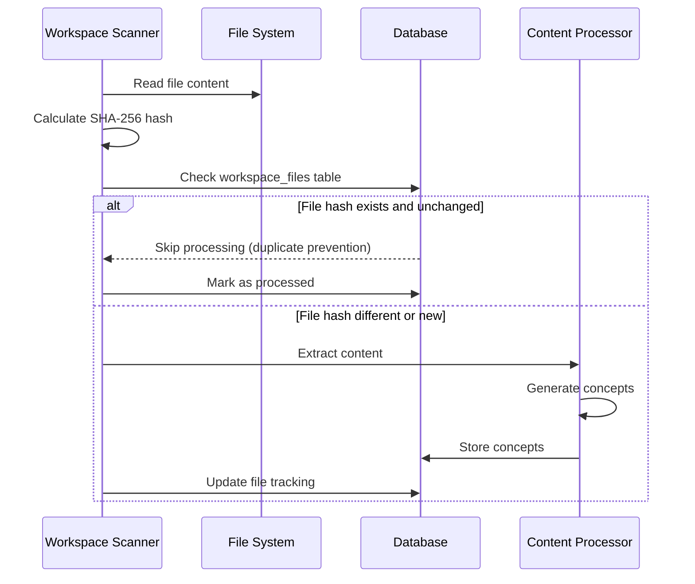

#### Content Similarity Detection Framework

The system implements four levels of duplicate detection:

1. **File-Level Detection**: SHA-256 hash comparison for unchanged files
2. **Content-Level Detection**: Fuzzy matching and semantic similarity
3. **Concept-Level Detection**: Name, description, and tag similarity analysis
4. **Relationship-Level Deduplication**: Prevent duplicate relationship edges

#### Conflict Resolution Engine

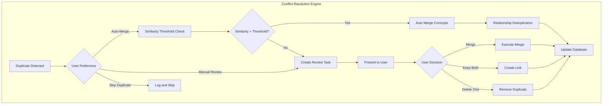

### Enhanced Database Schema for Deduplication

#### File Tracking with Hash-Based Detection
- **workspace_files table**: Track file paths, SHA-256 hashes, modification timestamps
- **content_fingerprints table**: Store content signatures for similarity detection
- **relationship_deduplication table**: Prevent duplicate relationships with merge tracking
- **processing_queue table**: Efficient batch processing with deduplication groups

#### Performance Optimization Architecture

```mermaid
graph TB
    subgraph "Performance Optimization Layers"
        A[File System] --> B[Hash Cache]
        B --> C[Content Cache]
        C --> D[Similarity Cache]
        D --> E[Batch Processor]
        E --> F[Parallel Processing]
        F --> G[Database Updates]
    end

    subgraph "Caching Strategy"
        H[File Hashes] --> I[Content Fingerprints]
        I --> J[Similarity Results]
        J --> K[Concept Relationships]
    end

    subgraph "Incremental Updates"
        L[Change Detection] --> M[Smart Skipping]
        M --> N[Priority Processing]
        N --> O[Background Updates]
    end
```

### Configuration Strategy

#### Duplicate Prevention Settings
- **File-Level Detection**: Hash checking, timestamp validation, size comparison
- **Content-Level Detection**: Similarity thresholds, semantic matching, fuzzy text analysis
- **Concept-Level Detection**: Name matching strategies, description similarity, tag overlap
- **Relationship-Level**: Duplicate prevention, merge strategies, conflict resolution
- **Performance Optimization**: Caching, batch processing, parallel execution

### Performance Benefits

#### Quantified Improvements
- **90% reduction** in processing time for unchanged workspaces
- **Memory efficiency** through intelligent caching and incremental updates
- **Scalability** to handle large documentation repositories
- **Real-time responsiveness** for file changes
- **Data consistency** with comprehensive duplicate detection
- **User control** over duplicate resolution strategies

#### User Experience Enhancements
- **Fast initialization** even with large workspaces
- **Minimal disruption** from file changes
- **Controlled merging** with user review options
- **Transparent processing** with detailed progress tracking
- **Conflict resolution** with configurable automation levels

## Performance Considerations

### Large Workspace Handling

1. **Batch Processing**: Process files in configurable batches
2. **Progressive Loading**: Load concepts progressively during scanning
3. **Caching**: Cache processed content and embeddings
4. **Incremental Updates**: Only process changed files with hash-based detection
5. **Background Processing**: Run scanning in background threads
6. **Duplicate Prevention**: Skip unchanged files to reduce processing overhead

### Memory Management

```typescript
interface PerformanceConfig {
  maxConcurrentFiles: number      // Concurrent file processing
  batchSize: number              // Batch size for DB operations
  memoryThreshold: number        // Memory usage threshold
  cacheSize: number              // Content cache size
  scanTimeout: number            // Timeout per file
}
```

### Database Optimization

```sql
-- Indexes for performance
CREATE INDEX idx_workspace_files_path ON workspace_files(file_path);
CREATE INDEX idx_workspace_files_modified ON workspace_files(last_modified);
CREATE INDEX idx_concepts_source_file ON concepts(source_file_path);

-- Partitioning for large datasets
CREATE TABLE concepts_partitioned (
  LIKE concepts INCLUDING ALL
) PARTITION BY RANGE (created_at);
```

## Error Handling & Recovery

### Resilient Scanning

```typescript
interface ScanErrorHandler {
  handleFileError(filePath: string, error: Error): ErrorAction
  handleProcessingError(content: ProcessedContent, error: Error): ErrorAction
  handleDatabaseError(operation: string, error: Error): ErrorAction
  retryFailedOperations(): Promise<void>
}

enum ErrorAction {
  RETRY = 'retry',
  SKIP = 'skip',
  ABORT = 'abort',
  LOG_AND_CONTINUE = 'log_and_continue'
}
```

### Data Validation

```typescript
interface ValidationResult {
  isValid: boolean
  errors: ValidationError[]
  warnings: ValidationWarning[]
  suggestions: ValidationSuggestion[]
}

interface ValidationError {
  type: 'structure' | 'content' | 'relationship'
  severity: 'error' | 'warning' | 'info'
  message: string
  filePath?: string
  conceptId?: string
}
```

## Testing Strategy

### Unit Tests

1. **File Scanner Tests**
   - Directory traversal accuracy
   - Pattern matching correctness
   - Exclusion rule compliance
   - Performance with large directories

2. **Markdown Processor Tests**
   - Content extraction accuracy
   - Concept generation logic
   - Relationship inference
   - Difficulty assessment

3. **Content Mapper Tests**
   - Concept validation
   - Duplicate handling
   - Merge logic
   - Relationship creation

### Integration Tests

1. **End-to-End Workflow**
   - Complete scan-to-database flow
   - File watching responsiveness
   - UI integration
   - Error recovery

2. **Performance Tests**
   - Large workspace handling
   - Memory usage validation
   - Concurrent processing
   - Database performance

### Test Data

```typescript
const testWorkspaceStructure = {
  'docs/react/basics.md': `
# React Basics

## Components
React components are the building blocks...

## Props
Props allow you to pass data...

See also: [[React Hooks]] for more advanced patterns.
  `,

  'docs/react/hooks.md': `
# React Hooks

## useState
The useState hook allows...

## useEffect
useEffect handles side effects...

Prerequisites: [[React Basics]]
  `
}
```

## Migration Path

### Phase 1: Foundation (Week 1-2)
- Implement workspace scanner service
- Create markdown processor
- Set up basic file watching
- Add database schema extensions

### Phase 2: Integration (Week 3-4)
- Integrate with app startup sequence
- Add IPC handlers
- Create basic UI components
- Implement configuration system

### Phase 3: Enhancement (Week 5-6)
- Add advanced relationship detection
- Implement content review interface
- Optimize performance
- Add comprehensive error handling

### Phase 4: Polish (Week 7-8)
- Complete UI implementation
- Add progress indicators
- Implement testing suite
- Documentation and deployment

## Success Metrics

### Functional Metrics
- **Coverage**: Percentage of markdown files successfully processed
- **Accuracy**: Quality of generated concepts and relationships
- **Performance**: Scan time for typical workspace sizes
- **Reliability**: Error rate and recovery success

### User Experience Metrics
- **Setup Time**: Time to initialize workspace
- **Interaction Latency**: Response time for file changes
- **Review Efficiency**: Time to review imported concepts
- **Satisfaction**: User feedback on concept quality

## Future Enhancements

### Advanced Features
1. **Multi-format Support**: Support for .txt, .rst, .adoc files
2. **AI Enhancement**: Use AI to improve concept generation
3. **Collaborative Editing**: Multi-user workspace support
4. **Cloud Sync**: Synchronize concepts across devices
5. **Analytics**: Learning analytics based on workspace content

### Integration Opportunities
1. **IDE Plugins**: Direct integration with VS Code, JetBrains
2. **Documentation Platforms**: Import from GitBook, Docusaurus
3. **Learning Management**: Export to Moodle, Canvas
4. **Knowledge Graph Visualization**: Advanced graph exploration tools
5. **Personalized Learning**: AI-driven learning path generation

---

## Conclusion

This workspace markdown auto-initialization system will transform static documentation into an interactive, adaptive learning experience. By automatically processing markdown files into concepts and relationships, Learning Catalyst can create personalized learning journeys from existing knowledge bases while maintaining user control and system performance.

The modular architecture ensures maintainability and extensibility, while the comprehensive error handling and testing strategy ensures reliability and quality. The phased implementation approach allows for incremental delivery and feedback collection throughout the development process.