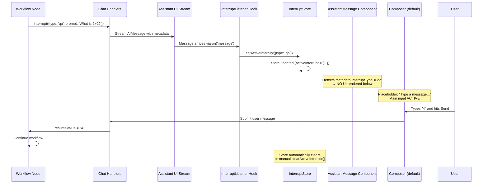
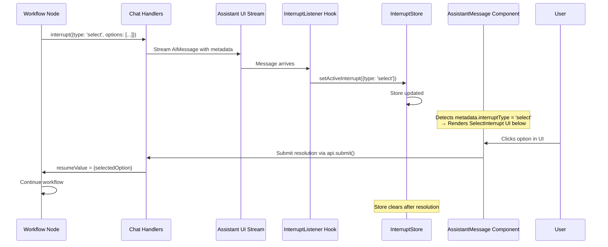
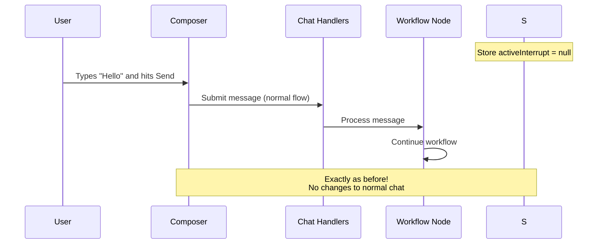
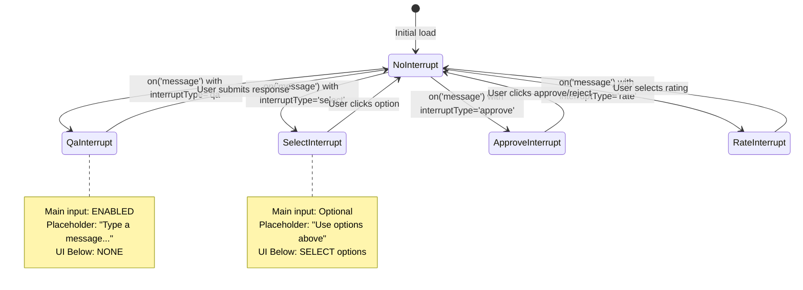

# Design: Event-Log Interrupt Architecture

## Architecture Overview

### Critical Design Clarifications (v2.0)

**This section addresses critical implementation gaps identified during risk assessment:**

#### Q1: One Source of Truth or Two?

**DECIDED: Single Source of Truth in Message Metadata**

The design uses **message metadata as the primary source of truth**, with `interruptHistory` as a **derived index**:

- **Primary Storage**: `ChatMessage.metadata.interrupt` field (NEW in schema)
- **Derived View**: `interruptHistory` channel for querying and reducer operations
- **Rationale**: Single write path, simpler consistency, works with existing message APIs

**Migration Required:**
```typescript
// src/main/services/domain/chat/chat-message-types.ts
export interface ChatMessage {
  // ... existing fields ...
  metadata?: {
    // ... existing fields ...
    // NEW: Interrupt metadata
    interrupt?: {
      id: string;
      type: string;
      status: 'pending' | 'resolved' | 'abandoned';
      payload?: unknown;
      options?: unknown[];
      createdAt: number;
      resolvedAt?: number;
    };
  };
}
```

#### Q2: Structured Resolution - User Message or Control Payload?

**DECIDED: Hidden Control Payload via New API Endpoint**

Structured resolutions use a **separate IPC endpoint** that doesn't create a visible user message:

```typescript
// NEW IPC endpoint
ipcMain.handle('chat:submit-interrupt-resolution', async (_event, payload) => {
  const { interruptId, resolution } = payload;
  // Resume workflow with resolution
  // No message added to history
});
```

**Current Implementation Gap:**
- UI currently sends: `api.submit({ content: JSON.stringify({ __interruptResolution: true, ... }) })`
- This adds visible JSON to chat history (wrong UX)
- Fix: Add dedicated `chat:submit-interrupt-resolution` endpoint

#### Q3: History Reload - Structured UI or Plain Text?

**DECIDED: Full Structured UI Support on History Reload**

Interrupt metadata must survive message conversion and enable structured UI rendering:

**Current Implementation Gap:**
- `message-converter.ts` strips `additional_kwargs` from AIMessage
- `ChatMessage` type has no `metadata.interrupt` field
- History reload cannot detect interrupts

**Required Changes:**
1. Add `metadata.interrupt` field to `ChatMessage` type
2. Update `message-converter.ts` to extract interrupt metadata from `additional_kwargs`
3. Frontend reads `message.metadata.interrupt` (not `additional_kwargs`)

#### Q4: When to Call `createInterruptRecord()`?

**DECIDED: Cannot Persist Before `interrupt()` - Use Event Handler**

The original design showed:
```typescript
// ❌ IMPOSSIBLE - interrupt() is synchronous pause
const record = createInterruptRecord(...);
await interrupt(payload);  // Pauses here - state not persisted yet
return { interruptHistory: [record] };
```

**Actual Implementation Pattern:**
```typescript
// ✅ WORKING - Record in state, interrupt after
export const askQuestionNode = (deps) => async (state, config) => {
  // Create record in memory
  const record = deps.interruptService.createInterruptRecord({
    node: 'askQuestion',
    type: 'qa',
    payload: { prompt: 'What is 2+2?' }
  });

  // Record in state BEFORE interrupt
  // This persists to checkpoint
  return {
    interruptHistory: [record],
    messages: [new AIMessage({
      content: 'What is 2+2?',
      additional_kwargs: {
        interruptType: 'qa',
        interruptId: record.id,
        pending: true
      }
    })]
    // State update commits, then interrupt fires
  };

  // Wait for user input
  const answer = await interrupt(payload);

  // After resume, update record
  return {
    interruptHistory: [{ ...record, status: 'resolved', resolution: answer }]
  };
};
```

**Alternative: Middleware Handler Pattern**
If nodes cannot update state before `interrupt()`, use a middleware handler:

```typescript
// In workflow executor or graph wrapper
workflow.on('before-interrupt', async (context) => {
  const record = interruptService.createInterruptRecord(context);
  await interruptService.updateState(record.id, record);
});
```

#### Q5: Stream Chunk Types

**DECIDED: Add Interrupt Chunk Types to DataStreamChunkType**

**Current Implementation Gap:**
- `DataStreamChunkType` has no `interrupt-start` or `interrupt-end`
- `toAssistantUIStream()` stops iteration on interrupt events
- UI never receives interrupt chunks

**Required Changes:**
```typescript
// src/main/services/domain/workflow/utils/assistant-ui-stream.ts
export type DataStreamChunkType =
  | 'text-start'
  | 'text-delta'
  | 'text-end'
  | 'tool-input-start'
  | 'tool-input-delta'
  | 'tool-input-available'
  | 'tool-output-available'
  | 'reasoning-start'
  | 'reasoning-delta'
  | 'reasoning-end'
  | 'interrupt-start'  // NEW
  | 'interrupt-end'    // NEW
  | 'error'
  | 'finish'
  | 'abort';
```

**Update Stream Handler:**
```typescript
// In toAssistantUIStream()
if (isInterruptEvent(data)) {
  // Extract interrupt metadata from event
  const interruptMetadata = extractInterruptMetadata(data);

  // Emit interrupt-start chunk (don't break yet)
  yield formatSSE({
    type: 'interrupt-start',
    interruptId: interruptMetadata.id,
    interruptType: interruptMetadata.type,
    payload: interruptMetadata.payload
  });

  // Then break for finish chunk
  interrupted = true;
  break;
}
```

---

## Architecture Overview

### Current State (Problematic)

```
User Input → chat-handlers.ts → [hidden interrupt check] → workflow.stream()
                                       ↓
                              [hidden resume logic]
                                       ↓
                              toAssistantUIStream() → finish chunk
```

**Issues:**
- Interrupt detection embedded in handler (lines 207-218)
- Resume decision embedded in handler (lines 216-232)
- No service layer for testing/reuse
- No audit trail of interrupt events

### Target State (Transparent)

```
User Input → chat-handlers.ts → interruptService.prepareRun()
                                       ↓
                              { shouldResume, checkpointId }
                                       ↓
                              workflow.stream() → interrupt event
                                       ↓
                              interruptService.recordInterrupt()
                                       ↓
                              toAssistantUIStream() → interrupt chunk → finish
```

**Benefits:**
- Clear separation of concerns
- Testable interrupt service
- Audit trail via event-log
- Reusable for other entry points

## Design Decisions

### Decision 1: Interrupt Service Pattern

**Context**: Interrupt logic is currently embedded in `chat-handlers.ts`

**Options**:
- A. Keep in handler, improve organization
- B. Extract to dedicated service
- C. Put in workflow graph utilities

**Choice**: B (Dedicated service)

**Rationale**:
- Follows existing service pattern in codebase
- Enables unit testing without IPC mocking
- Single source of truth for interrupt state
- Reusable if other entry points need interrupt handling

### Decision 2: Event-Log Scope

**Context**: Need to track interrupt history for restore/audit

**Options**:
- A. Full event-log (all messages + interrupts)
- B. Interrupt metadata only (augment messages[])
- C. No event-log (query checkpoint on demand)

**Choice**: B (Interrupt metadata only)

**Rationale**:
- Messages already stored in `messages[]` (don't duplicate)
- Only structured interrupts need tracking (per workflow-interrupt-control-flow spec)
- Lighter weight than full event-log
- Easier migration path from current architecture

### Decision 3: State Annotation Pattern

**Context**: Need to store interrupt records in workflow state

**Options**:
- A. Separate `interruptHistory` channel
- B. Extend existing subgraph state
- C. Store outside workflow state (SQLite)

**Choice**: A (Separate channel)

**Rationale**:
- Clean separation from existing state
- Works with LangGraph checkpointer
- Reducer pattern ensures immutability
- Doesn't pollute teach/practice state

### Decision 4: AI SDK Interrupt Chunk

**Context**: Frontend needs to render interrupt prompts

**Options**:
- A. Custom chunk type `interrupt-start/interrupt-end`
- B. Extend `tool-output-available` with interrupt metadata
- C. Use existing `text-delta` with data annotation

**Choice**: A (Custom chunk type)

**Rationale**:
- Clear semantics for UI layer
- Doesn't abuse existing protocol
- Enables specialized interrupt UI components
- Future-proof for complex interrupt types

### Decision 5: History Restore via Message Metadata

**Context**: Frontend needs to know about pending interrupts on thread load

**Options**:
- A. New `chat:get-thread-state` endpoint
- B. Extend `chat:get-messages` with `pendingInterrupt` field
- C. Embed interrupt metadata in AIMessage itself

**Choice**: C (Message metadata)

**Rationale**:
- No new API endpoint needed
- Interrupt prompt IS already an AIMessage in history
- Frontend detects interrupt from message `additional_kwargs`
- Simpler architecture - message is self-describing
- Works with existing `chat:get-messages` without changes

## Technical Design

### Interrupt Record Type

```typescript
// src/main/services/domain/workflow/types/interrupt-record.ts

export type InterruptStatus = 'pending' | 'resolved' | 'abandoned';

export type InterruptRecord = {
  id: string;                    // Unique interrupt ID
  node: string;                  // Node that triggered interrupt
  type: string;                  // Interrupt type (select, approve, rate, etc.)
  payload: {
    prompt: string;              // User-facing prompt
    options?: unknown[];         // For selection types
    [key: string]: unknown;      // Type-specific data
  };
  status: InterruptStatus;
  createdAt: number;
  resolvedAt?: number;
  resolution?: unknown;          // User's response
  reasoning?: string;            // AI reasoning (if applicable)
};
```

### State Annotation Extension

```typescript
// src/main/services/domain/workflow/state.ts (additions)

const interruptHistoryReducer = (
  current: InterruptRecord[] | undefined,
  update: InterruptRecord[],
): InterruptRecord[] => {
  const curr = current ?? [];
  // Merge updates: new records appended, existing records updated by id
  const updated = [...curr];
  for (const record of update) {
    const idx = updated.findIndex(r => r.id === record.id);
    if (idx >= 0) {
      updated[idx] = { ...updated[idx], ...record };
    } else {
      updated.push(record);
    }
  }
  return updated;
};

export const WorkflowStateAnnotation = Annotation.Root({
  // ... existing fields ...

  interruptHistory: Annotation<InterruptRecord[]>({
    reducer: interruptHistoryReducer,
    default: () => [],
  }),
});
```

### Interrupt Service Interface

```typescript
// src/main/services/domain/interrupt/interrupt-service.ts

export type InterruptService = {
  /**
   * Check if thread has pending interrupt and prepare run config
   */
  prepareRun(threadId: string, userInput: string): Promise<{
    shouldResume: boolean;
    checkpointId?: string;
  }>;

  /**
   * Create a new interrupt record (called from workflow node)
   */
  createInterruptRecord(params: {
    node: string;
    type: string;
    payload: InterruptRecord['payload'];
    reasoning?: string;
  }): InterruptRecord;

  /**
   * Derive pending interrupt from history
   */
  getPendingInterrupt(interruptHistory: InterruptRecord[]): InterruptRecord | null;
};

export function createInterruptService(deps: {
  checkpointer: BaseCheckpointSaver;
  loggerService: LoggerService;
}): InterruptService;
```

### Interrupt Message Metadata

Structured interrupt prompts include metadata in the AIMessage for frontend detection:

```typescript
// When creating interrupt prompt message
const interruptMessage = new AIMessage({
  content: 'Which learning path would you like to take?',
  additional_kwargs: {
    interruptType: 'select',
    interruptId: record.id,
    options: [
      { id: 'deep', label: 'Deep Dive' },
      { id: 'quick', label: 'Quick Overview' },
    ],
    pending: true,  // Frontend checks this to render special UI
  },
});
```

Frontend detects and renders:
```typescript
// In message rendering
if (message.additional_kwargs?.interruptType && message.additional_kwargs?.pending) {
  return <InterruptUI type={message.additional_kwargs.interruptType} options={...} />;
}
```

### AI SDK Chunk Extensions

```typescript
// src/main/services/domain/workflow/utils/assistant-ui-stream.ts (additions)

/**
 * Interrupt start chunk - begins interrupt UI
 */
export interface InterruptStartChunk extends BaseChunk {
  type: 'interrupt-start';
  interruptId: string;
  interruptType: string;        // 'select', 'approve', 'rate', etc.
  payload: {
    prompt: string;
    options?: unknown[];
    [key: string]: unknown;
  };
}

/**
 * Interrupt end chunk - interrupt resolved/abandoned
 */
export interface InterruptEndChunk extends BaseChunk {
  type: 'interrupt-end';
  interruptId: string;
  status: 'resolved' | 'abandoned';
  resolution?: unknown;
}
```

### Refactored Chat Handler

```typescript
// src/main/handlers/chat-handlers.ts (simplified)

ipcMainInstance.on('chat:start-stream', async (event, payload) => {
  const [replyPort] = event.ports;
  const streamId = payload.streamId ?? generateStreamId();

  // Delegate to service (no interrupt logic in handler)
  const runConfig = await interruptService.prepareRun(
    safeConversationId,
    lastUserText
  );

  const streamConfig = {
    configurable: {
      thread_id: safeConversationId,
      llmStreamMode,
      ...(runConfig.shouldResume && runConfig.checkpointId
        ? { checkpoint_id: runConfig.checkpointId }
        : {}),
    },
    streamMode: ['messages', 'custom', 'updates'],
  };

  const stream = await workflowGraph.stream(
    runConfig.shouldResume
      ? new Command({ resume: lastUserText })
      : { messages: lcMessages },
    streamConfig,
  );

  // Stream processing unchanged...
});
```

### Workflow Node Pattern for Structured Interrupts

```typescript
// Example: src/main/services/domain/workflow/nodes/selectLearningPath.ts

export const selectLearningPathNode = (deps: WorkflowDeps) =>
  async (state: WorkflowState, config: LangGraphRunnableConfig) => {
    const interruptService = deps.interruptService;

    // Create interrupt record BEFORE calling interrupt()
    const record = interruptService.createInterruptRecord({
      node: 'selectLearningPath',
      type: 'select',
      payload: {
        prompt: 'Which learning path would you like to take?',
        options: [
          { id: 'deep', label: 'Deep Dive', description: 'Comprehensive coverage' },
          { id: 'quick', label: 'Quick Overview', description: 'Key concepts only' },
        ],
      },
    });

    // Record in state (persisted before interrupt)
    // Then call interrupt
    const selection = interrupt(record.payload);

    // After resume, update record with resolution
    const resolved: InterruptRecord = {
      ...record,
      status: 'resolved',
      resolvedAt: Date.now(),
      resolution: selection,
    };

    return {
      interruptHistory: [resolved],
      sessionBlueprint: {
        ...state.sessionBlueprint,
        learningPath: selection.id
      },
    };
  };
```

## Migration Strategy

### Phase 1: Service Extraction (Non-Breaking)

1. Create `interrupt-service.ts` with current logic extracted
2. Refactor `chat-handlers.ts` to use service
3. Existing behavior unchanged

### Phase 2: State Extension (Additive)

1. Add `interruptHistory` to `WorkflowStateAnnotation`
2. Update `toAssistantUIStream` with interrupt chunks
3. Nodes that use `interrupt()` record events and embed metadata in messages
4. Existing interrupt flows continue working

### Phase 3: Frontend Integration

1. Handle interrupt chunks in Assistant UI adapter
2. Detect interrupt metadata in message `additional_kwargs`
3. Implement interrupt UI components
4. Complete end-to-end testing

## Frontend Architecture Design

### Overview

The frontend architecture leverages **Assistant UI's built-in capabilities** with minimal custom code:

1. **Message streaming** - Assistant UI handles chunks automatically
2. **Message metadata** - Detect interrupt metadata in message rendering
3. **State tracking** - Simple Zustand store for active interrupts only
4. **Component extension** - Extend AssistantMessage for conditional UI

### Key Principle: Minimal Intervention

Assistant UI provides:
- ✅ Thread component for chat interface
- ✅ Message streaming and state management
- ✅ Custom message component support
- ✅ Built-in history handling

**We extend only what's necessary**, not rebuild the wheel.

### Current Interrupt Types in Workflow

Based on scanning all workflow nodes, interrupts are used for **open-ended Q&A** (not structured interactions):

**Teach Subgraph:**
- `teach_response` - After generating explanation, wait for user question/response
- `teach_followup` - After answering question, wait for next user input
- `teach_max_questions` - After 10 questions, wait for user decision

**Practice Subgraph:**
- `practice_question` - After generating practice question, wait for user answer
- `practice_followup` - After hints/clarification, wait for next input
- `practice_final_attempt` - After 5 conversation turns, wait for final answer

**Main Workflow:**
- `await_user_input` - After diagnostic quiz, wait for user responses

**Common Pattern**: All use free-form text input, no structured options (select/approve/rate/upload). The `qa` interrupt type handles all of these.

### Simplified Approach: Minimal Intervention

**Core Components (Only 3 files):**

1. **Interrupt Store** - Zustand store tracking active interrupt
2. **Extended AssistantMessage** - Detects metadata, renders UI conditionally
3. **Stream Listener** - Listens to Assistant UI message stream, updates store

**Key Design Decisions:**

- **QA Interrupts**: Use main chat input (no separate UI component)
- **Structured Interrupts**: Render UI below message (select/approve/rate)
- **Normal Chat**: 100% unchanged, uses Assistant UI defaults

**Benefits:**

1. **Minimal Code**: Only ~150 lines across 3 files
2. **No Custom Composer**: Uses Assistant UI's default
3. **Backward Compatible**: Normal chat works exactly as before
4. **Extensible**: Easy to add new interrupt types
5. **Robust**: Leverages proven Assistant UI patterns

**This architecture is lean, robust, and maintains perfect backward compatibility!**

### Detailed Implementation

#### 1. Interrupt Store (Zustand)

```typescript
// src/renderer/stores/interruptStore.ts
import { create } from 'zustand';

export const useInterruptStore = create<{
  // Track active interrupt for UI state management
  activeInterrupt: {
    id: string;
    type: 'qa' | 'select' | 'approve' | 'rate' | 'upload';
    payload: {
      prompt?: string;
      options?: Array<{
        id: string;
        label: string;
        description?: string;
      }>;
      [key: string]: unknown;
    };
    node: string;
  } | null;

  // Set active interrupt when chunk arrives
  setActiveInterrupt: (interrupt: any) => void;

  // Clear interrupt after resolution
  clearActiveInterrupt: () => void;
}>((set, get) => ({
  activeInterrupt: null,

  setActiveInterrupt: (interrupt) => set({ activeInterrupt: interrupt }),

  clearActiveInterrupt: () => set({ activeInterrupt: null }),
}));
```

#### 2. Extended AssistantMessage Component

```tsx
// src/renderer/features/chat/ui/AssistantMessage.tsx

import { MessagePrimitive } from '@assistant-ui/react';
import {
  AssistantMessage as AUAssistantMessage,
  AssistantActionBar,
  BranchPicker,
} from '@assistant-ui/react-ui';
import { AssistantMessageContentWithReasoning } from './AssistantMessageWithReasoning';
import { SelectInterrupt } from './interrupts/SelectInterrupt';
import { ApproveInterrupt } from './interrupts/ApproveInterrupt';
import { RateInterrupt } from './interrupts/RateInterrupt';
import { useAssistantApi } from '@assistant-ui/react';

export function AssistantMessage() {
  const message = MessagePrimitive.useMessage();
  const api = useAssistantApi();

  // Extract interrupt metadata from message
  const metadata = message?.additional_kwargs;
  const interruptType = metadata?.interruptType;

  // Handle interrupt resolution submission
  const handleResolution = async (resolution: unknown) => {
    await api.submit({
      content: JSON.stringify({
        __interruptResolution: true,
        interruptId: metadata.interruptId,
        resolution,
      }),
    });

    // Clear interrupt from store
    useInterruptStore.getState().clearActiveInterrupt();
  };

  // Render based on interrupt type
  return (
    <AUAssistantMessage.Root>
      <AUAssistantMessage.Avatar />
      <div className="flex-1">
        <AssistantMessageContentWithReasoning />

        {/* ONLY render UI for structured interrupts */}
        {interruptType && interruptType !== 'qa' && (
          <div className="mt-3 p-3 border rounded-lg bg-blue-50">
            {renderStructuredInterrupt(interruptType, metadata, handleResolution)}
          </div>
        )}
      </div>
      <BranchPicker />
      <AssistantActionBar />
    </AUAssistantMessage.Root>
  );
}

function renderStructuredInterrupt(
  type: string,
  metadata: any,
  onSubmit: (resolution: unknown) => void
) {
  switch (type) {
    case 'select':
      return (
        <SelectInterrupt
          options={metadata.options || []}
          onSelect={(option) => onSubmit(option)}
        />
      );

    case 'approve':
      return (
        <ApproveInterrupt
          onApprove={() => onSubmit({ approved: true })}
          onReject={() => onSubmit({ approved: false })}
        />
      );

    case 'rate':
      return (
        <RateInterrupt
          onRate={(rating) => onSubmit({ rating })}
        />
      );

    case 'upload':
      return (
        <UploadInterrupt
          onUpload={(files) => onSubmit({ files })}
        />
      );

    default:
      return (
        <div className="text-sm text-gray-600">
          Interactive prompt from {metadata.node}
        </div>
      );
  }
}
```

#### 3. Interrupt Stream Listener

```tsx
// src/renderer/hooks/useInterruptListener.ts

import { useAssistantApi } from '@assistant-ui/react';
import { useEffect } from 'react';
import { useInterruptStore } from '@/renderer/stores/interruptStore';

/**
 * Listens to Assistant UI message stream for interrupt chunks
 * Updates store when interrupts start/end
 */
export function useInterruptListener() {
  const api = useAssistantApi();
  const setActiveInterrupt = useInterruptStore(s => s.setActiveInterrupt);
  const clearActiveInterrupt = useInterruptStore(s => s.clearActiveInterrupt);

  useEffect(() => {
    // Listen to all messages from Assistant UI
    const unsubscribe = api.on('message', (message) => {
      const metadata = message.additional_kwargs;

      // Check if this is an interrupt message
      if (metadata?.interruptType) {
        setActiveInterrupt({
          id: metadata.interruptId,
          type: metadata.interruptType,
          payload: metadata.payload || {},
          node: metadata.node,
        });
      }
    });

    // Also listen for user messages (potential resolutions)
    const unsubscribeUser = api.on('user-message', (message) => {
      // Check if this is an interrupt resolution
      const content = JSON.parse(message.content);
      if (content.__interruptResolution) {
        // Clear interrupt after successful resolution
        clearActiveInterrupt();
      }
    });

    return () => {
      unsubscribe();
      unsubscribeUser();
    };
  }, [api, setActiveInterrupt, clearActiveInterrupt]);
}
```

#### 4. ChatPage Integration

```tsx
// src/renderer/pages/chat/ChatPage.tsx

import { Thread } from '@assistant-ui/react-ui';
import { AssistantMessage } from '@/renderer/features/chat/ui/AssistantMessage';
import { useInterruptListener } from '@/renderer/hooks/useInterruptListener';
import { useInterruptStore } from '@/renderer/stores/interruptStore';

export function ChatPage() {
  // Mount the interrupt listener
  useInterruptListener();

  const activeInterrupt = useInterruptStore(state => state.activeInterrupt);

  return (
    <div className="h-full bg-gray-50">
      <Thread
        components={{
          // Use our extended AssistantMessage component
          AssistantMessage: AssistantMessage,
        }}
        userMessage={{ allowEdit: false }}
        assistantMessage={{
          components: {
            Text: MarkdownText,
            ToolFallback: ToolFallback,
          },
        }}
        // Optionally configure composer behavior based on interrupt
        composer={activeInterrupt ? {
          disabled: activeInterrupt.type !== 'qa', // Disable for structured interrupts
        } : undefined}
      />
    </div>
  );
};
```

#### 5. Structured Interrupt UI Components

```tsx
// src/renderer/features/chat/ui/interrupts/SelectInterrupt.tsx

export function SelectInterrupt({
  options,
  onSelect,
}: {
  options: Array<{ id: string; label: string; description?: string }>;
  onSelect: (option: { id: string; label: string }) => void;
}) {
  return (
    <div className="space-y-3">
      <h4 className="font-medium text-gray-900">Choose an option:</h4>
      <div className="space-y-2">
        {options.map((option) => (
          <button
            key={option.id}
            className="w-full p-3 text-left border border-gray-200 rounded-lg hover:bg-blue-50 hover:border-blue-300 transition"
            onClick={() => onSelect(option)}
          >
            <div className="font-medium text-gray-900">{option.label}</div>
            {option.description && (
              <div className="text-sm text-gray-600 mt-1">
                {option.description}
              </div>
            )}
          </button>
        ))}
      </div>
    </div>
  );
}

// src/renderer/features/chat/ui/interrupts/ApproveInterrupt.tsx

export function ApproveInterrupt({
  onApprove,
  onReject,
}: {
  onApprove: () => void;
  onReject: () => void;
}) {
  return (
    <div className="space-y-3">
      <h4 className="font-medium text-gray-900">Please confirm:</h4>
      <div className="flex gap-3">
        <button
          className="flex-1 px-4 py-2 bg-green-600 text-white rounded-lg hover:bg-green-700 transition"
          onClick={onApprove}
        >
          ✓ Approve
        </button>
        <button
          className="flex-1 px-4 py-2 bg-red-600 text-white rounded-lg hover:bg-red-700 transition"
          onClick={onReject}
        >
          ✗ Reject
        </button>
      </div>
    </div>
  );
}

// src/renderer/features/chat/ui/interrupts/RateInterrupt.tsx

export function RateInterrupt({
  onRate,
}: {
  onRate: (rating: number) => void;
}) {
  return (
    <div className="space-y-3">
      <h4 className="font-medium text-gray-900">Rate your understanding:</h4>
      <div className="flex gap-2">
        {[1, 2, 3, 4, 5].map((rating) => (
          <button
            key={rating}
            className="w-12 h-12 rounded-full border-2 border-gray-300 hover:border-blue-500 hover:bg-blue-50 transition flex items-center justify-center text-lg font-medium"
            onClick={() => onRate(rating)}
          >
            {rating}
          </button>
        ))}
      </div>
      <div className="text-xs text-gray-500">
        1 = Need help • 5 = Got it!
      </div>
    </div>
  );
}
```

### Flow Diagrams

#### Complete Data Flow



#### Structured Interrupt Flow



#### Normal Chat Flow (Unchanged)



### State Management Details

#### Store State Transitions



## Testing Strategy

### Critical Test Scenarios

This section defines the acceptance criteria for the interrupt architecture through specific test scenarios that validate the critical design decisions.

#### T1: Message Metadata Persistence (CRITICAL)

**Validates**: Q1 & Q3 - Interrupt metadata survives message conversion and history reload.

**Test Case**: `interrupt-metadata-persistence.test.ts`

```typescript
describe('Interrupt Metadata Persistence', () => {
  it('should extract interrupt metadata from AIMessage additional_kwargs', async () => {
    // Arrange: Create AIMessage with interrupt metadata in additional_kwargs
    const aiMessage = new AIMessage({
      content: 'Which learning path do you prefer?',
      additional_kwargs: {
        interruptType: 'select',
        interruptId: 'int-123',
        options: [{ id: 'deep', label: 'Deep Dive' }],
        pending: true,
      },
    });

    // Act: Convert message using message-converter.ts
    const chatMessage = convertToChatMessage(aiMessage, 0, 'session-1', undefined);

    // Assert: metadata.interrupt field populated correctly
    expect(chatMessage.metadata?.interrupt).toEqual({
      id: 'int-123',
      type: 'select',
      status: 'pending',
      options: [{ id: 'deep', label: 'Deep Dive' }],
      createdAt: expect.any(Number),
    });
  });

  it('should preserve interrupt metadata through checkpoint round-trip', async () => {
    // Arrange: Create message with interrupt metadata
    const original = new AIMessage({
      content: 'Approve this plan?',
      additional_kwargs: {
        interruptType: 'approve',
        interruptId: 'int-456',
        pending: true,
      },
    });

    // Act: Save to checkpoint, reload, convert
    const checkpointId = await saveCheckpoint({ messages: [original] });
    const loaded = await loadCheckpoint(checkpointId);
    const converted = convertToChatMessage(loaded.messages[0], 0, 'session-1', loaded.metadata);

    // Assert: Metadata survived checkpoint round-trip
    expect(converted.metadata?.interrupt?.type).toBe('approve');
    expect(converted.metadata?.interrupt?.id).toBe('int-456');
    expect(converted.metadata?.interrupt?.status).toBe('pending');
  });

  it('should handle missing interrupt metadata gracefully', () => {
    // Arrange: Normal message without interrupt metadata
    const normalMessage = new AIMessage({
      content: 'Hello, how can I help?',
    });

    // Act: Convert message
    const chatMessage = convertToChatMessage(normalMessage, 0, 'session-1', undefined);

    // Assert: No interrupt metadata, no errors
    expect(chatMessage.metadata?.interrupt).toBeUndefined();
    expect(chatMessage.content).toBe('Hello, how can I help?');
  });
});
```

#### T2: Stream Chunk Emission (CRITICAL)

**Validates**: Q5 - Interrupt events emit proper chunks before iteration stops.

**Test Case**: `interrupt-stream-chunks.test.ts`

```typescript
describe('Interrupt Stream Chunks', () => {
  it('should emit interrupt-start chunk before breaking iteration', async () => {
    // Arrange: Create stream that will hit an interrupt
    const mockStream = createMockWorkflowStream([
      ['custom', { type: 'text-delta', delta: 'Hello' }],
      ['interrupt', { value: { type: 'qa', prompt: 'What is 2+2?' } }],
    ]);

    // Act: Convert to assistant UI stream
    const chunks = [];
    for await (const chunk of toAssistantUIStream(mockStream)) {
      chunks.push(JSON.parse(chunk.slice(6))); // Remove 'data: ' prefix
    }

    // Assert: interrupt-start chunk emitted before finish
    const interruptChunk = chunks.find(c => c.type === 'interrupt-start');
    expect(interruptChunk).toBeDefined();
    expect(interruptChunk?.interruptType).toBe('qa');
    expect(interruptChunk?.payload?.prompt).toBe('What is 2+2?');

    // Finish chunk still emitted
    expect(chunks.find(c => c.type === 'finish')).toBeDefined();
  });

  it('should include all interrupt metadata in chunk payload', async () => {
    const mockStream = createMockWorkflowStream([
      ['interrupt', {
        value: {
          type: 'select',
          prompt: 'Choose path',
          options: [
            { id: 'deep', label: 'Deep Dive' },
            { id: 'quick', label: 'Quick Overview' },
          ],
        },
      }],
    ]);

    const chunks = [];
    for await (const chunk of toAssistantUIStream(mockStream)) {
      chunks.push(JSON.parse(chunk.slice(6)));
    }

    const interruptChunk = chunks.find(c => c.type === 'interrupt-start');
    expect(interruptChunk?.payload).toEqual({
      prompt: 'Choose path',
      options: [
        { id: 'deep', label: 'Deep Dive' },
        { id: 'quick', label: 'Quick Overview' },
      ],
    });
  });
});
```

#### T3: Interrupt Service Persistence Pattern (CRITICAL)

**Validates**: Q4 - Recording to state before interrupt() works correctly.

**Test Case**: `interrupt-service-persistence.test.ts`

```typescript
describe('Interrupt Service Persistence Pattern', () => {
  it('should record interruptHistory before interrupt() fires', async () => {
    // Arrange: Create workflow node with interrupt
    const mockNode = jest.fn(async (state) => {
      const record = interruptService.createInterruptRecord({
        node: 'testNode',
        type: 'qa',
        payload: { prompt: 'Test question' },
      });

      // Record in state BEFORE calling interrupt()
      return {
        interruptHistory: [record],
        messages: [createInterruptMessage(record, 'Test question')],
      };
    });

    // Act: Execute node
    const result = await mockNode({});

    // Assert: interruptHistory includes the record
    expect(result.interruptHistory).toHaveLength(1);
    expect(result.interruptHistory[0].status).toBe('pending');
  });

  it('should update record status after resume', async () => {
    // Arrange: Start with pending interrupt in state
    const initialState = {
      interruptHistory: [
        { id: 'int-1', type: 'qa', status: 'pending', payload: { prompt: '?' } },
      ],
    };

    // Act: Resume with user input
    const updatedState = await simulateResume(initialState, '42');

    // Assert: Record updated to resolved
    const resolvedRecord = updatedState.interruptHistory.find(r => r.id === 'int-1');
    expect(resolvedRecord?.status).toBe('resolved');
    expect(resolvedRecord?.resolution).toBe('42');
  });
});
```

#### T4: Structured Resolution Endpoint (CRITICAL)

**Validates**: Q2 - Dedicated endpoint doesn't create visible messages.

**Test Case**: `interrupt-resolution-endpoint.test.ts`

```typescript
describe('Interrupt Resolution Endpoint', () => {
  it('should resume workflow without creating user message', async () => {
    // Arrange: Setup pending interrupt
    const threadId = 'test-thread-1';
    await createPendingInterrupt(threadId, {
      id: 'int-1',
      type: 'select',
      payload: { options: [...] },
    });

    // Act: Submit resolution via new endpoint
    await ipcMain.handle('chat:submit-interrupt-resolution', null, {
      conversationId: threadId,
      interruptId: 'int-1',
      resolution: { selectedOption: 'deep' },
    });

    // Assert: No user message added to history
    const messages = await chatService.getMessages(threadId);
    const userMessages = messages.filter(m => m.role === 'user');

    // Resolution should NOT create a new user message
    expect(userMessages).toHaveLength(0);

    // Workflow should have resumed
    const finalState = await getWorkflowState(threadId);
    expect(finalState.sessionBlueprint?.learningPath).toBe('deep');
  });

  it('should validate resolution against interrupt type', async () => {
    // Test that endpoint validates payload structure
    await expect(
      ipcMain.handle('chat:submit-interrupt-resolution', null, {
        interruptId: 'int-select-1',
        resolution: 'invalid string for select', // Should be object
      })
    ).rejects.toThrow('Invalid resolution for select interrupt');
  });
});
```

#### T5: Frontend Interrupt Detection (INTEGRATION)

**Validates**: End-to-end flow from backend to frontend UI rendering.

**Test Case**: `interrupt-integration.test.tsx`

```typescript
describe('Frontend Interrupt Integration', () => {
  it('should render structured UI for select interrupt on history reload', async () => {
    // Arrange: Load thread with pending select interrupt
    const { getByText, getByRole } = render(<ChatPage />, {
      preloadedState: {
        messages: [
          {
            id: 'msg-1',
            role: 'assistant',
            content: 'Choose your path:',
            metadata: {
              interrupt: {
                id: 'int-1',
                type: 'select',
                status: 'pending',
                options: [
                  { id: 'deep', label: 'Deep Dive' },
                  { id: 'quick', label: 'Quick Overview' },
                ],
              },
            },
          },
        ],
      },
    });

    // Assert: SelectInterrupt UI rendered below message
    expect(getByText('Choose your path:')).toBeInTheDocument();
    expect(getByText('Deep Dive')).toBeInTheDocument();
    expect(getByText('Quick Overview')).toBeInTheDocument();

    // Assert: Buttons clickable
    const deepButton = getByText('Deep Dive');
    await fireEvent.click(deepButton);

    // Verify chat:submit-interrupt-resolution called
    await waitFor(() => {
      expect(electronAPI.submitInterruptResolution).toHaveBeenCalledWith({
        interruptId: 'int-1',
        resolution: { id: 'deep', label: 'Deep Dive' },
      });
    });
  });

  it('should use main input for QA interrupts', async () => {
    render(<ChatPage />, {
      preloadedState: {
        messages: [
          {
            id: 'msg-1',
            role: 'assistant',
            content: 'What is 2+2?',
            metadata: {
              interrupt: { id: 'int-1', type: 'qa', status: 'pending' },
            },
          },
        ],
      },
    });

    // Assert: No structured UI rendered
    expect(queryByText('Choose an option:')).not.toBeInTheDocument();

    // Assert: Main input composer is enabled
    const composer = getByRole('textbox');
    expect(composer).toBeEnabled();

    // User can type and submit normally
    await userEvent.type(composer, '4');
    await fireEvent.keyDown(composer, { key: 'Enter', code: 'Enter' });

    // Verify normal chat:start-stream called (not submit-interrupt-resolution)
    await waitFor(() => {
      expect(electronAPI.startStream).toHaveBeenCalled();
    });
  });
});
```

### Regression Tests

**Existing Interrupt Flows Must Not Break:**

1. **Practice QA Interrupt** - `askQuestion` node continues to work
2. **Teach Follow-up Interrupt** - `teachFollowUp` node continues to work
3. **Normal Chat** - No interrupts, uninterrupted flow
4. **History Reload** - Old messages without interrupt metadata render normally

### Performance Tests

- **Checkpoint Size**: Measure checkpoint size growth with interruptHistory
- **Stream Latency**: Verify interrupt-start chunk emission latency < 50ms
- **Message Conversion**: Verify conversion time with interrupt metadata < 5ms

### Coverage Targets

- **Interrupt Service**: >90% coverage
- **Stream Utils**: >85% coverage (including interrupt paths)
- **Message Converter**: >95% coverage (critical path)
- **Frontend Components**: >80% coverage
- **Integration Tests**: All critical scenarios covered

---

## Appendix A: Open Questions (RESOLVED)

All critical questions have been resolved in the Critical Design Clarifications section above:

| Question | Resolution | Section |
|----------|-----------|---------|
| One source of truth or two? | **Message metadata primary, interruptHistory derived** | Q1 |
| Structured resolution - user message or control? | **New `chat:submit-interrupt-resolution` endpoint** | Q2 |
| History reload - structured UI or plain text? | **Full structured UI via `metadata.interrupt`** | Q3 |
| When to call `createInterruptRecord()`? | **Record in state, then interrupt in same return** | Q4 |
| Stream chunk types missing? | **Add `interrupt-start`/`interrupt-end` to protocol** | Q5 |

---

## Appendix B: Migration Checklist

**Before Implementation:**
- [ ] All critical questions resolved and documented
- [ ] Design clarifications reviewed and approved
- [ ] Test cases written and reviewed
- [ ] Migration path staged (Phase 1 → Phase 2 → Phase 3)

**During Implementation:**
- [ ] Phase 1: Service extraction (non-breaking)
- [ ] Phase 2: State extension (additive)
- [ ] Phase 3: Frontend integration
- [ ] Continuous regression testing

**After Implementation:**
- [ ] All critical tests passing
- [ ] No regressions in existing interrupt flows
- [ ] Performance benchmarks met
- [ ] Documentation updated
